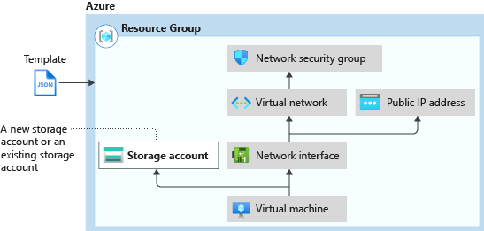
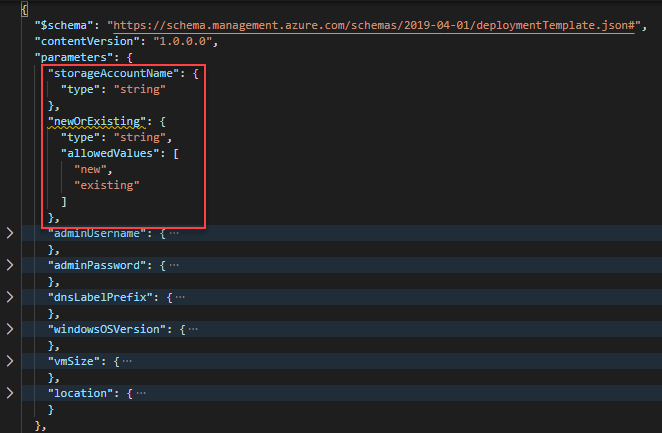
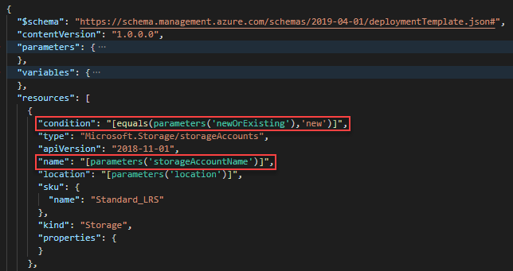

---
title: Use condition in templates
description: Learn how to deploy Azure resources based on conditions. Shows how to either deploy a new resource or use an existing resource.
author: mumian
ms.date: 05/21/2019
ms.topic: tutorial
ms.author: jgao
---

# Tutorial: Use condition in ARM templates

Learn how to deploy Azure resources based on conditions in an Azure Resource Manager (ARM) template.

In the [Set resource deployment order](./template-tutorial-create-templates-with-dependent-resources.md) tutorial, you create a virtual machine, a virtual network, and some other dependent resources including a storage account. Instead of creating a new storage account every time, you let people choose between creating a new storage account and using an existing storage account. To accomplish this goal, you define an additional parameter. If the value of the parameter is "new", a new storage account is created. Otherwise, an existing storage account with the name provided is used.



This tutorial covers the following tasks:

> [!div class="checklist"]
> * Open a QuickStart template
> * Modify the template
> * Deploy the template
> * Clean up resources

This tutorial only covers a basic scenario of using conditions. For more information, see:

* [Template file structure: Condition](conditional-resource-deployment.md).
* [Conditionally deploy a resource in an ARM template](/azure/architecture/building-blocks/extending-templates/conditional-deploy).
* [Template function: If](./template-functions-logical.md#if).
* [Comparison functions for ARM templates](./template-functions-comparison.md)

If you don't have an Azure subscription, [create a free account](https://azure.microsoft.com/free/) before you begin.

## Prerequisites

To complete this article, you need:

* Visual Studio Code with Resource Manager Tools extension. See [Use Visual Studio Code to create ARM templates](use-vs-code-to-create-template.md).
* To increase security, use a generated password for the virtual machine administrator account. Here is a sample for generating a password:

    ```console
    openssl rand -base64 32
    ```

    Azure Key Vault is designed to safeguard cryptographic keys and other secrets. For more information, see [Tutorial: Integrate Azure Key Vault in ARM template deployment](./template-tutorial-use-key-vault.md). We also recommend you to update your password every three months.

## Open a Quickstart template

Azure QuickStart Templates is a repository for ARM templates. Instead of creating a template from scratch, you can find a sample template and customize it. The template used in this tutorial is called [Deploy a simple Windows VM](https://azure.microsoft.com/resources/templates/101-vm-simple-windows/).

1. From Visual Studio Code, select **File**>**Open File**.
1. In **File name**, paste the following URL:

    ```url
    https://raw.githubusercontent.com/Azure/azure-quickstart-templates/master/101-vm-simple-windows/azuredeploy.json
    ```

1. Select **Open** to open the file.
1. There are six resources defined by the template:

   * [**Microsoft.Storage/storageAccounts**](/azure/templates/Microsoft.Storage/storageAccounts).
   * [**Microsoft.Network/publicIPAddresses**](/azure/templates/microsoft.network/publicipaddresses).
   * [**Microsoft.Network/networkSecurityGroups**](/azure/templates/microsoft.network/networksecuritygroups).
   * [**Microsoft.Network/virtualNetworks**](/azure/templates/microsoft.network/virtualnetworks).
   * [**Microsoft.Network/networkInterfaces**](/azure/templates/microsoft.network/networkinterfaces).
   * [**Microsoft.Compute/virtualMachines**](/azure/templates/microsoft.compute/virtualmachines).

    It is helpful to review the template reference before customizing a template.

1. Select **File**>**Save As** to save a copy of the file to your local computer with the name **azuredeploy.json**.

## Modify the template

Make two changes to the existing template:

* Add a storage account name parameter. Users can specify either a new storage account name or an existing storage account name.
* Add a new parameter called **newOrExisting**. The deployment uses this parameter to determine whether to create a new storage account or use an existing storage account.

Here is the procedure to make the changes:

1. Open **azuredeploy.json** in Visual Studio Code.
1. Replace the three **variables('storageAccountName')** with **parameters('storageAccountName')** in the whole template.
1. Remove the following variable definition:

    

1. Add the following two parameters to the beginning of the parameters section:

    ```json
    "storageAccountName": {
      "type": "string"
    },
    "newOrExisting": {
      "type": "string",
      "allowedValues": [
        "new",
        "existing"
      ]
    },
    ```

    Press **[ALT]+[SHIFT]+F** to format the template in Visual Studio Code.

    The updated parameters definition looks like:

    

1. Add the following line to the beginning of the storage account definition.

    ```json
    "condition": "[equals(parameters('newOrExisting'),'new')]",
    ```

    The condition checks the value of a parameter called **newOrExisting**. If the parameter value is **new**, the deployment creates the storage account.

    The updated storage account definition looks like:

    
1. Update the **storageUri** property of the virtual machine resource definition with the following value:

    ```json
    "storageUri": "[concat('https://', parameters('storageAccountName'), '.blob.core.windows.net')]"
    ```

    This change is necessary when you use an existing storage account under a different resource group.

1. Save the changes.

## Deploy the template

Follow the instructions in [Deploy the template](./template-tutorial-create-templates-with-dependent-resources.md#deploy-the-template) to open the Cloud Shell and upload the revised template, and then run the following PowerShell script to deploy the template.

> [!IMPORTANT]
> The storage account name must be unique across Azure. The name must have only lowercase letters or numbers. It can be no longer than 24 characters. The storage account name is the project name with "store" appended. Make sure the project name meets the storage account name requirements.

```azurepowershell
$projectName = Read-Host -Prompt "Enter a project name that is used to generate resource group name and resource names"
$newOrExisting = Read-Host -Prompt "Create new or use existing (Enter new or existing)"
$location = Read-Host -Prompt "Enter the Azure location (i.e. centralus)"
$vmAdmin = Read-Host -Prompt "Enter the admin username"
$vmPassword = Read-Host -Prompt "Enter the admin password" -AsSecureString
$dnsLabelPrefix = Read-Host -Prompt "Enter the DNS Label prefix"

$resourceGroupName = "${projectName}rg"
$storageAccountName = "${projectName}store"

New-AzResourceGroup -Name $resourceGroupName -Location $location
New-AzResourceGroupDeployment `
    -ResourceGroupName $resourceGroupName `
    -adminUsername $vmAdmin `
    -adminPassword $vmPassword `
    -dnsLabelPrefix $dnsLabelPrefix `
    -storageAccountName $storageAccountName `
    -newOrExisting $newOrExisting `
    -TemplateFile "$HOME/azuredeploy.json"
```

> [!NOTE]
> The deployment fails if **newOrExisting** is **new**, but the storage account with the storage account name specified already exists.

Try making another deployment with **newOrExisting** set to "existing" and specify an existing storage account. To create a storage account beforehand, see [Create a storage account](../../storage/common/storage-account-create.md).

## Clean up resources

When the Azure resources are no longer needed, clean up the resources you deployed by deleting the resource group. To delete the resource group, select **Try it** to open the Cloud Shell. To paste the PowerShell script, right-click the shell pane, and then select **Paste**.

```azurepowershell-interactive
$resourceGroupName = Read-Host -Prompt "Enter the same resource group name you used in the last procedure"
Remove-AzResourceGroup -Name $resourceGroupName
```

## Next steps

In this tutorial, you developed a template that allows users to choose between creating a new storage account and using an existing storage account. To learn how to retrieve secrets from Azure Key Vault, and use the secrets as passwords in the template deployment, see:

> [!div class="nextstepaction"]
> [Integrate Key Vault in template deployment](./template-tutorial-use-key-vault.md)
