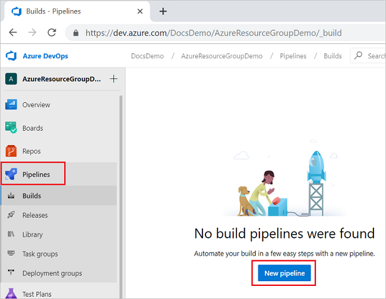
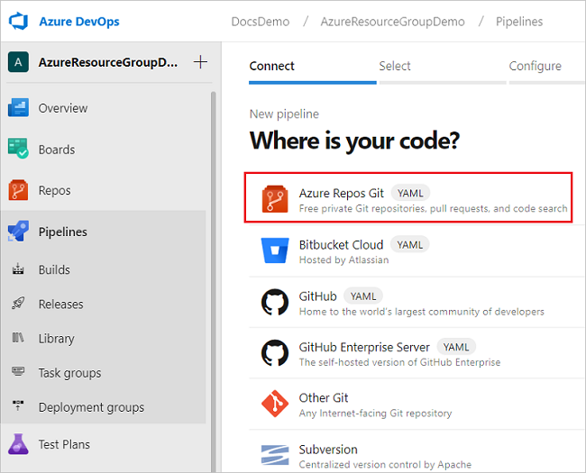
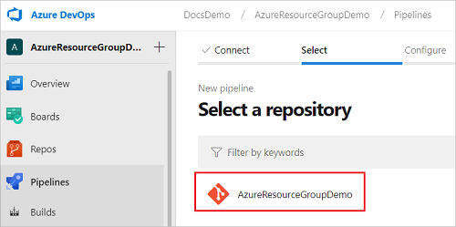
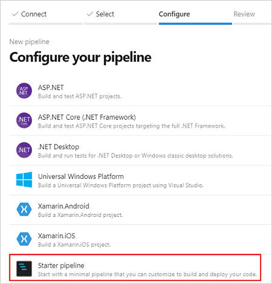
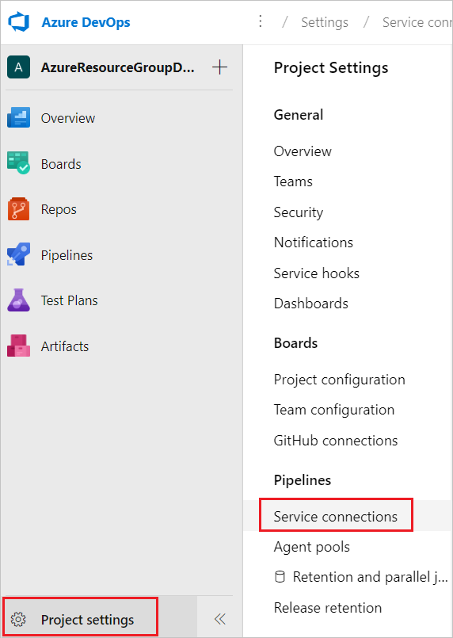
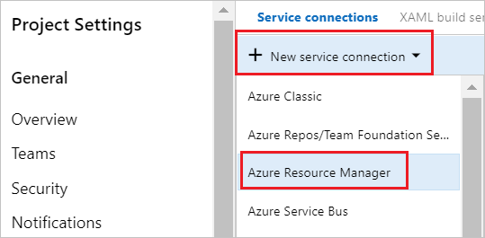
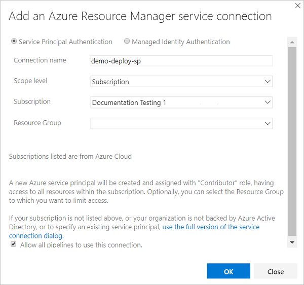

# Integrate Visual Studio Resource Group project with Azure Pipelines

Visual Studio provides the Azure Resource Group project for creating templates and deploying them to your Azure subscription. You can integrate this project with Azure Pipelines for continuous integration and continuous deployment (CI/CD).

There are two ways to deploy templates to Azure Pipelines:

* [Add task that runs an Azure PowerShell script](#use-azure-powershell-task). The script copies artifacts and then deploys the template. This option has the advantage of providing consistency throughout the development life cycle because you use the same script that is included in the Visual Studio project (Deploy-AzureResourceGroup.ps1).

* [Add copy and deploy tasks](#use-copy-and-deploy-tasks). This option offers a convenient alternative to the built-in script. You configure two tasks in the pipeline. One copies the artifacts and the other deploys the template.

## Prepare your project

This article assumes your Visual Studio project and Azure DevOps organization are ready for creating the pipeline. The following steps show how to make sure you are ready:

* You have an Azure DevOps organization. If you don't have one, [create one for free](/azure/devops/pipelines/get-started/pipelines-sign-up?view=azure-devops). If your team already has a DevOps organization, make sure you're an administrator of the Azure DevOps project that you want to use.

* You have a Visual Studio project that was created from the **Azure Resource Group** starter template. For information about creating that type of project, see [Creating and deploying Azure resource groups through Visual Studio](vs-azure-tools-resource-groups-deployment-projects-create-deploy.md).

* Your Visual Studio project is [shared to a DevOps project](/azure/devops/repos/git/share-your-code-in-git-vs-2017?view=azure-devops).

## Stage artifacts

With both approaches, you need to give Azure Resource Manager access to artifacts for your project. This step is known as staging. The artifacts can include files such as:

* Nested templates
* Configuration scripts and DSC scripts
* Application binaries

The PowerShell script copies the artifacts to a secure container in Azure, creates a SaS token for that container, and passes that information on to the template deployment.

The DevOps tasks includes a task for copying the artifacts. You pass parameter values from the staging step to the template deployment.

## Use Azure PowerShell task

To call the PowerShell script in Azure Pipelines, you need to update your build pipeline. In brief, the steps are: 

* Add the build pipeline.
* Set up Azure authorization in Azure Pipelines.
* Add an Azure PowerShell build step that references the PowerShell script in the Azure Resource Group deployment project.
* Set the value of the *-ArtifactsStagingDirectory* parameter to work with a project built in Azure Pipelines.

The following procedures walk you through the steps necessary to configure continuous deployment in Azure DevOps Services using a single task that runs the PowerShell script in your project.

1. If you haven't added a pipeline previously, you need to create a new pipeline. From your DevOps organization, select **Pipelines** and **New pipeline**.

   

1. Specify where your code is stored. The following image shows selecting **Azure Repos Git**.

   

1. From that source, select the repository that has the code for your project.

   

1. Select the type of pipeline to create. You can select **Starter pipeline**. Later in this article, you'll replace the contents of the pipeline.

   

You've set up a build pipeline for your project. Now, you need to add a service principal that is authorized to contribute to your Azure subscription. The tasks in the pipeline execute under the identity of the service principal.

1. In the lower left corner, select **Project settings**. Select **Service connections**.

   

1. Now, specify the type of service connection you want to create. Select **New service connection** and **Azure Resource Manager**.

   

1. Give your connection a name. For scope, select either **Subscription** or **ManagementGroup**. Select the particular subscription or management group you want to use for the new connection.

   

You are ready to add the task that runs your script.

2. Add a new **Azure PowerShell** build step to the build pipeline and then choose the **Add build step…** button.
   
3. Choose the **Deploy task** category, select the **Azure PowerShell** task, and then choose its **Add** button.

1. You have a default stage. Select **Save and run**. You will change this step later.

4. Choose the **Azure PowerShell** build step and then fill in its values.
   
   1. If you already have an Azure service endpoint added to Azure DevOps Services, choose the subscription in the **Azure Subscription** drop-down list box and then skip to the next section. 
      
      If you don't have an Azure service endpoint in Azure DevOps Services, you need to add one. This subsection takes you through the process. If your Azure account uses a Microsoft account (such as Hotmail), you must take the following steps to get a Service Principal authentication.

   2. Choose the **Manage** link next to the **Azure Subscription** drop-down list box.
      
   3. Choose **Azure** in the **New Service Endpoint** drop-down list box.
      
   4. In the **Add Azure Subscription** dialog box, select the **Service Principal** option.
      
   5. Add your Azure subscription information to the **Add Azure Subscription** dialog box. You need to provide the following items:
      
      * Subscription Id
      * Subscription Name
      * Service Principal Id
      * Service Principal Key
      * Tenant Id
   6. Add a name of your choice to the **Subscription** name box. This value appears later in the **Azure Subscription** drop-down list in Azure DevOps Services. 

   7. If you don’t know your Azure subscription ID, you can use one of the following commands to retrieve it.
      
      For PowerShell scripts, use:
      
      `Get-AzSubscription`
      
      For Azure CLI, use:
      
      `az account show`
   8. To get a Service Principal ID, Service Principal Key, and Tenant ID, follow the procedure in [Create Active Directory application and service principal using portal](../active-directory/develop/howto-create-service-principal-portal.md) or [Authenticating a service principal with Azure Resource Manager](../active-directory/develop/howto-authenticate-service-principal-powershell.md).
   9. Add the Service Principal ID, Service Principal Key, and Tenant ID values to the **Add Azure Subscription** dialog box and then choose the **OK** button.
      
      You now have a valid Service Principal to use to run the Azure PowerShell script.
5. Edit the build pipeline and choose the **Azure PowerShell** build step. Select the subscription in the **Azure Subscription** drop-down list box. (If the subscription doesn't appear, choose the **Refresh** button next the **Manage** link.) 
   
6. Provide a path to the Deploy-AzureResourceGroup.ps1 PowerShell script. To do this, choose the ellipsis (…) button next to the **Script Path** box, navigate to the Deploy-AzureResourceGroup.ps1 PowerShell script in the **Scripts** folder of your project, select it, and then choose the **OK** button.    
   
7. After you select the script, update the path to the script so that it’s run from the Build.StagingDirectory (the same directory that *ArtifactsLocation* is set to). You can do this by adding “$(Build.StagingDirectory)/” to the beginning of the script path.
   
8. In the **Script Arguments** box, enter the following parameters (in a single line). When you run the script in Visual Studio, you can see how VS uses the parameters in the **Output** window. You can use this as a starting point for setting the parameter values in your build step.
   
   | Parameter | Description |
   | --- | --- |
   | -ResourceGroupLocation |The geo-location value where the resource group is located, such as **eastus** or **'East US'**. (Add single quotes if there's a space in the name.) See [Azure Regions](https://azure.microsoft.com/regions/) for more information. |
   | -ResourceGroupName |The name of the resource group used for this deployment. |
   | -UploadArtifacts |This parameter, when present, specifies that artifacts that need to be uploaded to Azure from the local system. You only need to set this switch if your template deployment requires extra artifacts that you want to stage using the PowerShell script (such as configuration scripts or nested templates). |
   | -StorageAccountName |The name of the storage account used to stage artifacts for this deployment. This parameter is only used if you are staging artifacts for deployment. If this parameter is supplied, a new storage account is created if the script has not created one during a previous deployment. If the parameter is specified, the storage account must already exist. |
   | -StorageAccountResourceGroupName |The name of the resource group associated with the storage account. This parameter is required only if you provide a value for the StorageAccountName parameter. |
   | -TemplateFile |The path to the template file in the Azure Resource Group deployment project. To enhance flexibility, use a path for this parameter that is relative to the location of the PowerShell script instead of an absolute path. |
   | -TemplateParametersFile |The path to the parameters file in the Azure Resource Group deployment project. To enhance flexibility, use a path for this parameter that is relative to the location of the PowerShell script instead of an absolute path. |
   | -ArtifactStagingDirectory |This parameter lets the PowerShell script know the folder from where the project’s binary files should be copied. This value overrides the default value used by the PowerShell script. For Azure DevOps Services use, set the value to: -ArtifactStagingDirectory $(Build.StagingDirectory) |
   
   Here’s a script arguments example (line broken for readability):
   
   ```    
   -ResourceGroupName 'MyGroup' -ResourceGroupLocation 'eastus' -TemplateFile '..\templates\azuredeploy.json' 
   -TemplateParametersFile '..\templates\azuredeploy.parameters.json' -UploadArtifacts -StorageAccountName 'mystorageacct' 
   –StorageAccountResourceGroupName 'Default-Storage-EastUS' -ArtifactStagingDirectory '$(Build.StagingDirectory)'    
   ```
   
   When you’re finished, the **Script Arguments** box should resemble the following list:
   
9. After you’ve added all the required items to the Azure PowerShell build step, choose the **Queue** build button to build the project. The **Build** screen shows the output from the PowerShell script.

## Use copy and deploy tasks

The following procedures walk you through the steps necessary to configure continuous deployment in Azure DevOps Services using the built-in tasks.

1. Edit your Azure DevOps Services build pipeline to add two new build steps. Choose the build pipeline under the **Build definitions** category and then choose the **Edit** link.
   
2. Add the new build steps to the build pipeline using the **Add build step…** button.
   
3. Choose the **Deploy** task category, select the **Azure File Copy** task, and then choose its **Add** button.
   
4. Choose the **Azure Resource Group Deployment** task, then choose its **Add** button and then **Close** the **Task Catalog**.
   
5. Choose the **Azure File Copy** task and fill in its values.
   
   If you already have an Azure service endpoint added to Azure DevOps Services, choose the subscription in the **Azure Subscription** drop-down list box. 
   
   * Source - enter **$(Build.StagingDirectory)**
   * Azure Connection Type - select **Azure Resource Manager**
   * Azure RM Subscription - select the subscription for the storage account you want to use in the **Azure Subscription** drop-down list box. If the subscription doesn't appear, choose the **Refresh** button next the **Manage** link.
   * Destination Type - select **Azure Blob**
   * RM Storage Account - select the storage account you would like to use for staging artifacts
   * Container Name - enter the name of the container you would like to use for staging; it can be any valid container name, but use one dedicated to this build pipeline
   
   For the output values:
   
   * Storage Container URI - enter **artifactsLocation**
   * Storage Container SAS Token - enter **artifactsLocationSasToken**
   
   ![Configure Azure File Copy task][16]
6. Choose the **Azure Resource Group Deployment** build step and then fill in its values.
   
   * Azure Connection Type - select **Azure Resource Manager**
   * Azure RM Subscription - select the subscription for deployment in the **Azure Subscription** drop-down list box. This will usually be the same subscription used in the previous step
   * Action - select **Create or Update Resource Group**
   * Resource Group - select a resource group or enter the name of a new resource group for the deployment
   * Location - select the location for the resource group
   * Template - enter the path and name of the template to be deployed prepending **$(Build.StagingDirectory)**, for example: **$(Build.StagingDirectory/DSC-CI/azuredeploy.json)**
   * Template Parameters - enter the path and name of the parameters to be used, prepending **$(Build.StagingDirectory)**, for example: **$(Build.StagingDirectory/DSC-CI/azuredeploy.parameters.json)**
   * Override Template Parameters - enter or copy and paste the following code:
     
     ```    
     -_artifactsLocation $(artifactsLocation) -_artifactsLocationSasToken (ConvertTo-SecureString -String "$(artifactsLocationSasToken)" -AsPlainText -Force)
     ```
     ![Configure Azure Resource Group Deployment Task][17]
7. After you’ve added all the required items, save the build pipeline and choose **Queue new build** at the top.

## Next steps
Read [Azure Resource Manager overview](resource-group-overview.md) to learn more about Azure Resource Manager and Azure resource groups.
