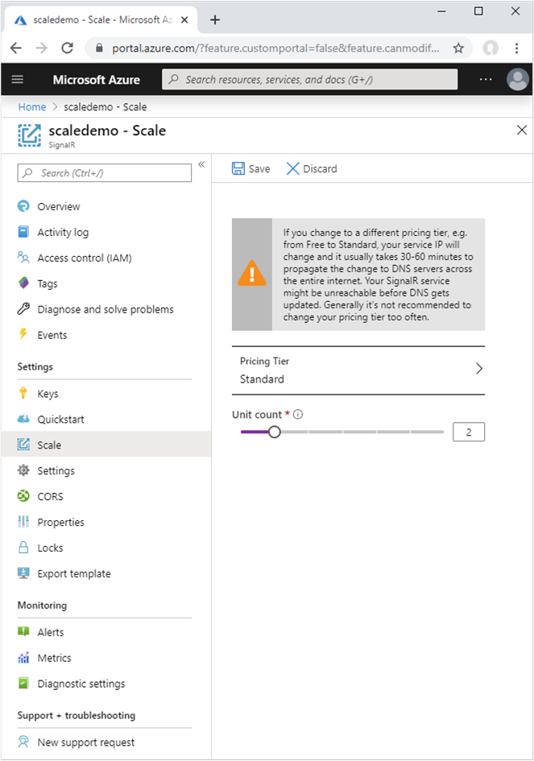

# How to scale an Azure SignalR Service instance?
This article shows you how to scale your instance of Azure SignalR Service. There are two scenarios for scaling, scale up and scale out.

* [Scale up](https://en.wikipedia.org/wiki/Scalability#Horizontal_and_vertical_scaling): Get more units, connections, messages, and more. You scale up by changing the pricing tier from Free to Standard.
* [Scale out](https://en.wikipedia.org/wiki/Scalability#Horizontal_and_vertical_scaling): Increase the number of SignalR units. You can scale out to as many as 100 units.

The scale settings take a few minutes to apply. They don't require you to change your code or redeploy your server application.

For information about the pricing and capacities of individual SignalR Service, see [Azure SignalR Service Pricing Details](https://azure.microsoft.com/pricing/details/signalr-service/).  

> [!NOTE]
> Changing SignalR Service from **Free** tier to **Standard** tier or vice versa, the public service IP will be changed and it usually takes 3-60 minutes to propagate the change to DNS servers across the entire internet. 
> Your service might be unreachable before DNS gets updated. Generally it’s not recommended to change your pricing tier too often.


## Scale on Azure Portal

1. In your browser, open the [Azure portal](https://portal.azure.com).

2. In your SignalR Service page, from the left menu, select **Scale**.
   
3. Choose your pricing tier, and then click **Select**. You need to set the unit count for **Standard** Tier.
   
    

4. Click **Save**.

## Scale using Azure CLI

This script creates a new SignalR Service resource of **Free** Tier and a new resource group, and scale it up to **Standard** Tier. 

```azurecli-interactive
#!/bin/bash

# Generate a unique suffix for the service name
let randomNum=$RANDOM*$RANDOM

# Generate a unique service and group name with the suffix
SignalRName=SignalRTestSvc$randomNum
#resource name must be lowercase
mySignalRSvcName=${SignalRName,,}
myResourceGroupName=$SignalRName"Group"

# Create resource group 
az group create --name $myResourceGroupName --location eastus

# Create the Azure SignalR Service resource
az signalr create \
  --name $mySignalRSvcName \
  --resource-group $myResourceGroupName \
  --sku Free_F1 \
  --service-mode Default

# Scale up to Standard Tier, and scale out to 50 units
az signalr update \
  --name $mySignalRSvcName \
  --resource-group $myResourceGroupName \
  --sku Standard_S1 \
  --unit-count 50
```

Make a note of the actual name generated for the new resource group. You will use that resource group name when you want to delete all group resources.

[!INCLUDE [cli-script-clean-up](../../includes/cli-script-clean-up.md)]

## Compare pricing tiers

For detailed information, such as included messages and connections for each pricing tier, see [SignalR Service Pricing Details](https://azure.microsoft.com/pricing/details/signalr-service/).

For a table of service limits, quotas, and constraints in each tier, see [SignalR Service limits](../azure-subscription-service-limits.md#azure-signalr-service-limits).

## Next steps

In this guide, you learned about how to scale single SignalR Service instance.

Multiple endpoints are also supported for scaling, sharding and cross-region scenarios.

> [!div class="nextstepaction"]
> [scale SignalR Service with multiple instances](./signalr-howto-scale-multi-instances.md)
