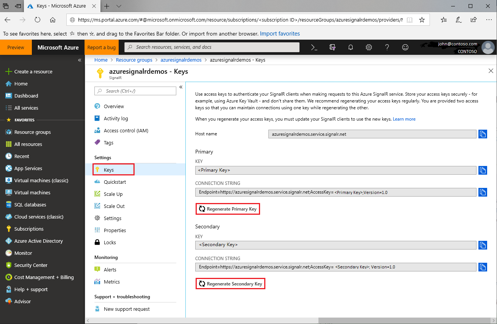

# Access Key Rotation for Azure SignalR Service

## Why rotating the Access Keys?

For security reason and compliance requirement, developers are recommended to routinely rotate the access keys.

## How to regenerate Access Keys?

1. Go to the [Azure portal](https://portal.azure.com/) and sign in with your credentials.

1. Find the Keys section from the Azure SignalR Service instance that you want to regenerate the keys.

1. Click **Keys** on the navigation menu. 

1. Click **Regenerate Primary Key** and **Regenerate Secondary Key**
 
A new set of keys and corresponding connection strings will be created and displayed.

 

You can also regenerate keys using [Azure CLI](/cli/azure/ext/signalr/signalr/key?view=azure-cli-latest#ext-signalr-az-signalr-key-renew)

## Update configurations with new connection strings

1. Copy the newly generated connection string

1. Update all configurations that use the connection string.

1. Restart the application

## Forced Access Key regeneration

Azure SignalR Service may enforce a mandatory Access Key regeneration under certain situation. The service will notify customers via email and portal notification. If you receive this communication or encounter service failure due to access key, rotate the keys by following this guide.

## Next steps

Routinely rotate the access keys as a good security practice. We recommend rotating all keys quarterly.