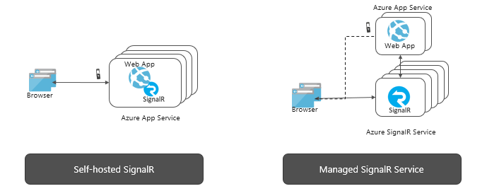

# What is Azure SignalR Service?

Azure SignalR Service simplifies the process of adding real-time web functionality to applications over HTTP. This real-time functionality allows the service to push content updates to connected clients, such as a single page web or mobile application. As a result, clients are updated without the need to poll the server, or submit new HTTP requests for updates. 

This article provides an overview of Azure SignalR Service.

## What is Azure SignalR Service used for?

Any scenario that requires pushing data from server to client in real time, can use Azure SignalR Service.

Traditional real-time features that often require polling from server, can also use Azure SignalR Service.

Azure SignalR Service has been used in a wide variety of industries, for any application type that requires real-time content updates. We list some examples that are good to use Azure SignalR Service:

* **High frequency data updates:** gaming, voting, polling, auction.
* **Dashboards and monitoring:** company dashboard, financial market data, instant sales update, multi-player game leader board, and IoT monitoring.
* **Chat:** live chat room, chat bot, on-line customer support, real-time shopping assistant, messenger, in-game chat, and so on.
* **Real-time location on map:** logistic tracking, delivery status tracking, transportation status updates, GPS apps.
* **Real time targeted ads:** personalized real time push ads and offers, interactive ads.
* **Collaborative apps:** coauthoring, whiteboard apps and team meeting software.
* **Push notifications:** social network, email, game, travel alert.
* **Real-time broadcasting:** live audio/video broadcasting, live captioning, translating, events/news broadcasting.
* **IoT and connected devices:** real-time IoT metrics, remote control, real-time status, and location tracking.
* **Automation:** real-time trigger from upstream events.

## What are the benefits using Azure SignalR Service?

**Standard based:**

SignalR provides an abstraction over a number of techniques used for building real-time web applications. [WebSockets](https://wikipedia.org/wiki/WebSocket) is the optimal transport, but other techniques like [Server-Sent Events (SSE)](https://wikipedia.org/wiki/Server-sent_events) and Long Polling are used when other options aren't available. SignalR automatically detects and initializes the appropriate transport based on the features supported on the server and client.

**Native ASP.NET Core support:**

SignalR Service provides native programming experience with ASP.NET Core and ASP.NET. Developing new SignalR application with SignalR Service, or migrating from existing SignalR based application to SignalR Service requires minimal efforts.
SignalR Service also supports ASP.NET Core's new feature, Server-side Blazor.

**Broad client support:**

SignalR Service works with a broad range of clients, such as web and mobile browsers, desktop apps, mobile apps, server process, IoT devices, and game consoles. SignalR Service offers SDKs in different languages. In addition to native ASP.NET Core or ASP.NET C# SDKs, SignalR Service also provides JavaScript client SDK, to enable web clients, and many JavaScript frameworks. Java client SDK is also supported for Java applications, including Android native apps. SignalR Service supports REST API, and serverless through integrations with Azure Functions and Event Grid.

**Handle large-scale client connections:**

SignalR Service is designed for large-scale real-time applications. SignalR Service allows multiple instances to work together to scale to millions of client connections. The service also supports multiple global regions for sharding, high availability, or disaster recovery purposes.

**Remove the burden to self-host SignalR:**

Compared to self-hosted SignalR applications, switching to SignalR Service will remove the need to manage back planes that handle the scales and client connections. The fully managed service also simplifies web applications and saves hosting cost. SignalR Service offers global reach and world-class data center and network, scales to millions of connections, guarantees SLA, while providing all the compliance and security at Azure standard.

**Offer rich APIs for different messaging patterns:**

SignalR Service allows the server to send messages to a particular connection, all connections, or a subset of connections that belong to a specific user, or have been placed in an arbitrary group.

## How to use Azure SignalR Service

There are many different ways to program with Azure SignalR Service, as some of the samples listed here:

- **[Scale an ASP.NET Core SignalR App](signalr-concept-scale-aspnet-core.md)** - Integrate Azure SignalR Service with an ASP.NET Core SignalR application to scale out to hundreds of thousands of connections.
- **[Build serverless real-time apps](signalr-concept-azure-functions.md)** - Use Azure Functions' integration with Azure SignalR Service to build serverless real-time applications in languages such as JavaScript, C#, and Java.
- **[Send messages from server to clients via REST API](https://github.com/Azure/azure-signalr/blob/dev/docs/rest-api.md)** - Azure SignalR Service provides REST API to enable applications to post messages to clients connected with SignalR Service, in any REST capable programming languages.
