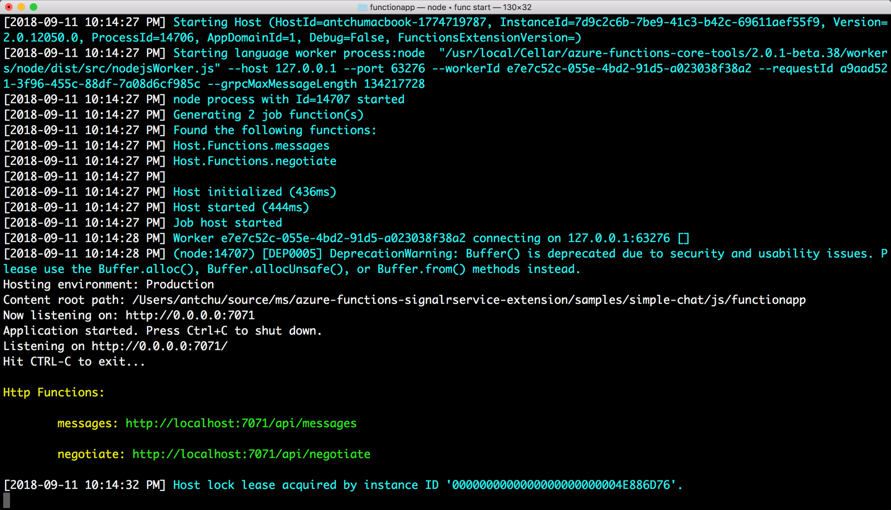

# Quickstart: Use JavaScript to create a chat room with Azure Functions and SignalR Service

Azure SignalR Service lets you easily add real-time functionality to your application and Azure Functions is a serverless platform that lets you run your code without managing any infrastructure. In this quickstart, you use JavaScript to build a serverless, real-time chat application using SignalR Service and Functions.

## Prerequisites

- A code editor, such as [Visual Studio Code](https://code.visualstudio.com/)
- An Azure account with an active subscription. [Create an account for free](https://azure.microsoft.com/free/?ref=microsoft.com&utm_source=microsoft.com&utm_medium=docs&utm_campaign=visualstudio).
- [Azure Functions Core Tools](https://github.com/Azure/azure-functions-core-tools#installing), version 2 or above. Used to run Azure Function apps locally.
- [Node.js](https://nodejs.org/en/download/), version 10.x

   > [!NOTE]
   > The examples should work with other versions of Node.js, see [Azure Functions runtime versions documentation](../azure-functions/functions-versions.md#languages) for more information.

> [!NOTE]
> This quickstart can be run on macOS, Windows, or Linux.

Having issues? Try the [troubleshooting guide](https://docs.microsoft.com/azure/azure-signalr/signalr-howto-troubleshoot-guide) or [let us know](https://aka.ms/asrs/qsjs).

## Log in to Azure

Sign in to the Azure portal at <https://portal.azure.com/> with your Azure account.

Having issues? Try the [troubleshooting guide](https://docs.microsoft.com/azure/azure-signalr/signalr-howto-troubleshoot-guide) or [let us know](https://aka.ms/asrs/qsjs).

[!INCLUDE [Create instance](includes/signalr-quickstart-create-instance.md)]

Having issues? Try the [troubleshooting guide](https://docs.microsoft.com/azure/azure-signalr/signalr-howto-troubleshoot-guide) or [let us know](https://aka.ms/asrs/qsjs).

[!INCLUDE [Clone application](includes/signalr-quickstart-clone-application.md)]

Having issues? Try the [troubleshooting guide](https://docs.microsoft.com/azure/azure-signalr/signalr-howto-troubleshoot-guide) or [let us know](https://aka.ms/asrs/qsjs).

## Configure and run the Azure Function app

1. In the browser where the Azure portal is opened, confirm the SignalR Service instance you deployed earlier was successfully created by searching for its name in the search box at the top of the portal. Select the instance to open it.

    

1. Select **Keys** to view the connection strings for the SignalR Service instance.

1. Select and copy the primary connection string.

    

1. In your code editor, open the *src/chat/javascript* folder in the cloned repository.

1. Rename *local.settings.sample.json* to *local.settings.json*.

1. In **local.settings.json**, paste the connection string into the value of the **AzureSignalRConnectionString** setting. Save the file.

1. JavaScript functions are organized into folders. In each folder are two files: *function.json* defines the bindings that are used in the function, and *index.js* is the body of the function. There are two HTTP triggered functions in this function app:

    - **negotiate** - Uses the *SignalRConnectionInfo* input binding to generate and return valid connection information.
    - **messages** - Receives a chat message in the request body and uses the *SignalR* output binding to broadcast the message to all connected client applications.

1. In the terminal, ensure that you are in the *src/chat/javascript* folder. Run the function app.

    ```bash
    func start
    ```

    
    
Having issues? Try the [troubleshooting guide](https://docs.microsoft.com/azure/azure-signalr/signalr-howto-troubleshoot-guide) or [let us know](https://aka.ms/asrs/qsjs).

[!INCLUDE [Run web application](includes/signalr-quickstart-run-web-application.md)]

Having issues? Try the [troubleshooting guide](https://docs.microsoft.com/azure/azure-signalr/signalr-howto-troubleshoot-guide) or [let us know](https://aka.ms/asrs/qsjs).

[!INCLUDE [Cleanup](includes/signalr-quickstart-cleanup.md)]

Having issues? Try the [troubleshooting guide](https://docs.microsoft.com/azure/azure-signalr/signalr-howto-troubleshoot-guide) or [let us know](https://aka.ms/asrs/qsjs).

## Next steps

In this quickstart, you built and ran a real-time serverless application in VS Code. Next, learn more about how to deploy Azure Functions from VS Code.

> [!div class="nextstepaction"]
> [Deploy Azure Functions with VS Code](/azure/developer/javascript/tutorial-vscode-serverless-node-01)

