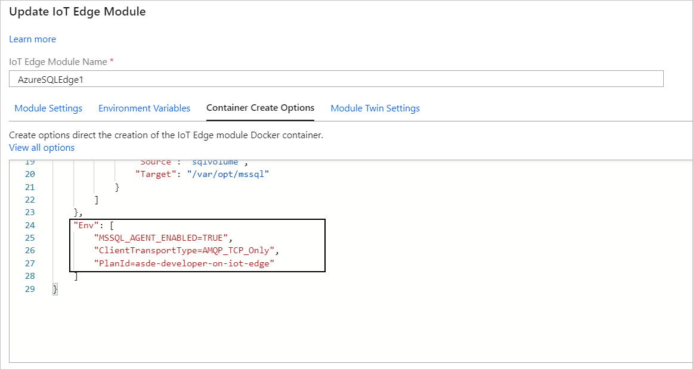

# Configure Azure SQL Edge Preview

Azure SQL Edge supports configuration through one of the following two options:

- Using Environment Variables.
- Using mssql.conf file placed in the /var/opt/mssql folder.

> [!NOTE]
> Setting Environment Variables overrides the settings specified in the mssql.conf file.

## Configure using Environment Variables

Azure SQL Edge exposes several different environment variables that can be used to configure the SQL Edge container. These environment variables are a subset of the environment variables available for SQL Server on Linux. For more information on SQL Server on Linux environment variables, see [Environment Variables](/sql/linux/sql-server-linux-configure-environment-variables/).

SQL Server on Linux environment variables are NOT supported for Azure SQL Edge. If defined, these environment variables will be ignored during container initialization.

| Environment variable | Description |
|-----|-----|
| **MSSQL_ENABLE_HADR** | Enable Availability Group. For example, '1' is enabled, and '0' is disabled |

> [!IMPORTANT]
> The *MSSQL_PID* environment variable for SQL Edge only accepts **Premium** and **Developer** as the valid values. Azure SQL Edge does not support initialization using a product key.

> [!NOTE]
> Additionally, to download the Azure SQL Edge end user license agreement, refer [End-User Licensing Agreement](https://go.microsoft.com/fwlink/?linkid=2128283).

### Specifying the Environment Variables

Environment variables for SQL Edge can be specified when deploying Azure SQL Edge through the [Azure portal](deploy-portal.md). This can be added either in the "Environment Variables" section of the module deployment or as part of the container create option as described below.

*Set using environment variables options*


*Set using container create options*



## Configure using mssql.conf file

Azure SQL Edge does not include the [mssql-conf configuration utility](/sql/linux/sql-server-linux-configure-mssql-conf/) like SQL Server on Linux does, as such the mssql.conf file needs to be manually configured and placed in the persistent storage drive that is mapped to the /var/opt/mssql/ folder in the SQL Edge module. When deploying SQL Edge from the Azure Marketplace, this mapping is specified as the **Mounts" option in the container create option

```json
    {
        "Mounts": [
          {
            "Type": "volume",
            "Source": "sqlvolume",
            "Target": "/var/opt/mssql"
          }
        ]
      }
    }
```

The following mssql.conf options are not applicable to SQL Edge:
</br></br>
|Option|Description|
|:---|:---|
|**Customer feedback** | Choose whether or not SQL Server sends feedback to Microsoft. |
|**Database Mail Profile** | Set the default database mail profile for SQL Server on Linux. |
|**High availability** | Enable Availability Groups. |
|**Microsoft Distributed Transaction Coordinator** | Configure and troubleshoot MSDTC on Linux. Additional distributed transaction-related configuration options are also not supported for SQL Edge. For more information on these additional configuration options, refer [Configure MSDTC](https://docs.microsoft.com/sql/linux/sql-server-linux-configure-mssql-conf#msdtc) |
|**MLServices EULAs** | Accept R and Python EULAs for Machine Learning Services packages. Applies to SQL Server 2019 only.|
|**outboundnetworkaccess** |Enable outbound network access for [Machine Learning Services](/sql/linux/sql-server-linux-setup-machine-learning/) R, Python, and Java extensions.|

A sample mssql.conf file, which works for SQL Edge is provided below. For more information on the format for mssql.conf file, see [mssql.conf format](https://docs.microsoft.com/sql/linux/sql-server-linux-configure-mssql-conf#mssql-conf-format).

```ini
[EULA]
accepteula = Y

[coredump]
captureminiandfull = true
coredumptype = full

[filelocation]
defaultbackupdir = /var/opt/mssql/backup/
defaultdatadir = /var/opt/mssql/data/
defaultdumpdir = /var/opt/mssql/data/
defaultlogdir = /var/opt/mssql/log/

[language]
lcid = 1033

[memory]
memorylimitmb = 6144

[sqlagent]
errorlogfile = /var/opt/mssql/log/sqlagentlog.log
errorlogginglevel = 7

[traceflag]
traceflag0 = 3604
traceflag1 = 3605
traceflag2 = 1204
```

## Next Step

- [Connect to Azure SQL Edge](connect.md)
- [Building an end-to-end IoT solution with SQL Edge](onnx-demo.md)