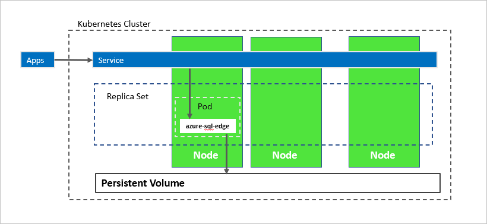
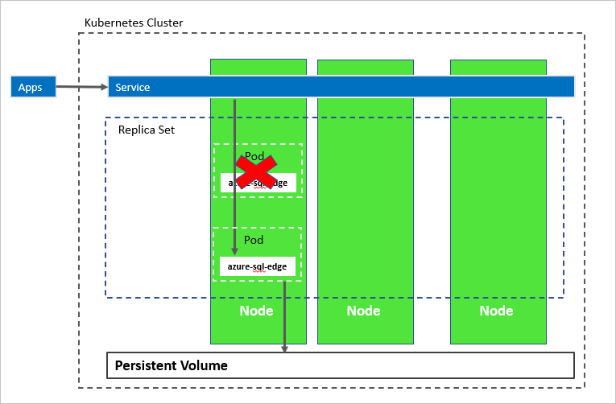
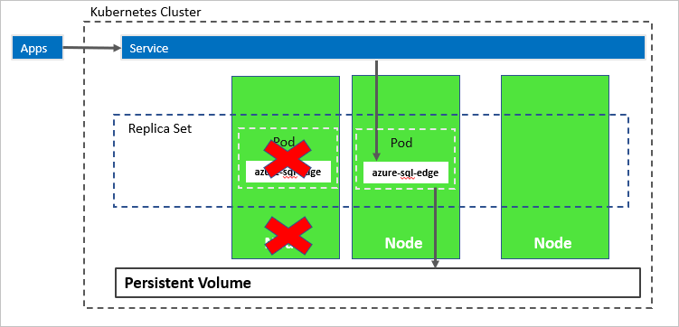
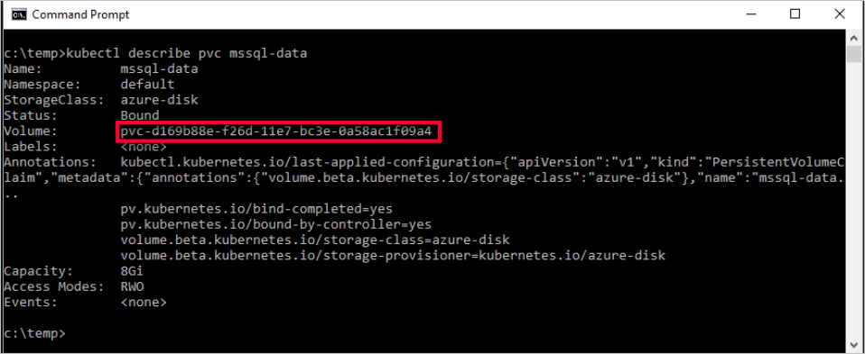

# Deploy an Azure SQL Edge container in Kubernetes

Azure SQL Edge can be deployed on a Kubernetes cluster both as an IoT Edge module through Azure IoT Edge running on Kubernetes or as a standalone container pod. For the remainder of this article, we will focus on the standalone container deployment on a kubernetes cluster. For information on deploying Azure IoT Edge on Kubernetes, refer [Azure IoT Edge on Kubernetes (preview)](https://microsoft.github.io/iotedge-k8s-doc/introduction.html).

This tutorial demonstrates how to configure a highly available Azure SQL Edge instance in a container on a kubernetes cluster. 

> [!div class="checklist"]
> * Create an SA password
> * Create storage
> * Create the deployment
> * Connect with SQL Server Management Studio (SSMS)
> * Verify failure and recovery

Kubernetes 1.6 and later has support for [storage classes](https://kubernetes.io/docs/concepts/storage/storage-classes/), [persistent volume claims](https://kubernetes.io/docs/concepts/storage/storage-classes/#persistentvolumeclaims), and the [Azure disk volume type](https://github.com/kubernetes/examples/tree/master/staging/volumes/azure_disk). You can create and manage your Azure SQL Edge instances natively in Kubernetes. The example in this article shows how to create a [deployment](https://kubernetes.io/docs/concepts/workloads/controllers/deployment/) to achieve a high availability configuration similar to a shared disk failover cluster instance. In this configuration, Kubernetes plays the role of the cluster orchestrator. When an Azure SQL Edge instance in a container fails, the orchestrator bootstraps another instance of the container that attaches to the same persistent storage.



In the preceding diagram, `azure-sql-edge` is a container in a [pod](https://kubernetes.io/docs/concepts/workloads/pods/pod/). Kubernetes orchestrates the resources in the cluster. A [replica set](https://kubernetes.io/docs/concepts/workloads/controllers/replicaset/) ensures that the pod is automatically recovered after a node failure. Applications connect to the service. In this case, the service represents a load balancer that hosts an IP address that stays the same after failure of the `azure-sql-edge`.

In the following diagram, the `azure-sql-edge` container has failed. As the orchestrator, Kubernetes guarantees the correct count of healthy instances in the replica set, and starts a new container according to the configuration. The orchestrator starts a new pod on the same node, and `azure-sql-edge` reconnects to the same persistent storage. The service connects to the re-created `azure-sql-edge`.



In the following diagram, the node hosting the `azure-sql-edge` container has failed. The orchestrator starts the new pod on a different node, and `azure-sql-edge` reconnects to the same persistent storage. The service connects to the re-created `azure-sql-edge`.



## Prerequisites

* **Kubernetes cluster**
   - The tutorial requires a Kubernetes cluster. The steps use [kubectl](https://kubernetes.io/docs/user-guide/kubectl/) to manage the cluster. 

   - For the purpose of this tutorial, we will be using Azure Kubernetes Service to deploy Azure SQL Edge. See [Deploy an Azure Kubernetes Service (AKS) cluster](https://docs.microsoft.com/azure/aks/tutorial-kubernetes-deploy-cluster) to create and connect to a single-node Kubernetes cluster in AKS with `kubectl`. 

   >[!NOTE]
   >To protect against node failure, a Kubernetes cluster requires more than one node.

* **Azure CLI**
   - The instructions in this tutorial have been validated against Azure CLI 2.10.1.

## Create a kubernetes namespace for SQL Edge deployment

Create a new namespace in the kubernetes cluster. This namespace will be used to deploy SQL Edge and all the required artifacts. For more information on Kubernetes namespaces, refer [namespaces](https://kubernetes.io/docs/concepts/overview/working-with-objects/namespaces/).

   ```azurecli
   kubectl create namespace <namespace name>
   ```  

## Create an SA password

Create an SA password in the Kubernetes cluster. Kubernetes can manage sensitive configuration information, like passwords as [secrets](https://kubernetes.io/docs/concepts/configuration/secret/).

The following command creates a password for the SA account:

   ```azurecli
   kubectl create secret generic mssql --from-literal=SA_PASSWORD="MyC0m9l&xP@ssw0rd" -n <namespace name>
   ```  

   Replace `MyC0m9l&xP@ssw0rd` with a complex password.

## Create storage

Configure a [persistent volume](https://kubernetes.io/docs/concepts/storage/persistent-volumes/) and [persistent volume claim](https://kubernetes.io/docs/concepts/storage/persistent-volumes/#persistent-volume-claim-protection) in the Kubernetes cluster. Complete the following steps: 

1. Create a manifest to define the storage class and the persistent volume claim.  The manifest specifies the storage provisioner, parameters, and [reclaim policy](https://kubernetes.io/docs/concepts/storage/persistent-volumes/#reclaiming). The Kubernetes cluster uses this manifest to create the persistent storage. 

   The following yaml example defines a storage class and persistent volume claim. The storage class provisioner is `azure-disk`, because this Kubernetes cluster is in Azure. The storage account type is `Standard_LRS`. The persistent volume claim is named `mssql-data`. The persistent volume claim metadata includes an annotation connecting it back to the storage class. 

   ```yaml
   kind: StorageClass
   apiVersion: storage.k8s.io/v1
   metadata:
        name: azure-disk
   provisioner: kubernetes.io/azure-disk
   parameters:
     storageaccounttype: Standard_LRS
     kind: managed
   ---
   kind: PersistentVolumeClaim
   apiVersion: v1
   metadata:
     name: mssql-data
     annotations:
       volume.beta.kubernetes.io/storage-class: azure-disk
   spec:
     accessModes:
     - ReadWriteOnce
     resources:
       requests:
         storage: 8Gi
   ```

   Save the file (for example, **pvc.yaml**).

2. Create the persistent volume claim in Kubernetes.

   ```azurecli
   kubectl apply -f <Path to pvc.yaml file> -n <namespace name>
   ```

   `<Path to pvc.yaml file>` is the location where you saved the file.

   The persistent volume is automatically created as an Azure storage account, and bound to the persistent volume claim. 

    

3. Verify the persistent volume claim.

   ```azurecli
   kubectl describe pvc <PersistentVolumeClaim>  -n <name of the namespace>
   ```

   `<PersistentVolumeClaim>` is the name of the persistent volume claim.

   In the preceding step, the persistent volume claim is named `mssql-data`. To see the metadata about the persistent volume claim, run the following command:

   ```azurecli
   kubectl describe pvc mssql-data  -n <namespace name>
   ```

   The returned metadata includes a value called `Volume`. This value maps to the name of the blob.

   

4. Verify the persistent volume.

   ```azurecli
   kubectl describe pv -n <namespace name>
   ```

   `kubectl` returns metadata about the persistent volume that was automatically created and bound to the persistent volume claim. 

## Create the deployment

In this example, the container hosting the Azure SQL Edge instance is described as a Kubernetes deployment object. The deployment creates a replica set. The replica set creates the pod. 

In this step, create a manifest to describe the container based on the Azure SQL Edge Docker image. The manifest references the `mssql-data` persistent volume claim, and the `mssql` secret that you already applied to the Kubernetes cluster. The manifest also describes a [service](https://kubernetes.io/docs/concepts/services-networking/service/). This service is a load balancer. The load balancer guarantees that the IP address persists after Azure SQL Edge instance is recovered. 

1. Create a manifest (a YAML file) to describe the deployment. The following example describes a deployment, including a container based on the Azure SQL Edge container image.

   ```yaml
    apiVersion: apps/v1
    kind: Deployment
    metadata:
    name: sqledge-deployment
    spec:
    replicas: 1
    selector:
        matchLabels:
        app: sqledge
    template:
        metadata:
        labels:
            app: sqledge
        spec:
        terminationGracePeriodSeconds: 30
        securityContext:
          fsGroup: 10001
        containers:
        - name: azuresqledge
            image: mcr.microsoft.com/azure-sql-edge-developer:latest
            ports:
            - containerPort: 1433
            env:
            - name: MSSQL_PID
            value: "Developer"
            - name: ACCEPT_EULA
            value: "Y"
            - name: SA_PASSWORD
            valueFrom:
                secretKeyRef:
                name: mssql
                key: SA_PASSWORD
            - name: MSSQL_AGENT_ENABLED
            value: "TRUE"        
            - name: MSSQL_COLLATION
            value: "SQL_Latin1_General_CP1_CI_AS"
            - name: MSSQL_LCID
            value: "1033"
            volumeMounts:
            - name: sqldata
            mountPath: /var/opt/mssql
        volumes:
        - name: sqldata
            persistentVolumeClaim:
            claimName: mssql-data
    ---
    apiVersion: v1
    kind: Service
    metadata:
    name: sqledge-deployment
    spec:
    selector:
        app: sqledge
    ports:
        - protocol: TCP
        port: 1433
        targetPort: 1433
    type: LoadBalancer
   ```

   Copy the preceding code into a new file, named `sqldeployment.yaml`. Update the following values: 

   * MSSQL_PID `value: "Developer"`: Sets the container to run Azure SQL Edge Developer edition. Developer edition is not licensed for production data. If the deployment is for production use, set the edition to `Premium`. 

      >[!NOTE]
      >For more information, see [How to license Azure SQL Edge](https://azure.microsoft.com/pricing/details/sql-edge/).

   * `persistentVolumeClaim`: This value requires an entry for `claimName:` that maps to the name used for the persistent volume claim. This tutorial uses `mssql-data`. 

   * `name: SA_PASSWORD`: Configures the container image to set the SA password, as defined in this section.

     ```yaml
     valueFrom:
       secretKeyRef:
         name: mssql
         key: SA_PASSWORD 
     ```

     When Kubernetes deploys the container, it refers to the secret named `mssql` to get the value for the password. 

   >[!NOTE]
   >By using the `LoadBalancer` service type, the Azure SQL Edge instance is accessible remotely (via the internet) at port 1433.

   Save the file (for example, **sqledgedeploy.yaml**).

2. Create the deployment.

   ```azurecli
   kubectl apply -f <Path to sqledgedeploy.yaml file> -n <namespace name>
   ```

   `<Path to sqldeployment.yaml file>` is the location where you saved the file.

   

   The deployment and service are created. The Azure SQL Edge instance is in a container, connected to persistent storage.

   To view the status of the pod, type `kubectl get pod -n <namespace name>`.

   

   In the preceding image, the pod has a status of `Running`. This status indicates that the container is ready. This may take several minutes.

   >[!NOTE]
   >After the deployment is created, it can take a few minutes before the pod is visible. The delay is because the cluster pulls the Azure SQL Edge container image from the Docker hub. After the image is pulled the first time, subsequent deployments might be faster if the deployment is to a node that already has the image cached on it. 

3. Verify the services are running. Run the following command:

   ```azurecli
   kubectl get services -n <namespace name>
   ```

   This command returns services that are running, as well as the internal and external IP addresses for the services. Note the external IP address for the `mssql-deployment` service. Use this IP address to connect to Azure SQL Edge. 

   

   For more information about the status of the objects in the Kubernetes cluster, run:

   ```azurecli
   az aks browse --resource-group <MyResourceGroup> --name <MyKubernetesClustername>
   ```  

## Connect to the Azure SQL Edge instance

If you configured the container as described, you can connect with an application from outside the Azure virtual network. Use the `sa` account and the external IP address for the service. Use the password that you configured as the Kubernetes secret. For more information on connecting to an Azure SQL Edge instance, refer [Connect to Azure SQL Edge](connect.md).

## Verify failure and recovery

To verify failure and recovery, you can delete the pod. Do the following steps:

1. List the pod running Azure SQL Edge.

   ```azurecli
   kubectl get pods -n <namespace name>
   ```

   Note the name of the pod running Azure SQL Edge.

2. Delete the pod.

   ```azurecli
   kubectl delete pod sqledge-deployment-7df66c9999-rc9xl
   ```
   `sqledge-deployment-7df66c9999-rc9xl` is the value returned from the previous step for pod name. 

Kubernetes automatically re-creates the pod to recover a Azure SQL Edge instance, and connect to the persistent storage. Use `kubectl get pods` to verify that a new pod is deployed. Use `kubectl get services` to verify that the IP address for the new container is the same. 

## Summary

In this tutorial, you learned how to deploy Azure SQL Edge containers to a Kubernetes cluster for high availability. 

> [!div class="checklist"]
> * Create an SA password
> * Create storage
> * Create the deployment
> * Connect with Azure SQL Edge Management Studios (SSMS)
> * Verify failure and recovery

## Next steps

- [Introduction to Kubernetes](https://docs.microsoft.com/azure/aks/intro-kubernetes)
- [Machine Learning and Artificial Intelligence with ONNX in SQL Edge](onnx-overview.md).
- [Building an end to end IoT Solution with SQL Edge using IoT Edge](tutorial-deploy-azure-resources.md).
- [Data Streaming in Azure SQL Edge](stream-data.md)

