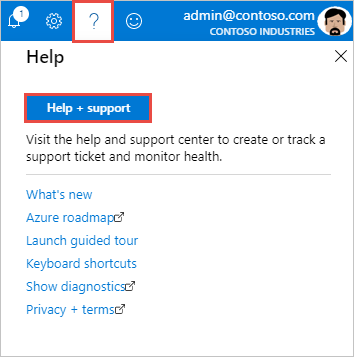
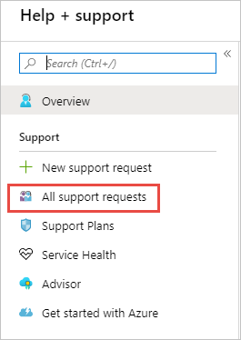

# How to create an Azure support request

## Overview

Azure customers can create and manage support requests in the [Azure portal](https://portal.azure.com).

> [!NOTE]
> The Azure portal URL is specific to the Azure cloud where your organization is deployed. 
>* Azure portal for commercial use is: [https://portal.azure.com](https://portal.azure.com)
>* Azure portal for Germany is: [https://portal.microsoftazure.de](https://portal.microsoftazure.de)
>* Azure portal for the United States government is: [https://portal.azure.us](https://portal.azure.us)
>
>

Based on customer feedback, we’ve updated the support request experience to focus on three main goals:

* **Streamlined**: Make support and troubleshooting easy to find and simplify how you submit a support request.
* **Integrated**: You can easily open a support request when you’re troubleshooting an issue with an Azure resource, without switching context.
* **Efficient**: Gather the key information your support agent needs to efficiently resolve your issue.

## Getting started

You can get to **Help + support** in the Azure portal. It's available from the global header or from the resource menu for a service.

### Go to Help + support from the global header

To start a support request from anywhere in the Azure portal:

1. Select the **?** in the global header. Then select **Help + support**.

   

2. Select **+ New support request**. Follow the prompts to provide us with information about your problem. We'll suggest some possible solutions, gather details about the issue, and help you submit and track the support request.

   

### Go to Help + support from a resource menu

To start a support request in the context of the resource, you're currently working with:

1. From the resource menu, in the **Support + Troubleshooting** section, select **New support request**.

   

2. Follow the prompts to provide us with information about the problem you're having. When you start the support request process from the resource, some options are pre-selected for you.

## Create a support request

We'll walk you through some steps to gather information about your problem and help you solve it. Each step is described in the following sections.

### Basics

The first step of the support request process gathers basic information about your issue and your support plan.

On the **Basics** tab of **New support request**, use the selectors to start to tell us about the problem. First, you'll identify some general categories for the issue type and choose the related subscription. Selecting the service (for example, "Virtual Machine running Windows") and the resource (the name of your virtual machine) is the next step to get help. Briefly describe the problem in your own words, then **Select problem type** to get more specific.

> [!NOTE]
> Azure provides unlimited support for subscription management (things like billing, quota adjustments, and account transfers). For technical support, you need a support plan. [Learn more about support plans](https://azure.microsoft.com/support/plans).
>
>

### Solutions

After gathering basic information, we next show you solutions to try on your own. In some cases, we may even run a quick diagnostic. Solutions are written by Azure engineers and will solve most common problems.

### Details

Next, we collect additional details about the problem. Providing thorough and detailed information in this step helps us route your support request to the right agent and lets them begin diagnosing the issue.

It's a good idea to let us know when the problem started and any steps to reproduce it. You may also choose to upload a file, such as a log file or output from diagnostics.

After we have all the information about the problem you're having, you can choose how to get support. In the **Support method** section of the **Details** tab, select the severity of impact. Provide your preferred contact method, a good time to contact you, and your support language.

Next, complete the **Contact info** section so we know how to contact you.

### Review + create

Complete all required information on each tab, then select **Review + create**. Check the details that you'll send to Support. Go back to any tab to make a change if needed. When you're satisfied the support request is complete, select **Create**.

A support agent will contact you using the method you indicated. Consult [Support scope and responsiveness](https://azure.microsoft.com/support/plans/response/) for information about initial response time.

## All support requests

You can view the details and status of support requests by going to **Help + support** >  **All support requests**.

On this page, you can filter support requests by Subscription, created date (UTC), and status. Additionally, you can sort and search for support requests on this page.

Select a support request to view details, including severity and the expected time it will take for a support agent to respond.

If you want to change the severity of the request, select  **Business impact**. A list of severities available to assign is shown.

> [!NOTE]
> The maximum severity level depends on your support plan. [Learn more about support plans](https://azure.microsoft.com/support/plans).
>
>
To learn more about self-help support options in Azure, watch this video:

> [!VIDEO https://www.youtube.com/embed/gNhzR5FE9DY]

## Next steps
* [Send us your feedback and suggestions](https://feedback.azure.com/forums/266794-support-feedback)
* Engage with us on [Twitter](https://twitter.com/azuresupport)
* Get help from your peers in the [MSDN forums](https://social.msdn.microsoft.com/Forums/azure)
* Learn more in [Azure Support FAQ](https://azure.microsoft.com/support/faq)
