# Back up AVS VMs with Azure Backup Server

In this article, we go through the procedures back up VMware VMs running on Azure VMware Solution (AVS) using Azure Backup Server. Before you begin, make sure to go through the [Set up Microsoft Azure Backup Server for AVS](set-up-mabs-for-avs.md). 

Them, we will walk through all of the necessary procedures to:

> [!div class="checklist"] 
> * Set up a secure channel so that Azure Backup Server can communicate with VMware servers over HTTPS. 
> * Add the account credentials to Azure Backup. 
> * Add the vCenter to Azure Backup Server. 
> * Set up a protection group that contains the VMware VMs you want to back up, specify backup settings, and schedule the backup.

## Create a secure connection to the vCenter Server

By default, Azure Backup Server communicates with VMware servers over HTTPS. To set up the HTTPS connection download the VMware Certificate Authority (CA) certificate, and import it on the Azure Backup Server.

### Set up the certificate

1.  In the browser on the Azure Backup Server, enter the vSphere Web Client URL.

    > [!NOTE] 
    > If the login page doesn't appear, verify the connection and browser proxy settings.

    

1.  On the vSphere Web Client login page, click **Download trusted root CA certificates**.

    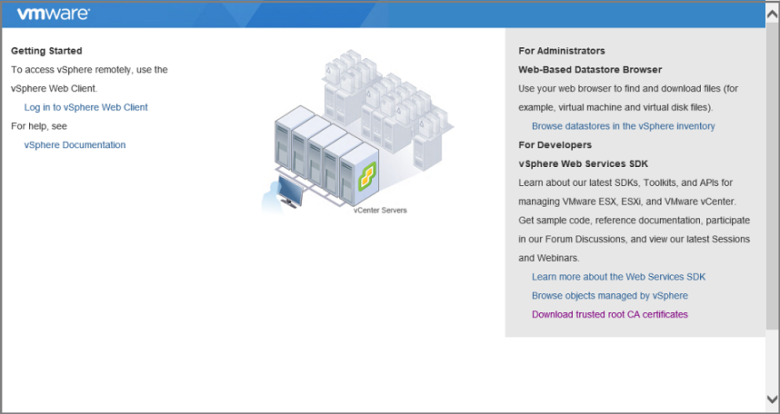

2.  Save the **download.zip** file to the Azure Backup Server machine and then extract its contents to the **certs** folder, which contains the:

    -   Root certificate file with an extension that begins with a numbered sequence like .0 and .1.

    -   CRL file has an extension that begins with a sequence like .r0 or .r1.

3.  In the **certs** folder, right-click the root certificate file, and select **Rename** to change the extension to **.crt**.

    The file icon changes to one that represents a root certificate.

1.  Right-click the root certificate and select **Install Certificate**.

2.  In the **Certificate Import Wizard**, select **Local Machine** as the destination for the certificate, and then click **Next**.

    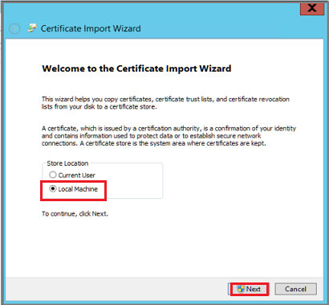

    > [!NOTE] 
    > If asked, confirm that you want to allow changes to the computer.    

1.  Select **Place all certificates in the following store**, and then click **Browse** to choose the certificate store.

    

1.  Select **Trusted Root Certification Authorities** as the destination folder and then click **OK**.

2.  Review the settings and then click **Finish** to start importing the certificate.

    

1.  After the certificate import is confirmed, sign in to the vCenter Server to confirm that your connection is secure.

### Enable TLS 1.2 on MABS Server

VMWare 6.7 onwards had TLS enabled as communication protocol. 

1. Copy the following registry settings and paste into Notepad, and then save the file as TLS.REG without the .txt extension.

    ```text
    
    Windows Registry Editor Version 5.00
    
    [HKEY_LOCAL_MACHINE\SOFTWARE\WOW6432Node\Microsoft\.NETFramework\v2.0.50727]
    
       "SystemDefaultTlsVersions"=dword:00000001
    
       "SchUseStrongCrypto"=dword:00000001
    
    [HKEY_LOCAL_MACHINE\SOFTWARE\WOW6432Node\Microsoft\.NETFramework\v4.0.30319]
    
       "SystemDefaultTlsVersions"=dword:00000001
    
       "SchUseStrongCrypto"=dword:00000001
    
    [HKEY_LOCAL_MACHINE\SOFTWARE\Microsoft\.NETFramework\v2.0.50727]
    
       "SystemDefaultTlsVersions"=dword:00000001
    
       "SchUseStrongCrypto"=dword:00000001
    
    [HKEY_LOCAL_MACHINE\SOFTWARE\Microsoft\.NETFramework\v4.0.30319]
    
       "SystemDefaultTlsVersions"=dword:00000001
    
       "SchUseStrongCrypto"=dword:00000001
    
    ```

1.  Right-click the TLS.REG file and select **Merge** or **Open** to add them to the registry.

## Add the provisioning IP Address for AVS ESXi hosts on Azure Backup Server

During preview, AVS does not resolve the ESX host from the virtual machine deployed in the virtual network. You’ll need to perform additional step to add host file entry on the MABS virtual machine.

### Identify IP Address for ESXi hosts

1.  Open the browser and sign in to the vCenter URLs. You can find the URLs in the [Connect to the local vCenter of your private cloud](tutorial-access-private-cloud.md#connect-to-the-local-vcenter-of-your-private-cloud) article.

2.  In the vSphere Client, select the cluster that you plan to enable backup.

    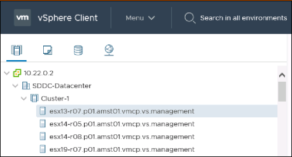

1.  Select **Configure** > **Networking** > **VMKernel adapters**, and under the list of devices identify the network adapter that has **Provisioning** role enabled, note down the **IP Address** and ESXi hostname.

    

1.  Repeat the previous step for each ESXi host under every cluster that you plan to enable backup.

### Update the host file on the Azure Backup Server

1.  Open **Notepad** as administrator.

2.  Select **File > Open** and search for c:\Windows\System32\Drivers\etc\hosts.

3.  Add the entry for each ESXi host along with the IP Address that you identified in the above section.

4.  Save your changes and close Notepad.

## Add the account on Azure Backup Server

The user added must have the proper backup privileges to perform backup and restores from Backup Server. Ensure the user you are adding has the privileges required by reviewing the [Add a new user account in VMware server](https://docs.microsoft.com/system-center/dpm/back-up-vmware?view=sc-dpm-2019&branch=master#add-a-new-user-account-in-vmware-server).

1.  Open Azure Backup Server, and in the Azure Backup Server console, select **Management** > **Production Servers** > **Manage VMware**.

    

1.  In the **Manage Credentials** dialog box, click **Add**.

    

1.  In **Add Credential**, enter a name and a description for the new credential, and specify the username and password you defined on the VMware server.

    > [!NOTE] 
    > If the VMware server and Azure Backup Server aren't in the same domain, specify the domain in the user name.

    

1.  Click **Add** to add the new credential.

    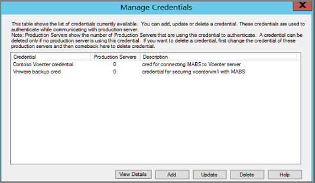

## Add the vCenter Server to Azure Backup Server

1.  In the Azure Backup Server console, click **Management** > **Production Servers** > **Add**.

    

1.  Select **VMware Servers** and then click **Next**.

    

1.  Specify the IP address of the vCenter.

    

1.  In **SSL Port**, enter the port used to communicate with the vCenter.

    > [!TIP] 
    > Port 443 is the default port, but you can change it if your vCenter listens on a different port.

1.  In **Specify Credential**, select the credential that you created in the previous section.

2.  Click **Add** to add the vCenter to the servers list, and then click **Next**.

    

1.  On the **Summary** page, click **Add** to add the vCenter to Azure Backup Server.

    The new server is added immediately; no agent is needed on the vCenter.

    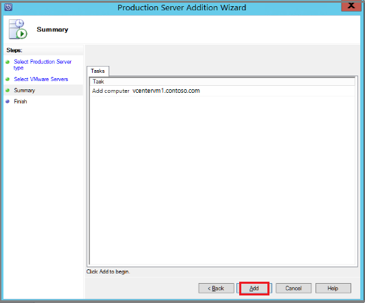

1.  On the **Finish** page, review the settings and then click **Close**.

    

    You should see the vCenter server listed under the Production Server with type as VMware Server and Agent Status as *OK*. If you see the agent status as *unknown*, click **Refresh**.

## Configure a protection group

Add VMware VMs for backup. Protection groups gather multiple VMs and apply the same data retention and backup settings to all VMs in the group.

1.  In the Azure Backup Server console, click **Protection** > **New**.

    

1.  In the **Create New Protection Group** wizard welcome page, click **Next**.

    

1.  On the **Select Protection group type** page, select **Servers** and then click **Next**. The **Select group members** page appears.

2.  In **Select group members**, select the VMs (or VM folders) that you want to back up. Then click **Next**.

    > [!NOTE]
    > When you select a folder, or VMs or folders inside that folder are also selected for backup. You can uncheck folders or VMs you don't want to back up. If a VM or folder is already being backed up, you can't select it. This ensures that duplicate recovery points aren't created for a VM.

    

1.  In **Select Data Protection Method** page, enter a name for the protection group, and protection settings. To back up to Azure, set short-term protection to **Disk** and enable online protection. Then click **Next**.

    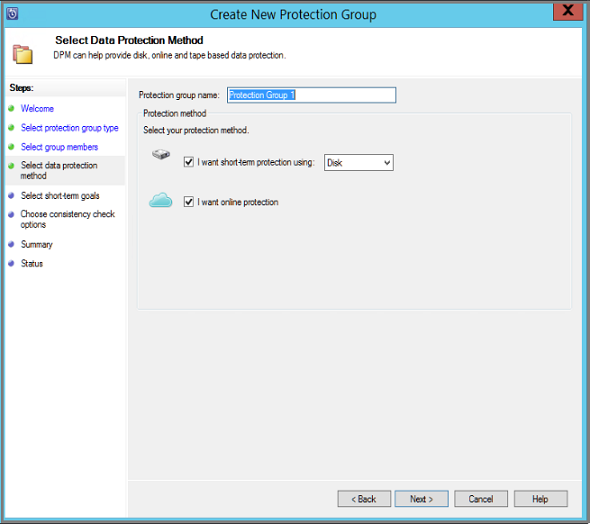

1.  Specify how long you want to keep data backed up to disk.

    -   **Retention Range** - number of days disk recovery points should be kept.

    -   **Express Full Backup** - how often disk recovery points are taken. Click **Modify** to change the times/dates when short-term backups occur.

    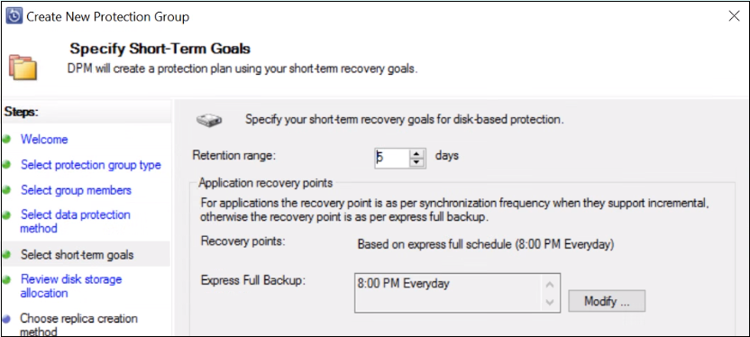

1.  In **Review Disk Allocation**, review the disk space provided for the VM backups. for the VMs.

    -   The recommended disk allocations are based on the retention range you specified, the type of workload, and the size of the protected data. Make any changes required, and then click **Next**.

    -   **Data size:** Size of the data in the protection group.

    -   **Disk space:** The recommended amount of disk space for the protection group. If you want to modify this setting, you should allocate total space that is slightly larger than the amount that you estimate each data source grows.

    -   **Storage pool details:** Shows the status of the storage pool, including total and remaining disk size.

    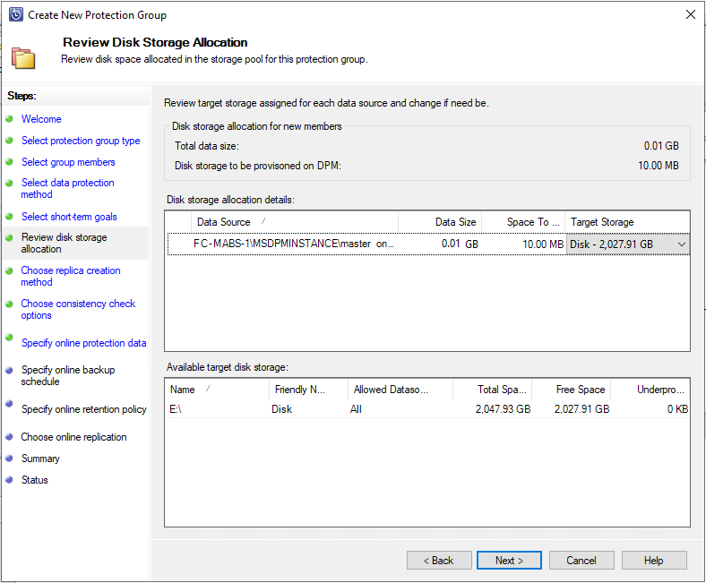

    > [!NOTE]
    > In some scenarios, the Data Size reported is higher than actual VM size. We are aware of the issue and currently investigating it.

1.  In **Choose Replica Creation Method** page, specify how you want to take the initial backup, and then click **Next**.

    -   The default is **Automatically over the network** and **Now**.

    -   If you use the default, we recommend that you specify an off-peak time. Choose **Later** and specify a day and time.

    -   For large amounts of data or less-than-optimal network conditions, consider replicating the data offline by using removable media.

    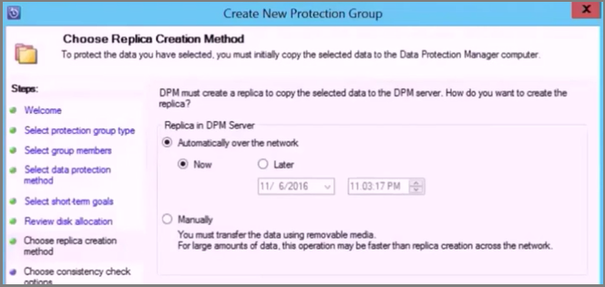

1.  In **Consistency Check Options**, select how and when to automate the consistency checks. Then click **Next**.

    -   You can run consistency checks when replica data becomes inconsistent, or on a set schedule.

    -   If you don't want to configure automatic consistency checks, you can run a manual check by right clicking the protection group **Perform Consistency Check**.

2.  In **Specify Online Protection Data** page, select the VMs or VM folders that you want to back up. You can select the members individually, or click **Select All** to choose all members. Then click **Next**.

    

1.  On the **Specify Online Backup Schedule** page, specify how often you want to back up data from local storage to Azure. 

    -   Cloud recovery points for the data will be generated according to the schedule. Then click **Next**.

    -   After the recovery point is generated, it is transferred to the Recovery Services vault in Azure.

    

1.  On the **Specify Online Retention Policy** page, indicate how long you want to keep the recovery points that are created from the daily/weekly/monthly/yearly backups to Azure. then click **Next**.

    -   There's no time limit for how long you can keep data in Azure.

    -   The only limit is that you can't have more than 9999 recovery points per protected instance. In this example, the protected instance is the VMware server.

    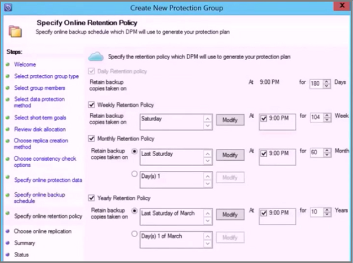

1.  On the **Summary** page, review the settings, and then click **Create Group**.

    

## Monitor with MABS console

Once you configure the protection group to back up AVS VMs, you can monitor the status of backup job and alert using the MABS console. Here is what you can monitor

-   On the Alerts tab in the Monitoring pane, you can monitor errors, warnings, and general information for a protection group, for a specific protected computer, or by message severity. You can view active and inactive alerts and set up email notifications

-   On the Jobs tab in the Monitoring pane, you can view jobs initiated  by MABS for a specific protected data source or protection group. You can follow job progress or check resources consumed by jobs.

-   In the **Protection** task area, you can check the status of volumes and shares in protection group, and check configuration settings such as recovery settings, disk allocation, and backup schedule.

-   In the **Management** task area you can view the **Disks, Online** and **Agents**, tab to check the status of disks in the storage pool, registration to Azure and deployed DPM agent status.

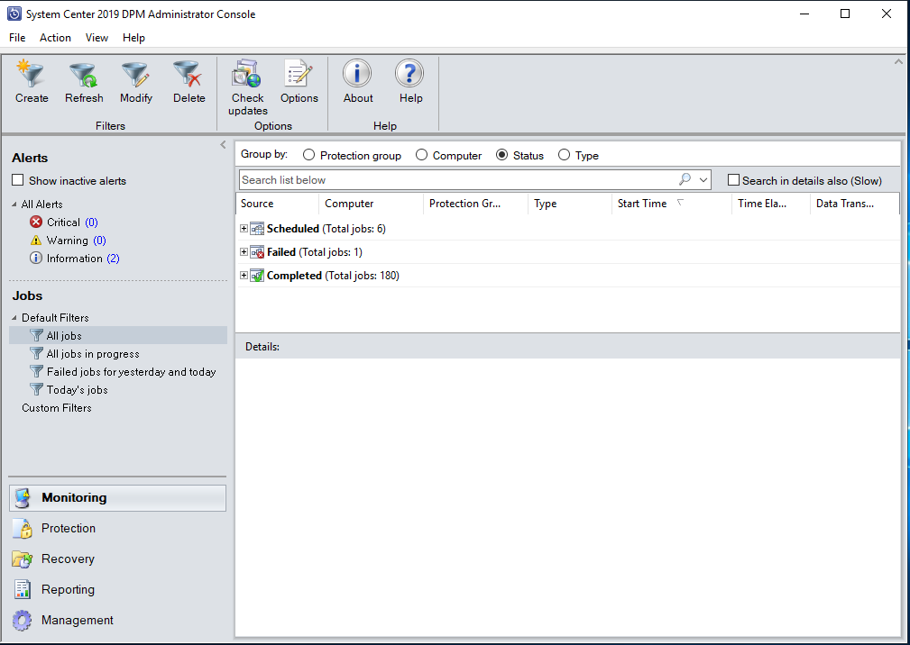

## Restore VMware virtual machines

In the MABS Administrator Console, there are two ways to find recoverable data - search or browse. When recovering data, you may, or may not want to restore data or a VM to the same location. For this reason, MABS supports three recovery options for VMware VM backups:

-   **Original location recovery (OLR)** - Use OLR to restore a protected VM to its original location. You can restore a VM to its original location only if no disks have been added or deleted, since the backup occurred. If disks have been added or deleted, you must use alternate location recovery.

-   **Alternate location recovery (ALR)** - When the original VM is missing, or you don't want to disturb the original VM, recover the VM to an alternate location. To recover a VM to an alternate location, you must provide the location of an ESXi host, resource pool, folder, and the storage datastore and path. To help differentiate the restored VM from the original VM, MABS appends "-Recovered" to the name of the VM.

-   **Individual file location recovery (ILR)** - If the protected VM is a Windows Server VM, individual files/folders inside the VM can be recovered using MABS’s ILR capability. To recover individual files, see the procedure later in this article. Restoring an individual file from a VM is available only for Windows VM and Disk Recovery Points.

### Restore a recovery point

1.  In the MABS Administrator Console, click Recovery view. 

2.  Using the Browse pane, browse or filter to find the VM you want to recover. Once you select a VM or folder, the Recovery points for pane displays the available recovery points.

    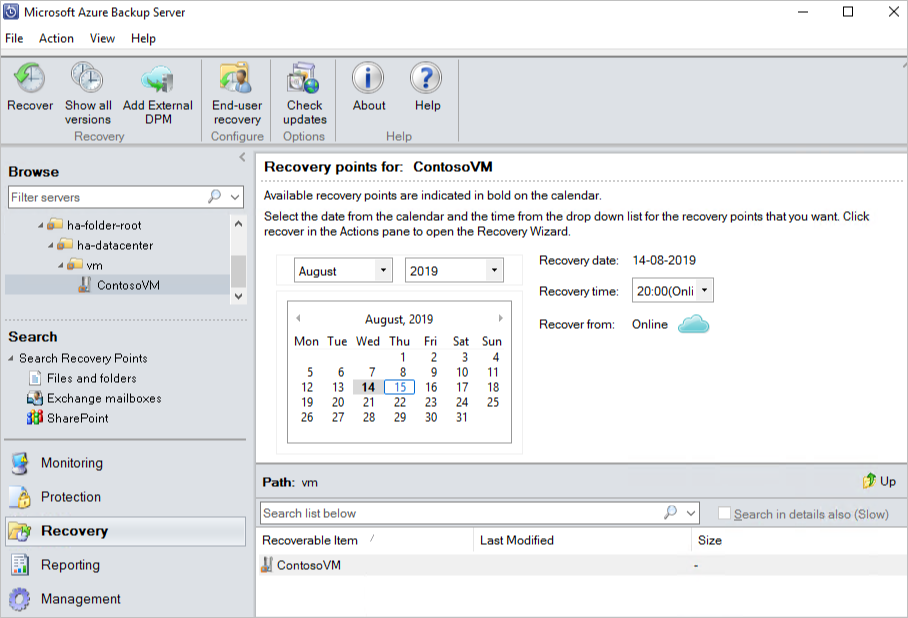

1.  In the **Recovery points for** field, use the calendar and drop-down menus to select a date when a recovery point was taken. Calendar dates in bold have available recovery points. Alternately, you can right-click the VM and select “show all recovery points”, then select the recovery point from the list.

    > [!NOTE] 
    > For short term protection, select a disk based recovery point for faster recovery. After short term recovery points expires you will only see Online recovery points to recover from.

1.  Before recovering from an online recovery point, ensure the staging location contains enough free space to house the full uncompressed size of the VM you want to recover. The staging location can be viewed / changed by running the “configure subscription settings wizard” as seen on this page.

    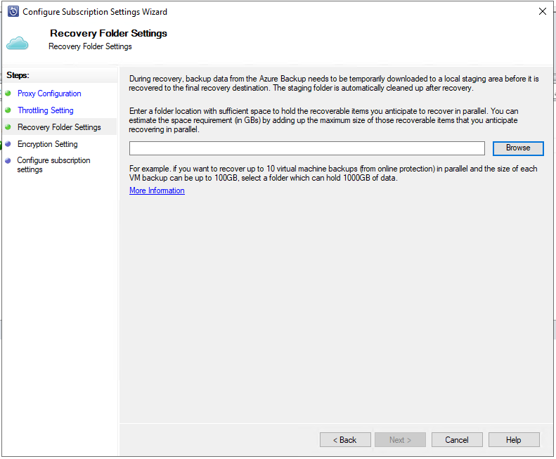

1.  On the tool ribbon, click **Recover** to open the **Recovery Wizard**.

    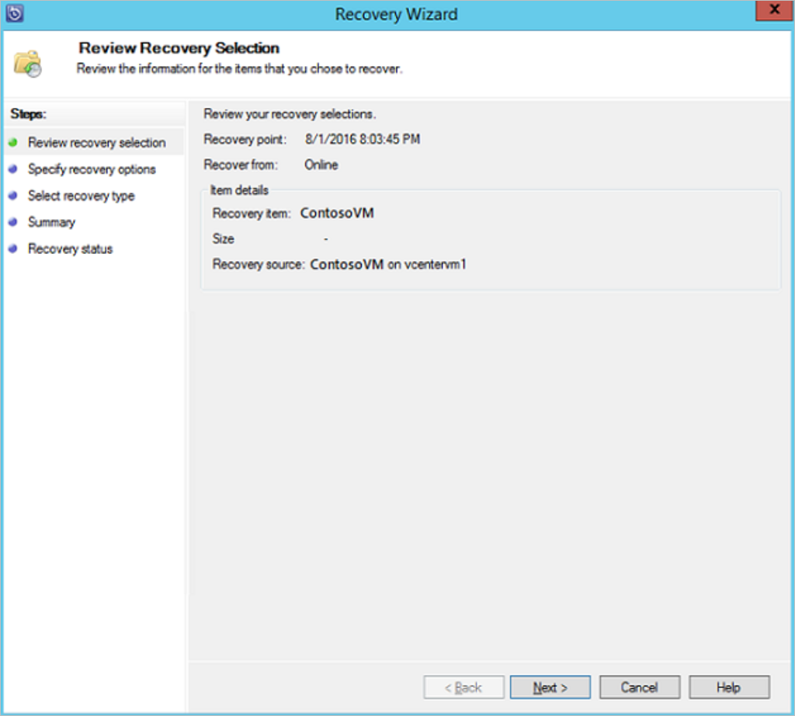

1.  Click **Next** to advance to the **Specify Recovery Options** screen and click **Next** again to advance to the **Select Recovery type** screen. 

    > [!NOTE]
    > VMware workloads do not support enabling network bandwidth throttling.

3.  On the **Select Recovery Type** screen, choose whether to recover to the original instance, or to a new location, and then click **Next**.

    -   If you choose **Recover to original instance**, you don't need to make any more choices in the wizard. The data for the original instance is used.

    -   If you choose **Recover as virtual machine on any host**, then on the **Specify Destination** screen, provide the information for **ESXi Host, Resource Pool, Folder,** and **Path**.

    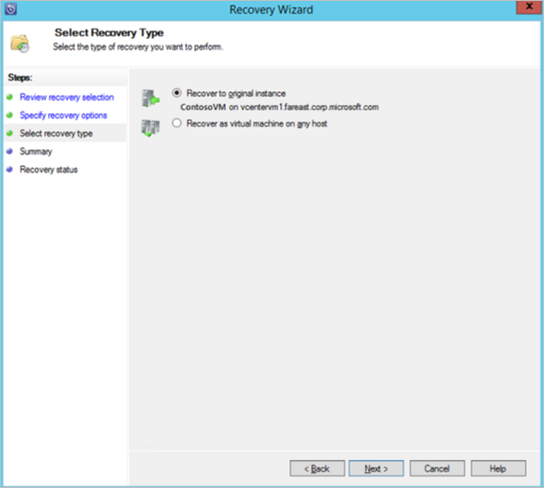

1.  On the **Summary** screen, review your settings and click **Recover** to start the recovery process. The **Recovery status** screen shows the progression of the recovery operation.

### Restore an individual file from a VM

You can restore individual files from a protected VM recovery point. This feature is only available for Windows Server VMs. Restoring individual files is similar to restoring the entire VM, except you browse into the VMDK and find the file(s) you want, before starting the recovery process. To recover an individual file or select files from a Windows Server VM.

> [!NOTE]
> Restoring an individual file from a VM is available only for Windows VM and Disk Recovery Points.

1.  In the MABS Administrator Console, click **Recovery** view.

2.  Using the **Browse** pane, browse or filter to find the VM you want to recover. Once you select a VM or folder, the Recovery points for pane displays the available recovery points.

    

1.  In the **Recovery Points for:** pane, use the calendar to select the date that contains the desired recovery point(s). Depending on how the backup policy has been configured, dates can have more than one recovery point. Once you've selected the day when the recovery point was taken, make sure you've chosen the correct **Recovery time**. If the selected date has multiple recovery points, choose your recovery point by selecting it in the Recovery time drop-down menu. Once you chose the recovery point, the list of recoverable items appears in the **Path** pane.

2.  To find the files you want to recover, in the **Path** pane, double-click the item in the **Recoverable item** column to open it. Select the file or folders you want to recover. To select multiple items, press the **Ctrl** key while selecting each item. Use the **Path** pane to search the list of files or folders appearing in the  **Recoverable Item** column.
    
    > [!NOTE]
    > **Search list below** does not search into subfolders. To search through subfolders, double-click the folder. Use the **Up** button to move from a child folder into the parent folder. You can select multiple items (files and folders), but they must be in the same parent folder. You cannot recover items from multiple folders in the same recovery job.

    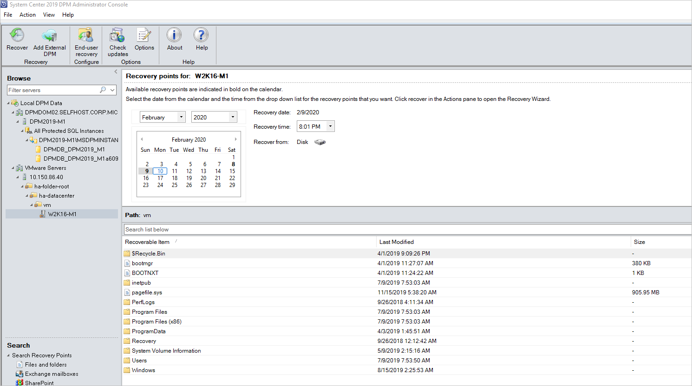

1.  When you have selected the item(s) for recovery, in the Administrator Console tool ribbon, click **Recover** to open the **Recovery Wizard**. In the Recovery Wizard, the **Review Recovery Selection** screen shows the selected items to be recovered.

2.  On the **Specify Recovery Options** screen, do one of the following:

    - Click **Modify** to enable network bandwidth throttling.  In the Throttle dialog, select **Enable network bandwidth usage throttling** to turn it on. Once enabled, configure the **Settings** and **Work Schedule**.
    
    - Click **Next** to leave network throttling disabled.

3.  On the **Select Recovery Type** screen, click **Next**. You can only recover your file(s) or folder(s) to a network folder.

4.  On the **Specify Destination** screen, click **Browse** to find a network location for your files or folders. MABS creates a folder where all recovered items are copied. The folder name has the prefix, MABS_day-month-year. When you select a location for the recovered files or folder, the details for that location (Destination, Destination path, and available space) are provided.

    

1.  On the **Specify Recovery Options** screen, choose which security setting to apply. You can opt to modify the network bandwidth usage throttling, but throttling is disabled by default. Also, **SAN Recovery** and **Notification** are not enabled.

2.  On the **Summary** screen, review your settings and click **Recover** to start the recovery process. The **Recovery status** screen shows the progression of the recovery operation.

## Next steps

For troubleshooting issues when setting up backups, review the troubleshooting guide for Azure Backup Server.


> [!div class="nextstepaction"]
> [Troubleshooting guide for Azure Backup Server](../backup/backup-azure-mabs-troubleshoot.md)
