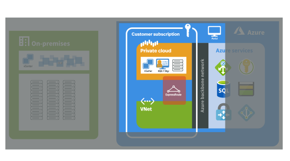
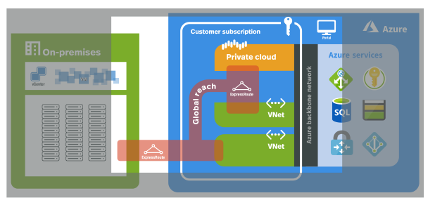

# Azure VMware Solution (AVS) Preview networking and interconnectivity concepts

Network interconnectivity between your Azure VMware Solution (AVS) private clouds and on-premises environments or virtual networks in Azure lets you access and use your private cloud. In this article, we'll cover a few key concepts that establish the basis of networking and interconnectivity.

A useful perspective on interconnectivity is to consider the two types of AVS private cloud implementations:

1. **Basic Azure-only interconnectivity**, described in [Azure virtual network connectivity](#azure-virtual-network-interconnectivity), lets you manage and use your private cloud with only a single virtual network in Azure. This implementation is best suited for AVS evaluations or implementations that don't require access from on-premises environments.
1. **Full on-premises to private cloud interconnectivity**, described in [On-premises connectivity](#on-premises-interconnectivity), extends the basic Azure-only implementation to include interconnectivity between on-premises and AVS private clouds.
 
You can find more information about the requirements and the two types of AVS private cloud interconnectivity implementations described in the sections below.

## AVS private cloud use cases

The use cases for AVS private clouds include:
- new VMware VM workloads in the cloud
- VM workload bursting to the cloud
- VM workload migration to the cloud
- disaster recovery
- consumption of Azure services

 All use cases for the AVS service are enabled with on-premises to private cloud connectivity. 

## Virtual network and ExpressRoute circuit requirements
 
When you create a connection from a virtual network in your subscription, the ExpressRoute circuit gets established through peering, uses an authorization key and a circuit ID  that you request in the Azure portal. The peering is a private, one-to-one connection between your private cloud and the virtual network.

> [!NOTE] 
> The ExpressRoute circuit is in your subscription but is not part of a private cloud deployment. The on-premises ExpressRoute circuit is beyond the scope of this document. If you require on-premises connectivity to your private cloud, you can use one of your existing ExpressRoute circuits or purchase one in the Azure portal.

When deploying a private cloud, you receive IP addresses for vCenter and NSX-T Manager. To access those management interfaces, you'll need to create additional resources in a virtual network in your subscription. You can find the procedures for creating those resources and establishing ExpressRoute private peering in the tutorials.

The private cloud logical networking comes with pre-provisioned NSX-T. A Tier-0 gateway and Tier-1 gateway is pre-provisioned for you. You can create a segment and attach it to the existing Tier-1 gateway or attach it to a new Tier-1 gateway that you define. NSX-T logical networking components provide East-West connectivity between workloads and also provide North-South connectivity to the internet and Azure services. 

## Routing and subnet requirements

The routing is Border Gateway Protocol (BGP) based, which is automatically provisioned and enabled by default for each private cloud deployment. For AVS private clouds, it's required to plan private cloud network address spaces. AVS private clouds require a minimum of /22 prefix length CIDR network address blocks for subnets, shown in the table below. The address block shouldn't overlap with address blocks used in other virtual networks that are in your subscription and on-premises networks. Within this address block, management, provisioning, and vMotion networks are provisioned automatically.

Example `/22` CIDR network address block:  `10.10.0.0/22`

The subnets:

| Network usage             | Subnet | Example        |
| ------------------------- | ------ | -------------- |
| Private cloud management            | `/24`    | `10.10.0.0/24`   |
| vMotion network       | `/24`    | `10.10.1.0/24`   |
| VM workloads | `/24`   | `10.10.2.0/24`   |
| ExpressRoute peering | `/24`    | `10.10.3.8/30`   |

## Azure virtual network interconnectivity

In the virtual network to private cloud implementation, you can manage your AVS private cloud, consume workloads in your private cloud, and access Azure services over the ExpressRoute connection. 

The diagram below shows the basic network interconnectivity established at the time of a private cloud deployment. It shows the logical, ExpressRoute-based networking between a virtual network in Azure and a private cloud. The interconnectivity fulfills three of the primary use cases:
* Inbound access to vCenter server and NSX-T manager that is accessible from VMs in your Azure subscription and not from your on-premises systems. 
* Outbound access from VMs to Azure services. 
* Inbound access and consumption of workloads running a private cloud.

## On-premises interconnectivity

In the virtual network and on-premises to full private cloud implementation, you can access your AVS private clouds from on-premises environments. This implementation is an extension of the basic implementation described in the previous section. Like the basic implementation, an ExpressRoute circuit is required, but with this implementation, it’s used to connect from on-premises environments to your private cloud in Azure. 

The diagram below shows the on-premises to private cloud interconnectivity, which enables the following use cases:
* Hot/Cold Cross-vCenter vMotion
* On-Premise to AVS private cloud management access

For full interconnectivity to your private cloud, enable ExpressRoute Global Reach and then request an authorization key and private peering ID for Global Reach in the Azure portal. The authorization key and peering ID are used to establish Global Reach between an ExpressRoute circuit in your subscription and the ExpressRoute circuit for your new private cloud. Once linked, the two ExpressRoute circuits route network traffic between your on-premises environments to your private cloud.  See the [tutorial for creating an ExpressRoute Global Reach peering to a private cloud](tutorial-er-global-reach-private-cloud.md) for the procedures to request and use the authorization key and peering ID.

## Next steps 

The next step is to learn about [private cloud storage concepts](concepts-storage.md).

<!-- LINKS - external -->
[enable Global Reach]: https://docs.microsoft.com/azure/expressroute/expressroute-howto-set-global-reach

<!-- LINKS - internal -->

