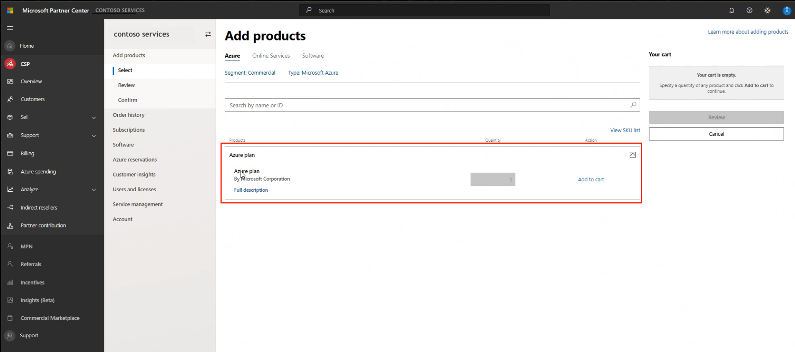

# How to enable Azure VMware Solution resource
Learn how to submit a support request to enable your [Azure VMware Solution](introduction.md) resource. You can also request more nodes in your existing Azure VMware Solution private cloud.

## Eligibility criteria

You'll need an Azure account in an Azure subscription. The Azure subscription must comply with one of the following criteria:

* A subscription under an [Azure Enterprise Agreement (EA)](../cost-management-billing/manage/ea-portal-agreements.md) with Microsoft.
* A Cloud Solution Provider managed subscription under an Azure plan.


## Enable Azure VMware Solution resource for customers with Azure Enterprise Agreement with Microsoft
Before you create your Azure VMware Solution resource, you'll need to submit a support ticket to have your nodes allocated. Once the support team receives your request, it takes up to five business days to confirm your request and allocate your nodes. If you have an existing Azure VMware Solution private cloud and want more nodes allocated, you'll go through the same process.


1. In your Azure portal, under **Help + Support**, create a **[New support request](https://rc.portal.azure.com/#create/Microsoft.Support)** and provide the following information for the ticket:
   - **Issue type:** Technical
   - **Subscription:** Select your subscription
   - **Service:** All services > Azure VMware Solution
   - **Resource:** General question 
   - **Summary:** Need capacity
   - **Problem type:** Capacity Management Issues
   - **Problem subtype:** Customer Request for Additional Host Quota/Capacity

1. In the **Description** of the support ticket, on the **Details** tab, provide:

   - POC or Production 
   - Region Name
   - Number of nodes
   - Any other details

   >[!NOTE]
   >Azure VMware Solution recommends a minimum of three nodes to spin up your private cloud and for redundancy N+1 nodes. 

1. Select **Review + Create** to submit the request.

   It will take up to five business days for a support representative to confirm your request.

   >[!IMPORTANT] 
   >If you already have an existing Azure VMware Solution, and you are requesting additional nodes, please note that we need five business days to allocate the nodes. 

1. Before you can provision your nodes, make sure that you register the **Microsoft.AVS** resource provider in the Azure portal.  

   ```azurecli-interactive
   az provider register -n Microsoft.AVS --subscription <your subscription ID>
   ```

   For additional ways to register the resource provider, see [Azure resource providers and types](../azure-resource-manager/management/resource-providers-and-types.md).

## Enable Azure VMware Solution resource for customers under a CSP Azure plan

Cloud Solution Providers must use [Microsoft Partner Center](https://partner.microsoft.com) to enable Azure VMware Solution for their customers. 

In **Partner Center** go to **CSP** and then access the **Customers** area.


Select your customer and then go to **Add products**.



Select **Azure plan** and click **Add to cart**. Review the cart and finish the process to get the Azure plan available for your customer. See [Microsoft Partner Center documentation](https://docs.microsoft.com/partner-center/azure-plan-manage) to review and finish the general set up of the Azure plan subscription.

After the Azure plan is properly configured and the needed RBAC permissions in place as a Cloud Solution Provider you will have to engage Microsoft using a similar procedure to enable the quota for an Azure plan subscription. 

Once the solution is added to the Azure plan then the customer or the partner administrator can proceed with the deployment of an Azure VMware Solution Private Cloud through Azure Portal. 