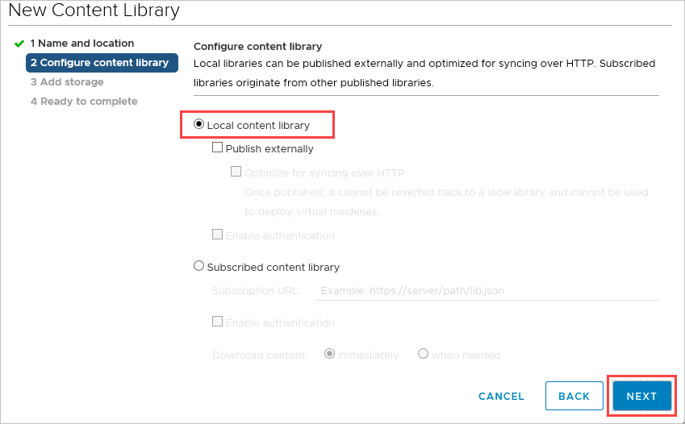
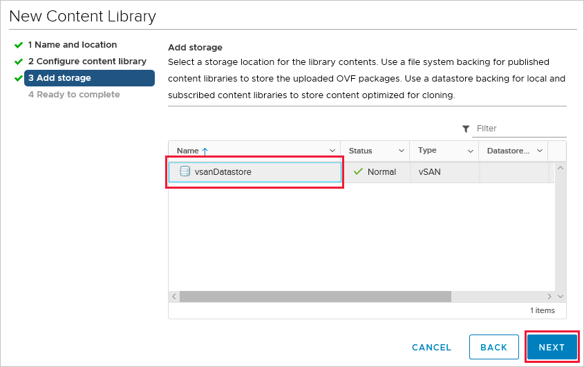
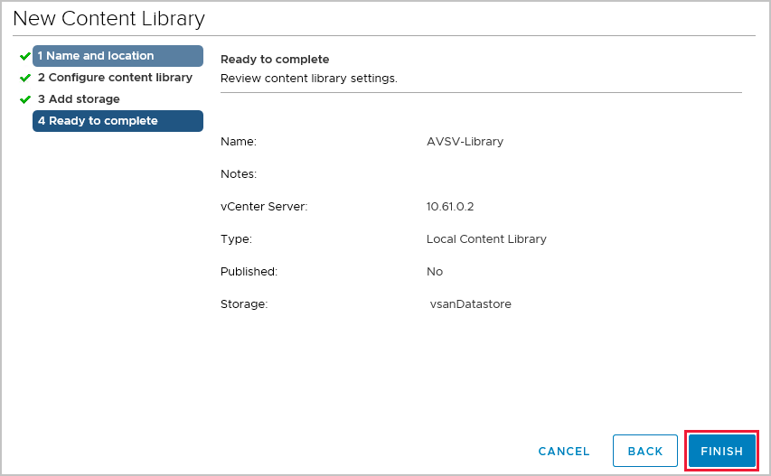

# Tutorial: Create a content library for deploying a VM in Azure VMware Solution (AVS)

In this tutorial, you learn how to:

You learn how to:
> [!div class="checklist"]
> * Create a content library
> * Upload an ISO to the content library
> * Deploy a VM using an ISO in the Content Library

## Prerequisites

An NSX-T logical switch segment created in a [previous tutorial]() is required to complete this tutorial.

## Create a content library

1. From the on-premises vSphere Client, select **Menu > Content Libraries**.

   

1. Click the **Add** button to create a new content library.

   

1. Specify a name and confirm the IP address of the vCenter server and click **Next**.

   

1. Select the **Local content library** and click **Next**.

   

1. Select the datastore that will store your content library, and then click **Next**.

   

1. Review and verify the content library settings, and then click **Finish**.

   

## Upload an ISO image to the content library

Now that the content library has been created, you can add the ISO image to deploy a VM to a private cloud cluster. 

1. From the on-premises vSphere Client, select **Menu > Content Libraries**.

1. Right-click the content library you want to use for a new ISO and select **Import Item**.

1. Import a library item by doing one of the following for the Source, and then click **Import**:
   1. Select URL and provide a URL to download an ISO.
   2. Select Local File to upload from your local system.

   > [!TIP]
   > Optional, you can define a custom item name and notes for the Destination.

1. Open the library and select the **Other Types** tab to verify that your ISO was uploaded successfully.

## Deploy a VM to a private cloud cluster

1. From the on-premises vSphere Client, select **Menu > Hosts and Clusters**.

1. In the left panel, expand the tree and select a cluster.

1. Select **Actions > New Virtual Machine**.

1. Go through the wizard and modify the settings as desired.

1. Select **New CD/DVD Drive > Client Device > Content Library ISO File**.

1. Select the ISO uploaded in the previous section and then click **OK**.

1. Select the **Connect** check box so the ISO is mounted at power-on time.

1. Select **New Network > Select dropdown > Browse**.

1. Select the **logical switch (segment)** and click **OK**.

1. Modify any other hardware settings and click **Next**.

1. Verify the settings and click **Finish**.

## Next steps

The next step is to [create additional NSX-T networks]().

<!-- LINKS - external-->

<!-- LINKS - internal -->