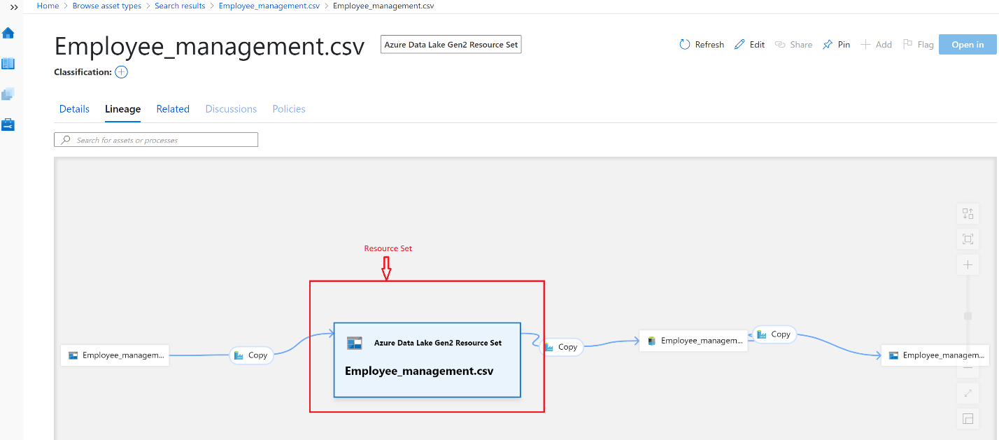
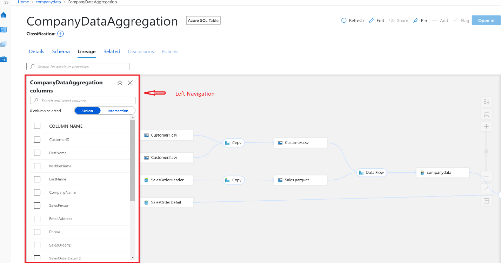
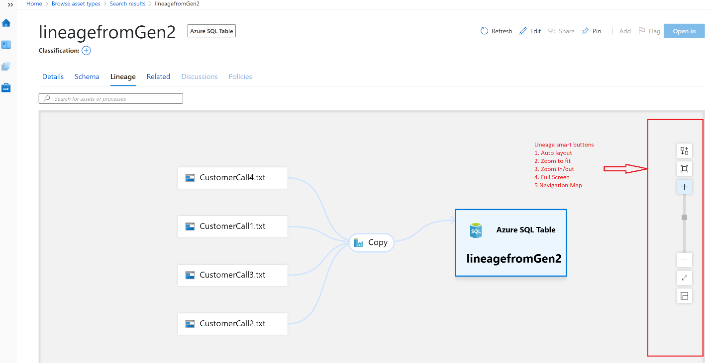

# Catalog lineage user guide

One of the primary features of Project Babylon is the ability to show the lineage between datasets, based on the integration with Azure Data Factory (ADF). The current  support includes capturing data lineage from ADF activities Copy data, Data Flow, and Execute SSIS package. In addition to the native integration, custom lineage reporting is also supported via Atlas hooks or REST API.

## Common scenarios
Lineage in Babylon is aimed to support root cause analysis and impact analysis scenarios for the Data producers and Data consumers.

### Root cause analysis 
Data Engineers own data sources within a data estate. In situations when a data source has incorrect data because of upstream issues, the data engineers can use Babylon lineage as a centralized platform to  understand upstream process failures and be informed about the reasons for their data sources discrepancy.

### Impact analysis
Data producers want to change and deprecate a column in a data source they own, and they want to know who's impacted upon making such a change. Babylon lineage can be used as a centralized place for data producer to know all the downstream consumers of their data sources and easily understand the impact of the downstream assets upon changing the attributes of the data source.

## Configure the catalog to collect lineage from Azure Data Factory

This section explains the configuration steps required to report lineage in to Babylon at the execution time of ADF pipelines. The step-by-step instructions to connect Azure Data Factory and Azure Babylon is documented under the section "Connection to Azure Data Factory" in the [Client Overview document](catalog-client-overview.md#connection-to-azure-data-factory-adf) document of our documentation site. Follow the instructions exactly as stated in the Client Overview document to configure lineage reporting. This configuration is a one-time step to start ingesting lineage from ADF into Azure Babylon.

Lineage for the ADF Copy activity is available for on-prem SQL DB. If you're running self-hosted IR for the data movement using Data Factory and want to capture lineage in Babylon, ensure the version is at least 4.8.7418.1. Read [here](https://docs.microsoft.com/azure/data-factory/create-self-hosted-integration-runtime) for more information on self-hosted IR.

To collect lineage from [Execute SSIS package activity](https://docs.microsoft.com/azure/data-factory/how-to-invoke-ssis-package-ssis-activity), enable **Logging level** as **Verbose** on the Settings tab for the Execute SSIS package activity.

## Supported Data Factory activities

Runtime lineage is captured from the following list of Azure Data Factory activities:

* Copy data

* Data Flow

* Execute SSIS package

## Supported Data Stores in lineage for ADF Copy activity

Data factory supports several Azure, on-prem and multi cloud data systems as source/sinks. The Babylon/ADF native integration currently supports only the below list of source and Sinks. 

> [!IMPORTANT]
> Azure Babylon lineage doesn't support types in Azure Data Factory other than those listed in the following table. Lineage is dropped if the source or destination uses an unsupported data storage system.

<table>
<thead>
<tr class="header">
<th>Data Storage systems</th>
<th>Supported as Source</th>
<th>
Supported as Sink

</tr>
</thead>
<tbody>
<tr class="odd">
<td>
Azure Blob

(no JSON support)
</td>
<td>Yes</td>
<td>Yes</td>
</tr>
<tr class="even">
<td>
ADLS Gen1

(no JSON support)
</td>
<td>Yes</td>
<td>Yes (Non-binary copy only)</td>
</tr>
<tr class="odd">
<td>
ADLS Gen2

(no JSON support)
</td>
<td>Yes</td>
<td>Yes</td>
</tr>
<tr class="even">
<td>Azure SQL DB/DW</td>
<td>Yes</td>
<td>Yes</td>
</tr>
<tr class="odd">
<td>On-prem SQL (SHIR required)</td>
<td>Yes</td>
<td>Yes</td>
</tr>
<tr class="even">
<td>ADX</td>
<td>Yes</td>
<td>Yes</td>
</tr>
</tbody>
</table>

### Data flow activity

<table>
<thead>
<tr class="header">
<th>Data storage system</th>
<th>
Supported 

</tr>
</thead>
<tbody>
<tr class="odd">
<td>
Azure Blob

<td>Yes</td>

</tr>
<tr class="even">
<td>
ADLS Gen1

<td>Yes</td>
</tr>

<tr class="odd">
<td>
ADLS Gen2

<td>Yes</td>
</tr>

<tr class="even">
<td>Azure SQL DB/DW</td>
<td>Yes</td>
</tr>

<tr class="odd">
<td>On-prem SQL(SHIR required)</td>
<td>Yes</td>

</tr>
<tr class="even">
<td>ADX</td>
<td>Yes</td>
</tr>
</tbody>
</table>

### Execute SSIS package activity

<table>
<thead>
<tr class="header">
<th>Data storage system</th>
<th>
Supported 

</tr>
</thead>
<tbody>
<tr class="odd">
<td>
Azure Blob

<td>Yes</td>

</tr>
<tr class="even">
<td>
ADLS Gen1

<td>Yes</td>
</tr>

<tr class="odd">
<td>
ADLS Gen2

<td>Yes</td>
</tr>

<tr class="even">
<td>Azure SQL DB/Managed Instance/DW</td>
<td>Yes</td>
</tr>

<tr class="odd">
<td>On-prem SQL</td>
<td>Yes</td>

</tr>
<tr class="even">
<td>Azure Files</td>
<td>Yes</td>
</tr>
</tbody>
</table>

\*In case of SQL (Azure/On-prem) scenarios Stored procedures or scripts are not supported for lineage or scanning scenarios currently. The lineage is currently limited to table and view sources only. We plan to support the scripts in the future.

> [!NOTE]
> As the scope of lineage continue to increase, the document and the above list of supported source/sink datastores will be updated.

## Get started with lineage

The following terms are used to describe lineage.

| **Terminologies**   | **Definition**                                                                                                                                                                                                                                                            |
| ------------------- | ------------------------------------------------------------------------------------------------------------------------------------------------------------------------------------------------------------------------------------------------------------------------- |
| Source/Input (Node) | A dataset (structured or unstructured) provided as an input to a Process. For example, SQL Table, Azure blob, files (.csv, .xml etc.). In the following lineage screenshots, these datasets are the rectangle boxes to the left of round edged process. They're also referred to as Nodes.            |
| Process (Edge)      | A unit of activity or transformation where an action is performed on the Source/Input(s). For example, ADF Copy activity. In the following screenshots, these are round edged boxes                                                                                                  |
| Sink/Output (Node)  | A dataset (structured or unstructured) produced as an output from the Process. For example, SQL Table, Azure blob, files (.csv, .xml etc.) In the following lineage screenshots, these are the rectangle boxes to the right of round edged process. They're also referred as Nodes. |

The lineage information for an asset can be accessed by going to the Lineage tab of the asset detail page.

Follow these steps to access lineage information:

1. Go to the [Azure Babylon instance screen in the Azure portal](https://aka.ms/babylonportal).

1. Open your Babylon instance from the result in Azure portal.

1. Within the Azure Babylon home page, Search for a data asset by entering the name of the input used in the ADF Copy or Data Flow activity and press Enter.

1. From the Search result page, open the asset details and select the **Lineage** tab. It will look like the following screenshot:

   > 

## Supported lineage patterns for the ADF Copy and Data Flow activities

The lineage data generated is based on the type of source and sink used
in the ADF Activities. There are approximately 80+ source/sinks in ADF
and currently we support only a few source/sinks that are captured in
the table [supported Datastore](#supported-data-stores) section above.
Refer to the "[Get Started](#get-started-with-lineage)" section
for information on how to configure ADF to send lineage. There are
several patterns of lineage captured in Azure Babylon, which are explained as follows:

-   In the lineage tab, hover over the Node/Edge to get more information
    about the Asset's taxonomy, like Asset Type.

-   Select the Node/Edge to show additional metadata like the Business
    Glossary annotations, Column count, etc.

-   Select **View Columns** in the Data Asset to see the list of columns in the data asset. Click [here](#column-level-lineage) for more details on Column lineage

### Data movement with 1:1 lineage

This pattern applies to all copy activities that capture lineage for the data movement from one input dataset to one output dataset with a process in between. The ADF operation will ingest three assets in the catalog.

> E.g. SQL table -\> SQL table; SQL table -\> Azure blob/ADLS Gen1/ADLS Gen2
>
> 1 Source/input: *"Customer"* (SQL Table)
>
> 1 Sink/output: "*Customer1.csv"* (Azure Blob)
>
> 1 Process : *"CopyCustomerInfo1\#Customer1.csv"* (ADF Copy activity)

### Data Movement with wildcard support 1:1 lineage

In this scenario, the data is moved from Azure blob to Azure Data lake storage using Data factory Copy activity with wildcard support. When a wildcard is used in the copy activity to copy multiple files together, Babylon will capture file level lineage for each individual file that is copied by the ADF copy activity.
> E.g. Azure Blob/ADLS Gen1/Gen2 -\> Azure Blob/ADLS Gen1/Gen2 file(s)
> Source/input: *"CustomerCall\*.csv"* (ADLS Gen2 path)
>
> Sink/output: "*CustomerCall\*.csv*" (Azure blob file)
>
> 1 process: *"CopyGen2ToBlob\#CustomerCall.csv"* (ADF Copy activity)"
>
>  

### Data movement with n:1 lineage

Data Factory Data Flow activities can be used to merge or join more than
one source datasets to produce a target dataset. In this specific
example Babylon captures file level lineage for individual input files that
are part of the ADF Data Flow activity flowing into a SQL table.

>E.g. Lineage from Azure Blob/ADLS Gen1/Gen2 -\> SQL table
> 2 Source/input: *"Customer.csv"," Sales.parquet"* (ADLS Gen2 Path)
>
> 1 Sink/output: "*Companydata*" (Azure SQL table)
>
> 1 process: "*DataFlowBlobsToSQL"* (ADF Data Flow activity)

### Lineage for resource sets

A resource set is a logical object in the catalog that represents many partition files in the underlying storage. More information is available in [Resource Sets document](concept-resource-sets.md). While capturing lineage from the Azure Data Factory, we apply the rules to normalize the individual partition files and create a single logical object. In the below example an Azure Data Lake Gen2 Resource Set is produced from an Azure Blob

1 Source/input: "Employee\_management.csv" (Azure Blob)

1 Sink/output: "Employee\_management.csv" (Azure Data Lake Gen 2)

1 process: "CopyBlobToAdlsGen2\_RS" (ADF Copy activity)

  

## Column level lineage

Column level lineage is currently supported in Babylon for the ADF
Copy activity and the mapping Data Flow activity. To see column level lineage, go to the **Lineage** tab of the current asset in the catalog and follow these steps:

1. Select the current data asset node to expand it, and then select **View columns**. The list of columns belonging to the data node appears in a list in the left navigation bar.

2.  Select the checkbox in the left navigation bar to see one or more
    columns to display the column level data lineage.

3.  Hover over any column name on the left navigation bar or a data
    asset node to have all the instances highlighted and see the flow of
    a column in data lineage path.

4.  If the number of columns is larger than can be displayed in the left navigation bar, use the filter option to find the desired column by name. Alternatively, one can use the mouse to scroll down.

5.  If the lineage canvas contains more nodes and edges, use the filter highlighted below to find data asset nodes by name. Alternatively, you can use the mouse to scroll around the lineage window.

6.  Use the Union/Intersection toggle to filter the list of nodes in the lineage canvas. If you select union, then any asset that contains at least one of the selected columns will be displayed. If you select intersection, then only assets that contain all of the assets will be displayed.

7.  Select **Switch to asset** in the data node to view another data asset from the lineage view. This is an effective way to browse to another asset in the catalog from the lineage view.

8. Use the smart buttons in the lineage canvas to get an optimal view of the lineage. Auto layout, zoom to fit, zoom in/out, full screen, and navigation map are available to have an immersive lineage experience in the catalog.

