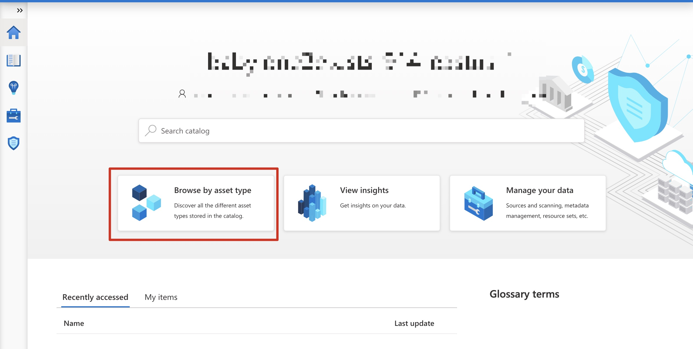
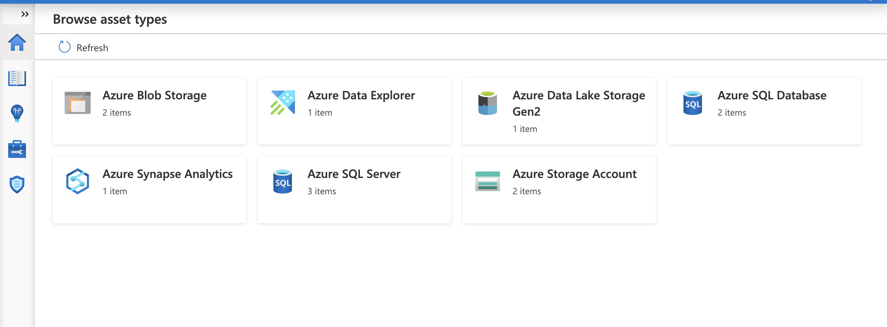
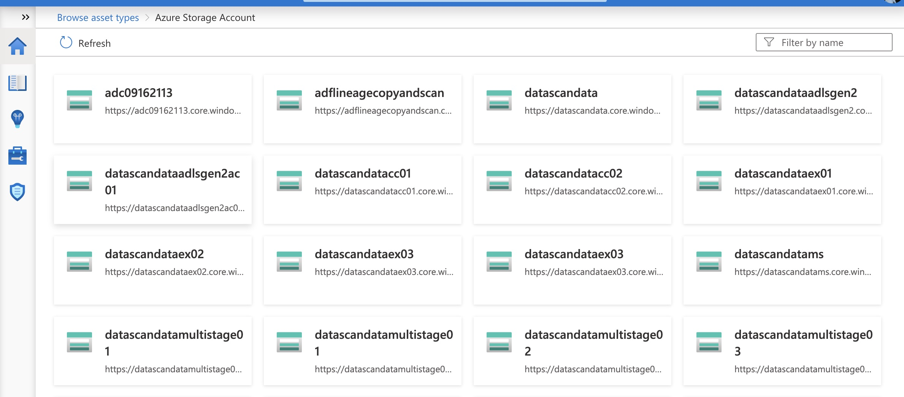
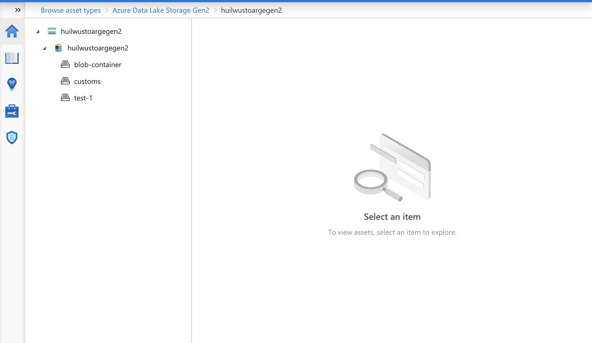
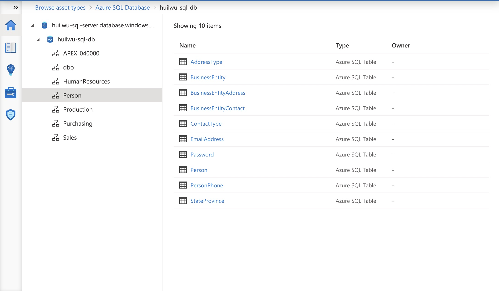
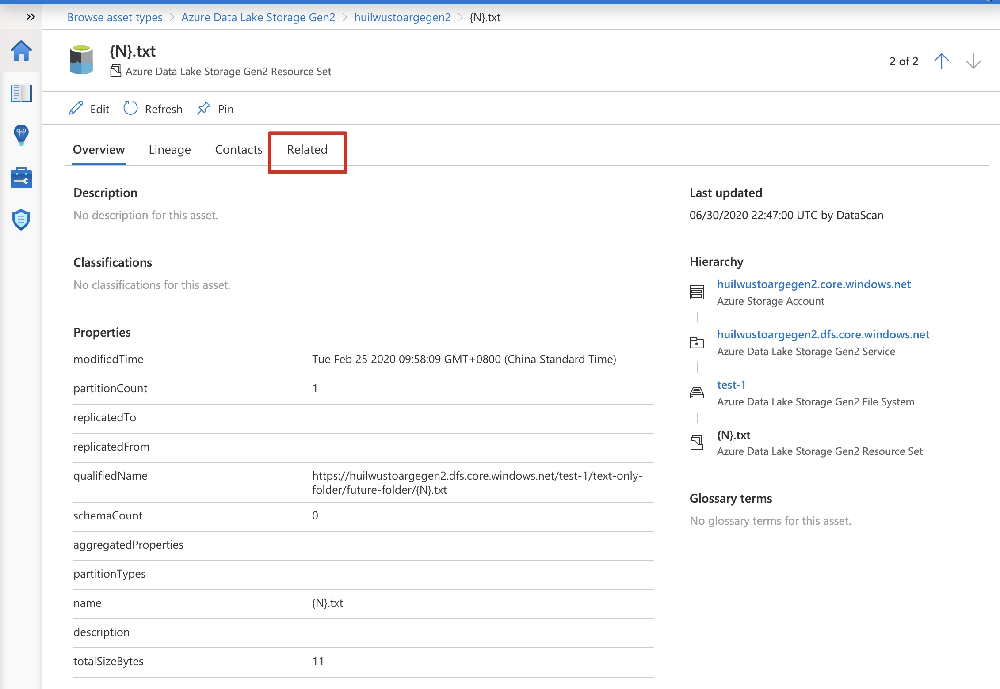
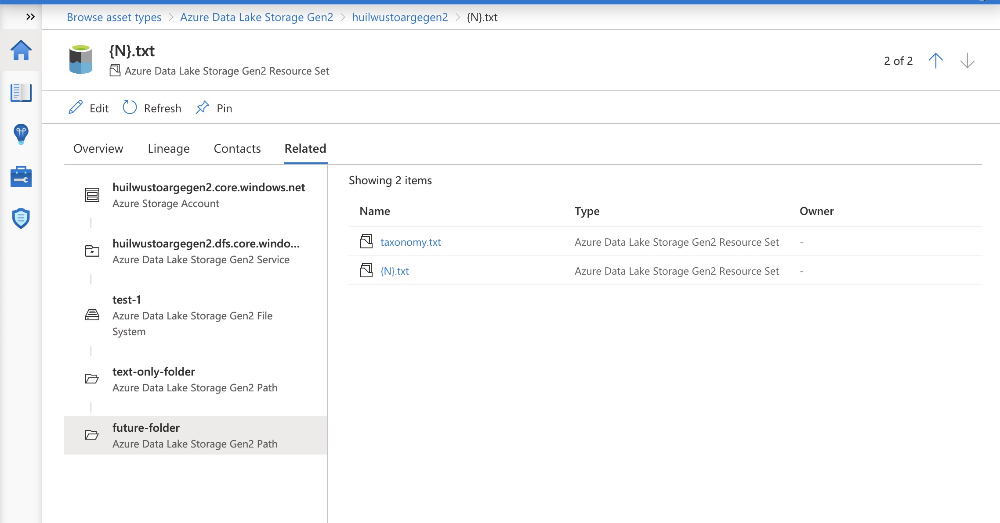
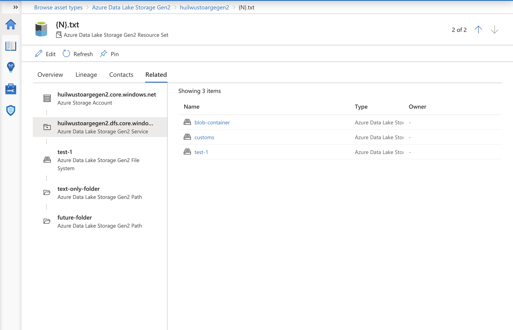

# How to Browse Data catalog

This guide outlines a generic browsing experience in your catalog for Data discovery using the hierarchial namespace of each data source.

## Browse experience

A Data consumers can discover data using the familiar hierarchical namespace for each of the data source using an explorer view. Once the data source is registered and scanned, the Data map extracts information about the structure(hierarchical namespace) of the Data source. This information is used to build the browsing experience for Data discovery.

For example, as a data consumer I am trying to find a dataset called 'DateDimension' under a folder called 'Dimensions' in my data lake built in Azure Data lake Storage Gen 2. I can use the 'Browse by Asset Type' experience to navigate to the ADLS Gen 2 storage account, then browse the service -> container -> Folder(s) to reach the specific 'Dimensions' folder to see the DataDimension table.

A native browsing experience with hierarchical namespace is provided for each of the corresponding data source.

## Launch browse experience

1. The browsing experience can be launched by clicking on the "Browse by asset type" tile in homepage.
   
2. On browse asset types page, tiles are categorized by data source type. To further explore assets, click on one of data source type tile that you're interested in.
   
3. On the next page, top-level assets under chosen type are listed. Pick one of the asset to further explore the contents within.
   

4. The explorer view will open. Start browsing by selecting the asset on the left panel. Children assets will be listed on the right panel of the page.

   

5. To view the detail information of an asset, click on the name or the ellipses to the right which will navigate you to the asset's detail page.

   

## Launch related experience from asset detail page

Once the data consumer is in the asset detail page, they can launch an experience to see other related assets. For example, the data consumer can navigate to the parent folder of 'DateDimension' to see the 'Dimensions' folder or even navigate to the container to see the assets under the specific hierarchy. 

1. From the asset detail page, click on the Related tab to see other related assets.
   
2. The Current asset's full relationship will be listed in hierarchical namespace.
   

3. Click on any level on the hierarchial map to list the children assets under the selected hierarchy.
   
