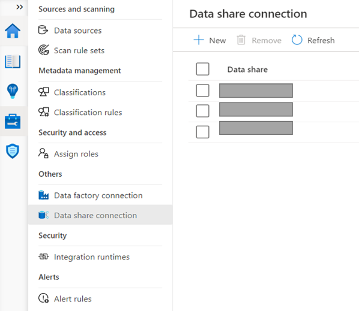
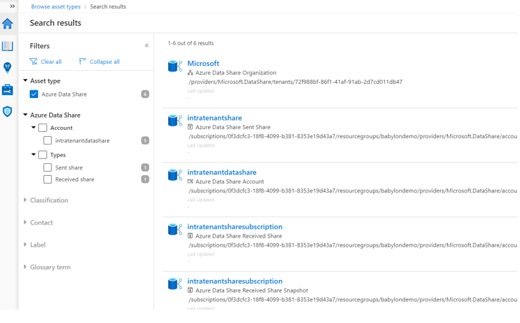
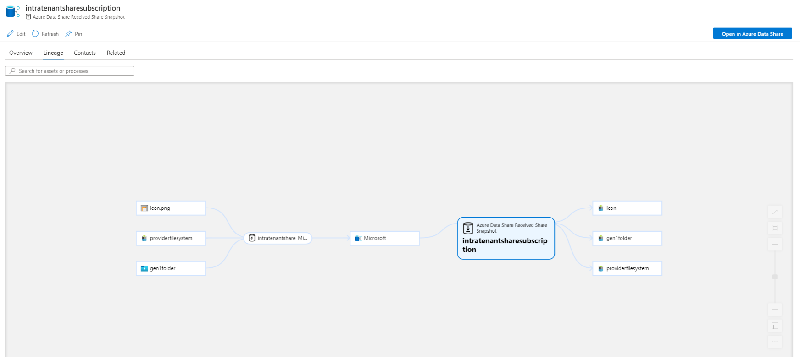

# How to link Azure Data Share account with Babylon

## Introduction
This guide talks about how to connect your [Azure Data Share](https://docs.microsoft.com/azure/data-share/overview) account with Project Babylon and govern the shared(outgoing/incoming) datasets in your data estate. The data governance personas can discover and track lineage of data going cross boundaries like organizations, data centers, and departments.

## Common Scenarios
Data Share Lineage is aimed to provide detailed information for root cause analysis and impact analysis.
### Scenario 1: 360 view of datasets shared in/out for a partner organization or internal department.
Data officers can see a list of all Datasets that are bi-directionally shared with their partner organization. They can search and discover the datasets by organization name and see a 360 view of all outgoing and incoming shares.

### Scenarios 2: Root cause analysis - upstream dependency on datasets coming into organization. (consumer view of incoming shares)
A report has incorrect information because of upstream data issues from an external data share account. The data engineers can understand upstream failures, be informed about the reasons and further contact the owner of the share to fix the issues causing their data discrepancy.
 
### Scenario 3: Impact analysis on datasets going outside organization. (provider view of outgoing shares)
Data Producers want to know who are being impacted upon making a change to their dataset. Using lineage, a data producer can easily understand the impact of the downstream data shares upon changing the attributes of a data source.

## Azure Data Share and Babylon connected experience.
### Step 1: Create a Babylon account.
All the Data Share lineage information will be collected by Babylon account. You can use an existing one or create a new Babylon account.
 
### Step 2: Connect your Azure Data Share to your Babylon account.
In Babylon portal, you can go to Management Center and connect your Azure Data Share under the 'Others' section. Select New on the top bar, find your Azure Data Share in the pop-up side bar and add the Data Share account. It's mandatory to execute Step 3 in the next section. Run a data share snapshot after connecting your Data Share to Babylon account, so that the Data Share assets and lineage information is visible in Babylon.
 

### Step 3: Execute your Snapshot in Azure Data Share.
Once the Azure Data share connection is established with Project Babylon, you can execute a snapshot for your existing shares. If you don’t have any existing shares, go to the Azure data share portal to [share your data](https://docs.microsoft.com/azure/data-share/share-your-data) [and subscribe to a data share](https://docs.microsoft.com/azure/data-share/subscribe-to-data-share). Once the data share snapshot is  complete, you can view associated Data Share assets and lineage in Babylon.

### Step 4: Discover Data Share accounts and share Information in your Babylon account.
In the home page of Babylon account, select Browse by asset type and select Azure data share tile. You can search for a data share account, share name, share snapshot or partner organization. Otherwise apply filters on the Search result page by Azure Data Share Account, Azure Data Share Type (Sent vs Received Shares). 

 
Note: For Data Share assets to show in Babylon, a snapshot must be taken after you connect your Data Share to Babylon.
 
### Step 5: Track lineage of datasets shared with Azure Data Share.
From the Babylon Search result page, choose the Data share snapshot(received/sent) and select the Lineage tab, to see a lineage graph with upstream and downstream dependency. 

