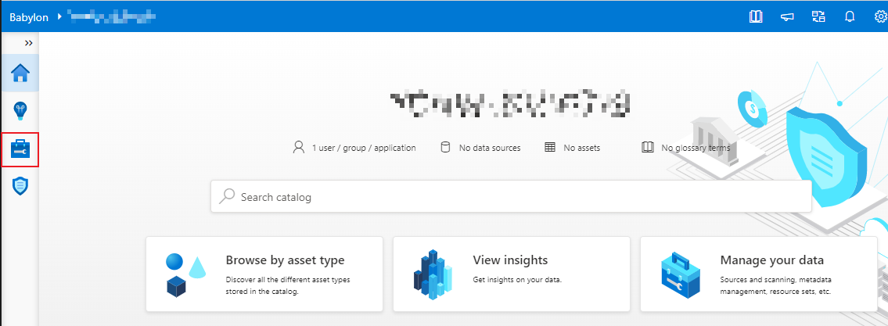
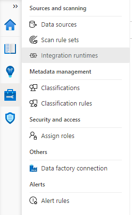
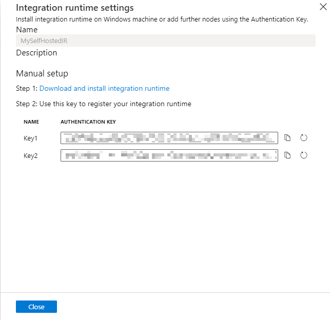
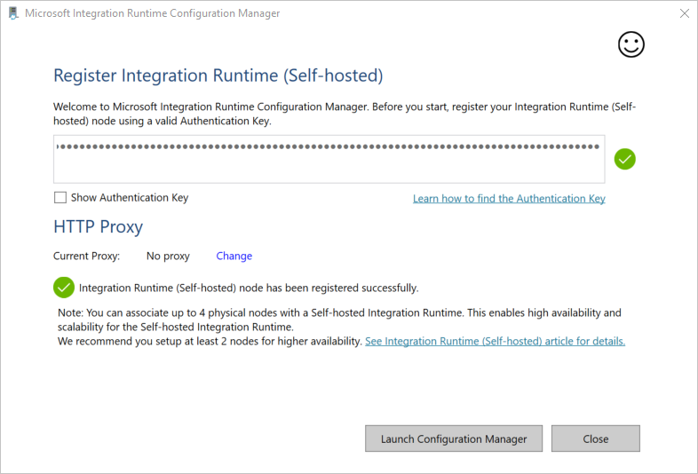
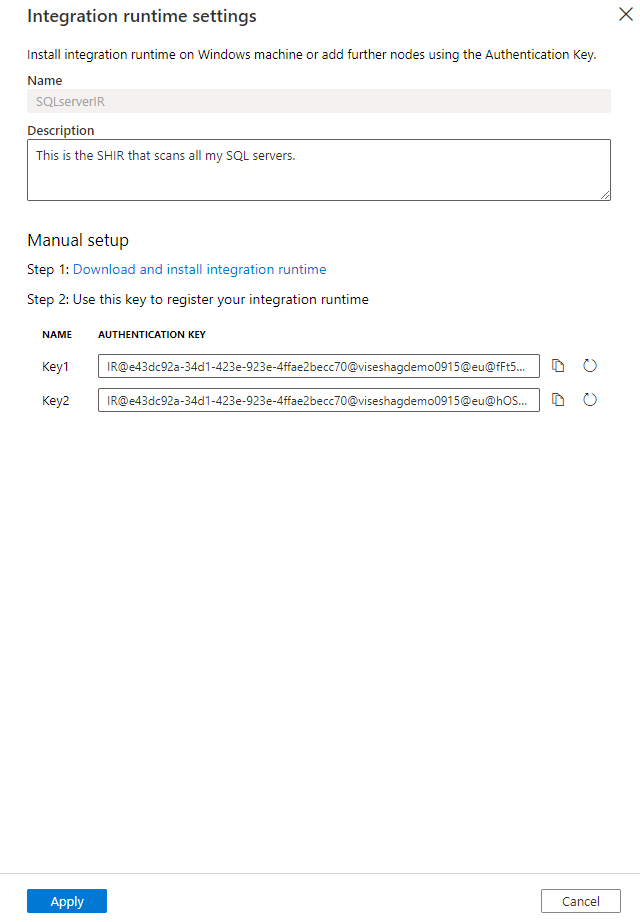

# Create and manage a self-hosted integration runtime for scanning

## Prerequisites

1. **Create a new Babylon account (or create date more recent than 9/15/2020). This capability is currently not available on older Babylon accounts and will be available by 10/9/2020.**

### Feature Flag

To create and manage an SHIR, please append the following to your URL: ?feature.ext.datasource={%22sqlServer%22:%22true%22}

E.g. full URL https://web.babylon.azure.com/?feature.ext.datasource={%22sqlServer%22:%22true%22}

## Create a self-hosted integration runtime

1. On the home page of Babylon Studio, select Management Center from the leftmost navigation pane.

    

2. Select Integration runtimes on the left pane, and then select +New.

    

3. On the Integration runtime setup page, select Self-Hosted to create a Self-Hosted IR, and then select Continue.

    

4. Enter a name for your IR, and select Create.

5. On the Integration runtime settings page, follow the steps under Manual setup section. You will have to download the integration runtime from the download site onto a VM or machine where you intend to run it.

    

    a. Copy and paste the authentication key.
        
    b. Download the self-hosted integration runtime from [here](https://www.microsoft.com/en-us/download/details.aspx?id=39717) on a local Windows machine. Run the installer.
        
    c. On the Register Integration Runtime (Self-hosted) page, paste one of the 2 keys you saved earlier, and select Register.

    

    d. On the New Integration Runtime (Self-hosted) Node page, select Finish.

6. After the self-hosted integration runtime is registered successfully, you see the following window:

    

## Manage a self-hosted integration runtime

You can edit a self-hosted integration runtime by navigating to 'integration runtimes' in the management center, selecting the IR and then clicking on edit. You can now update the description, copy the key or regenerate new keys.

You can delete a self-hosted integration runtime by navigating to 'integration runtimes' in the management center, selecting the IR and then clicking on delete.

> [!NOTE]
> If scans are using this IR, then they will fail.