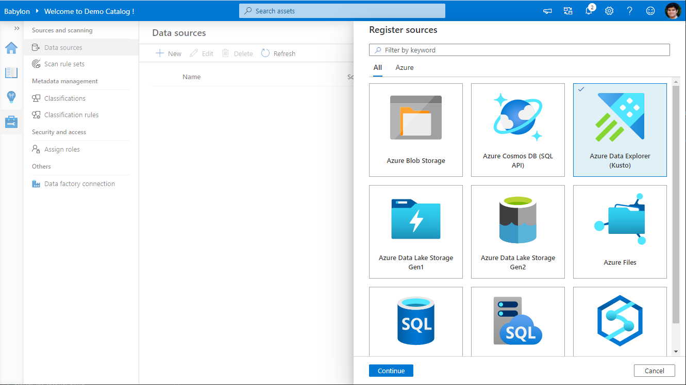
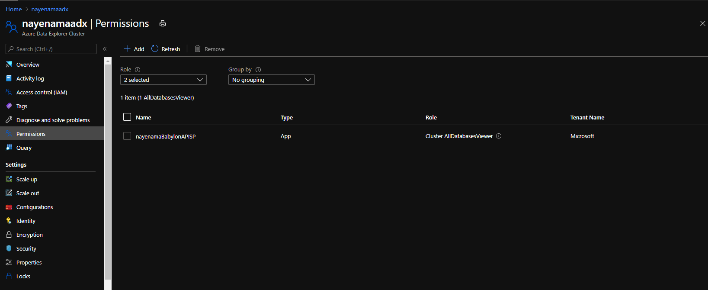
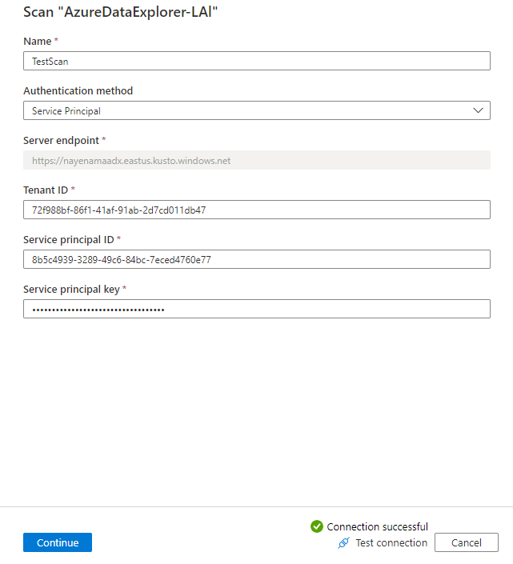
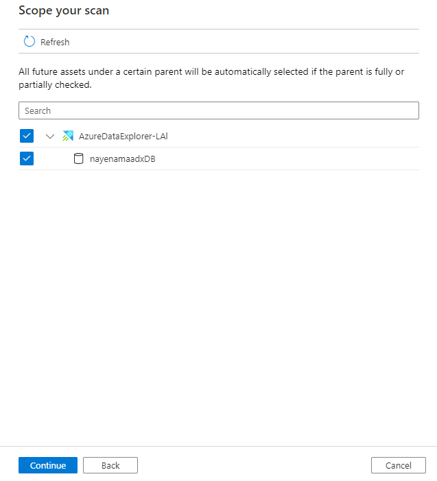
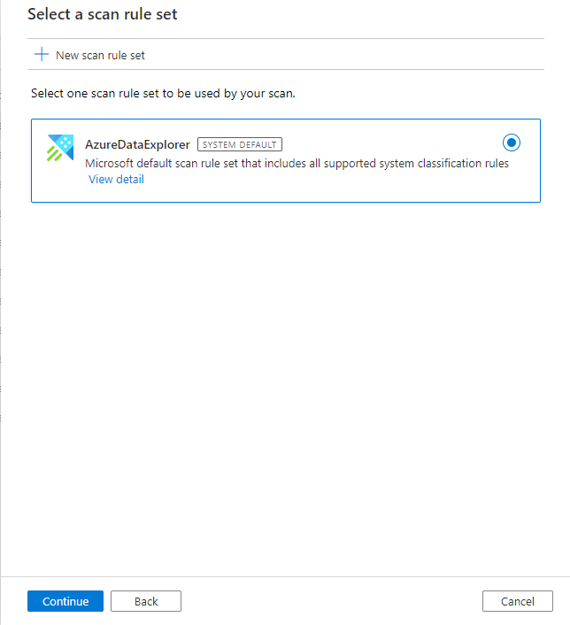
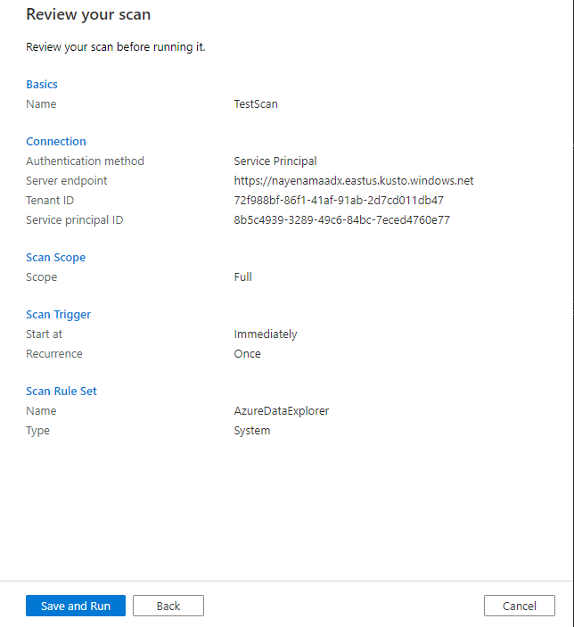

# Register and Scan Azure Data Explorer    
This article outlines how to register an Azure Data Explorer account in Babylon and set up a scan.

## Supported Capabilities
Azure Data Explorer supports the following:
* Full and incremental scans to capture the metadata and apply classifications on the metadata, based on system and customer classifications

## Prerequisites
* You need to be a Data Source Administrator to setup and schedule scans

## Register an Azure Data Explorer account
1. Navigate to your Babylon catalog.
2. Click on **Management Center** on the left navigation pane.

    

3. Under **Sources and Scanning** pane, go to **Data sources** and hit the + sign on the right pane.
4. You can see **Register sources** pane open up on the right side of your screen. From the tiles of data sources, select **Azure Data Explorer** and hit **continue**

## Set up authentication for a scan
The supported Authentication mechanism for Azure Data Explorer is **Service Principal**

### Service Principal
To use a service principal, you must first create one

To do this in the Azure portal: 

1. Browse to the [Azure portal](https://portal.azure.com).

2. Search for **"Azure Active Directory"** in the top search bar.

3. Select **App registrations**

4. Select **+ New application registration**

5. Enter a name for the **application** (the service principal name)

6. Select **"Accounts in this organizational directory only (Microsoft only -- Single Tenant)"**

7. For Redirect URI select **"Web"** and enter any URL you want; it doesn't have to be real or work

8. Then select **Register**.

9. Copy down both the display name and the application ID

10. Add your service principal to a role on the Azure Data Explorer account that you would like to scan. You do this in the Azure portal. For more information about service principals, see [Acquire a token from Azure AD for authorizing requests from a client application](https://docs.microsoft.com/azure/storage/common/storage-auth-aad-app?tabs=dotnet)

11. Once service principal is created, add the same to the AllDatabasesViewer role in Permissions tab on Azure portal as shown in below screenshot

12. Once your Service Principal is set, connect your Babylon to your Azure Blob store using client ID and secret key and check your connect as shown in the screenshot below.

## Create and run a scan
After you have setup your authentication type, click Continue. 

**Scope your scan**
The next screen here is to scope the scan. Please select the folders you want to scan and click continue (by default all the folders will be selected)

The next screen is where you set your scan trigger, telling the system how often you would like to scan.

> [!NOTE] 
> Once means no schedule, which is an indication to the system that the scan should only run once.

Here are some examples of triggers that are set up on a monthly cadence below. You can select the time it starts at and define the recurrence for a particular day of the month, and a time on that day of your choosing. You can also choose to specify an end date or not (meaning the recurrence of the scan will happen indefinitely).

You can also set up a trigger on a weekly cadence with an option to choose the day of the week.

**Set scan rule set**
Select a scan rule set to be used by your scan from the list of available

**Review your scan**
When you click Continue, you will be presented with scan summary page, where you can view all the settings for your scan.

**Edit a scan**
Select a scan and click Edit to edit the selected scan. You can only edit one scan at a time.

**Remove a scan**
To remove a scan, select one or more scans from the list, then click Remove.

**Scan history**
Click on any scan in the list to get to the scan history page. This page will show you whether your scan was schedule or manual, how many assets had classifications applied, how many total assets were discovered, the start and end time of the scan and the total duration.

**Run a scan manually**
From the Scan History page, you can choose Run Scan now to launch a new scan immediately. This action will run a full scan, not an incremental scan.

**Cancel scans in progress**
Select one or more scans that are in progress by selecting the checkbox for each.

Then click Cancel Scan to stop all the selected scans from running.

## Summary
In this tutorial you scanned an Azure Data Explorer account using the portal.
