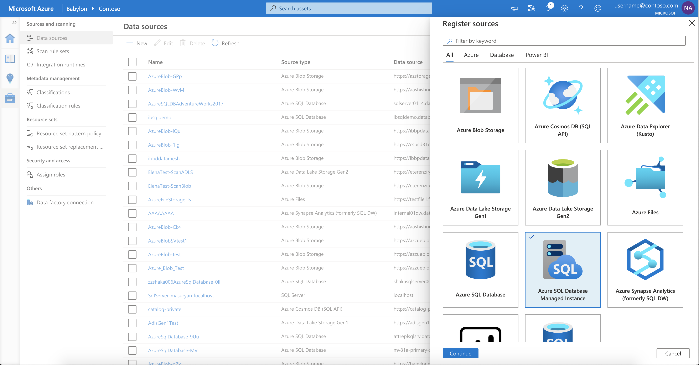
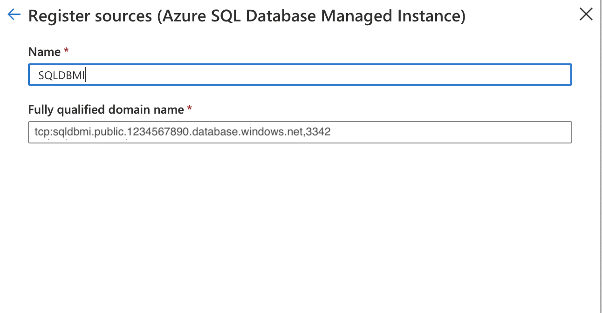
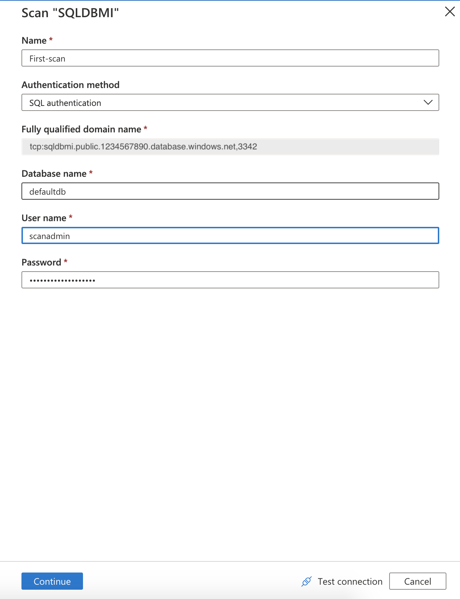
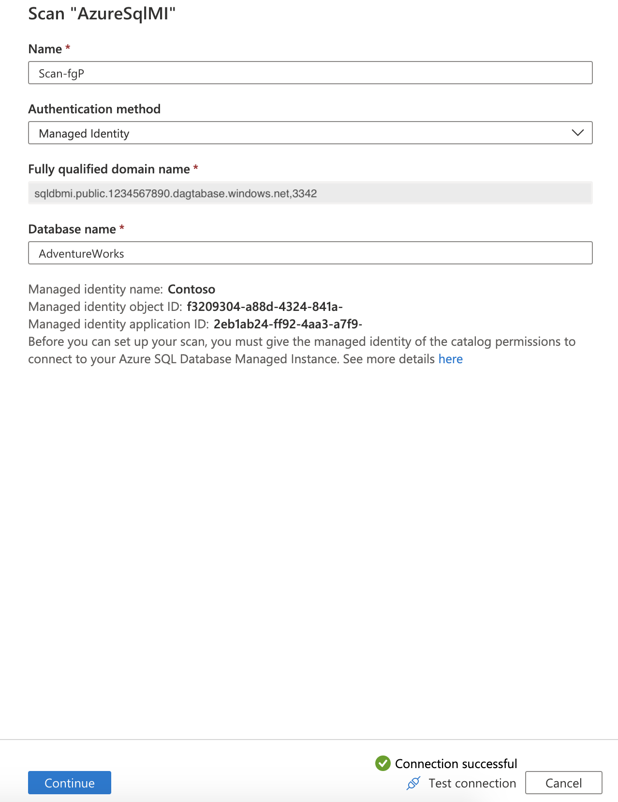
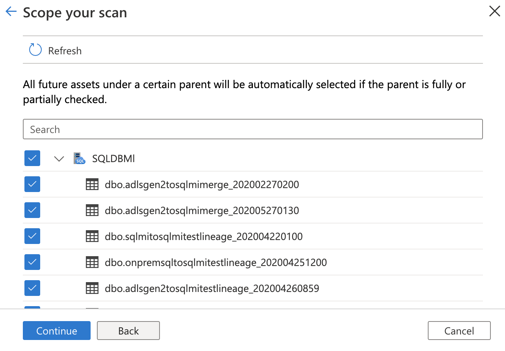
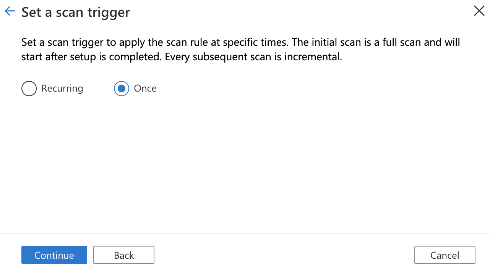
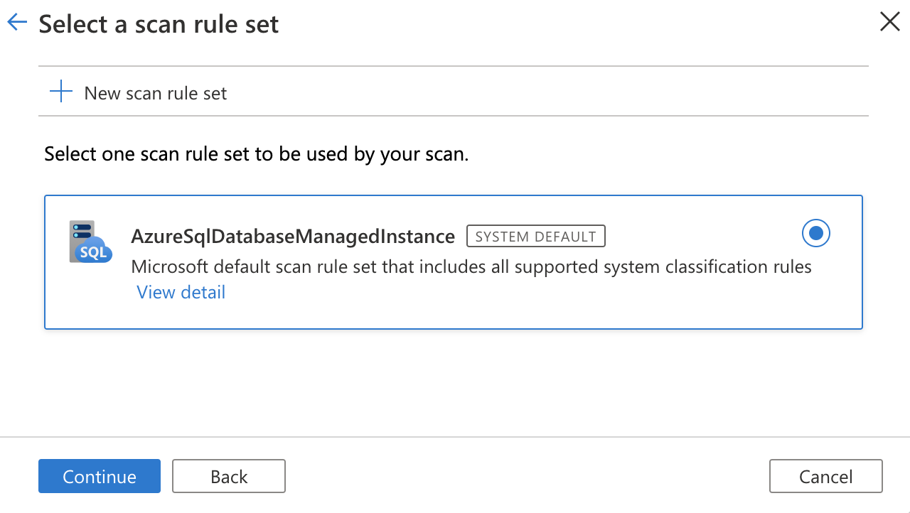

# Register and scan an Azure SQL Database Managed Instance

This article outlines how to register an Azure SQL Database Managed Instance data source in Babylon and set up a scan on it.

## Supported Capabilities

The Azure SQL Database Managed Instance data source supports the following functionality:

- **Full and incremental scans** to capture metadata and classification in Azure SQL Database Managed Instance.

- **Lineage** between data assets for ADF copy and dataflow activities.

## Prerequisites

1. Create a new Babylon account if you don't already have one.

1. [Configure public endpoint in Azure SQL Managed Instance](https://docs.microsoft.com/azure/azure-sql/managed-instance/public-endpoint-configure)

1. Authentication to scan Azure SQL Database Managed Instance. If you need to create new authentication, you need to [authorize database access to SQL Database Managed Instance](https://docs.microsoft.com/azure/azure-sql/database/logins-create-manage). There are three authentication methods that Babylon supports today:

    > [!Note]
    > Only the server-level principal login (created by the provisioning process) or members of the `loginmanager` database role in the master database can create new logins. It takes about 15 minutes after granting permission, the Babylon account should have the appropriate permissions to be able to scan the resource(s).
    
   1. **SQL authentication:** You can follow the instructions in [CREATE LOGIN](https://docs.microsoft.com/sql/t-sql/statements/create-login-transact-sql?view=azuresqldb-current&preserve-view=true#examples-1) to create a login for Azure SQL Database Managed Instance. 

   1. **Service Principal and Managed Identity:** You need to [configure and manage Azure AD authentication with Azure SQL](https://docs.microsoft.com/azure/azure-sql/database/authentication-aad-configure). In addition, you must also create an Azure AD user in Azure SQL Database Managed Instance by following the prerequisites and tutorial on [Create contained users mapped to Azure AD identities](https://docs.microsoft.com/azure/azure-sql/database/authentication-aad-configure?tabs=azure-powershell#create-contained-users-mapped-to-azure-ad-identities). 

1. The authentication must have permission to get metadata for the database, schemas and tables. It must also be able to query the tables to sample for classification. The recommendation is to assign `db_owner` permission to the identity.

## Register an Azure SQL Database Managed Instance data source

1. Navigate to your Babylon catalog.

2. Select on **Manage your data** tile on the home page.

3. Select on **Data sources** under the Sources and scanning section.

4. Select **New** to register a new data source. 

5. Select **Azure SQL Database Managed Instance** and then **Continue**

    

6. Provide **fully qualified domain name** and **port number**. Then select **Finish** to register the data source.

    

    E.g. `foobar.database.windows.net,3342`

## Creating and running a scan

1. Navigate to the management center and select **Data sources** under the **Sources and scanning** section

1. Select the Azure SQL Database Managed Instance data source that you registered.

1. Select **+ New scan**

1. Select the authentication method.

   1. **SQL authentication:** You will need database name, user name and password.

      

   1. **Service Principal:** Select Service Principal from the dropdown menu and provide database name service principal ID which is your **Application client (ID)** and service principal key which is your **client secret**.

      > [!Note]
      > If Test connection fails, you need to go back to the **Prerequisites** step to confirm if the appropriate permission is assigned to the service principal or managed identity. In addition, the server name must have port number to successfully connect.

   1. **Managed Identity:** You just need to select Managed Identity from the drop down menu and test connection.
   
      

1. You can scope your scan to specific schemas by checking the appropriate items in the list.

    

1. Choose your scan trigger. You can set up a schedule or run the scan once.

    

1. The select a scan rule set for you scan. You can choose between the system default, the existing custom ones or create a new one inline.

    

1. Review your scan and select **Save and run**.

## Viewing your scans and scan runs

1. Navigate to the management center. Select **Data sources** under the Sources and scanning section 

1. Select the Azure SQL Database Managed Instance data source.

2. Select the scan whose results you are interested to view.

3. You can view all the scan runs along with metrics and status for each scan run.

## Manage your scans

1. Navigate to the management center. Select **Data sources** under the Sources and scanning section then select on the Azure SQL Database Managed Instance data source.

2. Select the scan you would like to manage. You can edit the scan by selecting on the edit.

    

3. You can delete your scan by selecting on delete.

> [!NOTE]
> Deleting your scan does not delete your assets from previous Azure SQL Database Managed Instance scans.