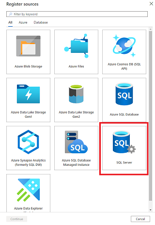
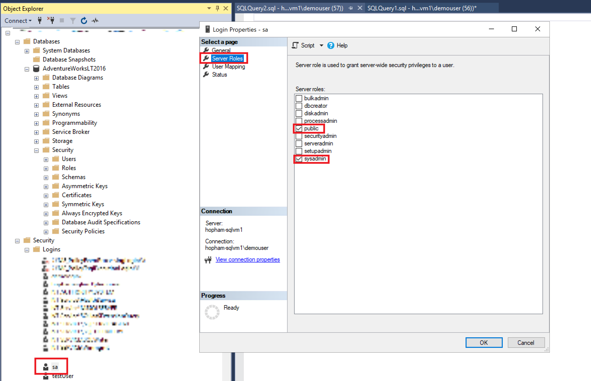
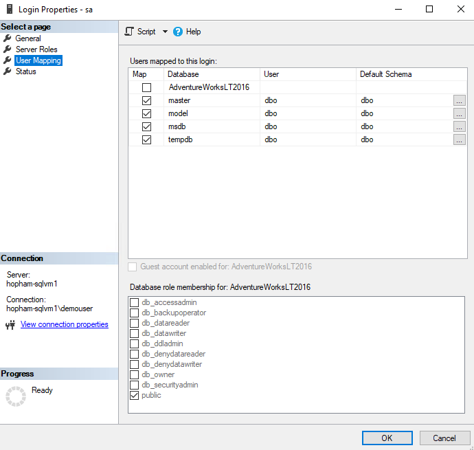
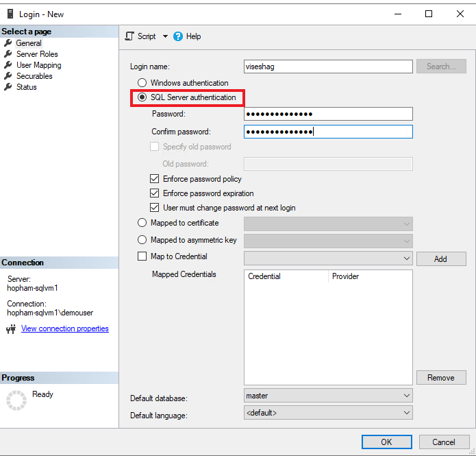
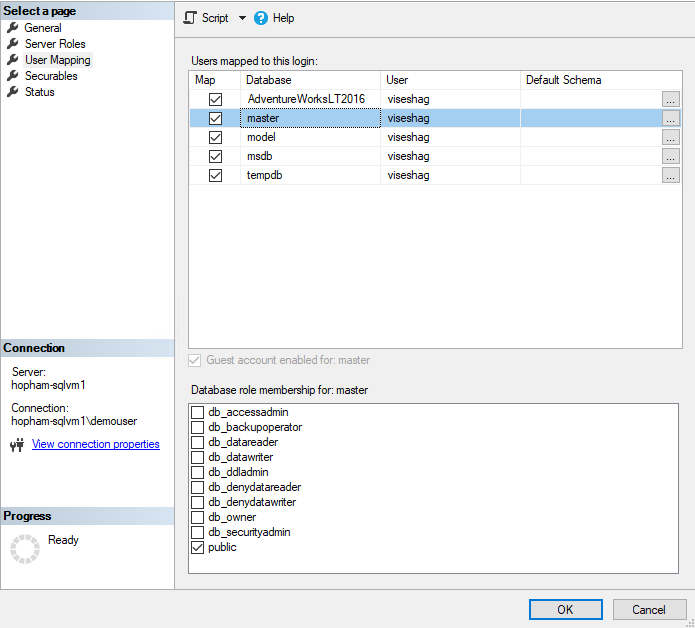
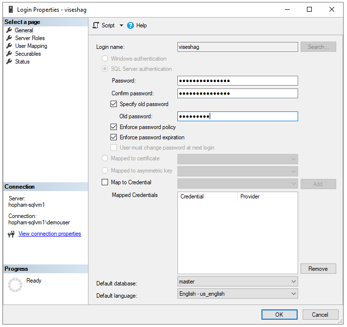
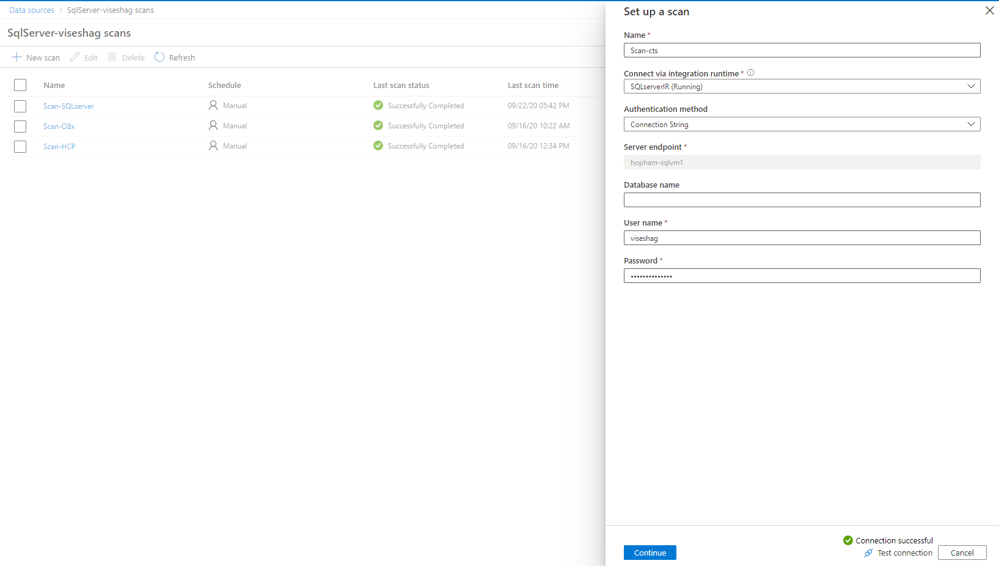
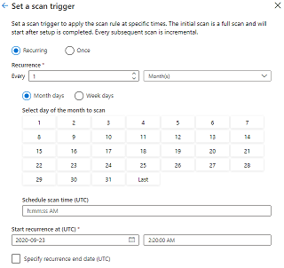
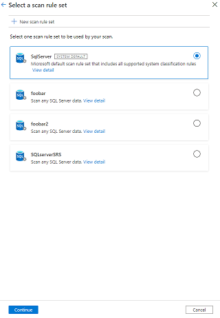

# Register and scan an on-premises SQL server

This article outlines how to register a SQL server data source in Babylon and set up a scan on it.

## Supported Capabilities

The SQL server on-premises data source supports the following functionality:

- **Full and incremental scans** to capture metadata and classification in
    an on-premises network or a SQL server installed on an Azure VM.

- **Lineage** between data assets for ADF copy/dataflow activities

SQL server on-premises data source supports:

- every version of SQL from SQL server 2019 back to SQL server 2000

- Authentication methods : SQL authentication

## Prerequisites

1. **Create a new Babylon account (create date more recent than 9/15/2020) in East US or East US2. This capability is currently not available on older Babylon accounts and in other regions. It will be available by 10/9/2020.**

2. Set up a [self-hosted integration
    runtime](https://github.com/Azure/Babylon/blob/master/docs/manage-integration-runtimes.md) to scan the data source.

### Feature Flag

Registration and scanning of a SQL server on-premises data source is available behind a feature flag. Please append the following to your URL: ?feature.ext.datasource={%22sqlServer%22:%22true%22}

E.g. full URL https://web.babylon.azure.com/?feature.ext.datasource={%22sqlServer%22:%22true%22}

## Register a SQL server data source

1. Navigate to your Babylon catalog.

2. Click on *Manage your data* tile on the home page.

3. Under Sources and scanning in the left navigation, click on *Integration runtimes*. Make sure a self-hosted integration runtime is setup. If it is not setup, please follow the steps mentioned [here](https://github.com/Azure/Babylon/blob/master/docs/manage-integration-runtimes.md) to create a self-hosted integration runtime for scanning on an on-premises or Azure VM that has access to your on-premises network.

4. Click on *Data sources* under the Sources and scanning section.
    Click on *New* to register a new data source. Select **SQL server** and
    click on Continue.

    

5. Provide a friendly name and server endpoint and then click on finish to register the data source.

    E.g. if your SQL server FQDN is **foobar.database.windows.net**, then enter *foobar* as the server endpoint.

## Setting up authentication for a scan

The following authentication methods are supported for SQL server on-premises:
    - SQL authentication

### SQL authentication

The SQL identity must have access to the master database. This is where sys.databases is stored. The Babylon scanner needs to enumerate sys.databases in order to find all the SQL DB instances in the server.

#### Using an existing server admin login and user

If you plan to use an existing server admin (sa) user to scan your on-premises SQL server, ensure the following:

1. The sa is not Windows authentication type. (we will add support for this over the coming months)

2. The server level login you are planning to use must have server roles of public and sysadmin. You can verify this by navigating to SQL Server Management Studio (SSMS), connecting to the server, navigating to security, selecting the login you are planning to use, right clicking -> properties and then selecting Server roles.

    

3. The databases are mapped to a user that has at least db_datareader level access on each database.
    

#### Creating a new login and user

If you would like to create a new login and user to be able to scan your SQL server, follow the steps below:

1. Navigate to SQL Server Management Studio (SSMS), connect to the server, navigate to security, right-click on login and create New login. Make sure to select SQL authentication.

    

2. Select Server roles on the left navigation and select both public and sysadmin.

3. Select User mapping on the left navigation and select all the databases in the map.

    

4. Click OK to save.

5. Navigate again to the user you just created, right click -> properties, enter a new password and confirm it. Select the 'Specify old password' and enter the old password.

    

**It is required to change your password as soon as you create a new login.**

## Creating and running a scan

1. Navigate to the management center. Click on *Data sources* under the Sources and scanning section click on the SQL server data source.

2. Click on + New scan. Select the IR and authentication method as connection string. Database name is optional, if you do not provide a name, the whole server will be scanned. Fill in the user name and password.

    

3. If you plan to scan the entire server, we do not provide scope functionality. If you did however provided a database name, then you can scope your scan to specific tables.

4. Choose your scan trigger. You can set up a schedule or ran the scan once.

    

5. The select a scan rule set for you scan. You can choose between the system default, the existing custom ones or create a new one inline.

    

6. Review your scan and click on Save and run.

## Viewing your scans and scan runs

1. Navigate to the management center. Click on *Data sources* under the Sources and scanning section click on the SQL server data source.

2. Click on the scan whose results you are interested to view.

3. You can view all the scan runs along with metrics and status for each scan run.

## Manage your scans

1. Navigate to the management center. Click on *Data sources* under the Sources and scanning section click on the SQL server data source.

2. Select the scan you would like to manage. You can edit the scan by clicking on the edit.

    

3. You can delete your scan by clicking on delete.
