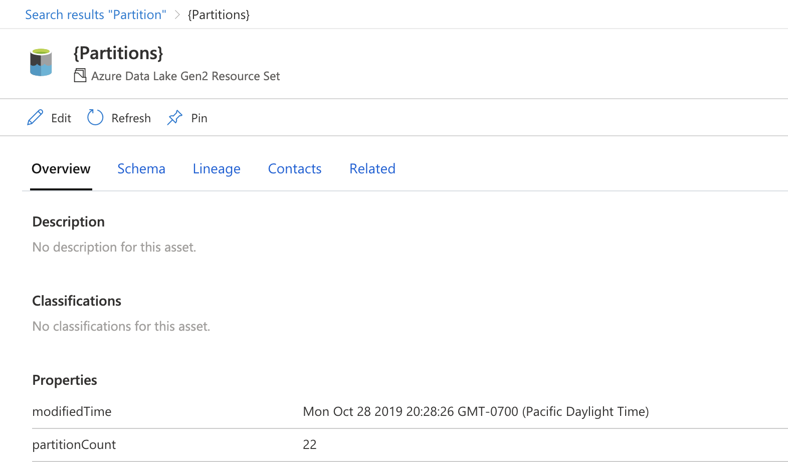
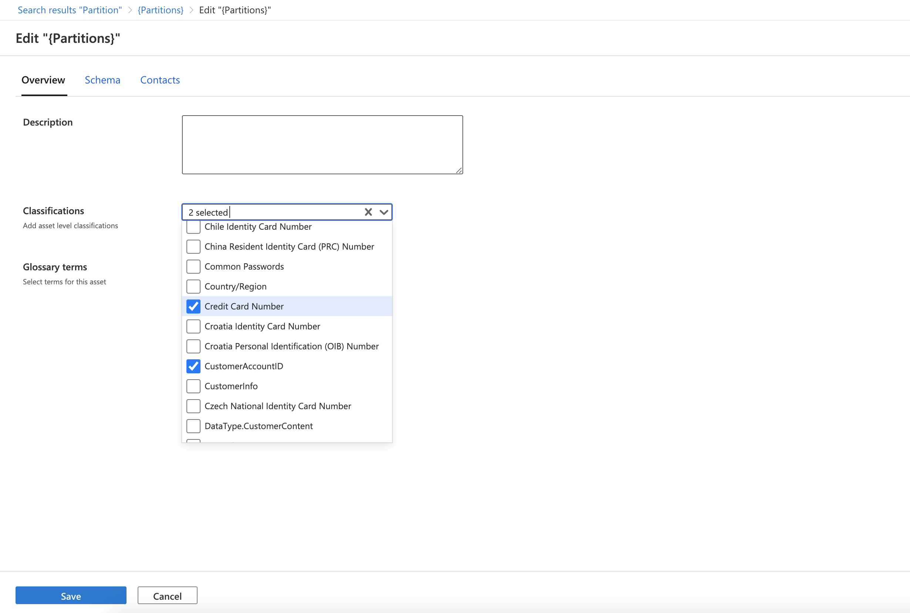
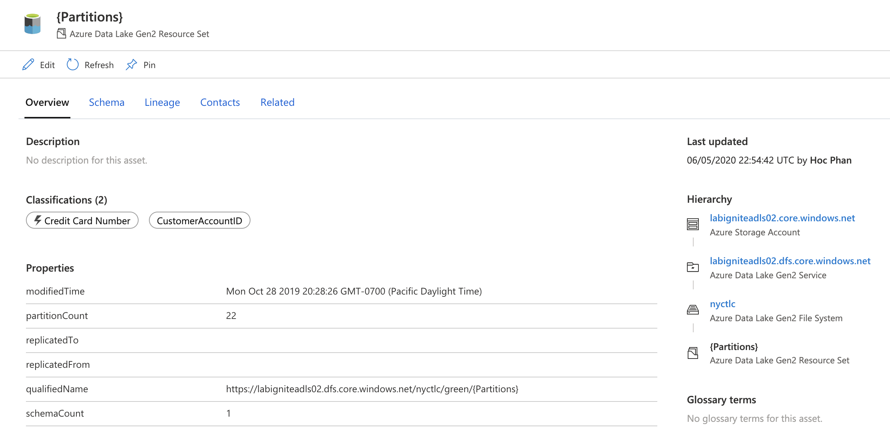
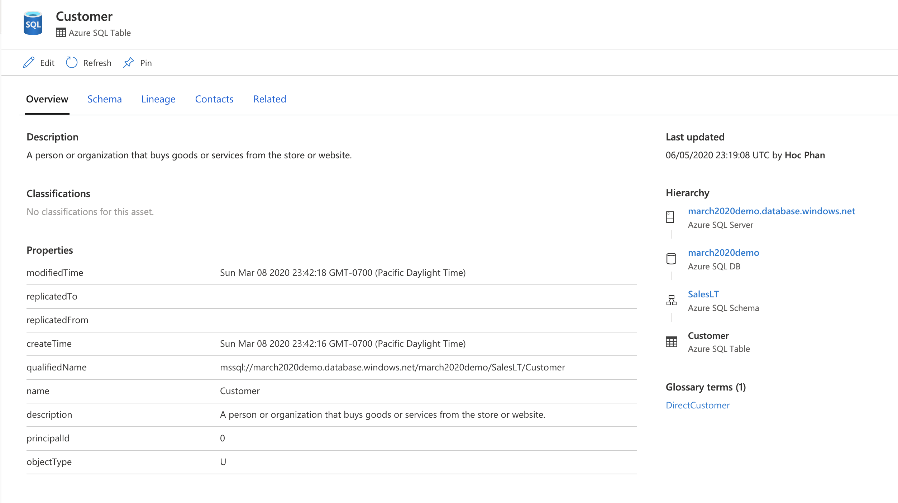
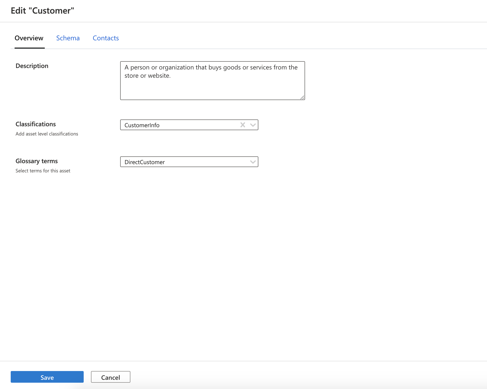
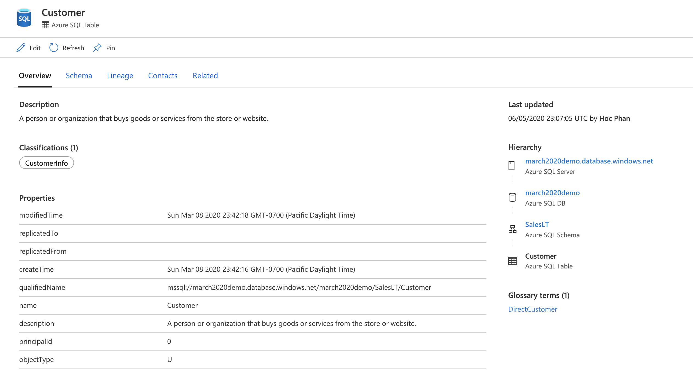
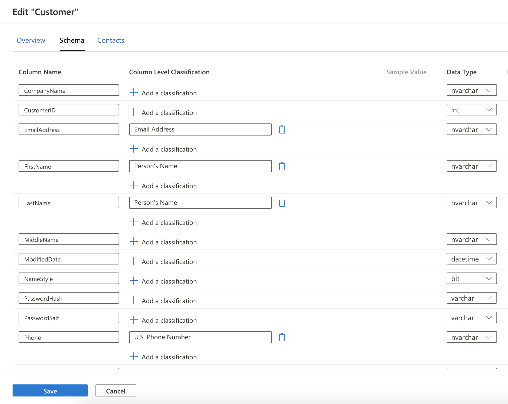
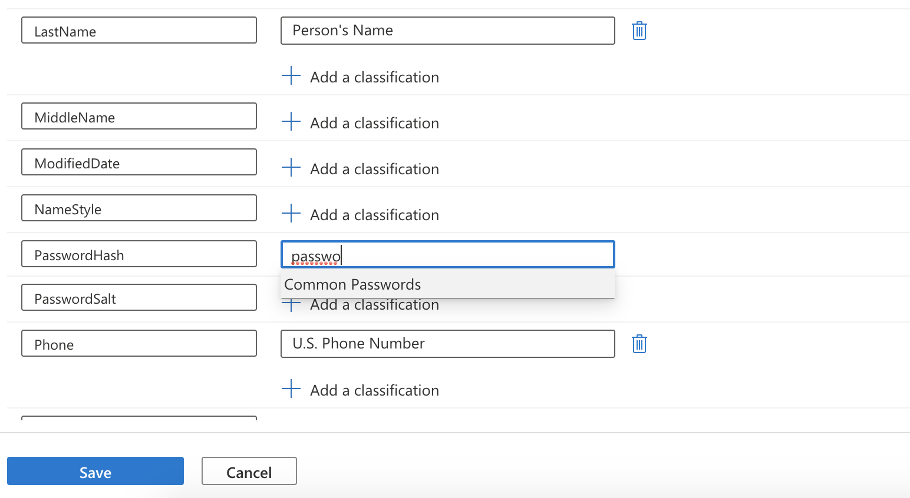
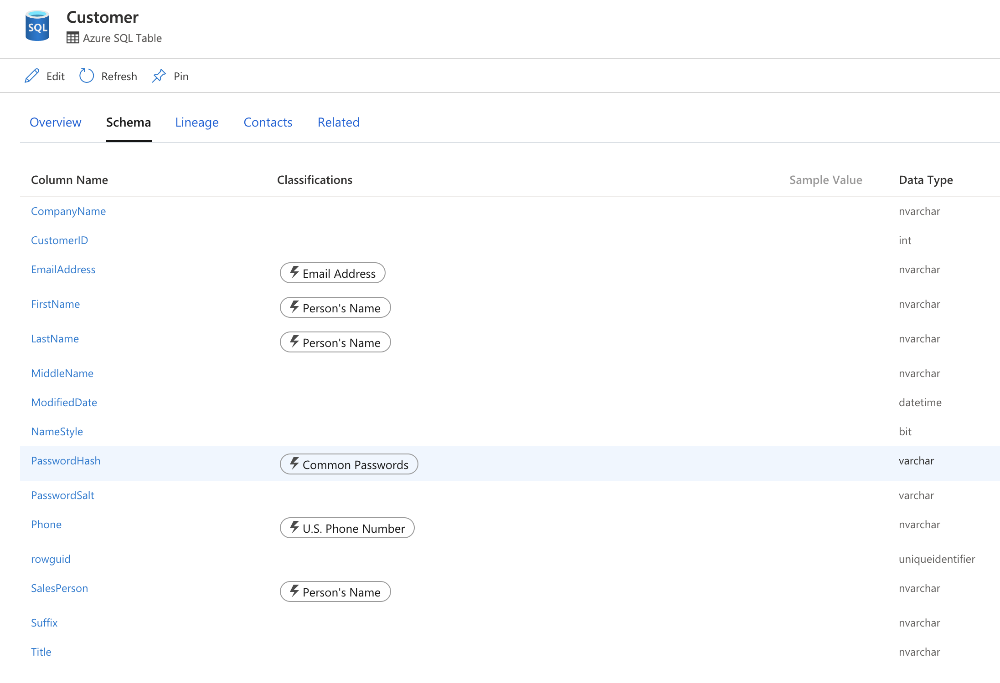

# Using Classifications

You can apply system or custom classifications on File, Table or Column asset. This article describes the steps how to apply classifications manually on your assets.

## Steps to add a classification to a File asset

Babylon can scan and automatically classify documentations. For example, if you have a file named **multiple.docx** and it has a National ID number in its content, Babylon will add classification such as **EU National Identification Number** in the Asset Detail page.

In some scenarios, you might want to manually add classifications to your File asset. If you have multiple files which are grouped into a Resource set, you can also add classification on the Resource set level. Follow steps below to add a custom or system classification to a partition Resource set.

1. Search or browse the partition and navigate to the Asset Detail page.

    

1. Note that there is no classifications. You can add one by selecting **Edit**

1. Select **Classifications** and check on specific classifications you are interested in such as **Credit Card Number** which is a system classification and **CustomerAccountID** which is a custom classification. You can pick any custom classification as your environment may look different.

    

1. Select **Save**

1. Confirm that in your Partition detail page, there are two classifications showing up.

    

## Steps to add a classification to a Table asset

When Babylon scans your data sources, it will not automatically assign classifications on a Table asset. You have to assign classification to any table manually. The steps below describe the process.

1. Find a table asset that you are interested in. You can search or browser the **Customer** table.

1. Confirm that there is no classifications assigned to the table. Select **Edit**

    

1. Under **Classifications**, you can search for a classification and click on the checkbox. In this example, you can use a custom classification named **CustomerInfo**. You can pick any classification in your Babylon account for this step.

    

1. Once completed, select **Save** to save the classifications.

1. Verify that the classification is now added in the detail page.

    

## Steps to add a classification to a Column asset

Babylon automatically scans and add classifications to all columns. However, if there is a wrong or missing classification, you can update at the column-level.

1. Follow **Step 1 & 2** in the instructions above.

1. Navigate to the **Schema** tab

    

1. Identify column(s) you are interested in and select **Add a classification**. For example, let's add **Common Passwords** classification to the **PasswordHash** column.

    

1. Select **Save**

1. Confirm that the classification is now added to the column under **Schema** tab.

    

