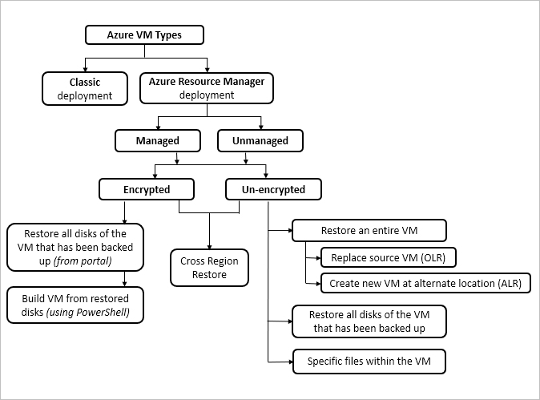

# About Azure VM restore

This article describes how the [Azure Backup service](https://docs.microsoft.com/azure/backup/backup-overview) restores Azure virtual machines (VMs). There are a number of restore options. We'll discuss the various scenarios they support.

## Concepts

- **PIT**: Point In Time (or snapshot) is a copy of the original data that are being backed up.

- **Tier (snapshot vs. vault)**:  Azure VM backup happens in two phases:

  - In phase 1, the snapshot taken is stored along with the disk. This is referred to as **snapshot tier**.
  - In phase 2, the snapshot is transferred and stored in the vault managed by the Azure Backup service. This is referred to as **vault tier**.
  - Snapshot tier restores are faster (than restore from vault) because they eliminate the wait time for snapshots to copy to the vault before triggering the restore. So restore from the snapshot tier is also referred as [Instant Restore](https://docs.microsoft.com/azure/backup/backup-instant-restore-capability).

- **Original Location Recovery (OLR)**: A recovery done from PIT to the original server where the backups were taken, replacing it with the state stored in the PIT

- **Alternate-Location Recovery (ALR)**: A recovery done from PIT to a server other than the original server where the backups were taken

- **Item Level Restore (ILR):** restoring individual files or folders inside the VM from the PIT

- **Availability (Replication types)**: Azure Backup offers two types of replication to keep your storage/data highly available.
  - [Locally redundant storage (LRS)](../storage/common/storage-redundancy-lrs.md) replicates your data three times (it creates three copies of your data) in a storage scale unit in a datacenter. All copies of the data exist within the same region. LRS is a low-cost option for protecting your data from local hardware failures.
  - [Geo-redundant storage (GRS)](../storage/common/storage-redundancy-grs.md) is the default and recommended replication option. GRS replicates your data to a secondary region (hundreds of miles away from the primary location of the source data). GRS costs more than LRS, but GRS provides a higher level of durability for your data, even if there's a regional outage.

- **Cross-Region Restore (CRR)**: As one of the [restore options](https://docs.microsoft.com/azure/backup/backup-azure-arm-restore-vms#restore-options), Cross Region Restore (CRR) allows you to restore Azure VMs in a secondary region, which is an Azure paired region.

## Restore scenarios

| **Scenario**                         | **What is done**                                             | **When to use**                                              |
| ------------------------------------ | ------------------------------------------------------------ | ------------------------------------------------------------ |
| [Restore to create a new virtual machine](https://docs.microsoft.com/azure/backup/backup-azure-arm-restore-vms)                 | Restores the entire VM to OLR (if the source VM still exists) or ALR | <li>     If the  source VM is lost or corrupt, then you can restore entire VM   <li>     Create  a copy of the VM  <li>     Restore  drill for audit or compliance  <li>     Before using this option, review the [pre-requisites/limitations](https://docs.microsoft.com/azure/backup/backup-support-matrix-iaas#supported-restore-methods) and see if you have [VMs with special   configuration](https://docs.microsoft.com/azure/backup/backup-azure-arm-restore-vms#restore-vms-with-special-configurations) |
| [Restore specific disk of the VM](https://docs.microsoft.com/azure/backup/backup-azure-arm-restore-vms#restore-disks)      | Restore disks attached to the VM                             | <li>     If  the disk is lost or corrupted, then can you restore the disk and attach it to an existing impacted VM  <li>     If  you can't use the "Restore to create a new virtual machine" option because you want to customize or configure  the VM, then you can create a new VM from the restored disk.   <li>     Create  a copy of the disk  <li>     Before using this option, review the [pre-requisites/limitations](https://docs.microsoft.com/azure/backup/backup-support-matrix-iaas#supported-restore-methods) |
| [Restore specific files within the VM](https://docs.microsoft.com/azure/backup/backup-azure-restore-files-from-vm) | Choose restore point, browse, select files, and restore them to the same (or compatible) OS as the backed-up VM. | <li>     If  you know which specific files to restore, then use this option instead of  restoring the entire VM  <li>     Before using this option, review the [pre-requisites/limitations](https://docs.microsoft.com/azure/backup/backup-support-matrix-iaas#support-for-file-level-restore) |
| [Restore an encrypted VM](https://docs.microsoft.com/azure/backup/backup-azure-vms-encryption)              | Restores the entire VM to ALR or restore specific disks      | <li>     If  the source backed-up VM is encrypted, then use this restore option  <li>     If  the entire VM is lost <li>  Drill for audit or compliance <li>  To create a copy of the VM |
| [Cross Region Restore](https://docs.microsoft.com/azure/backup/backup-azure-arm-restore-vms#cross-region-restore)                 | Restore VM in a secondary region                             | <li> If the primary region isn’t available because of an outage <li> For performing a drill for audit or compliance. |

## Next steps

- Learn how to [restore Azure VM data in Azure portal](backup-azure-arm-restore-vms.md)
- Learn how to [recover files from Azure virtual machine backup](backup-azure-restore-files-from-vm.md)
