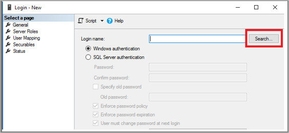
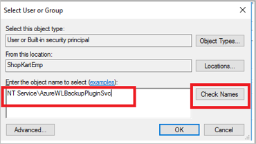

# Back up SQL Server databases on Azure VMs

SQL Server databases are critical workloads that require a low recovery point objective (RPO) and long-term retention. You can backup SQL Server databases running on Azure VMs using [Azure Backup](backup-overview.md).

You can use the [Azure Backup service](backup-overview.md) to back up on-premises machines and workloads, and Azure VMs. This article summarizes support settings and limitations for backing up machines using Microsoft Azure SQL Server instance.

## Backup process

This solution leverages the SQL Native APIs to take backups of your SQL databases.

  * Once you specify the SQL Server VM that you want to protect and query for the databases in the it, Azure Backup service will install a workload backup extension on the VM by the name `AzureBackupWindowsWorkload` extension.
  * This extension consists a Coordinator and a SQL plugin. While the coordinator is responsible for triggering workflows for various operations like configure backup, backup and restore, the plugin is responsible for actual data flow.
  * To be able to discover databases on this VM, Azure Backup creates the account `NT SERVICE\AzureWLBackupPluginSvc`. This account is used for backup and restore and requires SQL sysadmin permissions. Azure Backup leverages the `NT AUTHORITY\SYSTEM` account for database discovery/inquiry, so this account need to be a public login on SQL. If you didn't create the SQL Server VM from the Azure Marketplace, you might receive an error **UserErrorSQLNoSysadminMembership**. If this occurs [follow these instructions](backup-azure-sql-database.md).
  * Once you trigger configure protection on the selected databases, the backup service sets up the coordinator with the backup schedules and other policy details, which the extension caches locally on the VM 
  * At the scheduled time, the coordinator communicates with the plugin and it starts streaming the backup data from the SQL server using VDI.  
  * The plugin sends the data directly to the recovery services vault, thus eliminating the need for a staging location. The data is encrypted and stored by the Azure Backup service in storage accounts.
  * When the data transfer is complete, coordinator confirms the commit with the backup service.

## Before you start

Before you start, verify the following:

1. Make sure you have a SQL Server instance running in Azure. You can [quickly create a SQL Server instance](../virtual-machines/windows/sql/quickstart-sql-vm-create-portal.md) in the marketplace.
2. Review the [feature consideration](#feature-consideration) and [scenario support](#scenario_support).
3. [Review common questions](faq-backup-sql-server.md) about this scenario.

## Feature consideration

- The VM running SQL Server requires internet connectivity to access Azure public IP addresses.
- You can back up to 2000 SQL Server databases in a vault. If you have more, create another vault.
- Backups of [distributed availability groups](https://docs.microsoft.com/sql/database-engine/availability-groups/windows/distributed-availability-groups?view=sql-server-2017) don't fully work.
- SQL Server Always On Failover Cluster Instances (FCIs) aren't supported for backup.
- SQL Server backup should be configured in the portal. You can't currently configure backup with Azure PowerShell, CLI, or the REST APIs.
- Backup and restore operations for FCI mirror databases, database snapshots and databases aren't supported.
- Databases with large number of files can't be protected. The maximum number of files supported isn't deterministic. It not only depends on the number of files, but also depends on the path length of the files.

## Scenario support

**Support** | **Details**
--- | ---
**Supported deployments** | SQL Marketplace Azure VMs and non-Marketplace (SQL Server manually installed) VMs are supported.
**Supported geos** | Australia South East (ASE), East Australia (AE)   Brazil South (BRS)  Canada Central (CNC), Canada East (CE)  South East Asia (SEA), East Asia (EA)   East US (EUS), East US 2 (EUS2), West Central US (WCUS), West US (WUS); West US 2 (WUS 2) North Central US (NCUS) Central US (CUS) South Central US (SCUS)   India Central (INC), India South (INS)   Japan East (JPE), Japan West (JPW)   Korea Central (KRC), Korea South (KRS)   North Europe (NE), West Europe   South Africa North (SAN), South Africa West (SAW)   UAE Central (UAC), UAE North (UAN)   UK South (UKS), UK West (UKW)
**Supported operating systems** | Windows Server 2016, Windows Server 2012 R2, Windows Server 2012   Linux isn't currently supported.
**Supported SQL Server versions** | SQL Server 2017; SQL Server 2016, SQL Server 2014, SQL Server 2012.   Enterprise, Standard, Web, Developer, Express.
**Supported .Net versions** | .NET Framework 4.5.2 and above installed on the VM

## Prerequisites

Before you back up your SQL Server database, check the following conditions:

1. Identify or [create](backup-azure-sql-database.md#create-a-recovery-services-vault) a Recovery Services vault in the same region or locale as the VM hosting the SQL Server instance.
2. [Check the VM permissions](#fix-sql-sysadmin-permissions) needed to back up the SQL databases.
3. Verify that the  VM has [network connectivity](backup-azure-sql-database.md#establish-network-connectivity).
4. Check that the SQL Server databases are named in accordance with [naming guidelines](backup-azure-sql-database.md) for Azure Backup.
5. Verify that you don't have any other backup solutions enabled for the database. Disable all other SQL Server backups before you set up this scenario. You can enable Azure Backup for an Azure VM along with Azure Backup for a SQL Server database running on the VM without any conflict.

### Establish network connectivity

For all operations, the SQL Server VM virtual machine needs connectivity to Azure public IP addresses. VM operations (database discovery, configure backups, schedule backups, restore recovery points and so on) fail without connectivity to the public IP addresses. Establish connectivity with one of these options:

- **Allow the Azure datacenter IP ranges**: Allow the [IP ranges](https://www.microsoft.com/download/details.aspx?id=41653) in the download. For access in an network security group (NSG), use the **Set-AzureNetworkSecurityRule** cmdlet.
- **Deploy an HTTP proxy server to route traffic**: When you back up a SQL Server database on an Azure VM, the backup extension on the VM uses the HTTPS APIs to send management commands to Azure Backup, and data to Azure Storage. The backup extension also uses Azure Active Directory (Azure AD) for authentication. Route the backup extension traffic for these three services through the HTTP proxy. The extension's the only component that's configured for access to the public internet.

Each options has advantages and disadvantages

**Option** | **Advantages** | **Disadvantages**
--- | --- | ---
Allow IP ranges | No additional costs. | Complex to manage because the IP address ranges change over time.    Provides access to the whole of Azure, not just Azure Storage.
Use an HTTP proxy   | Granular control in the proxy over the storage URLs is allowed.    Single point of internet access to VMs.    Not subject to Azure IP address changes. | Additional costs to run a VM with the proxy software.

### Set VM permissions

Azure Backup does a number of things when you configure backup for a SQL Server database:

- Adds the **AzureBackupWindowsWorkload** extension.
- To discover databases on the virtual machine, Azure Backup creates the account **NT SERVICE\AzureWLBackupPluginSvc**. This account is used for backup and restore, and requires SQL sysadmin permissions.
- Azure Backup leverages the **NT AUTHORITY\SYSTEM** account for database discovery/inquiry, so this account need to be a public login on SQL.

If you didn't create the SQL Server VM from the Azure Marketplace, you might receive an error **UserErrorSQLNoSysadminMembership**. If this occurs [follow these instructions](#fix-sql-sysadmin-permissions).

### Verify database naming guidelines for Azure Backup

Avoid the following for database names:

  * Trailing/Leading spaces
  * Trailing ‘!’
  * Close square bracket ‘]’

We do have aliasing for Azure table unsupported characters, but we recommend avoiding them. [Learn more](https://docs.microsoft.com/rest/api/storageservices/Understanding-the-Table-Service-Data-Model?redirectedfrom=MSDN).

[!INCLUDE [How to create a Recovery Services vault](../../includes/backup-create-rs-vault.md)]

## Fix SQL sysadmin permissions

If you need to fix permissions because of an **UserErrorSQLNoSysadminMembership** error, do the following:

1. Use an account with SQL Server sysadmin permissions to sign in to SQL Server Management Studio (SSMS). Unless you need special permissions, Windows authentication should work.
2. On the SQL Server, open the **Security/Logins** folder.

    

3. Right-click the **Logins** folder and select **New Login**. In **Login - New**, select **Search**.

    

3. The Windows virtual service account **NT SERVICE\AzureWLBackupPluginSvc** was created during the virtual machine registration and SQL discovery phase. Enter the account name as shown in **Enter the object name to select**. Select **Check Names** to resolve the name. Click **OK**.

    

4. In **Server Roles**, make sure the **sysadmin** role is selected. Click **OK**. The required permissions should now exist.

    

5. Now associate the database with the Recovery Services vault. In the Azure portal, in the **Protected Servers** list, right-click the server that's in an error state > **Rediscover DBs**.

    

6. Check progress in the **Notifications** area. When the selected databases are found, a success message appears.

    

Alternatively, you can enable [auto-protection](backup-azure-sql-database.md#enable-auto-protection) on the entire instance or Always On Availability group by selecting the **ON** option in the corresponding dropdown in the **AUTOPROTECT** column. The [auto-protection](backup-azure-sql-database.md#enable-auto-protection) feature not only enables protection on all the existing databases in one go but also automatically protects any new databases that will be added to that instance or the availability group in future.  

   

## Next steps

- [Learn about](backup-sql-database-azure-vm.md) backing up SQL Server databases.
- [Learn about](restore-sql-database-azure-vm.md) restoring backed up SQL Server databases.
- [Learn about](manage-monitor-sql-database-backup.md) managing backed up SQL Server databases.
