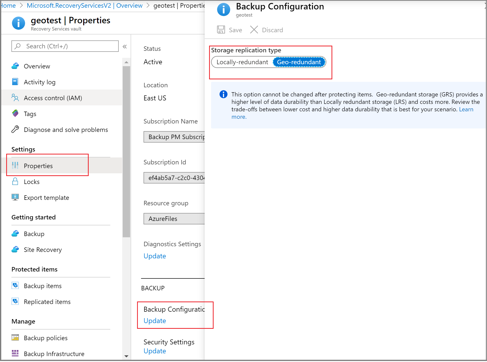
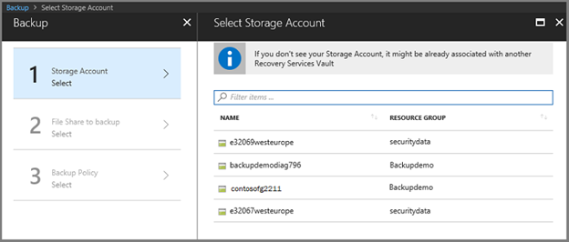
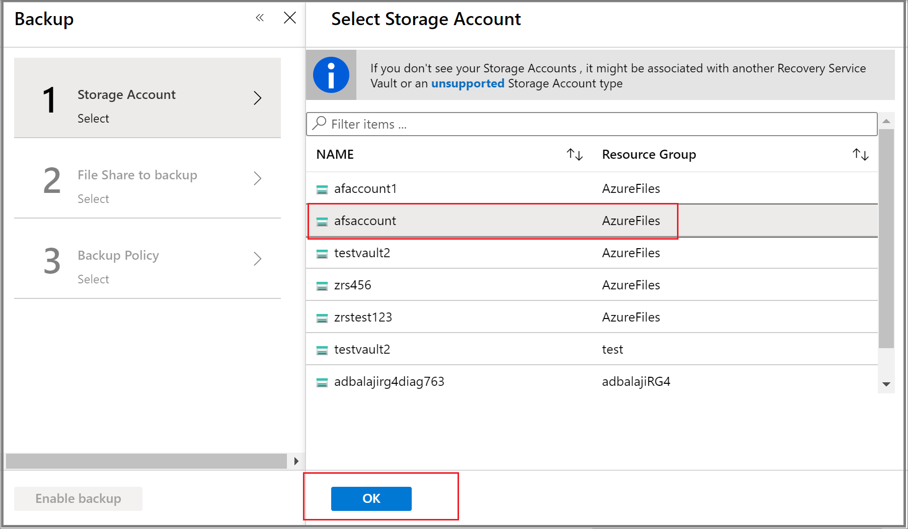
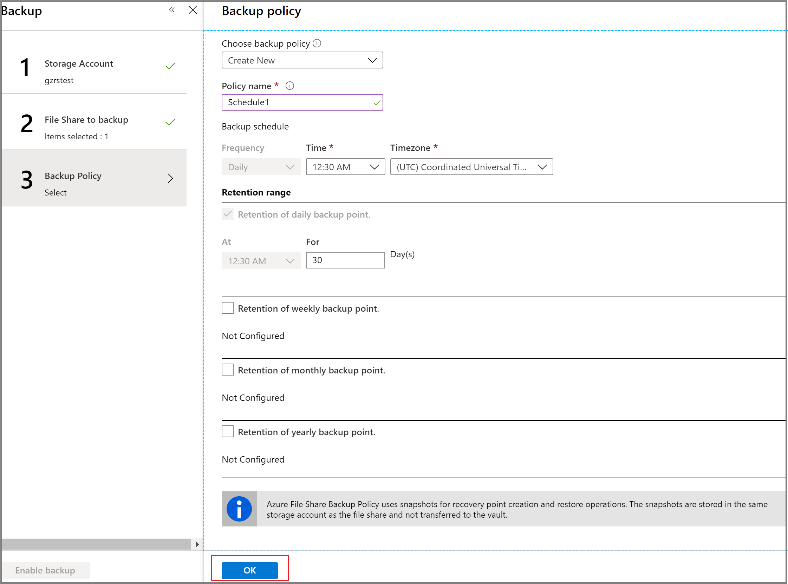
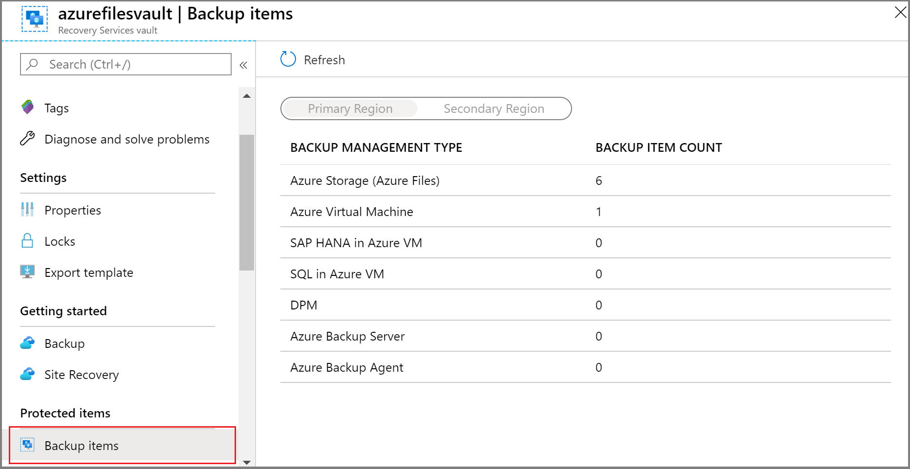
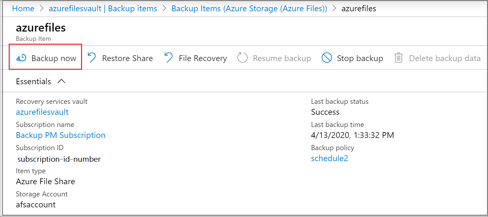

# Back up Azure file shares in a Recovery Services vault

This article explains how to use the Azure portal to back up [Azure file shares](https://docs.microsoft.com/azure/storage/files/storage-files-introduction).

In this article, you'll learn how to:

* Create a Recovery Services vault.
* Discover file shares and configure backups.
* Run an on-demand backup job to create a restore point.

## Prerequisites

* Identify or create a [Recovery Services vault](#create-a-recovery-services-vault) in the same region as the storage account that hosts the file share.
* Ensure that the file share is present in one of the [supported storage account types](#limitations-for-azure-file-share-backup-during-preview).

## Limitations for Azure file share backup during preview

Backup for Azure file shares is in preview. Azure file shares in both general-purpose v1 and general-purpose v2 storage accounts are supported. Here are the limitations for backing up Azure file shares:

* Support for backup of Azure file shares in storage accounts with [zone-redundant storage](https://docs.microsoft.com/azure/storage/common/storage-redundancy-zrs) (ZRS) replication is currently limited to [these regions](https://docs.microsoft.com/azure/backup/backup-azure-files-faq#in-which-geos-can-i-back-up-azure-file-shares).
* Azure Backup currently supports configuring scheduled once-daily backups of Azure file shares.
* The maximum number of scheduled backups per day is one.
* The maximum number of on-demand backups per day is four.
* Use [resource locks](https://docs.microsoft.com/cli/azure/resource/lock?view=azure-cli-latest) on the storage account to prevent accidental deletion of backups in your Recovery Services vault.
* Don't delete snapshots created by Azure Backup. Deleting snapshots can result in loss of recovery points or restore failures.
* Don't delete file shares that are protected by Azure Backup. The current solution deletes all snapshots taken by Azure Backup after the file share is deleted, so all restore points will be lost.

[!INCLUDE [How to create a Recovery Services vault](../../includes/backup-create-rs-vault.md)]

## Modify storage replication

By default, vaults use [geo-redundant storage (GRS)](https://docs.microsoft.com/azure/storage/common/storage-redundancy-grs).

* If the vault is your primary backup mechanism, we recommend that you use GRS.
* You can use [locally redundant storage (LRS)](https://docs.microsoft.com/azure/storage/common/storage-redundancy-lrs?toc=%2fazure%2fstorage%2fblobs%2ftoc.json) as a low-cost option.

Follow these steps to modify the storage replication type.

1. In the new vault, select **Properties** under the **Settings** section.

1. On the **Properties** page, under **Backup Configuration**, select **Update**.

1. Select the storage replication type, and select **Save**.

    

> [!NOTE]
> You can't modify the storage replication type after the vault is set up and contains backup items. If you want to do this, you need to re-create the vault.
>

## Discover file shares and configure backup

1. In the [Azure portal](https://portal.azure.com/), open the Recovery Services vault you want to use to back up the file share.

1. In the **Recovery Services vault** dashboard, select **+Backup**.

   

    a. In **Backup Goal**, set **Where is your workload running?** to **Azure**.

    

    b.  In **What do you want to backup?**, select **Azure File Share** from the drop-down menu.

    c.  Select **Backup** to register the Azure file share extension in the vault.

    

1. After you select **Backup**, the **Backup** pane opens and prompts you to select a storage account from a list of discovered supported storage accounts. They're either associated with this vault or present in the same region as the vault, but not yet associated to any Recovery Services vault.

   

1. From the list of discovered storage accounts, select an account, and select **OK**. Azure searches the storage account for file shares that can be backed up. If you recently added your file shares and don't see them in the list, allow some time for the file shares to appear.

    

1. From the **File Shares** list, select one or more of the file shares you want to back up. Select **OK**.

1. After you choose your file shares, the **Backup** menu switches to **Backup policy**. From this menu, either select an existing backup policy or create a new one. Then select **Enable Backup**.

    

After you set a backup policy, a snapshot of the file shares is taken at the scheduled time. The recovery point is also retained for the chosen period.

## Create an on-demand backup

Occasionally, you might want to generate a backup snapshot, or recovery point, outside of the times scheduled in the backup policy. A common reason to generate an on-demand backup is right after you've configured the backup policy. Based on the schedule in the backup policy, it might be hours or days until a snapshot is taken. To protect your data until the backup policy engages, initiate an on-demand backup. Creating an on-demand backup is often required before you make planned changes to your file shares.

### Create an on-demand backup

1. Open the Recovery Services vault you used to back up your file share. On the **Overview** pane, select **Backup items** under the **Protected items** section.

   

1. After you select **Backup items**, a new pane that lists all **Backup Management Types** appears next to the **Overview** pane.

   

1. From the **Backup Management Type** list, select **Azure Storage (Azure Files)**. You'll see a list of all the file shares and the corresponding storage accounts backed up by using this vault.

   

1. From the list of Azure file shares, select the file share you want. The **Backup Item** details appear. On the **Backup Item** menu, select **Backup now**. Because this backup job is on demand, there's no retention policy associated with the recovery point.

   

1. The **Backup Now** pane opens. Specify the last day you want to retain the recovery point. You can have a maximum retention of 10 years for an on-demand backup.

   

1. Select **OK** to confirm the on-demand backup job that runs.

1. Monitor the portal notifications to keep a track of backup job run completion. You can monitor the job progress in the vault dashboard. Select **Backup Jobs** > **In progress**.

## Next steps

Learn how to:
* [Restore Azure file shares](restore-afs.md)
* [Manage Azure file share backups](manage-afs-backup.md)
