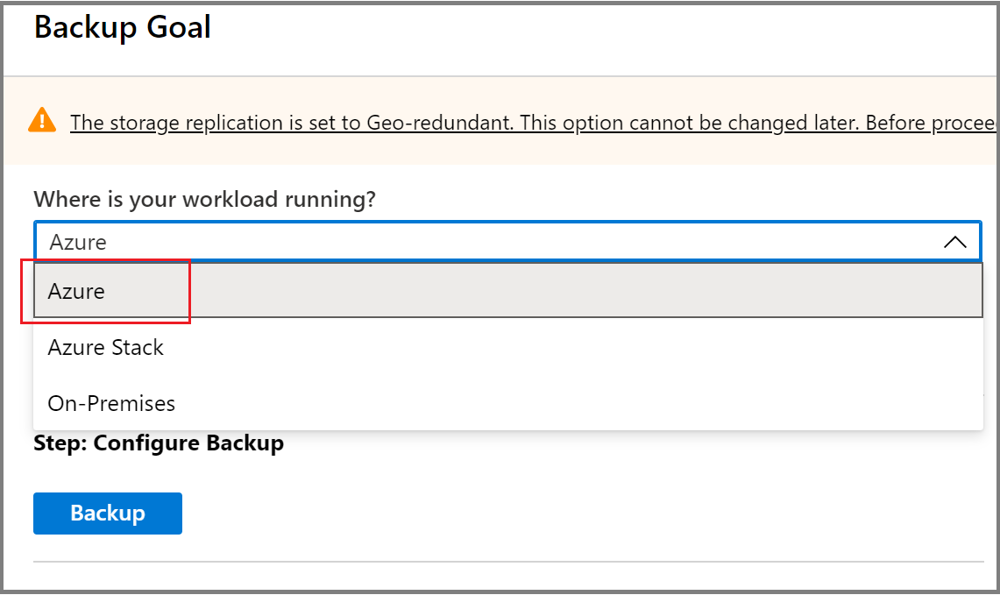
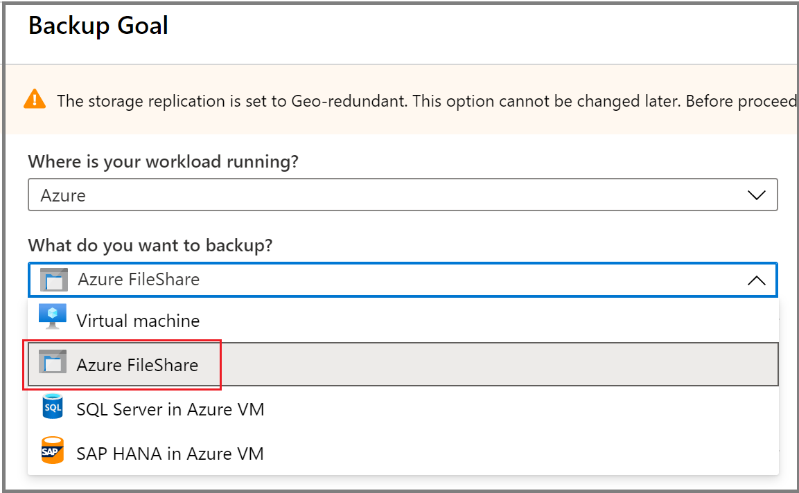
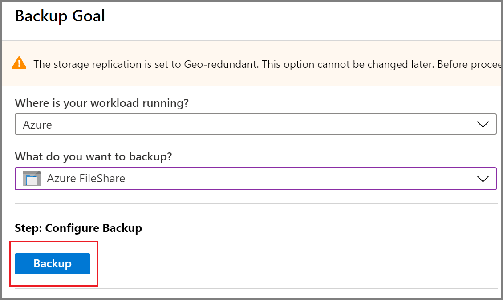
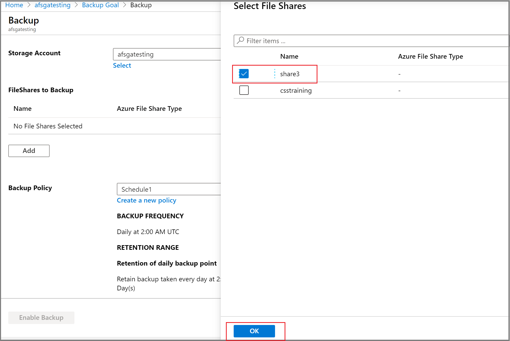
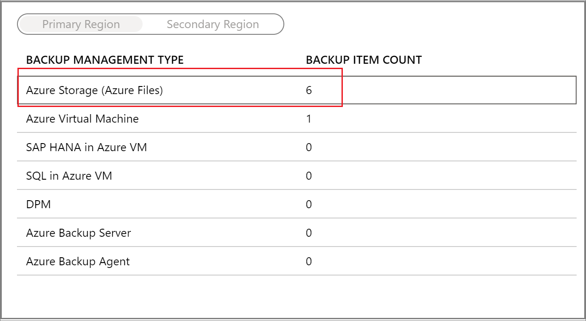
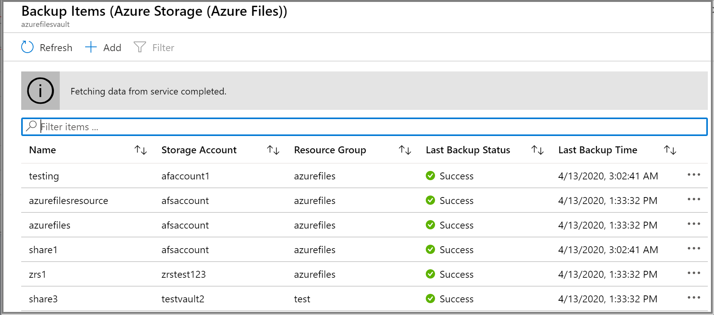
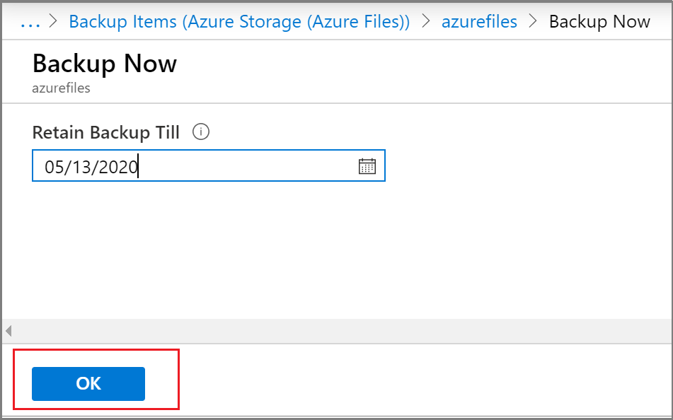

# Back up Azure file shares in a Recovery Services vault

This article explains how to use the Azure portal to back up [Azure file shares](https://docs.microsoft.com/azure/storage/files/storage-files-introduction).

In this article, you'll learn how to:

* Create a Recovery Services vault.
* Discover file shares and configure backups.
* Run an on-demand backup job to create a restore point.

## Prerequisites

* Identify or create a [Recovery Services vault](#create-a-recovery-services-vault) in the same region as the storage account that hosts the file share.
* Ensure that the file share is present in one of the [supported storage account types](azure-file-share-support-matrix.md).

[!INCLUDE [How to create a Recovery Services vault](../../includes/backup-create-rs-vault.md)]

## Modify storage replication

By default, vaults use [geo-redundant storage (GRS)](https://docs.microsoft.com/azure/storage/common/storage-redundancy-grs).

* If the vault is your primary backup mechanism, we recommend that you use GRS.
* You can use [locally redundant storage (LRS)](https://docs.microsoft.com/azure/storage/common/storage-redundancy-lrs?toc=%2fazure%2fstorage%2fblobs%2ftoc.json) as a low-cost option.

To modify the storage replication type:

1. In the new vault, select **Properties** under the **Settings** section.

1. On the **Properties** page, under **Backup Configuration**, select **Update**.

1. Select the storage replication type, and select **Save**.

    

> [!NOTE]
> You can't modify the storage replication type after the vault is set up and contains backup items. If you want to do this, you need to re-create the vault.
>

## Discover file shares and configure backup

1. In the [Azure portal](https://portal.azure.com/), open the Recovery Services vault you want to use for configuring backup for the file share.

1. In the **Recovery Services vault** pane, select the **+Backup** from the menu on the top.

   

    a. In the **Backup Goal** pane, set **Where is your workload running?** to **Azure** by selecting the **Azure** option from the drop-down list.

    

    b.  In **What do you want to back up?**, select **Azure File Share** from the drop-down list.

    

    c.  Select **Backup** to register the Azure file share extension in the vault.

    

1. After you select **Backup**, the **Backup** pane opens. To select the storage account hosting the file share that you want to protect, click the **Select** link text below the **Storage Account** textbox.

   

1. The **Select Storage Account Pane** opens on the right, listing a set of discovered supported storage accounts. They're either associated with this vault or present in the same region as the vault, but not yet associated to any Recovery Services vault.

1. From the list of discovered storage accounts, select an account, and select **OK**.

   

1. The next step is to select the file shares you want to back up. Click the **Add** button in the **FileShares to Backup** section.

   

1. The **Select File Shares** context pane opens on the right. Azure searches the storage account for file shares that can be backed up. If you recently added your file shares and don't see them in the list, allow some time for the file shares to appear.

1. From the **Select File Shares** list, select one or more of the file shares you want to back up. Select **OK**.

   

1. To choose a backup policy for your file share, you have three options:

   * Choose the default policy. 
   This option allows you to enable daily backup that will be retained for 30 days. If you don’t have an existing backup policy in the vault, the backup pane opens with the default policy settings. If you want to choose the default settings, you can directly click **Enable backup**.

   * Create a new policy  
   a. To create a new backup policy for your file share, click the link text below the drop-down list in the **Backup Policy** section.
      
   b. The **Backup Policy** context pane opens on the right. Specify a policy name in the text box and choose the retention period according to your requirement. Only the daily retention option is enabled by default. If you want to have weekly, monthly, or yearly retention, select the corresponding checkbox and provide the desired retention value.
   c. After specifying the retention values and a valid policy name, click OK.
      

   * Choose one of the existing backup policies  
   To choose one of the existing backup policies for configuring protection, select the desired policy from the **Backup policy** drop-down list.
   

1. Click **Enable Backup** to start protecting the file share.

   

After you set a backup policy, a snapshot of the file shares is taken at the scheduled time. The recovery point is also retained for the chosen period.

>[!NOTE]
>Azure Backup now supports policies with daily/weekly/monthly/yearly retention for Azure file share backup.

## Create an on-demand backup

Occasionally, you might want to generate a backup snapshot, or recovery point, outside of the times scheduled in the backup policy. A common reason to generate an on-demand backup is right after you've configured the backup policy. Based on the schedule in the backup policy, it might be hours or days until a snapshot is taken. To protect your data until the backup policy engages, initiate an on-demand backup. Creating an on-demand backup is often required before you make planned changes to your file shares.

### Create a backup job on demand

1. Open the Recovery Services vault you used to back up your file share. On the **Overview** pane, select **Backup items** under the **Protected items** section.

   

1. After you select **Backup items**, a new pane that lists all **Backup Management Types** appears next to the **Overview** pane.

   

1. From the **Backup Management Type** list, select **Azure Storage (Azure Files)**. You'll see a list of all the file shares and the corresponding storage accounts backed up by using this vault.

   

1. From the list of Azure file shares, select the file share you want. The **Backup Item** details appear. On the **Backup Item** menu, select **Backup now**. Because this backup job is on demand, there's no retention policy associated with the recovery point.

   

1. The **Backup Now** pane opens. Specify the last day you want to retain the recovery point. You can have a maximum retention of 10 years for an on-demand backup.

   

1. Select **OK** to confirm the on-demand backup job that runs.

1. Monitor the portal notifications to keep a track of backup job run completion. You can monitor the job progress in the vault dashboard. Select **Backup Jobs** > **In progress**.

>[!NOTE]
>Azure Backup locks the storage account when you configure protection for any file share in the corresponding account. This provides protection against accidental deletion of a storage account with backed up file shares.

## Best practices

* Don't delete snapshots created by Azure Backup. Deleting snapshots can result in loss of recovery points and/or restore failures.

* Don't remove the lock taken on the storage account by Azure Backup. If you delete the lock, your storage account will be prone to accidental deletion and if it's deleted, you will lose your snapshots or backups.

## Next steps

Learn how to:

* [Restore Azure file shares](restore-afs.md)
* [Manage Azure file share backups](manage-afs-backup.md)
