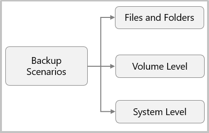

# About the Microsoft Azure Recovery Services (MARS) agent

This article describes how the Azure Backup service uses the Microsoft Azure Recovery Services (MARS) agent to back up and restore files, folders, and the volume or system state from an on-premises computer to Azure.

The MARS agent supports the following backup scenarios:

- **Files and Folders**: Selectively protect Windows files and folders.
- **Volume Level**: Protect an entire Windows volume of your machine.
- **System Level**: Protect an entire Windows system state.

The MARS agent supports the following restore scenarios:

-    **Same Server**: The server on which the backup was originally created.
    -    **Files and Folders**: Choose the individual files and folders that you want to restore.
    -    **Volume Level**: Choose the volume and recovery point that you want to restore and then restore it to the same location or an alternate location on the same machine.  Create a copy of existing files, overwrite existing files, or skip recovering existing files.
    -    **System Level**: Choose the system state and recovery point to restore to the same machine at a specified location.

-     **Alternate Server**: A server other than the server where the backup was taken.
    -    **Files and Folders**: Choose the individual files and folders whose recovery point you want to restore to a target machine.
    -    **Volume Level**: Choose the volume and recovery point that you want to restore to another location. Create a copy of existing files, overwrite existing files, or skip recovering existing files.
    -    **System Level**: Choose the system state and recovery point to restore as a System State file to an alternate machine.

## Backup process

1. From the Azure portal, create a [Recovery Services vault](https://docs.microsoft.com/azure/backup/backup-windows-with-mars-agent#create-a-recovery-services-vault), and choose files, folders, and the system state from the Backup goals.
2. [Download the Recovery Services vault credentials and agent installer](https://docs.microsoft.com/azure/backup/install-mars-agent#download-the-mars-agent) to an on-premises machine. 

    To protect the on-premises machine by selecting the Backup option, choose files, folders, and the system state, and then download the MARS agent.

3. Prepare the infrastructure:

    a. Run the installer to [install the agent](https://docs.microsoft.com/azure/backup/install-mars-agent#install-and-register-the-agent).

    b. Use your downloaded vault credentials to register the machine to the Recovery Services vault.
4. From the agent console on the client, [configure the backup](https://docs.microsoft.com/azure/backup/backup-windows-with-mars-agent#create-a-backup-policy). Specify the retention policy of your backup data to start protecting it.

### Additional scenarios
-    **Back up specific files and folders within Azure virtual machines**: The primary method for backing up Azure virtual machines (VMs) is to use an Azure Backup extension on the VM. The extension backs up the entire VM. If you want to back up specific files and folders within a VM, you can install the MARS agent in the Azure VMs. For more information, see [Architecture: Built-in Azure VM Backup](https://docs.microsoft.com/azure/backup/backup-architecture#architecture-built-in-azure-vm-backup).

-    **Offline seeding**: Initial full backups of data to Azure typically transfer large amounts of data and require more network bandwidth. Subsequent backups transfer only the delta, or incremental, amount of data. Azure Backup compresses the initial backups. Through the process of *offline seeding*, Azure Backup can use disks to upload the compressed initial backup data offline to Azure. For more information, see [Azure Backup offline-backup using Azure Data Box](offline-backup-azure-data-box.md).

## Next steps
[MARS agent support matrix](https://docs.microsoft.com/azure/backup/backup-support-matrix-mars-agent)

[MARS agent FAQ](https://docs.microsoft.com/azure/backup/backup-azure-file-folder-backup-faq)
