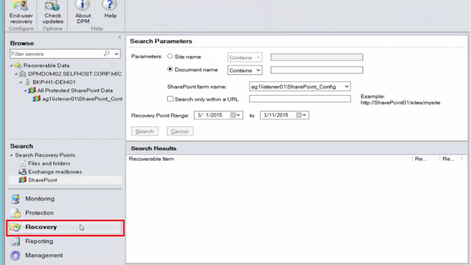
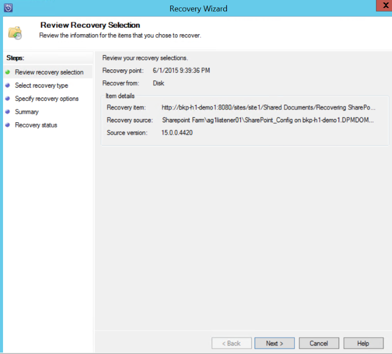
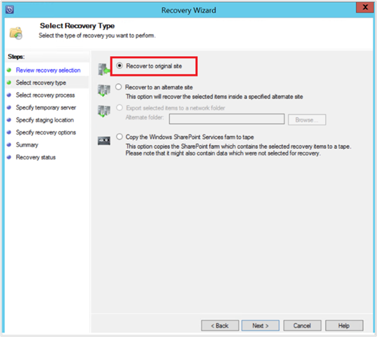
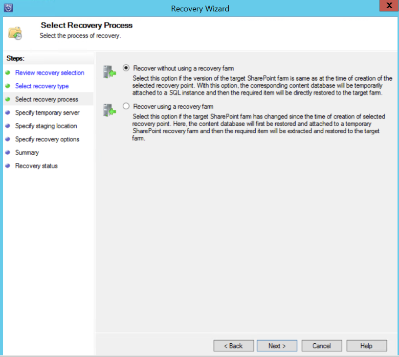
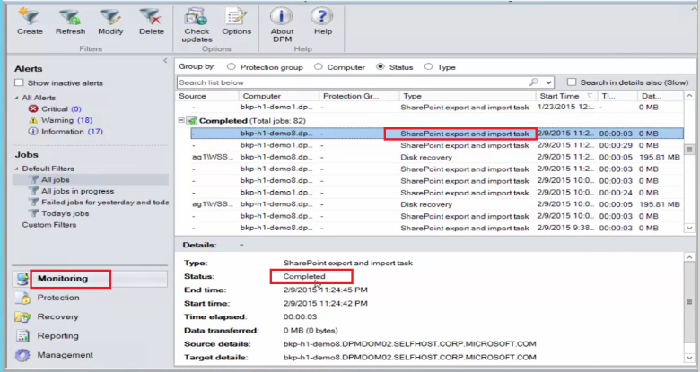
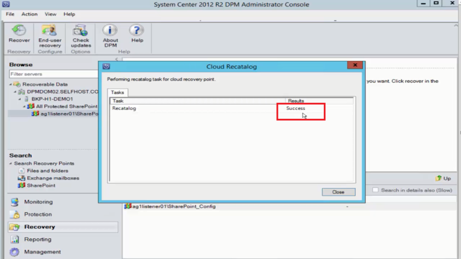
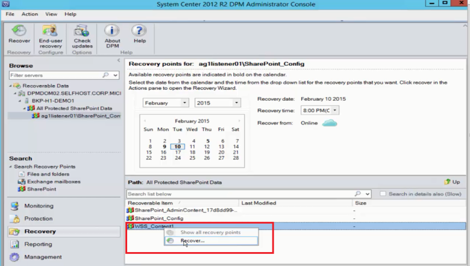

# Back up a SharePoint farm to Azure with MABS

You back up a SharePoint farm to Microsoft Azure by using Microsoft Azure Backup Server (MABS) in much the same way that you back up other data sources. Azure Backup provides flexibility in the backup schedule to create daily, weekly, monthly, or yearly backup points and gives you retention policy options for various backup points. MABS provides the capability to store local disk copies for quick recovery-time objectives (RTO) and to store copies to Azure for economical, long-term retention.

Backing up SharePoint to Azure with MABS is a similar process to backing up SharePoint to DPM (Data Protection Manager) locally. Particular considerations for Azure will be noted in this article.

## SharePoint supported versions and related protection scenarios

For a list of supported SharePoint versions and the MABS versions required to back them up see [the MABS protection matrix](https://docs.microsoft.com/azure/backup/backup-mabs-protection-matrix)

## Before you start

There are a few things you need to confirm before you back up a SharePoint farm to Azure.

### What's not supported

* MABS that protects a SharePoint farm doesn't protect search indexes or application service databases. You'll need to configure the protection of these databases separately.

* MABS doesn't provide backup of SharePoint SQL Server databases that are hosted on scale-out file server (SOFS) shares.

### Prerequisites

Before you continue, make sure that you've met all the [prerequisites for using Microsoft Azure Backup](backup-azure-dpm-introduction.md#prerequisites-and-limitations) to protect workloads. Some tasks for prerequisites include: create a backup vault, download vault credentials, install Azure Backup Agent, and register the Azure Backup Server with the vault.

Additional prerequisites and limitations can be found on the [Back up SharePoint with DPM](https://docs.microsoft.com/system-center/dpm/back-up-sharepoint?view=sc-dpm-2019#prerequisites-and-limitations) article.

## Configure backup

To back up the SharePoint farm, configure protection for SharePoint by using ConfigureSharePoint.exe and then create a protection group in MABS. For instructions, see [Configure Backup](https://docs.microsoft.com//system-center/dpm/back-up-sharepoint?view=sc-dpm-2019#configure-backup) in the DPM documentation.

## Monitoring

To monitor the backup job, follow the instructions in [Monitoring DPM backup](https://docs.microsoft.com/system-center/dpm/back-up-sharepoint?view=sc-dpm-2019#monitoring)

## Restore SharePoint data

To learn how to restore a SharePoint item from a disk with DPM, see [Restore SharePoint data](https://docs.microsoft.com/system-center/dpm/back-up-sharepoint?view=sc-dpm-2019#restore-sharepoint-data).

## Restore a SharePoint item from disk by using MABS

In the following example, the *Recovering SharePoint item* has been accidentally deleted and needs to be recovered.

1. Open the **DPM Administrator Console**. All SharePoint farms that are protected by DPM are shown in the **Protection** tab.

    
2. To begin to recover the item, select the **Recovery** tab.

    
3. You can search SharePoint for *Recovering SharePoint item* by using a wildcard-based search within a recovery point range.

    
4. Select the appropriate recovery point from the search results, right-click the item, and then select **Recover**.
5. You can also browse through various recovery points and select a database or item to recover. Select **Date > Recovery time**, and then select the correct **Database > SharePoint farm > Recovery point > Item**.

    
6. Right-click the item, and then select **Recover** to open the **Recovery Wizard**. Click **Next**.

    
7. Select the type of recovery that you want to perform, and then click **Next**.

    

   > [!NOTE]
   > The selection of **Recover to original** in the example recovers the item to the original SharePoint site.
   >
   >
8. Select the **Recovery Process** that you want to use.

   * Select **Recover without using a recovery farm** if the SharePoint farm hasn't changed and is the same as the recovery point that is being restored.
   * Select **Recover using a recovery farm** if the SharePoint farm has changed since the recovery point was created.

     
9. Provide a staging SQL Server instance location to recover the database temporarily, and provide a staging file share on MABS and the server that's running SharePoint to recover the item.

    

    MABS attaches the content database that is hosting the SharePoint item to the temporary SQL Server instance. From the content database, it recovers the item and puts it on the staging file location on MABS. The recovered item that's on the staging location now needs to be exported to the staging location on the SharePoint farm.

    
10. Select **Specify recovery options**, and apply security settings to the SharePoint farm or apply the security settings of the recovery point. Click **Next**.

    

    > [!NOTE]
    > You can choose to throttle the network bandwidth usage. This minimizes impact to the production server during production hours.
    >
    >
11. Review the summary information, and then click **Recover** to begin recovery of the file.

    
12. Now select the **Monitoring** tab in the **MABS Administrator Console** to view the **Status** of the recovery.

    

    > [!NOTE]
    > The file is now restored. You can refresh the SharePoint site to check the restored file.
    >
    >

## Restore a SharePoint database from Azure by using DPM

1. To recover a SharePoint content database, browse through various recovery points (as shown previously), and select the recovery point that you want to restore.

    
2. Double-click the SharePoint recovery point to show the available SharePoint catalog information.

   > [!NOTE]
   > Because the SharePoint farm is protected for long-term retention in Azure, no catalog information (metadata) is available on the DPM server. As a result, whenever a point-in-time SharePoint content database needs to be recovered, you need to catalog the SharePoint farm again.
   >
   >
3. Click **Re-catalog**.

    

    The **Cloud Recatalog** status window opens.

    

    After cataloging is finished, the status changes to *Success*. Click **Close**.

    
4. Click the SharePoint object shown in the DPM **Recovery** tab to get the content database structure. Right-click the item, and then click **Recover**.

    
5. At this point, follow the recovery steps earlier in this article to recover a SharePoint content database from disk.

## Switching the Front-End Web Server

If you have more than one front-end web server, and want to switch the server that DPM uses to protect the farm, follow the instructions in [Switching the Front-End Web Server](https://docs.microsoft.com/system-center/dpm/back-up-sharepoint?view=sc-dpm-2019#switching-the-front-end-web-server).
follow the recovery steps earlier in this article to recover a SharePoint content database from disk.

## Next steps

See the [Back up Exchange server](backup-azure-exchange-mabs.md) article.
See the [Back up SQL Server](backup-azure-sql-mabs.md) article.
