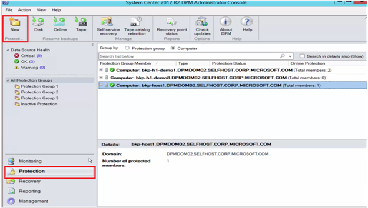
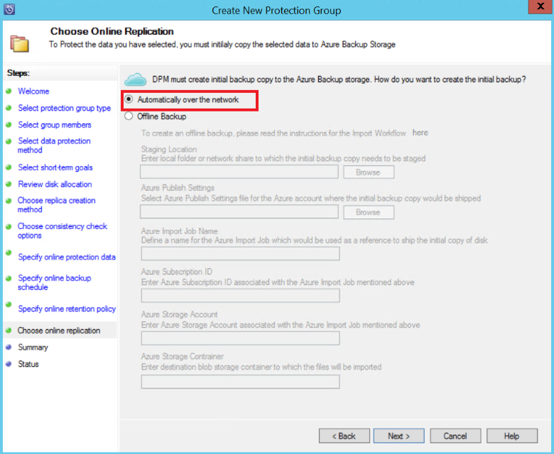
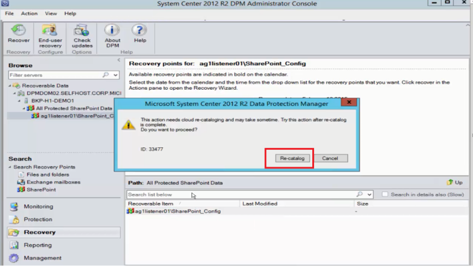

# Back up a SharePoint farm to Azure with DPM

You back up a SharePoint farm to Microsoft Azure by using System Center Data Protection Manager (DPM) in much the same way that you back up other data sources. Azure Backup provides flexibility in the backup schedule to create daily, weekly, monthly, or yearly backup points and gives you retention policy options for various backup points. DPM provides the capability to store local disk copies for quick recovery-time objectives (RTO) and to store copies to Azure for economical, long-term retention.

Backing up SharePoint to Azure with DPM is a very similar process to backing up SharePoint to DPM locally. Particular considerations for Azure will be noted in this article.

## SharePoint supported versions and related protection scenarios

For a list of supported SharePoint versions and the DPM versions required to back them up see [What can DPM back up?](https://docs.microsoft.com/system-center/dpm/dpm-protection-matrix?view=sc-dpm-2019#applications-backup)

DPM - System Center 2012 R2 supports backup to Azure from Update Rollup 5. Update Rollup 5 provides the ability to protect a SharePoint farm to Azure if the farm is configured by using SQL AlwaysOn.

Azure Backup for DPM supports the following scenarios:

Recovery is supported for farm, database, and file or list item from disk recovery points.  Farm and database recovery are supported from Azure recovery points. |

## Before you start

There are a few things you need to confirm before you back up a SharePoint farm to Azure.

### Prerequisites

Before you proceed, make sure that you have met all the [prerequisites for using Microsoft Azure Backup](backup-azure-dpm-introduction.md#prerequisites-and-limitations) to protect workloads. Some tasks for prerequisites include: create a backup vault, download vault credentials, install Azure Backup Agent, and register DPM/Azure Backup Server with the vault.

Additional prerequisites and limitations can be found on the [Back up SharePoint with DPM](https://docs.microsoft.com/system-center/dpm/back-up-sharepoint?view=sc-dpm-2019#prerequisites-and-limitations) article.

## Configure SharePoint protection

To configure the backup for your SharePoint farm, see [Configure Backup](https://docs.microsoft.com//system-center/dpm/back-up-sharepoint?view=sc-dpm-2019#configure-backup) in the DPM documentation.

## Back up a SharePoint farm by using DPM

After you have configured DPM and the SharePoint farm as explained previously, SharePoint can be protected by DPM.

For instructions on how to back up your SharePoint farm with DPM, see 

### To protect a SharePoint farm

1. From the **Protection** tab of the DPM Administrator Console, click **New**.
    
2. On the **Select Protection Group Type** page of the **Create New Protection Group** wizard, select **Servers**, and then click **Next**.

    
3. On the **Select Group Members** screen, select the check box for the SharePoint server you want to protect and click **Next**.

    

   > [!NOTE]
   > With the DPM agent installed, you can see the server in the wizard. DPM also shows its structure. Because you ran ConfigureSharePoint.exe, DPM communicates with the SharePoint VSS Writer service and its corresponding SQL Server databases and recognizes the SharePoint farm structure, the associated content databases, and any corresponding items.
   >
   >
4. On the **Select Data Protection Method** page, enter the name of the **Protection Group**, and select your preferred *protection methods*. Click **Next**.

    

   > [!NOTE]
   > The disk protection method helps to meet short recovery-time objectives. Azure is an economical, long-term protection target compared to tapes. For more information, see [Use Azure Backup to replace your tape infrastructure](./backup-azure-backup-cloud-as-tape.md)
   >
   >
5. On the **Specify Short-Term Goals** page, select your preferred **Retention range** and identify when you want backups to occur.

    

   > [!NOTE]
   > Because recovery is most often required for data that's less than five days old, we selected a retention range of five days on disk and ensured that the backup happens during non-production hours, for this example.
   >
   >
6. Review the storage pool disk space allocated for the protection group, and click then **Next**.
7. For every protection group, DPM allocates disk space to store and manage replicas. At this point, DPM must create a copy of the selected data. Select how and when you want the replica created, and then click **Next**.

    

   > [!NOTE]
   > To make sure that network traffic is not effected, select a time outside production hours.
   >
   >
8. DPM ensures data integrity by performing consistency checks on the replica. There are two available options. You can define a schedule to run consistency checks, or DPM can run consistency checks automatically on the replica whenever it becomes inconsistent. Select your preferred option, and then click **Next**.

    
9. On the **Specify Online Protection Data** page, select the SharePoint farm that you want to protect, and then click **Next**.

    
10. On the **Specify Online Backup Schedule** page, select your preferred schedule, and then click **Next**.

    

    > [!NOTE]
    > DPM provides a maximum of two daily backups to Azure at different times. Azure Backup can also control the amount of WAN bandwidth that can be used for backups in peak and off-peak hours by using  [Azure Backup Network Throttling](backup-windows-with-mars-agent.md#enable-network-throttling).
    >
    >
11. Depending on the backup schedule that you selected, on the **Specify Online Retention Policy** page, select the retention policy for daily, weekly, monthly, and yearly backup points.

    

    > [!NOTE]
    > DPM uses a grandfather-father-son retention scheme in which a different retention policy can be chosen for different backup points.
    >
    >
12. Similar to disk, an initial reference point replica needs to be created in Azure. Select your preferred option to create an initial backup copy to Azure, and then click **Next**.

    
13. Review your selected settings on the **Summary** page, and then click **Create Group**. You will see a success message after the protection group has been created.

    

## Restore a SharePoint item from disk by using DPM

To learn how to restore a SharePoint item from a disk with DPM, see [Restore SharePoint data](https://docs.microsoft.com/system-center/dpm/back-up-sharepoint?view=sc-dpm-2019#restore-sharepoint-data).

## Restore a SharePoint database from Azure by using DPM

1. To recover a SharePoint content database, browse through various recovery points (as shown previously), and select the recovery point that you want to restore.

    
2. Double-click the SharePoint recovery point to show the available SharePoint catalog information.

   > [!NOTE]
   > Because the SharePoint farm is protected for long-term retention in Azure, no catalog information (metadata) is available on the DPM server. As a result, whenever a point-in-time SharePoint content database needs to be recovered, you need to catalog the SharePoint farm again.
   >
   >
3. Click **Re-catalog**.

    

    The **Cloud Recatalog** status window opens.

    

    After cataloging is finished, the status changes to *Success*. Click **Close**.

    
4. Click the SharePoint object shown in the DPM **Recovery** tab to get the content database structure. Right-click the item, and then click **Recover**.

    
5. At this point, follow the recovery steps earlier in this article to recover a SharePoint content database from disk.

## Next steps

