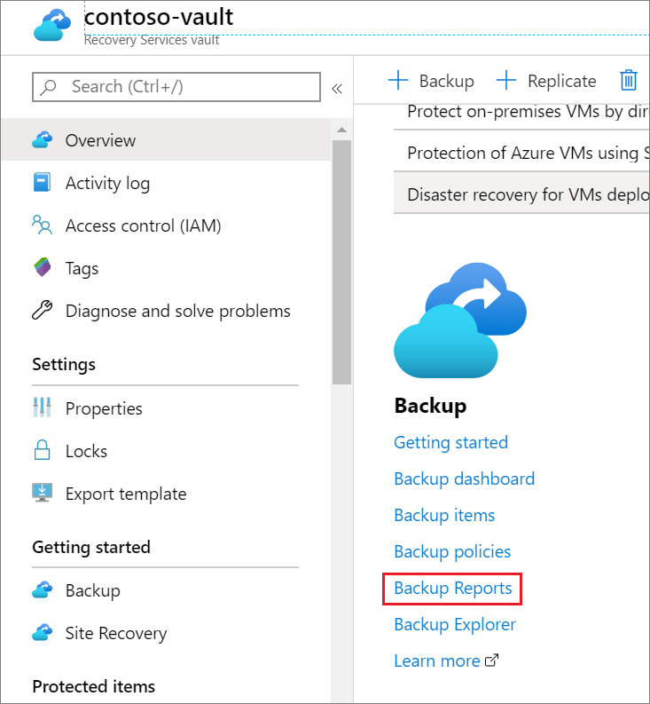
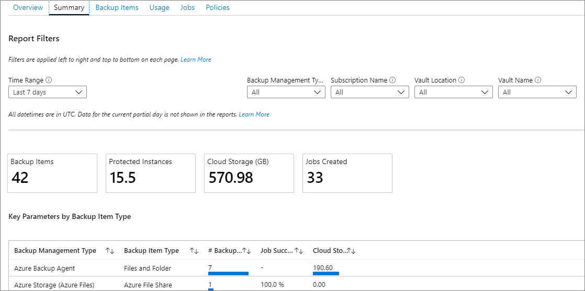
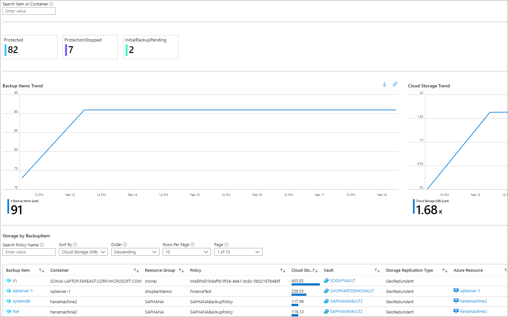
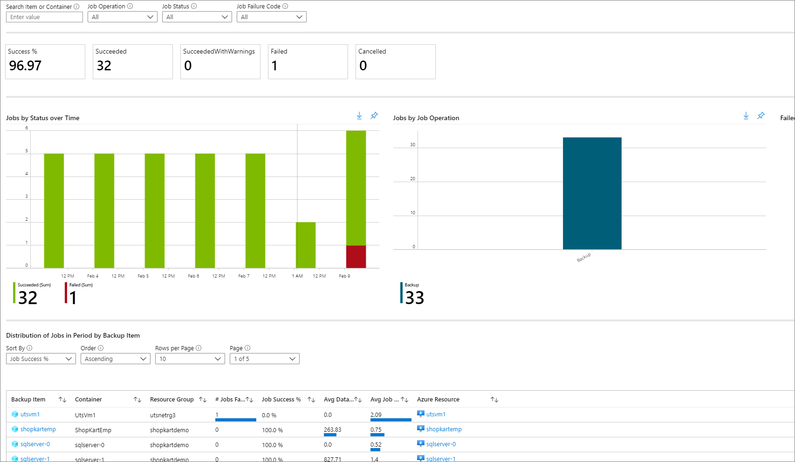
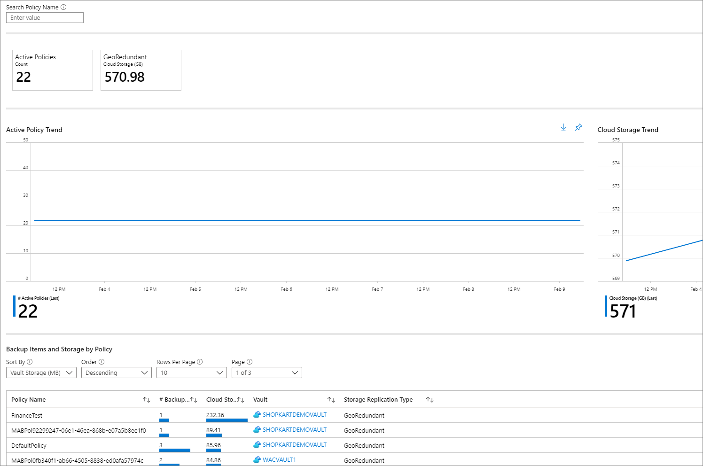

# Configure Azure Backup Reports

A common requirement for backup admins is to obtain insights on backups, based on data spanning a long period of time. There could be multiple use cases for such a solution - allocating and forecasting of cloud storage consumed, auditing of backups and restores, and identifying key trends at different levels of granularity.

Today, Azure Backup provides a reporting solution that leverages [Azure Monitor Logs](https://docs.microsoft.com/azure/azure-monitor/log-query/get-started-portal) and [Azure Workbooks](https://docs.microsoft.com/azure/azure-monitor/app/usage-workbooks), helping you get rich insights on your backups across your entire backup estate. This article explains how to configure and view Backup Reports.

## Supported scenarios

* Backup Reports are supported for Azure VMs, SQL in Azure VMs, SAP HANA/ASE in Azure VMs, Azure Backup Agent (MARS), Azure Backup Server (MABS) and System Center DPM.
* For DPM workloads, Backup Reports are supported for DPM Version 5.1.363.0 and above, and Agent Version 2.0.9127.0 and above.
* For MABS workloads, Backup Reports are supported for MABS Version 13.0.415.0 and above, and Agent Version 2.0.9170.0 and above.
* Backup Reports can be viewed across all backup items, vaults, subscriptions and regions as long as their data is being sent to a Log Analytics (LA) Workspace that the user has access to. 
* If you are an [Azure Lighthouse](https://docs.microsoft.com/azure/lighthouse/) user with delegated access to your customers' subscriptions, you can use these reports with Azure Lighthouse to view reports across all your tenants.
* Data for log backup jobs is currently not displayed in the reports.

## Getting Started

1. **Create a Log Analytics (LA) Workspace (or use an existing one):**

You need to set up one or more LA Workspaces to store your backup reporting data. The location and subscription where this LA workspace can be created is independent of the location and subscription where your vaults exist. 

Refer to the following article: [Create a Log Analytics Workspace in the Azure portal](https://docs.microsoft.com/azure/azure-monitor/learn/quick-create-workspace) to set up an LA Workspace.

By default, the data in an LA Workspace is retained for 30 days. To see data for a longer time horizon, change the retention period of the LA Workspace. To change the retention period, refer to the following article: [Manage usage and costs with Azure Monitor Logs](https://docs.microsoft.com/azure/azure-monitor/platform/manage-cost-storage).

2. **Configure Diagnostics Settings for your vaults:**

Azure Resource Manager resources, such as Recovery Services vaults, record information about scheduled operations and user-triggered operations as diagnostics data. 

In the monitoring section of your Recovery Services vault, select **Diagnostic settings** and specify the target for the Recovery Services vault's diagnostic data. [Learn more about using diagnostic events](https://aka.ms/AzureBackupDiagnosticDocs).

Azure Backup also provides a built-in Azure Policy, which automates the configuration of diagnostic settings for all vaults in a given scope. Refer to the following article to learn how to use this policy: [Configure Vault Diagnostics Settings at scale](https://aka.ms/AzureBackupDiagnosticsPolicyDocs)

3. **View Reports on the Azure portal:**

Once you have configured your vaults to send data to LA, view your backup reports by navigating to any vault’s blade and clicking on the **Backup Reports** menu item. 

Clicking this link opens up the Backup Report Workbook. 

> [!NOTE]
> Currently, the initial load of the report may take up to 1 minute.

Below is a description of the various tabs that the report contains:

1. **Summary** - The Summary tab provides a high-level overview of your backup estate. Under the Summary tab, you can get a quick glance of the total number of backup items, total cloud storage consumed, the number of protected instances and the job success rate per workload type. For more detailed information around a specific backup artifact type, navigate to the respective tabs.

2. **Backup Items** - The Backup Items tab allows you to see information and trends on cloud storage consumed at a Backup Item level. For example, if you are using SQL in Azure VM backup, you can see the cloud storage consumed for each SQL database being backed up. You can also choose to see data for backup items of a particular protection status. For example, clicking on the **Protection Stopped** tile at the top of the tab, filters all the below widgets to show data only for Backup Items in Protection Stopped state.

3. **Usage** - The Usage tab helps you view key billing parameters for your backups. The information shown in this tab is at a billing entity (protected container) level. For example, in the case of a DPM server being backed up to Azure, you can view the trend of protected instances and cloud storage consumed for the DPM server. Similarly, if you are using SQL in Azure Backup or SAP HANA in Azure Backup, this tab gives you usage-related information at the level of the virtual machine that these databases are contained in.

4. **Jobs** - The Jobs tab lets you view long running trends on jobs, such as the number of failed jobs per day and the top causes of job failure. You can view this information at both an aggregate level and at a backup item level. Clicking on a particular backup item in a grid lets you view detailed information on each job that was triggered on that backup item in the selected time range.

5. **Policies** - The Policies tab lets you view information on all of your active policies, such as the number of associated items, and the total cloud storage consumed by items backed up under a given policy. Clicking on a particular policy lets you view information on each of its associated backup items.

## Exporting to Excel

Clicking on the down arrow button at the top right of any widget (table/chart) exports the contents of that widget as an Excel sheet, as-is with existing filters applied. To export more rows of a table to Excel, you can increase the number of rows displayed on the page by using the **Rows Per Page** dropdown at the top of each grid.

## Pinning to Dashboard

Click the Pin Icon at the top of each widget to pin the widget to your Azure portal dashboard. This helps you create customized dashboards tailored to display the most important information that you need.

## Cross-Tenant Reports

If you are an [Azure Lighthouse](https://docs.microsoft.com/azure/lighthouse/) user with delegated access to subscriptions across multiple tenant environments, you can use the default subscription filter (by clicking on the filter icon in the top right of the Azure portal) to choose all the subscriptions you wish to see data for. Doing so will let you select LA Workspaces across your tenants to view multi-tenanted reports.

## Conventions used in Backup Reports

* Filters work from left to right and top to bottom on each tab, that is, any filter only applies to all those widgets that are positioned either to the right of that filter or below that filter. 
* Clicking on a colored tile filters the widgets below the tile for records pertaining to the value of that tile. For example, clicking on the *Protection Stopped* tile in the Backup Items tab filters the grids and charts below to show data for backup items in 'Protection Stopped' state.
* Tiles that are not colored are not clickable.
* Data for the current partial day is not shown in the reports. Thus, when the selected value of **Time Range** is, ***Last 7 days***, the report shows records for the last 7 completed days (which does not include the current day).
* The report shows details of Jobs (apart from log jobs) that were **triggered** in the selected time range. 
* The values shown for Cloud Storage and Protected Instances, are at the **end** of the selected time range.
* The Backup Items displayed in the reports are those items that exist at the **end** of the selected time range. Backup Items which were deleted in the middle of the selected time range are not displayed. The same convention applies for Backup Policies as well.

## Query Load Times

The widgets in the Backup Report are powered by Kusto queries, which run on the user's LA Workspaces. As these queries typically involve the processing of large amounts of data, with multiple joins to enable richer insights, the widgets may not load instantaneously when the user is viewing reports across a large backup estate. The table below provides a rough estimate of the time that different widgets can take to load, based on the number of backup items and the time range for which the report is being viewed:

| **# Datasources**                         | **Time Horizon** | **Load Times (approx)**                                              |
| --------------------------------- | ------------- | ------------------------------------------------------------ |
| ~5 K                       | 1 month          | Tiles: 5-10 secs   Grids: 5-10 secs   Charts: 5-10 secs   Report-level filters: 5-10 secs|
| ~5 K                       | 3 months          | Tiles: 5-10 secs   Grids: 5-10 secs   Charts: 5-10 secs   Report-level filters: 5-10 secs|
| ~10 K                       | 3 months          | Tiles: 15-20 secs   Grids: 15-20 secs   Charts: 1-2 mins   Report-level filters: 25-30 secs|
| ~15 K                       | 1 month          | Tiles: 15-20 secs   Grids: 15-20 secs   Charts: 50-60 secs   Report-level filters: 20-25 secs|
| ~15 K                       | 3 months          | Tiles: 20-30 secs   Grids: 20-30 secs   Charts: 2-3 mins   Report-level filters: 50-60 secs |

## What happened to the Power BI Reports?
* Our earlier Power BI template app for reporting (which sourced data from an Azure Storage Account) is on a deprecation path. It is recommended to start sending vault diagnostic data to Log Analytics as described above, to view reports.

* In addition, the V1 schema of sending diagnostics data to a storage account or an LA Workspace is also on a deprecation path. This means that if you have written any custom queries or automations based on the V1 schema, you are advised to update these queries to use the currently supported V2 schema.

## Next Steps
[Learn more about monitoring and reporting with Azure Backup](https://docs.microsoft.com/azure/backup/backup-azure-monitor-alert-faq)