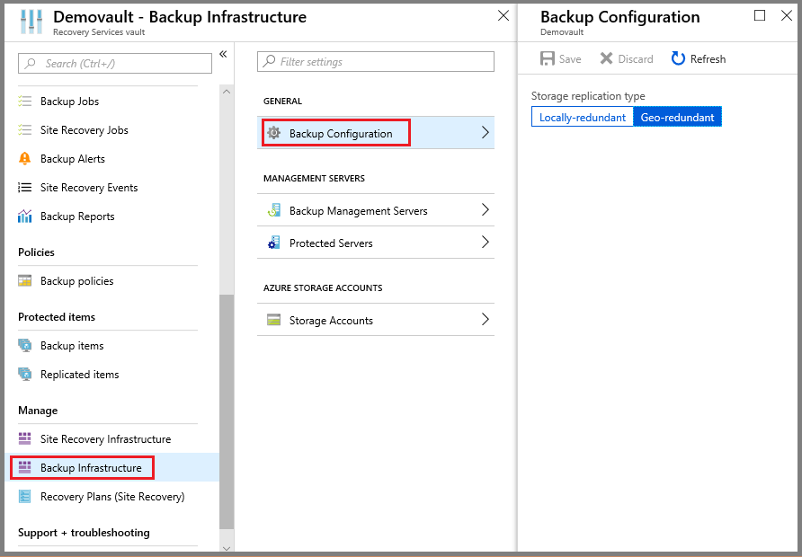
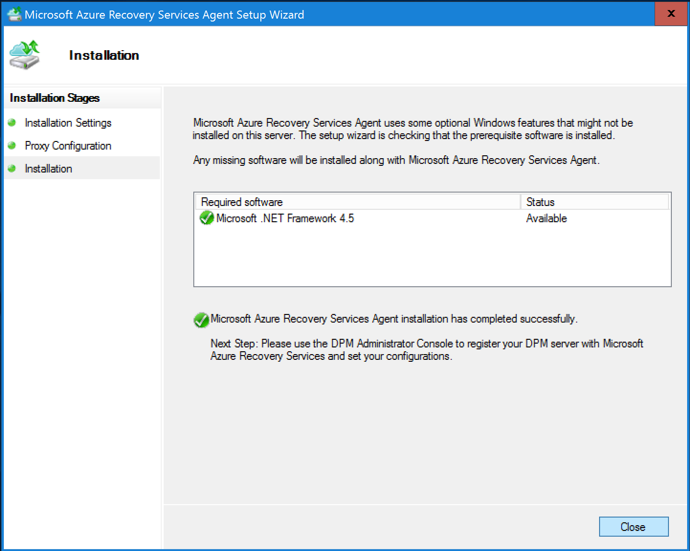
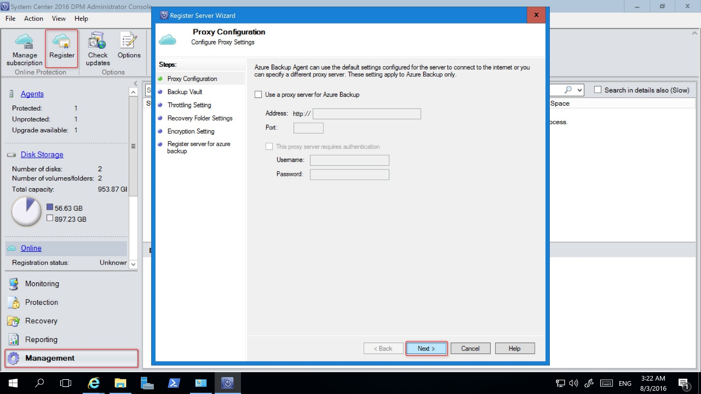
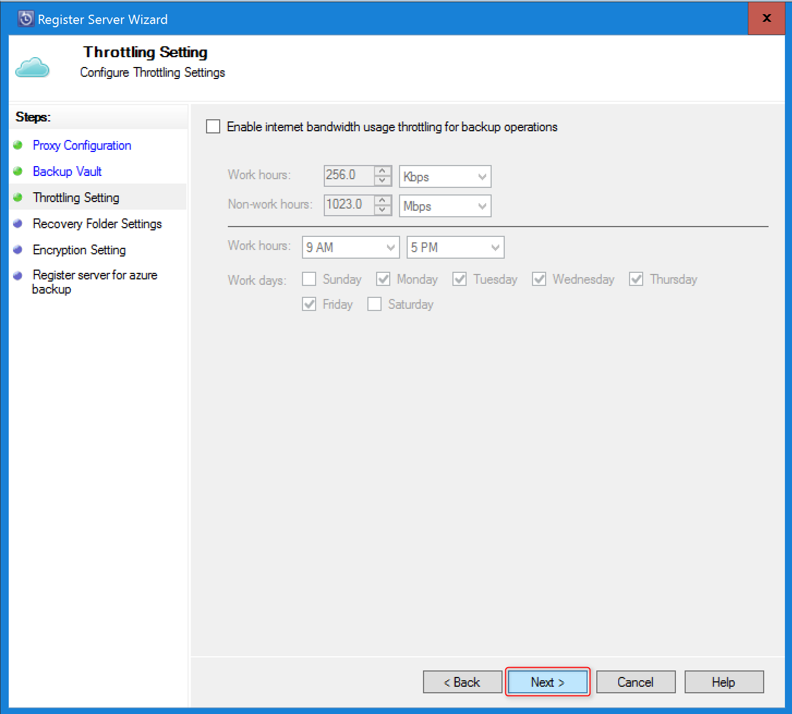
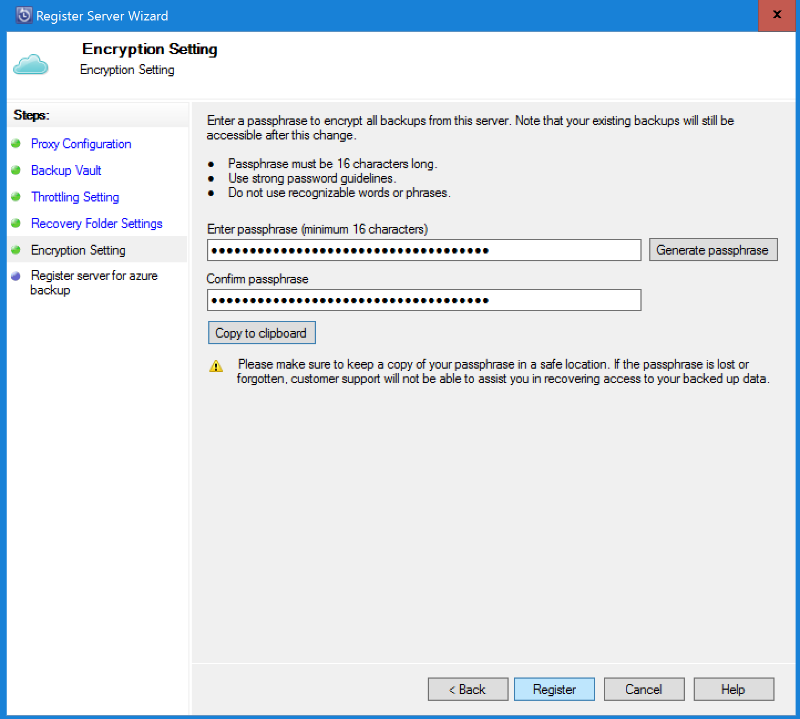

# Prepare to back up workloads to Azure with System Center DPM

This article explains how to prepare for System Center Data Protection Manager (DPM) backups to Azure, using the Azure Backup service. 

The article provides:

- An overview of deploying DPM with Azure Backup.
- Prerequisites and limitations for using Azure Backup with DPM.
- Steps for preparing Azure, including setting up a Recovery Services Backup vault, and optionally modifying the type of Azure storage for the vault.
- Steps for preparing the DPM server, including downloading vault credentials, installing the Azure Backup agent, and registering the DPM server in the vault.
- Troubleshooting tips for common errors. 

## Why back up DPM to Azure?

[System Center DPM](https://docs.microsoft.com/system-center/dpm/dpm-overview) backs up file and application data. DPM interacts with Azure Backup as follows:

* **DPM running on a physical server or on-premises VM** — You can back up data to a Backup vault in Azure, in addition to disk and tape backup.
* **DPM running on an Azure VM** — From System Center 2012 R2 with Update 3 or later, you can deploy DPM on an Azure VM. You can back up data to Azure disks attached to the VM, or use Azure Backup to back up the data to a Backup vault.

The business benefits of backing up DPM servers to Azure include:

* For on-premises DPM, Azure Backup provides an alternative to long-term deployment to tape.
* For DPM running on an Azure VM, Azure Backup allows you to offload storage from the Azure disk. Storing older data in a Backup vault vault allows you to scale up your business by storing new data to disk.

## Prerequisites and limitations

**Setting** | **Requirement** 
--- | ---
DPM on an Azure VM | System Center 2012 R2 with DPM 2012 R2 Update Rollup 3 or later.
DPM on a physical server | System Center 2012 SP1 or later; System Center 2012 R2. 
DPM on a Hyper-V VM | System Center 2012 SP1 or later; System Center 2012 R2. 
DPM on a VMware VM | System Center 2012 R2 with Update Rollup 5 or later.
Components | The DPM server should have Windows PowerShell and .Net Framework 4.5 installed.
Supported apps | [Learn](https://docs.microsoft.com/system-center/dpm/dpm-protection-matrix) what DPM can back up.
Supported file types | These file types can be backed up with Azure Backup: Encrypted (full backups only); Compressed (incremental backups supported); Sparse (incremental backups supported); Compressed and sparse (treated as sparse).
Unsupported file types | Servers on case-sensitive file systems; hard links (skipped); reparse points (skipped); encrypted and compressed (skipped); encrypted and sparse (skipped); Compressed stream; parse stream.
Local storage | Each machine you want to back up must have local free storage that's at least 5 % of the size of the data that is being backed up.  For example, backing up 100 GB of data requires a minimum of 5 GB of free space in the scratch location.
Vault storage | There’s no limit to the amount of data you can back up to an Azure Backup vault but the size of a data source (for example a virtual machine or database) shouldn’t exceed 54400 GB.
Azure Backup agent | If DPM is running on System Center 2012 SP1, install Rollup 2 or later for DPM SP1. This is required for agent installation.   This article describes how to deploy the latest version of the Azure Backup agent, also known as the Microsoft Azure Recovery Service (MARS) agent. If you have an earlier version deployed, update to the latest version to ensure that backup works as expected. 

Before you start, you need an Azure account with the Azure Backup feature enabled. If you don't have an account, you can create a free trial account in just a couple of minutes. Read about [Azure Backup pricing](https://azure.microsoft.com/pricing/details/backup/).

[!INCLUDE [backup-create-rs-vault.md](../../includes/backup-create-rs-vault.md)]

## Modify storage settings

You can choose between geo-redundant storage and locally redundant storage.

- By default, your vault has geo-redundant storage.
- If the vault is your primary backup, leave the option set to geo-redundant storage. If you want a cheaper option that isn't quite as durable, use the following procedure to configure locally redundant storage.
- Learn about [Azure storage](../storage/common/storage-redundancy.md), and the [geo-redundant](../storage/common/storage-redundancy-grs.md) and [locally redundant](../storage/common/storage-redundancy-lrs.md) storage options.
- Modify storage settings before the initial backup. If you've already backed up an item, stop backing it up in the vault before you modify storage settings.

To edit the storage replication setting:

1. Open the vault dashboard.

2. In **Manage**, click **Backup Infrastructure**.

3. In **Backup Configuration** menu, select a storage option for the vault.

    

## Download vault credentials

You use vault credentials when you register the DPM server in the vault. 

- The vault credentials file is a certificate generated by the portal for each backup vault.
- The portal then uploads the public key to the Access Control Service (ACS).
- During the machine registration workflow, the certificate's private key is made available to the user, which authenticates the machine.
- Based on the authentication, the Azure Backup service sends data to the identified vault.

 ### Best practices for vault credentials

To obtain the credentials you download the vault credential file through a secure channel from the Azure portal:

- The vault credentials are used only during the registration workflow.
- It's your responsibility to ensure that the vault credentials file is safe, and not compromised.
    -  If control of the credentials is lost, the vault credentials can be used to register other machines to vault.
    - However, backup data is encrypted using a passphrase that belongs to the customer, so existing backup data can't be compromised.
- Ensure that file is saved in a location which can be accessed from the DPM server. If it is stored in a file share/SMB, check for the access permissions.
- Vault credentials expire after 48 hrs. You can download new vault credentials as many times as needed. However, only the latest vault credential file can be used during the registration workflow.
- The Azure Backup service isn't aware of the certificate's private key, and the private key isn't available in the portal or the service. 

Download the vault credentials file to a local machine as follows:

1. Sign in to the [Azure portal](https://portal.azure.com/).
2. Open the vault in which you want to register the DPM server.
3. In **Settings**, click **Properties**.

    

4. In **Properties** > **Backup Credentials**, click **Download**. The portal generates the vault credential file using a combination of the vault name and current date, and makes it available for download.

    

5. Click **Save** to download the vault credentials to folder, or **Save As** and specify a location. It will take up to a minute for the file to be generated.

## Install the Backup Agent

Every machines that's backed up by Azure Backup must have the Backup agent (also known as the Microsoft Azure Recovery Service (MARS) agent) installed on it. Install the agent on the DPM server as follows:

1. Open the vault to which you want to register the DPM server.
2. In **Settings**, click **Properties**.

    
3. On the **Properties** page, download the Azure Backup Agent.

    

4. After downloading, run MARSAgentInstaller.exe. to install the agent on the DPM machine. 
5. Select an installation folder and cache folder for the agent. The cache location free space must be at least 5% of the backup data.
6. If you use a proxy server to connect to the internet, in the **Proxy configuration** screen, enter the proxy server details. If you use an authenticated proxy, enter the user name and password details in this screen.
7. The Azure Backup agent installs .NET Framework 4.5 and Windows PowerShell (if they're not installed) to complete the installation.
8. After the agent is installed, **Close** the window.

   

## Register the DPM server in the vault

1. In the DPM Administrator console > **Management**, click **Online**. Select **Register**. It will open the Register Server Wizard.
2. In **Proxy Configuration**, specify the proxy settings as required.

    
9. In **Backup Vault**, browse to and select the vault credentials file that you downloaded.

    

10. In **Throttling Setting**, you can optionally enable bandwidth throttling for backups. You can set the speed limits for specify work hours and days. 

    

11. In **Recovery Folder Setting**, specify a location that can be used during data recovery.

    - Azure Backup uses this location as a temporary holding area for recovered data.
    - After finishing data recovery, Azure Backup will clean up the data in this area.
    - The location must have enough space to hold items that you anticipate recovering in parallel.

    

12. In **Encryption setting** generate or provide a passphrase.

    - The passphrase is used to encrypt the backups to cloud.
    - Specify a minimum of 16 characters.
    - Save the file in a secure location, it's needed for recovery.
    
    

    > [!WARNING]
    > You own the encryption passphrase and Microsoft does not have visibility into it.
    > If the passphrase is lost or forgotten; Microsoft cannot help in recovering the backup data. 

13. Click **Register** to register the DPM server to the vault.  

After the server is registered successfully to the vault and you are now ready to start backing up to Microsoft Azure.

## Troubleshoot vault credentials

### Expiration error

The vault credentials file is valid only for 48 hrs (after it’s downloaded from the portal). If you encounter any error in this screen (for example, “Vault credentials file provided has expired”), login to the Azure portal and download the vault credentials file again.

### Access error

Ensure that the vault credentials file is available in a location which can be accessed by the setup application. If you encounter access related errors, copy the vault credentials file to a temporary location in this machine and retry the operation.

### Invalid credentials error

If you encounter an invalid vault credential error (for example, “Invalid vault credentials provided") the file is either corrupted or does not have the latest credentials associated with the recovery service.

- Retry the operation after downloading a new vault credential file from the portal.
- This error is typically seen when you click on the **Download vault credential** option in the Azure portal, twice in quick succession. In this case, only the second vault credential file is valid.
