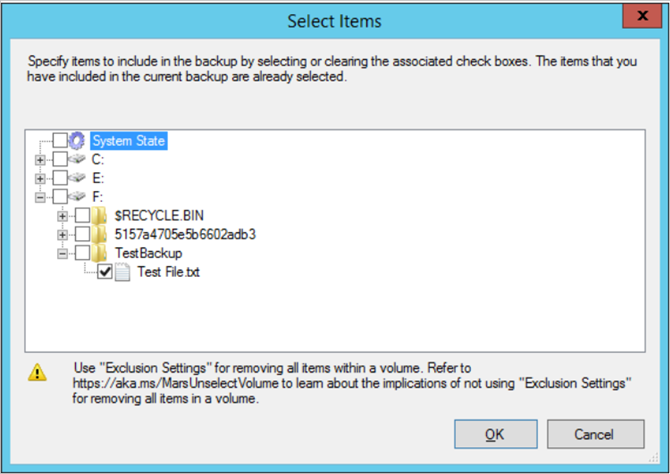
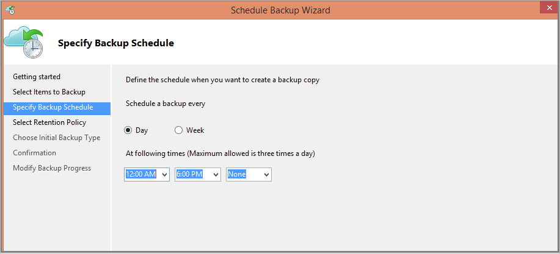
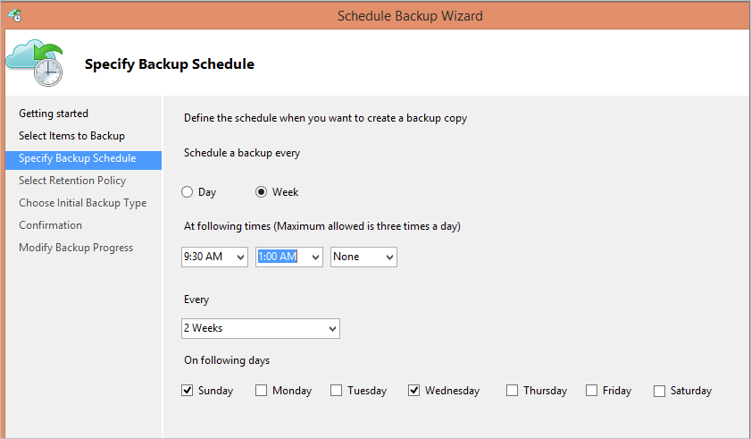
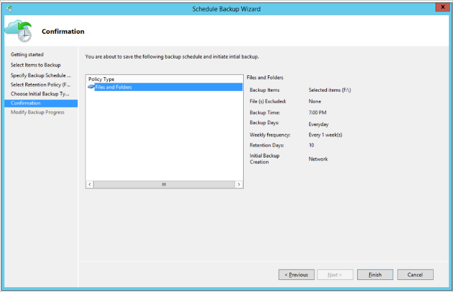
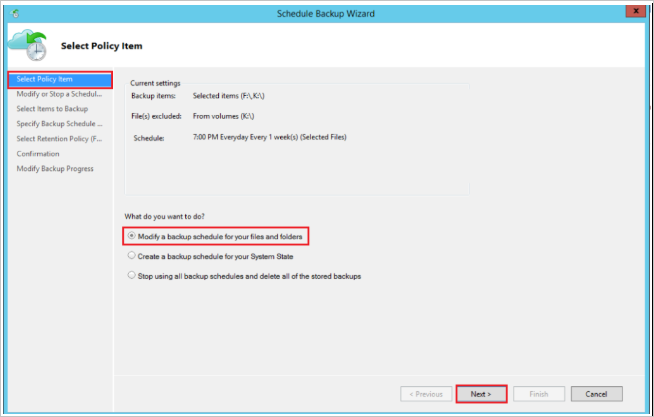
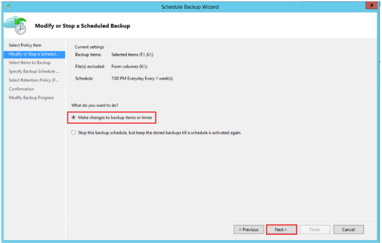
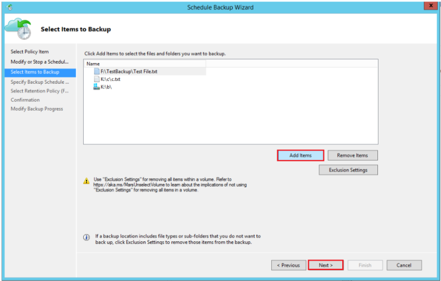
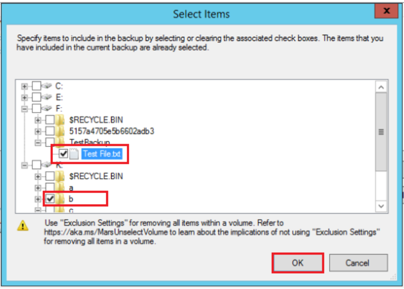

# Manage Microsoft Azure Recovery Services Agent backups by using the Azure Backup service

This article describes how to manage Files and Folder that is backed up by using Microsoft Azure Recovery Services Agent.

## Create a backup policy

The backup policy specifies when to take snapshots of the data to create recovery points and how long to retain recovery points.

- You configure a backup policy using the MARS agent.
- Azure Backup doesn't support automatic adjustment of clock for daylight savings time (DST). You have to modify the policy to ensure day light saving is taken into account to prevent discrepancy between the actual time and scheduled backup time.

Create a policy as follows:
1. After downloading and registering MARS agent launch it where it is installed. You can find it by searching your machine for **Microsoft Azure Backup**. This has to be done on each machine where the agent is installed. 
2. In **Actions**, click **Schedule Backup**.

    
3. In the Schedule Backup Wizard >  **Getting started**, click **Next**.
4. In **Select Items to Backup**, click **Add Items**.

    

5. In **Select Items**, select what you want to back up and click **OK**.

    

6. In **Select Items to Backup** page, click **Next**.
7. In **Specify Backup Schedule** page, specify when you want to take daily or weekly backups. Then click **Next**.

    - A recovery point is created when a backup is taken.
    - The number of recovery points created in your environment is dependent upon your backup schedule.

8. You can schedule daily backups, up to three times a day. For example, the screenshot shows two daily backups, one at midnight and one at 6pm.

    

9. You can run weekly backups too. For example, the screenshot shows backups taken every alternate Sunday & Wednesday at 9:30AM and 1:00AM.

    

10. On the **Select Retention Policy** page, specify how you store historical copies of your data. Then click **Next**.

    - Retention settings specify which recovery points should be stored, and how long they should be stored for.
    - For example, when you set a daily retention setting, you indicate that at the time specified for the daily retention, the latest recovery point will be retained for the specified number of days. Or, as another example, you could specify a monthly retention policy to indicate that the recovery point created on the 30th of every month should be stored for 12 months.
    - Daily and weekly recovery point retention usually coincides with the backup schedule. Meaning that when the backup is triggered according to schedule, the recovery point created by the backup is stored for the duration indicated in the daily or weekly retention policy.
    - As an example, in the following screenshot:
             - Daily backups at midnight and 6 PM are kept for seven days.
             - Backups taken on a Saturday at midnight and 6 PM are kept for 4 weeks.
            - Backups taken on Saturday on the last week of the month at midnight and 6 PM are kept for 12 months. - Backups taken on a Saturday in the last week of March are kept for 10 years.

   

11. In **Choose Initial Backup Type** decide if you want to take the initial backup over the network or use offline backup (for more information on offline backup refer to this [article](backup-azure-backup-import-export.md)). To take the initial backup over the network select **Automatically over the network** and click **Next**.

    

10. In **Confirmation**, review the information, and then click **Finish**.
    

11. After the wizard finishes creating the backup schedule, click **Close**.
  

## Modify a backup policy
When you modify backup policy you can add new items, remove existing items from backup or exclude files from being backed up using  Exclusion Settings.
    
   - **Add Items** use this option only for adding new items to back up. To remove existing items use **Remove Items** or **Exclusion Settings** option.  
   - **Remove Items** use this option to remove items from being backed up. 
           - Avoid using this option to unselect all protected items in a volume. Use Exclusion Settings to exclude items.
           - Unselecting entire volume retains past backup without any scope for modifying retention policy
           - Use **Exclusion Settings** for removing all items within a volume instead of **Remove Items**. Clearing all selections in a volume causes old backups of the items, to be retained as per retention settings at the time of the last backup, without scope for modification. Re-selecting these items, leads to a first full-backup and new policy changes are not applied to old backups. 
   - **Exclusion Settings** use this option to exclude specific items from being backed up. 
  
### Add new items to existing policy:
1. In **Actions**, click **Schedule Backup**.

    

2. In **Select policy item** tab, and select **Modify backup schedule for your files and folders** and click **Next**.

    

3. In **Modify or stop schedule backup** tab, select **Make changes to backup items or times** and click **Next**.

    

4. In **Select items to backup** tab, click **Add items** that you want to backup then **Select Items** window appears.

    

5. In **Select Items** window, select flies or folders that you  want to add and click **OK**.

    

6. Complete the subsequent steps and click **Finish** to complete the operation. 

## Next steps
- Learn more about [Ad hoc backup policy retention behavior](https://docs.microsoft.com/azure/backup/backup-configure-vault#ad-hoc-backup-policy-retention-behavior.md).

