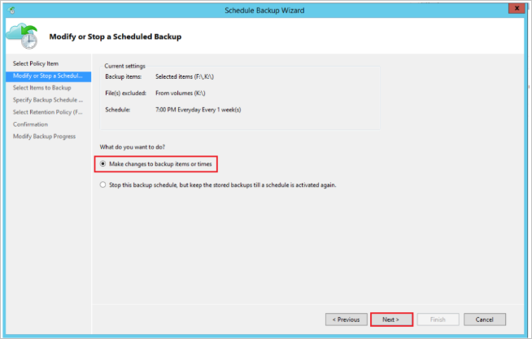
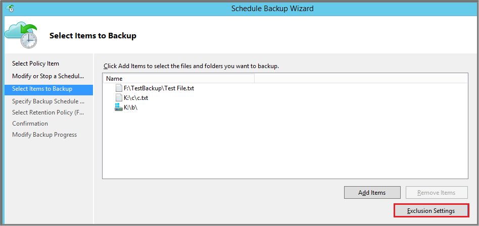
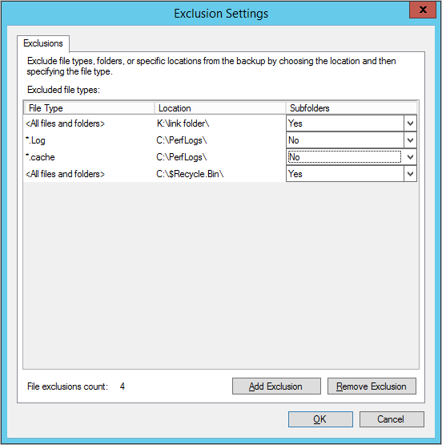
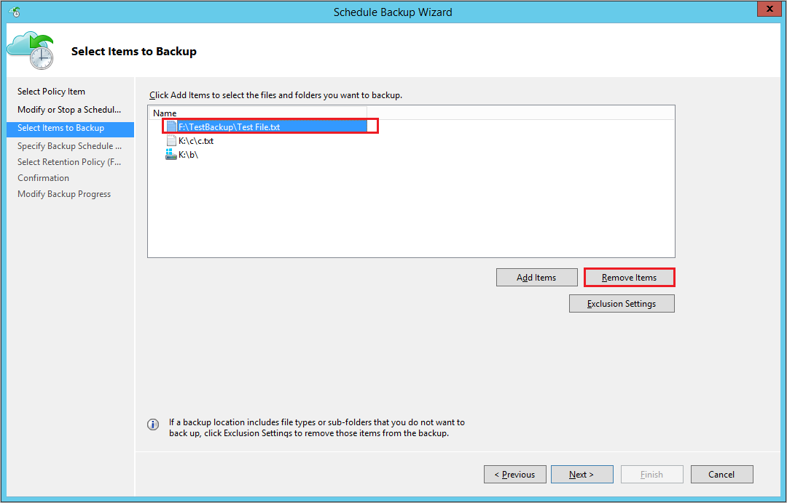
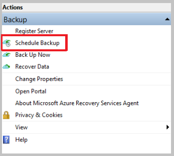
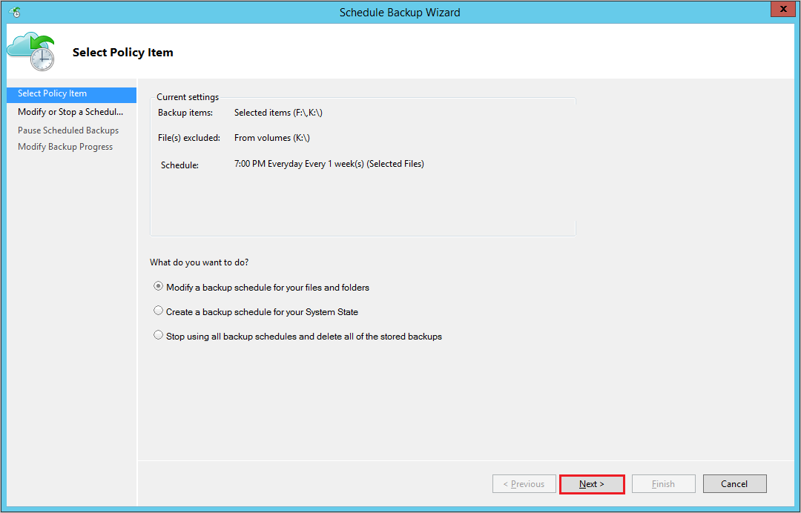
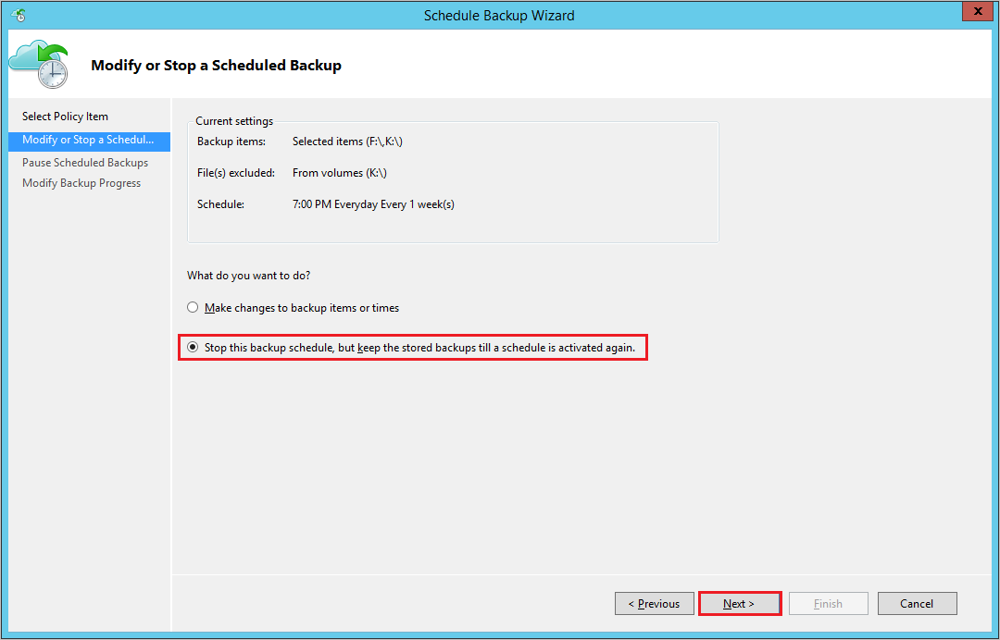
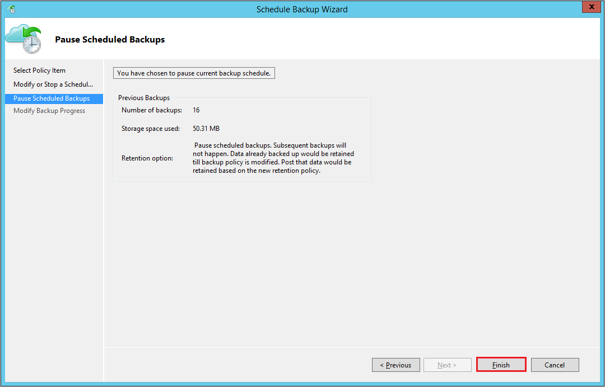
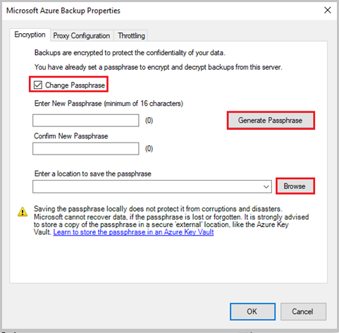
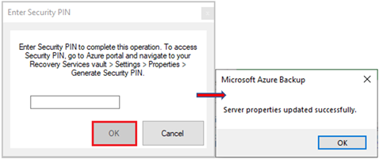

# Manage Microsoft Azure Recovery Services (MARS) Agent backups by using the Azure Backup service

This article describes how to manage files and folders that are backed up with the Microsoft Azure Recovery Services Agent.

## Modify a backup policy

When you modify backup policy, you can add new items, remove existing items from backup, or exclude files from being backed up using  Exclusion Settings.

- **Add Items** use this option only for adding new items to back up. To remove existing items, use **Remove Items** or **Exclusion Settings** option.  
- **Remove Items** use this option to remove items from being backed up.
  - Use **Exclusion Settings** for removing all items within a volume instead of **Remove Items**.
  - Clearing all selections in a volume causes old backups of the items, to be retained as per retention settings at the time of the last backup, without scope for modification.
  - Reselecting these items, leads to a first full-backup and new policy changes are not applied to old backups.
  - Unselecting entire volume retains past backup without any scope for modifying retention policy.
- **Exclusion Settings** use this option to exclude specific items from being backed up.

### Add new items to existing policy

1. In **Actions**, click **Schedule Backup**.

    

2. In **Select policy item** tab, and select **Modify backup schedule for your files and folders** and click **Next**.

    

3. In **Modify or stop schedule backup** tab, select **Make changes to backup items or times** and click **Next**.

    

4. In **Select items to Backup** tab, click **Add items** to add the items that you want to back up.

    

5. In **Select Items** window, select flies or folders that you  want to add and click **OK**.

    

6. Complete the subsequent steps and click **Finish** to complete the operation.

### Add Exclusion rules to existing policy

You can add exclusion rules to skip files and folders that you don't want to be backed up. You can do this during when defining a new policy or modifying an existing policy.

1. From the Actions pane, click **Schedule Backup**. Go to **Select items to Backup** and click **Exclusion Settings**.

    

2. In **Exclusion Settings**, click **Add Exclusion**.

    

3. From **Select Items to Exclude**, browse the files and folders and select items that you want to exclude and click **OK**.

    

4. By default all **Subfolders** within the selected folders are excluded. You can change this by selecting **Yes** or **No**. You can edit and specify the file types to exclude as shown below:

    

5. Complete the subsequent steps and click **Finish** to complete the operation.

### Remove items from existing policy

1. From the Actions pane, click **Schedule Backup**. Go to **Select items to Backup**. From the list, select the files and folders that you want to remove from backup schedule and click **Remove items**.

    

> [!NOTE]
> Proceed with caution when you completely remove a volume from the policy.  If you need to add it again, then it will be treated as a new volume. The next scheduled backup will perform an Initial Backup (full backup) instead of Incremental Backup. If you need to temporarily remove and add items later, then it is recommended to use **Exclusions Settings** instead of **Remove Items** to ensure incremental backup instead of full backup.

2. Complete the subsequent steps and click **Finish** to complete the operation.

## Stop protecting Files and Folder backup

There are two ways to stop protecting Files and Folders backup:

- **Stop protection and retain backup data**.
  - This option will stop all future backup jobs from protection.
  - Azure Backup service will retain the recovery points that have been backed up based on the retention policy.
  - You'll be able to restore the backed-up data for unexpired recovery points.
  - If you decide to resume protection, then you can use the *Re-enable backup schedule* option. After that, data would be retained based on the new retention policy.
- **Stop protection and delete backup data**.
  - This option will stop all future backup jobs from protecting your data and delete all the recovery points.
  - You will receive a delete Backup data alert email with a message *Your data for this Backup item has been deleted. This data will be temporarily available for 14 days, after which it will be permanently deleted* and recommended action *Reprotect the Backup item within 14 days to recover your data.*
  - To resume protection, reprotect within 14 days from delete operation.

### Stop protection and retain backup data

1. Open the MARS management console, go to the **Actions pane**, and **select Schedule Backup**.

    
1. In **Select Policy Item** page, select **Modify a backup schedule for your files and folders** and click **Next**.

    
1. From the **Modify or Stop a Scheduled Backup** page, select **Stop using this backup schedule, but keep the stored backups until a schedule is activated again**. Then, select **Next**.

    
1. In **Pause Scheduled Backup** review the information and click **Finish**.

    
1. In **Modify backup process** check your schedule backup pause is in success status and click **close** to finish.

### Stop protection and delete backup data

1. Open the MARS management console, go to the **Actions** pane, and select **Schedule Backup**.
2. From the **Modify or Stop a Scheduled Backup** page, select **Stop using this backup schedule and delete all the stored backups**. Then, select **Next**.

    

3. From the **Stop a Scheduled Backup** page, select **Finish**.

    
4. You are prompted to enter a security PIN (personal identification number), which you must generate manually. To do this, first sign in to the Azure portal.
5. Go to **Recovery Services vault** > **Settings** > **Properties**.
6. Under **Security PIN**, select **Generate**. Copy this PIN. The PIN is valid for only five minutes.
7. In the management console, paste the PIN, and then select **OK**.

    

8. In the **Modify Backup Progress** page, the following message appears: *Deleted backup data will be retained for 14 days. After that time, backup data will be permanently deleted.*  

    

After you delete the on-premises backup items, follow the next steps from the portal.

## Re-enable protection

If you stopped protection while retaining data and decided to resume protection, then you can re-enable the backup schedule using modify backup policy.

1. On **Actions** select **Schedule backup**.
1. Select **Re-enable backup schedule. You can also modify backup items or times** and click **Next**. 

    
1. In **Select Items to Backup**, click **Next**.

    
1. In **Specify Backup Schedule**, specify the backup schedule and click **Next**.
1. In **Select Retention Policy**, specify retention duration and click **Next**.
1. Finally in the **Confirmation** screen, review the policy details and click **Finish**.

## Re-generate passphrase

A passphrase is used to encrypt and decrypt data while backing up or restoring your on-premises or local machine using the MARS agent to or from Azure. If you lost or forgot the passphrase, then you can regenerate the passphrase (provided your machine is still registered with Recovery Services Vault and the backup is configured) by following these steps:

- From MARS agent console, go to **Actions Pane** > **Change properties**.  Then go to **Encryption tab** > **Change Passphrase** > **Generate passphrase** 
- Once you click **Generate passphrase**, it will generate a new passphrase. 
- Click Browse to save your passphrase. 

    
- Click **OK** to apply changes.  If the [Security Feature](https://docs.microsoft.com/azure/backup/backup-azure-security-feature#enable-security-features) is enabled on the Azure Portal for the Recovery Services Vault, then you will be prompted to enter the Security PIN. To receive the PIN, follow the steps listed in this [article](https://docs.microsoft.com/azure/backup/backup-azure-security-feature#authentication-to-perform-critical-operations). 
- Paste the security PIN from the portal and click **OK** to apply the changes. 

    
- Ensure that the passphrase is securely saved in an alternate location (other than source machine), preferably in the Azure Key Vault. Keep track of all the passphrases if you have multiple machines being backed up with MARS agents).

## Next steps

- For information about supported scenarios and limitations, refer to the [Support Matrix for MARS](https://docs.microsoft.com/azure/backup/backup-support-matrix-mars-agent).
- Learn more about [On demand backup policy retention behavior](backup-configure-vault.md#on-demand-backup-policy-retention-behavior).
