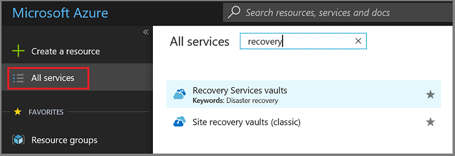
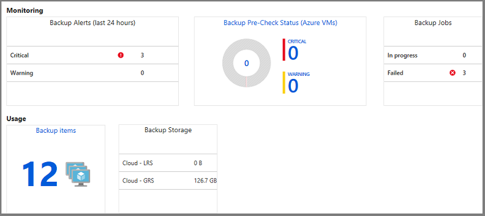
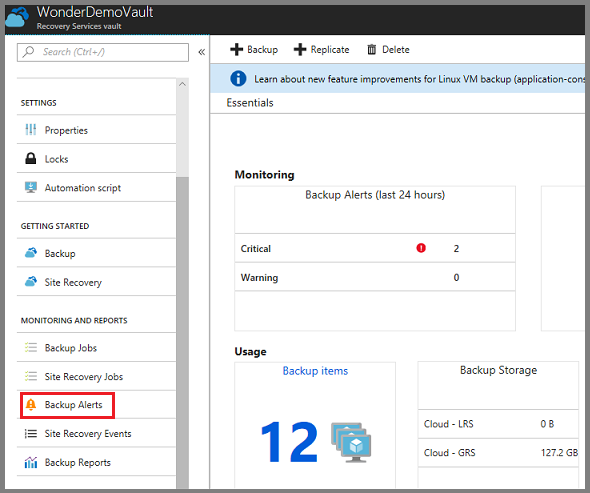
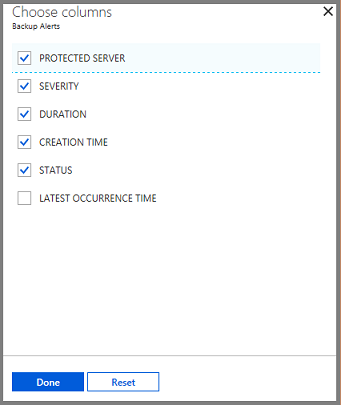
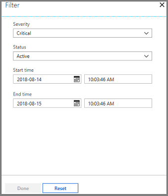
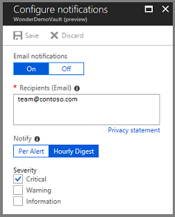
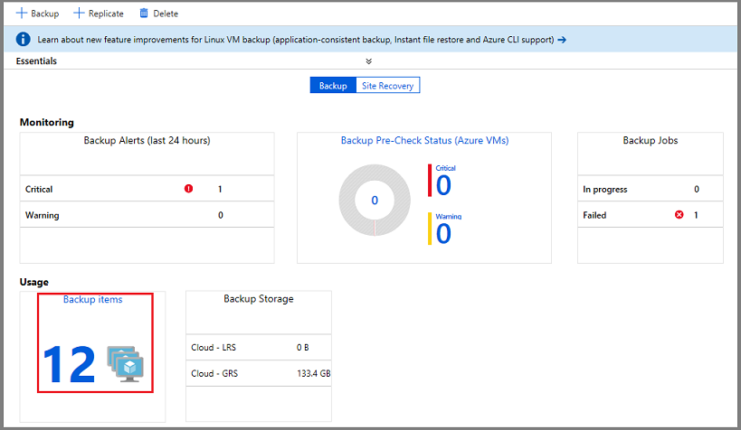
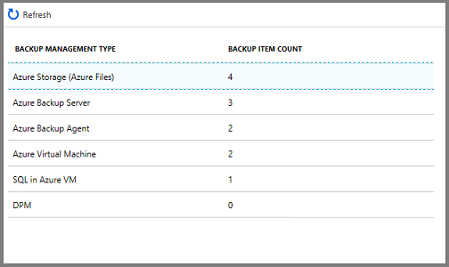
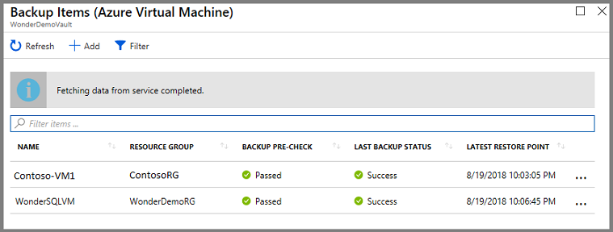
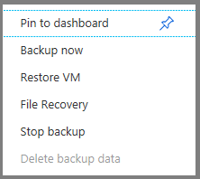

# Monitor and manage Azure recovery services vaults and servers for Windows machines

This article contains an overview of the backup monitor and management tasks available through the Azure portal. The monitor and management tasks are based on the selected Recovery Services vault. Your subscription can have more than one Recovery Services vault. This article assumes: you already have an Azure subscription, have created a Recovery Services vault, and configured the vault to store backup data.

[!INCLUDE [learn-about-deployment-models](../../includes/learn-about-deployment-models-rm-include.md)]


## Open a Recovery Services vault

To monitor alerts, or view management data about a Recovery Services vault, open a Recovery Services vault in the Azure portal. When you open the Recovery Services vault, the default dashboard shows you monitoring information and more.

1. Sign in to the [Azure Portal](https://portal.azure.com/) using your Azure subscription.

2. In the portal, click **All services**.

   

3. In the **All services** dialog box, type **Recovery Services**. As you begin typing, the list filters based on your input. When the **Recovery Services vaults** option appears, click it to open the list of Recovery Services vaults in your subscription.

     <br/>

4. From the list of vaults, click a vault to open its **Overview** dashboard. 

     <br/>

    The Recovery Services vault Overview dashboard displays multiple tiles that provide information about alerts and backup jobs.

## Monitor backup jobs and alerts in vault dashboard

The Recovery Services vault **Overview** dashboard, provides tiles for Monitoring and Usage information. The tiles each report on an aspect of what's happening with the selected Recovery Services vault.



The Monitoring section shows the results of predefined **Backup Alerts** and **Backup Jobs** queries. The Monitoring tiles provide up-to-date information about:

* Critical and Warning alerts for Backup jobs (in the last 24 hours)
* Pre-check status for Azure VMs - The pre-check status does not apply to on-premises VMs.
* The Backup jobs in progress, and jobs that have failed (in the last 24 hours).

The Usage tiles provide:

* The number of Backup items configured for the vault.
* The Azure storage (separated by LRS and GRS) consumed by the vault.

Click the tiles (except Backup Storage) to open the associated menu. In the image above, the Backup Alerts tile shows three Critical alerts. Clicking the Critical alerts row in the Backup Alerts tile, opens the Backup Alerts filtered for Critical alerts.


The Backup Alerts menu, in the image above, is filtered by: Status is Active, Severity is Critical, and time is the previous 24 hours. 

## Manage Backup alerts

To access the Backup Alerts menu, in the Recovery Services vault menu, click **Backup Alerts**.



The Backup Alerts report displays the filtered alerts for the vault.


### Alerts

The Backup Alerts report displays the selected information for the filtered alerts. In the Backup Alerts menu, you can filter for Critical or Warning alerts.

| Alert Level | Events that generate alerts |
| ----------- | ----------- |
| Critical | You receive criticial alerts when: Backup jobs fail, recovery jobs fail, and when you stop protection on a server, but retain the data.|
| Warning | You receive warning alerts when: Backup jobs complete with warnings, for example when fewer than 100 files are not backed up due to corruption issues, or when greater than 1,000,000 files are successfully backed up). |
| Informational | currently, no informational alerts are in use. |

### Viewing alert details

The Backup Alerts report can display eight details about each alert.


By default, all details except Latest Occurrence Time, appear in the report.

* Alert
* Backup Item
* Protected Server
* Severity
* Duration
* Creation Time
* Status
* Latest Occurrence Time

### Change the details in alerts report

1. To change the report information, in the **Backup Alerts** menu, click **Choose columns**.

   

   The **Choose columns** menu opens.

2. In the **Choose columns** menu, choose the details you want to appear in the report.

    

3. Click **Done** to save your changes and close the Choose columns menu.

   If you make changes, but don't want to keep the changes, click **Reset** to return the selected to the last saved configuration.

### Change the filter in alerts report

Use the **Filter** menu to change the Severity, Status, Start time and End time for the alerts. 

> ![Note]
> Editing the Backup Alerts filter doesn't change the Critical or Warning alerts in the vault Overview dashboard.
>  

1. To change the Backup Alerts filter, in the Backup Alerts menu, click **Filter**.

   

   The Filter menu appears.

   

2. Edit the Severity, Status, Start time, or End time, and click **Done** to save your changes.

## Configuring notifications for alerts

Configure notifications to generate emails when a Warning or Critical alert occurs. You can send email alerts each hour, or when a particular alert occurs.

   

By default, Email notifications are **On**. Click **Off** to stop the email notifications.

On the **Notify** control, choose **Per Alert** if don't want grouping or don't have many items that could generate alerts. Every alert results in one notification (the default setting), and a resolution email is sent immediately.

If you select **Hourly Digest**, an email is sent to the recipients explaining the unresolved alerts generated in the last hour. A resolution email is sent out at the end of the hour.

Choose the alert severity (Critical or Warning) used to generate email. Currently there are no Information alerts.

## Manage Backup items

A Recovery Services vault holds many types of backup data. For a complete list of backup types, see [Which applications and workloads can be backed up](backup-introduction-to-azure-backup.md#which-azure-backup-components-should-i-use). To manage the various servers, computers, databases, and workloads, click the **Backup Items** tile to view the contents of the vault.



The list of Backup Items, which is organized by Backup Management Type, opens.



To see the specific machines protected in each type, click the management type. For example, in the above image, there are two Azure virtual machines protected in this vault. Clicking **Azure Virtual Machine**, opens the list of protected virtual machines. 



The list of virtual machines has helpful data: the associated Resource Group, previous Backup Pre-Check, Last Backup Status, and date of the most recent Restore Point. The ellipsis, in the last column, opens the menu to trigger common tasks. The column data for each backup type is different.



## Manage Backup jobs

Backup jobs for both on-premises (when the on-premises server is backing up to Azure) and Azure backups are visible in the dashboard.

In the Backup section of the dashboard, the Backup job tile shows the number of jobs:

* in progress
* failed in the last 24 hours.

To manage your backup jobs, click the **Backup Jobs** tile, which opens the Backup Jobs menu.


You modify the information available in the Backup Jobs menu with the **Choose columns** button at the top of the page.

Use the **Filter** button to select between Files and folders and Azure virtual machine backup.

If you don't see your backup files and folders, click **Filter** button at the top of the page and select **Files and folders** from the Item Type menu.

> [!NOTE]
> From the **Settings** menu, you manage backup jobs by selecting **Monitoring and Reports > Jobs > Backup Jobs** and then selecting **File-Folders** from the drop down menu.
>
>

## Monitor Backup usage

The Backup Storage tile in the dashboard shows the storage consumed in Azure. Storage usage is provided for:

* Cloud LRS storage usage associated with the vault
* Cloud GRS storage usage associated with the vault

## Manage your production servers
To manage your production servers, click **Settings**.

Under Manage click **Backup infrastructure > Production Servers**.

The Production Servers menu lists of all your available production servers. Click on a server in the list to open the server details.


## Open the Azure Backup agent

Open the **Microsoft Azure Backup agent**. Find it on your computer by searching your machine for *Microsoft Azure Backup*.


From the **Actions** available at the right of the backup agent console you perform the following management tasks:

* Register Server
* Schedule Backup
* Back Up now
* Change Properties


> [!NOTE]
> To **Recover Data**, see [Restore files to a Windows server or Windows client machine](backup-azure-restore-windows-server.md).
>
>

[!INCLUDE [backup-upgrade-mars-agent.md](../../includes/backup-upgrade-mars-agent.md)]

## Modify the backup schedule

1. In the Microsoft Azure Backup agent, click **Schedule Backup**.

    

2. In the **Schedule Backup Wizard**, leave the **Make changes to backup items or times** option selected and click **Next**.

    

3. If you want to add or change items, on the **Select Items to Backup** screen click **Add Items**.

    You can also set **Exclusion Settings** from this page in the wizard. If you want to exclude files or file types read the procedure for adding [exclusion settings](#manage-exclusion-settings).

4. Select the files and folders you want to back up and click **Okay**.

    
5. Specify the **backup schedule** and click **Next**.

    You can schedule daily (at a maximum of 3 times per day) or weekly backups.

    

   > [!NOTE]
   > Specifying the backup schedule is explained in detail in this [article](backup-azure-backup-cloud-as-tape.md).
   >

6. Select the **Retention Policy** for the backup copy and click **Next**.

    

7. On the **Confirmation** screen review the information and click **Finish**.

8. Once the wizard finishes creating the **backup schedule**, click **Close**.

    After modifying protection, you can confirm that backups are triggering correctly by going to the **Jobs** tab and confirming that changes are reflected in the backup jobs.

## Enable Network Throttling

The Azure Backup agent provides a Throttling tab which allows you to control how network bandwidth is used during data transfer. This control can be helpful if you need to back up data during work hours but do not want the backup process to interfere with other internet traffic. Throttling of data transfer applies to back up and restore activities.  

To enable throttling:

1. In the **Backup agent**, click **Change Properties**.
2. On the **Throttling tab, select **Enable internet bandwidth usage throttling for backup operations**.

    

    Once you have enabled throttling, specify the allowed bandwidth for backup data transfer during **Work hours** and **Non-work hours**.

    The bandwidth values begin at 512 kilobytes per second (Kbps) and can go up to 1023 megabytes per second (Mbps). You can also designate the start and finish for **Work hours**, and which days of the week are considered Work days. The time outside of the designated Work hours is considered to be non-work hours.
3. Click **OK**.

## Manage exclusion settings
1. Open the **Microsoft Azure Backup agent** (you can find it by searching your machine for *Microsoft Azure Backup*).

    

2. In the Microsoft Azure Backup agent, click **Schedule Backup**.

    

3. In the Schedule Backup Wizard, leave the **Make changes to backup items or times** option selected and click **Next**.

    

4. Click **Exclusions Settings**.

    

5. Click **Add Exclusion**.

    

6. Select the location and then, click **OK**.

    

7. Add the file extension in the **File Type** field.

    

    Adding an .mp3 extension

    

    To add another extension, click **Add Exclusion** and enter another file type extension (adding a .jpeg extension).

    

8. When you've added all the extensions, click **OK**.

9. Continue through the Schedule Backup Wizard by clicking **Next** until the **Confirmation page**, then click **Finish**.

    

## Frequently asked questions

**Q1. How long does it take for the Azure backup agent job status to reflect in the portal?**

A1. The Azure portal can take up to 15 mins to reflect the Azure backup agent job status.

**Q2. When a backup job fails, how long does it take to raise an alert?**

A2. An alert is raised within 20 mins of the Azure backup failure.

**Q3. Is there a case where an email won’t be sent if notifications are configured?**

A3. Yes. In the following situations, notifications are not sent.

* If notifications are configured hourly, and an alert is raised and resolved within the hour
* When a job is canceled
* When a second backup job fails because the original backup job is in progress

## Troubleshooting Monitoring Issues

**Issue:** Jobs and/or alerts from the Azure Backup agent do not appear in the portal.

**Troubleshooting steps:** The process, ```OBRecoveryServicesManagementAgent```, sends the job and alert data to the Azure Backup service. Occasionally this process can become stuck or shutdown.

1. To verify the process is not running, open **Task Manager** and check if the ```OBRecoveryServicesManagementAgent``` process is running.

2. If the process is not running, open **Control Panel** and browse the list of services. Start or restart **Microsoft Azure Recovery Services Management Agent**.

    For further information, browse the logs at:<br/>
   `<AzureBackup_agent_install_folder>\Microsoft Azure Recovery Services Agent\Temp\GatewayProvider*`
    For example:<br/>
   `C:\Program Files\Microsoft Azure Recovery Services Agent\Temp\GatewayProvider0.errlog`

## Next steps
* [Restore Windows Server or Windows Client from Azure](backup-azure-restore-windows-server.md)
* To learn more about Azure Backup, see [Azure Backup Overview](backup-introduction-to-azure-backup.md)
* Visit the [Azure Backup Forum](http://go.microsoft.com/fwlink/p/?LinkId=290933)
