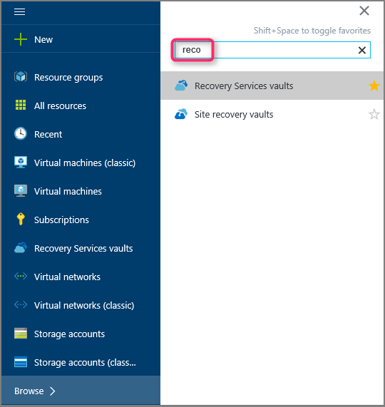
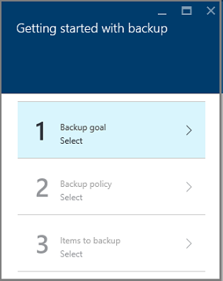
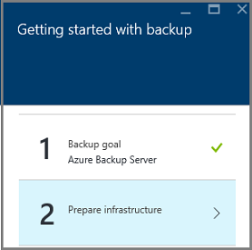
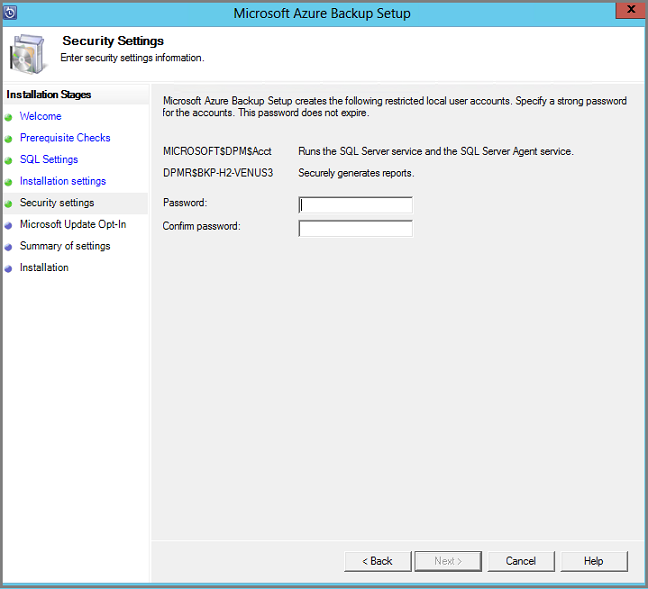
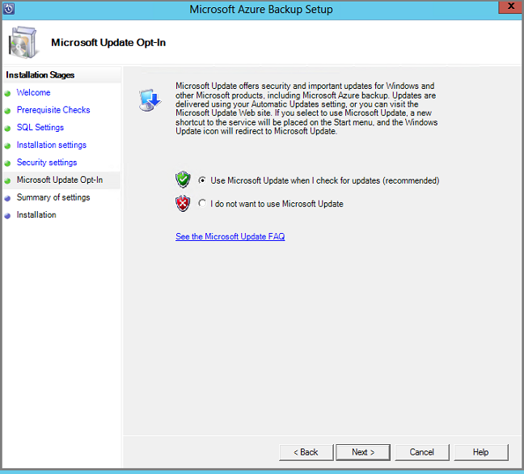
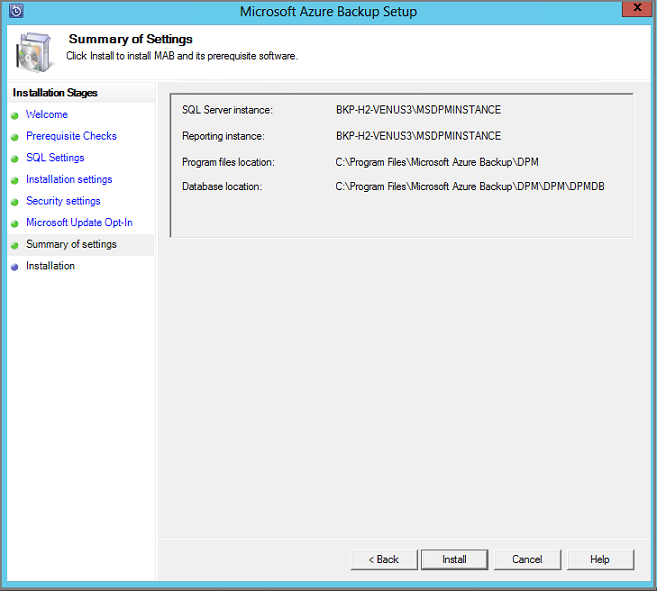
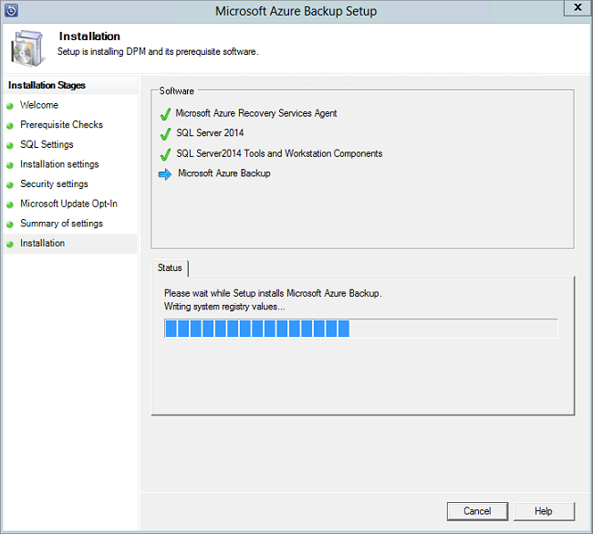

# Install and upgrade Azure Backup Server

> [!div class="op_single_selector"]
>
> * [Azure Backup Server](backup-azure-microsoft-azure-backup.md)
> * [SCDPM](backup-azure-dpm-introduction.md)
>
>

> Applies To: MABS v3. (MABS v2 is no longer supported. If you are using a version earlier than MABS v3, please upgrade to the latest version.)

This article explains how to prepare your environment to back up workloads using Microsoft Azure Backup Server (MABS). With Azure Backup Server, you can protect application workloads such as Hyper-V VMs, Microsoft SQL Server, SharePoint Server, Microsoft Exchange, and Windows clients from a single console.

> [!NOTE]
> Azure Backup Server can now protect VMware VMs and provides improved security capabilities. Install the product as explained in the sections below and the latest Azure Backup Agent. To learn more about backing up VMware servers with Azure Backup Server, see the article, [Use Azure Backup Server to back up a VMware server](backup-azure-backup-server-vmware.md). To learn about security capabilities, refer to [Azure backup security features documentation](backup-azure-security-feature.md).
>
>

MABS deployed in an Azure VM can back up VMs in Azure but they should be in same domain to enable backup operation. The process to back an Azure VM remains same as backing up VMs on premises, however deploying MABS in Azure has some limitations. For more information on limitation, see [DPM as an Azure virtual machine](https://docs.microsoft.com/system-center/dpm/install-dpm?view=sc-dpm-1807#setup-prerequisites)

> [!NOTE]
> Azure has two deployment models for creating and working with resources: [Resource Manager and classic](../azure-resource-manager/management/deployment-models.md). This article provides the information and procedures for restoring VMs deployed using the Resource Manager model.
>
>

Azure Backup Server inherits much of the workload backup functionality from Data Protection Manager (DPM). This article links to DPM documentation to explain some of the shared functionality. Though Azure Backup Server shares much of the same functionality as DPM, Azure Backup Server does not back up to tape, nor does it integrate with System Center.

## Choose an installation platform

The first step towards getting the Azure Backup Server up and running is to set up a Windows Server. Your server can be in Azure or on-premises.

### Using a server in Azure

When choosing a server for running Azure Backup Server, it is recommended you start with a gallery image of Windows Server 2016 Datacenter or Windows Server 2019 Datacenter. The article, [Create your first Windows virtual machine in the Azure portal](../virtual-machines/virtual-machines-windows-hero-tutorial.md?toc=%2fazure%2fvirtual-machines%2fwindows%2ftoc.json), provides a tutorial for getting started with the recommended virtual machine in Azure, even if you've never used Azure before. The recommended minimum requirements for the server virtual machine (VM) should be: Standard_A4_v2  with four cores and 8-GB RAM.

Protecting workloads with Azure Backup Server has many nuances. The article, [Install DPM as an Azure virtual machine](https://technet.microsoft.com/library/jj852163.aspx), helps explain these nuances. Before deploying the machine, read this article completely.

### Using an on-premises server

If you do not want to run the base server in Azure, you can run the server on a Hyper-V VM, a VMware VM, or a physical host. The recommended minimum requirements for the server hardware are two cores and 8-GB RAM. The supported operating systems are listed in the following table:

| Operating System | Platform | SKU |
|:--- | --- |:--- |
| Windows Server 2019 |64 bit |Standard, Datacenter, Essentials |
| Windows Server 2016 and latest SPs |64 bit |Standard, Datacenter, Essentials  |

You can deduplicate the DPM storage using Windows Server Deduplication. Learn more about how [DPM and deduplication](https://technet.microsoft.com/library/dn891438.aspx) work together when deployed in Hyper-V VMs.

> [!NOTE]
> Azure Backup Server is designed to run on a dedicated, single-purpose server. You cannot install Azure Backup Server on:
>
> * A computer running as a domain controller
> * A computer on which the Application Server role is installed
> * A computer that is a System Center Operations Manager management server
> * A computer on which Exchange Server is running
> * A computer that is a node of a cluster
>
> Installing Azure Backup Server is not supported on Windows Server Core or Microsoft Hyper-V Server.

Always join Azure Backup Server to a domain. If you plan to move the server to a different domain, install Azure Backup Server first, then join the server to the new domain. Moving an existing Azure Backup Server machine to a new domain after deployment is *not supported*.

Whether you send backup data to Azure, or keep it locally, Azure Backup Server must be registered with a Recovery Services vault.

[!INCLUDE [backup-create-rs-vault.md](../../includes/backup-create-rs-vault.md)]

### Set Storage Replication

The storage replication option allows you to choose between geo-redundant storage and locally redundant storage. By default, Recovery Services vaults use geo-redundant storage. If this vault is your primary vault, leave the storage option set to geo-redundant storage. Choose locally redundant storage if you want a cheaper option that isn't quite as durable. Read more about [geo-redundant](../storage/common/storage-redundancy-grs.md) and [locally redundant](../storage/common/storage-redundancy-lrs.md) storage options in the [Azure Storage replication overview](../storage/common/storage-redundancy.md).

To edit the storage replication setting:

1. From the **Recovery Services vaults** blade, click the new vault. Under the **Settings** section, click  **Properties**.
2. In **Properties**, under **Backup Configuration**, click **Update**.

3. Select the storage replication type, and click **Save**.

     

## Software package

### Downloading the software package

1. Sign in to the [Azure portal](https://portal.azure.com/).
2. If you already have a Recovery Services vault open, proceed to step 3. If you do not have a Recovery Services vault open, but are in the Azure portal, on the main menu, click **Browse**.

   * In the list of resources, type **Recovery Services**.
   * As you begin typing, the list will filter based on your input. When you see **Recovery Services vaults**, click it.

     

     The list of Recovery Services vaults appears.
   * From the list of Recovery Services vaults, select a vault.

     The selected vault dashboard opens.

     
3. The **Settings** blade opens up by default. If it is closed, click on **Settings** to open the settings blade.

    
4. Click **Backup** to open the Getting Started wizard.

    

    In the **Getting Started with backup** blade that opens, **Backup Goals** will be auto-selected.

    

5. In the **Backup Goal** blade, from the **Where is your workload running** menu, select **On-premises**.

    

    From the **What do you want to back up?** drop-down menu, select the workloads you want to protect using Azure Backup Server, and then click **OK**.

    The **Getting Started with backup** wizard switches the **Prepare infrastructure** option to back up workloads to Azure.

   > [!NOTE]
   > If you only want to back up files and folders, we recommend using the Azure Backup agent and following the guidance in the article, [First look: back up files and folders](backup-try-azure-backup-in-10-mins.md). If you are going to protect more than files and folders, or you are planning to expand the protection needs in the future, select those workloads.
   >
   >

    

6. In the **Prepare infrastructure** blade that opens, click the **Download** links for Install Azure Backup Server and Download vault credentials. You use the vault credentials during registration of Azure Backup Server to the recovery services vault. The links take you to the Download Center where the software package can be downloaded.

    

7. Select all the files and click **Next**. Download all the files coming in from the Microsoft Azure Backup download page, and place all the files in the same folder.

    

    Since the download size of all the files together is > 3G, on a 10-Mbps download link it may take up to 60 minutes for the download to complete.

### Extracting the software package

After you've downloaded all the files, click **MicrosoftAzureBackupInstaller.exe**. This will start the **Microsoft Azure Backup Setup Wizard** to extract the setup files to a location specified by you. Continue through the wizard and click on the **Extract** button to begin the extraction process.

> [!WARNING]
> At least 4 GB of free space is required to extract the setup files.
>
>


Once the extraction process complete, check the box to launch the freshly extracted *setup.exe* to begin installing Microsoft Azure Backup Server and click on the **Finish** button.

### Installing the software package

1. Click **Microsoft Azure Backup** to launch the setup wizard.

    
2. On the Welcome screen, click the **Next** button. This takes you to the *Prerequisite Checks* section. On this screen, click **Check** to determine if the hardware and software prerequisites for Azure Backup Server have been met. If all prerequisites are met successfully, you will see a message indicating that the machine meets the requirements. Click on the **Next** button.

    
3. The Azure Backup Server installation package comes bundled with the appropriate SQL Server binaries needed. When starting  a new Azure Backup Server installation, pick the option **Install new Instance of SQL Server with this Setup** and click the **Check and Install** button. Once the prerequisites are successfully installed, click **Next**.

    >[!NOTE]
    >If you wish to use your own SQL server, the supported SQL Server versions are SQL Server 2014 SP1 or higher, 2016 and 2017.  All SQL Server versions should be Standard or Enterprise 64-bit.
    >Azure Backup Server will not work with a remote SQL Server instance. The instance being used by Azure Backup Server needs to be local. If you are using an existing SQL server for MABS, the MABS setup only supports the use of *named instances* of SQL server.

    

    If a failure occurs with a recommendation to restart the machine, do so and click **Check Again**. If there are any SQL configuration issues, reconfigure SQL as per the SQL guidelines and retry to install/upgrade MABS using the existing instance of SQL.

   **Manual configuration**

   When you use your own instance of SQL, make sure you add builtin\Administrators to sysadmin role to master DB.

    **SSRS Configuration with SQL 2017**

    When you are using your own instance of SQL 2017, you need to manually configure SSRS. After SSRS configuration, ensure that *IsInitialized* property of SSRS is set to *True*. When this is set to True, MABS assumes that SSRS is already configured and will skip the SSRS configuration.

    Use the following values for SSRS configuration:
    * Service Account: ‘Use built-in account’ should be Network Service
    * Web Service URL: ‘Virtual Directory’ should be ReportServer_\<SQLInstanceName>
    * Database: DatabaseName should be ReportServer$\<SQLInstanceName>
    * Web Portal URL: ‘Virtual Directory’ should be Reports_\<SQLInstanceName>

    [Learn more](https://docs.microsoft.com/sql/reporting-services/report-server/configure-and-administer-a-report-server-ssrs-native-mode?view=sql-server-2017) about SSRS configuration.

    > [!NOTE]
    > Licensing for SQL Server used as the database for MABS is governed by [Microsoft Online Services Terms](https://www.microsoft.com/licensing/product-licensing/products) (OST). According to OST, SQL Server bundled with MABS can be used only as the database for MABS.

4. Provide a location for the installation of Microsoft Azure Backup server files and click **Next**.

    

    The scratch location is a requirement for back up to Azure. Ensure the scratch location is at least 5% of the data planned to be backed up to the cloud. For disk protection, separate disks need to be configured once the installation completes. For more information regarding storage pools, see [Configure storage pools and disk storage](https://technet.microsoft.com/library/hh758075.aspx).
5. Provide a strong password for restricted local user accounts and click **Next**.

    
6. Select whether you want to use *Microsoft Update* to check for updates and click **Next**.

   > [!NOTE]
   > We recommend having Windows Update redirect to Microsoft Update, which offers security and important updates for Windows and other products like Microsoft Azure Backup Server.
   >
   >

    
7. Review the *Summary of Settings* and click **Install**.

    
8. The installation happens in phases. In the first phase, the Microsoft Azure Recovery Services Agent is installed on the server. The wizard also checks for Internet connectivity. If Internet connectivity is available you can proceed with installation, if not, you need to provide proxy details to connect to the Internet.

    The next step is to configure the Microsoft Azure Recovery Services Agent. As a part of the configuration, you will have to provide your vault credentials to register the machine to the recovery services vault. You will also provide a passphrase to encrypt/decrypt the data sent between Azure and your premises. You can automatically generate a passphrase or provide your own minimum 16-character passphrase. Continue with the wizard until the agent has been configured.

    
9. Once registration of the Microsoft Azure Backup server successfully completes, the overall setup wizard proceeds to the installation and configuration of SQL Server and the Azure Backup Server components. Once the SQL Server component installation completes, the Azure Backup Server components are installed.

    

When the installation step has completed, the product's desktop icons will have been created as well. Just double-click the icon to launch the product.

### Add backup storage

The first backup copy is kept on storage attached to the Azure Backup Server machine. For more information about adding disks, see [Configure storage pools and disk storage](https://docs.microsoft.com/azure/backup/backup-mabs-add-storage).

> [!NOTE]
> You need to add backup storage even if you plan to send data to Azure. In the current architecture of Azure Backup Server, the Azure Backup vault holds the *second* copy of the data while the local storage holds the first (and mandatory) backup copy.
>
>

### Install and update the Data Protection Manager protection agent

MABS uses the System Center Data Protection Manager protection agent. [Here are the steps](https://docs.microsoft.com/system-center/dpm/deploy-dpm-protection-agent?view=sc-dpm-1807) to install the Protection Agent on your Protection Servers.

The following sections describe how to update protection agents for client computers.

1. In the Backup Server Administrator Console, select **Management** > **Agents**.

2. In the display pane, select the client computers for which you want to update the protection agent.

   > [!NOTE]
   > The **Agent Updates** column indicates when a protection agent update is available for each protected computer. In the **Actions** pane, the **Update** action is available only when a protected computer is selected and updates are available.
   >
   >

3. To install updated protection agents on the selected computers, in the **Actions** pane, select **Update**.

4. For a client computer that is not connected to the network, until the computer is connected to the network, the **Agent Status** column shows a status of **Update Pending**.

   After a client computer is connected to the network, the **Agent Updates** column for the client computer shows a status of **Updating**.

## Move MABS to a new server

Here are the steps if you need to move MABS to a new server, while retaining the storage. This can be done only if all the data is on Modern Backup Storage.

  > [!IMPORTANT]
  >
  > * The new server name must be the same name as the original Azure Backup Server instance. You can't change the name of the new Azure Backup Server instance if you want to use the previous storage pool and MABS Database (DPMDB) to retain recovery points.
  > * You must have a backup of the MABS Database (DPMDB). You'll need to restore the database.

1. In the display pane, select the client computers for which you want to update the protection agent.
2. Shut down the original Azure backup server or take it off the wire.
3. Reset the machine account in active directory.
4. Install Server 2016 on new machine and name it the same machine name as the original Azure Backup server.
5. Join the Domain
6. Install Azure Backup server V3 or later (move MABS Storage pool disks from old server and import)
7. Restore the DPMDB taken in step 1.
8. Attach the storage from the original backup server to the new server.
9. From SQL Restore the DPMDB
10. From admin command line on new server cd to Microsoft Azure Backup install location and bin folder

    Path example:
    C:\windows\system32>cd "c:\Program Files\Microsoft Azure Backup\DPM\DPM\bin\"

11. To Azure backup, Run DPMSYNC -SYNC

    If you have added NEW disks to the DPM Storage pool instead of moving the old ones, then run DPMSYNC -Reallocatereplica

## Network connectivity

Azure Backup Server requires connectivity to the Azure Backup service for the product to work successfully. To validate whether the machine has the connectivity to Azure, use the ```Get-DPMCloudConnection``` cmdlet in the Azure Backup Server PowerShell console. If the output of the cmdlet is TRUE, then connectivity exists, else there is no connectivity.

At the same time, the Azure subscription needs to be in a healthy state. To find out the state of your subscription and to manage it, sign in to the [subscription portal](https://account.windowsazure.com/Subscriptions).

Once you know the state of the Azure connectivity and of the Azure subscription, you can use the table below to find out the impact on the backup/restore functionality offered.

| Connectivity State | Azure Subscription | Back up to Azure | Back up to disk | Restore from Azure | Restore from disk |
| --- | --- | --- | --- | --- | --- |
| Connected |Active |Allowed |Allowed |Allowed |Allowed |
| Connected |Expired |Stopped |Stopped |Allowed |Allowed |
| Connected |Deprovisioned |Stopped |Stopped |Stopped and Azure recovery points deleted |Stopped |
| Lost connectivity > 15 days |Active |Stopped |Stopped |Allowed |Allowed |
| Lost connectivity > 15 days |Expired |Stopped |Stopped |Allowed |Allowed |
| Lost connectivity > 15 days |Deprovisioned |Stopped |Stopped |Stopped and Azure recovery points deleted |Stopped |

### Recovering from loss of connectivity

If you have a firewall or a proxy that is preventing access to Azure, you need to allow the following domain addresses in the firewall/proxy profile:

* `http://www.msftncsi.com/ncsi.txt`
* \*.Microsoft.com
* \*.WindowsAzure.com
* \*.microsoftonline.com
* \*.windows.net

If you are using ExpressRoute Microsoft peering, please select the following services/regions:

* Azure Active Directory (12076:5060)
* Microsoft Azure Region (as per the location of your Recovery Services vault)
* Azure Storage (as per the location of your Recovery Services vault)

For more details, visit [ExpressRoute routing requirements](https://docs.microsoft.com/azure/expressroute/expressroute-routing).

Once connectivity to Azure has been restored to the Azure Backup Server machine, the operations that can be performed are determined by the Azure subscription state. The table above has details about the operations allowed once the machine is "Connected".

### Handling subscription states

It is possible to take an Azure subscription from an *Expired* or *Deprovisioned* state to the *Active* state. However, this has some implications on the product behavior while the state is not *Active*:

* A *Deprovisioned* subscription loses functionality for the period that it is deprovisioned. On turning *Active*, the product functionality of backup/restore is revived. The backup data on the local disk also can be retrieved if it was kept with a sufficiently large retention period. However, the backup data in Azure is irretrievably lost once the subscription enters the *Deprovisioned* state.
* An *Expired* subscription only loses functionality for until it has been made *Active* again. Any backups scheduled for the period that the subscription was *Expired* will not run.

## Upgrade MABS

Use the following procedures to upgrade MABS.

### Upgrade from MABS V2 to V3

> [!NOTE]
>
> MABS V2 is not a prerequisite for installing MABS V3. However, you can upgrade to MABS V3 only from MABS V2.

Use the following steps to upgrade MABS:

1. To upgrade from MABS V2 to MABS V3, upgrade your OS to Windows Server 2016 or Windows Server 2019 if needed.

2. Upgrade your server. The steps are similar to [installation](#install-and-upgrade-azure-backup-server). However, for SQL settings, you will get an option to upgrade your SQL instance to SQL 2017, or to use your own instance of SQL server 2017.

   > [!NOTE]
   >
   > Do not exit while your SQL instance is being upgraded, exiting will uninstall the SQL reporting instance and hence an attempt to re-upgrade MABS will fail.

   > [!IMPORTANT]
   >
   >  As part of SQL 2017 upgrade, we backup the SQL encryption keys and uninstall the reporting services. After SQL server upgrade,  reporting service(14.0.6827.4788) is installed & encryption keys are restored.
   >
   > When configuring SQL 2017 manually, refer to *SSRS configuration with SQL 2017* section under Install instructions.

3. Update the protection agents on the protected servers.
4. Backups should continue without the need to restart your production servers.
5. You can begin protecting your data now. If you are upgrading to Modern Backup Storage, while protecting, you can also choose the volumes you wish to store the backups in, and check for under provisioned space. [Learn more](backup-mabs-add-storage.md).

## Troubleshooting

If Microsoft Azure Backup server fails with errors during the setup phase (or backup or restore), refer to this [error codes document](https://support.microsoft.com/kb/3041338)  for more information.
You can also refer to [Azure Backup related FAQs](backup-azure-backup-faq.md)

## Next steps

You can get detailed information about [preparing your environment for DPM](https://technet.microsoft.com/library/hh758176.aspx) on the Microsoft TechNet site. It also contains information about supported configurations on which Azure Backup Server can be deployed and used. You can use a series of [PowerShell cmdlet](https://docs.microsoft.com/powershell/module/dataprotectionmanager/?view=systemcenter-ps-2016)  for performing various operations.

You can use these articles to gain a deeper understanding of workload protection using Microsoft Azure Backup server.

* [SQL Server backup](backup-azure-backup-sql.md)
* [SharePoint server backup](backup-azure-backup-sharepoint.md)
* [Alternate server backup](backup-azure-alternate-dpm-server.md)
