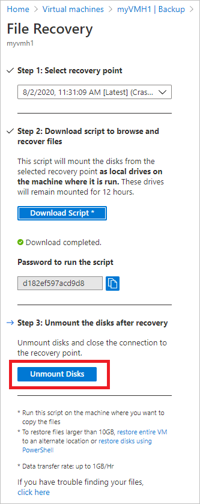
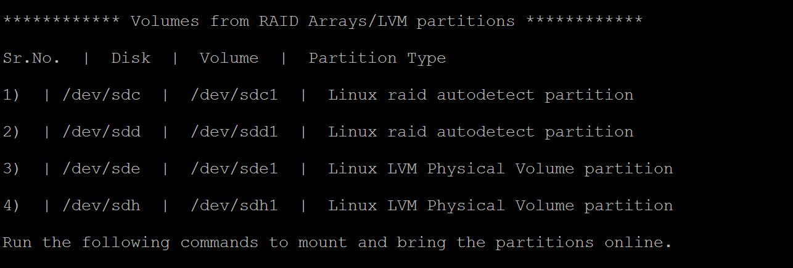

# Recover files from Azure virtual machine backup

Azure backup provides the capability to restore [Azure VMs and disks](./backup-azure-arm-restore-vms.md) from Azure VM backups. Now this article explains how you can recover items such as files and folders from an Azure VM backup.

> [!Note]
> This feature is available for Azure VMs deployed using the Resource Manager model and protected to a Recovery Services vault.
> File recovery from an encrypted VM backup is not supported.
>

## Mount the volume and copy files

1. Sign into the [Azure portal](http://portal.Azure.com). Find the relevant Recovery Services vault and the required backup item.

2. On the Backup Item blade, click **File Recovery**

    

    The **File Recovery** blade opens.

    

3. From the **Select recovery point** drop-down menu, select the recovery point that contains the files you want. By default, the latest recovery point is already selected.

4. Click **Download Executable** (for Windows Azure VM) or **Download Script** (for Linux Azure VM) to download the software that you'll use to copy files from the recovery point.

  The executable/script creates a connection between the local computer and the specified recovery point.

5. You need a password to run the downloaded script/executable. You can copy the password from the portal using the copy button beside the generated password

    

6. On the computer where you want to recover the files, run the executable/script. You must run it with Administrator credentials. If you run the script on a computer with restricted access, ensure there is access to:

    - download.microsoft.com
    - Azure endpoints used for Azure VM backups
    - outbound port 3260

   For Linux, the script requires 'open-iscsi' and 'lshw' components to connect to the recovery point. If those do not exist on the machine where it is run, it asks for permission to install the relevant components and installs them upon consent.
   
   Enter the password copied from the portal when prompted. Once the valid password is entered the scripts connects to the recovery point.
      
    
    
   
   You can run the script on any machine that has the same (or compatible) operating system as the backed-up VM. See the [Compatible OS table](backup-azure-restore-files-from-vm.md#compatible-os) for compatible operating systems. If the protected Azure virtual machine uses Windows Storage Spaces (for Windows Azure VMs) or LVM/RAID Arrays(for Linux VMs), then you can't run the executable/script on the same virtual machine. Instead, run it on any other machine with a compatible operating system.

### Compatible OS

#### For Windows

The following table shows the compatibility between server and computer operating systems. When recovering files, you can't restore files between incompatible operating systems.

|Server OS | Compatible client OS  |
| --------------- | ---- |
| Windows Server 2012 R2 | Windows 8.1 |
| Windows Server 2012    | Windows 8  |
| Windows Server 2008 R2 | Windows 7   |

#### For Linux

In Linux, the fundamental requirement is that the OS of the machine where the script is run should support the filesystem of the files present in the backed-up Linux VM. While selecting a machine to run the script, please ensure it has the compatible OS and the versions as mentioned in the table below.

|Linux OS | Versions  |
| --------------- | ---- |
| Ubuntu | 12.04 and above |
| CentOS | 6.5 and above  |
| RHEL | 6.7 and above |
| Debian | 7 and above |
| Oracle Linux | 6.4 and above |

The script also requires python and bash components to execute and connect securely to the recovery point.

|Component | Version  |
| --------------- | ---- |
| bash | 4 and above |
| python | 2.6.6 and above  |


### Identifying Volumes

#### For Windows

When you run the exectuable, the operating system mounts the new volumes and assigns drive letters. You can use Windows Explorer or File Explorer to browse those drives. The drive letters assigned to the volumes may not be the same letters as the original virtual machine, however, the volume name is preserved. For example, if the volume on the original virtual machine was “Data Disk (E:\)”, that volume can be attached as “Data Disk ('Any drive letter available':\)” on the local computer. Browse through all volumes mentioned in the script output until you find your files/folder.  
       
   
           
#### For Linux

In Linux, the volumes of the recovery point are mounted to the folder where the script is run. The attached disks, volumes and the corresponding mount paths are shown accordingly. These mount paths are visible to users having root level access. Browse through the volumes mentioned in the script output.

  
  

## Closing the connection

After identifying the files and copying them to a local storage location, remove (or unmount) the additional drives. To unmount the drives, on the **File Recovery** blade in the Azure portal, click **Unmount Disks**.



Once the disks have been unmounted, you receive a message letting you know it was successful. It may take a few minutes for the connection to refresh so that you can remove the disks.

In Linux, after the connection to the recovery point is severed, the OS doesn't remove the corresponding mount paths automatically. These exist as "orphan" volumes and they are visible but throw an error when you access/write the files. They can be manually removed. The script, when run, identifies any such volumes existing from any previous recovery points and cleans them up upon consent.

## Special configurations

### Dynamic Disks

If the Azure VM that was backed up has volumes that span multiple disks (spanned and striped volumes) and/or fault-tolerant volumes (mirrored and RAID-5 volumes) on dynamic disks, then you can't run the executable script on the same VM. Instead, run the executable script on any other machine with a compatible operating system.

### Windows Storage Spaces

Windows Storage Spaces is a technology in Windows storage that enables you to virtualize storage. With Windows Storage Spaces you can group industry-standard disks into storage pools, and then create virtual disks, called storage spaces, from the available space in those storage pools.

If the Azure VM that was backed up uses Windows Storage Spaces, then you can't run the executable script on the same VM. Instead, run the executable script on any other machine with a compatible operating system.

### LVM/RAID Arrays

In Linux, Logical volume manager (LVM) and/or software RAID Arrays are used to manage logical volumes over multiple disks. If the backed up Linux VM uses LVM and/or RAID Arrays, you can't run the script on the same VM. Instead run the script on any other machine with compatible OS and which supports filesystem of the backed up VM.

The script output displays the LVM and/or RAID Arrays disks and the volumes with the partition type as shown below

   
   
The following commands need to be run by the user to bring these partitions online. 

**For LVM Partitions**

```
$ pvs <volume name as shown above in the script output> 
```
This lists the volume group names under a physical volume.

```
$ lvdisplay <volume-group-name from the pvs command’s results> 
```
This lists all logical volumes, names and their paths in a volume group.

```
$ mount <LV path> </mountpath>
```
To mount the logical volumes to the path of your choice.


**For RAID Arrays**

```
$ mdadm –detail –scan
```
This displays details about all raid disks. The relevant RAID disk will be displayed as `/dev/mdm/<RAID array name in the backed up VM>`

Use the mount command if the RAID disk has physical volumes.
```
$ mount [RAID Disk Path] [/mounthpath]
```

If this RAID disk has another LVM configured in it then follow the same procedure as outlined above for LVM partitions with the volume name being the RAID Disk name

## Troubleshooting

If you have problems while recovering files from the virtual machines, check the following table for additional information.

| Error Message / Scenario | Probable Cause | Recommended action |
| ------------------------ | -------------- | ------------------ |
| Exe output: *Exception connecting to the target* |Script is not able to access the recovery point	| Check whether the machine fulfills the access requirements mentioned above|  
|	Exe output: *The target has already been logged in via an ISCSI session.* |	The script was already executed on the same machine and the drives have been attached |	The volumes of the recovery point have already been attached. They may NOT be mounted with the same drive letters of the original VM. Browse through all the available volumes in the file explorer for your file |
| Exe output: *This script is invalid because the disks have been dismounted via portal/exceeded the 12-hr limit. Please download a new script from the portal.* |	The disks have been dismounted from the portal or the 12-hr limit exceeded |	This particular exe is now invalid and can’t be run. If you want to access the files of that recovery point-in-time, visit the portal for a new exe|
| On the machine where the exe is run: The new volumes are not dismounted after the dismount button is clicked |	The ISCSI initiator on the machine is not responding/refreshing its connection to the target and maintaining the cache |	Wait for some mins after the dismount button is pressed. If the new volumes are still not dismounted, please browse through all the volumes. This forces the initiator to refresh the connection and the volume is dismounted with an error message that the disk is not available|
| Exe output: Script is run successfully but “New volumes attached” is not displayed on the script output |	This is a transient error	| The volumes would have been already attached. Open Explorer to browse. If you are using the same machine for running scripts every time, consider restarting the machine and the list should be displayed in the subsequent exe runs. |
| Linux specific: Not able to view the desired volumes | The OS of the machine where the script is run may not recognize the underlying filesystem of the backed up VM | Check whether the recovery point is crash consistent or file-consistent. If file consistent, run the script on another machine whose OS recognizes the backed up VM's filesystem |
| Windows specific: Not able to view the desired volumes | The disks may have been attached but the volumes were not configured | From the disk management screen, identify the additional disks related to the recovery point. If any of these disks are in offline state try making them online by right-clicking on the disk and click 'Online'|
