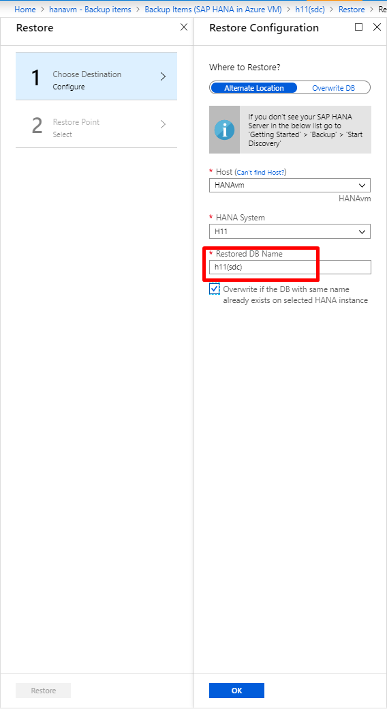

# Troubleshoot backup of SAP HANA databases on Azure

This article provides troubleshooting information for backing up SAP HANA databases on Azure virtual machines. For more information about the backup process and limitations, see About SAP HANA backup in Azure VMs.

## Prerequisites and Permissions

Refer to the prerequisites and setting up permissions before configuring backups.

## Common user errors

| Error                                | Error message                    | Possible causes                                              | Recommended action                                           |
| ------------------------------------ | -------------------------------- | ------------------------------------------------------------ | ------------------------------------------------------------ |
| UserErrorInOpeningHanaOdbcConnection | Failed to connect to HANA system | The SAP HANA instance may be down.   The required permissions for Azure backup to interact with the HANA  database aren't set. | Check if the SAP HANA database is  up. If the database is up and running, check if all the required permissions are set. If any of the permissions are  missing run the pre-registration script to add the missing permissions. |
| UserErrorHanaInstanceNameInvalid | The specified SAP HANA instance is either invalid or can't be found | Multiple SAP HANA instances on a single  Azure VM can't be backed up. | Run the pre-registration script on the SAP HANA instance you  want to back up. If the issue still persists, contact Microsoft support. |
| UserErrorHanaUnsupportedOperation | The specified SAP HANA operation isn't supported | Azure backup for SAP HANA doesn't support incremental backup and actions performed on SAP HANA native clients  (Studio/ Cockpit/ DBA Cockpit) | For more information, refer [here](https://docs.microsoft.com/azure/backup/backup-azure-sap-hana-database#scenario-support). |
| UserErrorHANAPODoesNotSupportBackupType | This SAP HANA database doesn't support the requested backup  type | Azure backup doesn't support  incremental backup and backup using snapshots | For more information, refer [here](https://docs.microsoft.com/azure/backup/backup-azure-sap-hana-database#scenario-support). |
| UserErrorHANALSNValidationFailure | Backup log chain is broken | The log backup destination may have  been updated from backint to file system or the backint executable may have  been changed | Trigger a full backup to resolve the  issue |
| UserErrorIncomaptibleSrcTargetSystsemsForRestore | The source and target systems for restore are incompatible | The target system for restore is  incompatible with the source | Refer to the SAP Note [1642148](https://launchpad.support.sap.com/#/notes/1642148) to learn  about the restore types supported today |
| UserErrorSDCtoMDCUpgradeDetected | SDC to MDC upgrade detected | The SAP HANA instance has been upgraded  from SDC to MDC. Backups will fail after the update. | Follow the steps listed in the Upgrading from SAP HANA 1.0 to 2.0 section to resolve the issue |
| UserErrorInvalidBackintConfiguration | Detected invalid backint configuration | The backing parameters are incorrectly  specified for Azure backup | Check whether the parameters are set. If backint-based parameters are present in HOST, remove  them. If parameters aren't present at HOST level but have been manually  modified at a database level, revert them to the appropriate values as  described earlier. Or, run **Stop protection  and retain backup data** from the Azure portal, and then select **Resume backup**. |

## Restore checks

### Single Container Database (SDC) restore

Take care of inputs while restoring a single container database (SDC) for HANA to another SDC machine. The database name should be given with lowercase and with "sdc" appended in brackets. The HANA instance will be displayed in capitals.

Assume an SDC HANA instance "H21" is backed up. The backup items page will show the backup item name as **"h21(sdc)"**. If you attempt to restore this database to another target SDC, say H11, then following inputs need to be provided.

Note the following points:

- By default, the restored db name will be populated with the backup item name i.e., h21(sdc)
- Selecting the target as H11 will NOT change the restored db name automatically. **It should be edited to h11(sdc)**. Regarding SDC, the restored db name will be the target instance ID with lowercase letters and 'sdc' appended in brackets.
- Since SDC can have only single database, you also need to click the checkbox to allow override of the existing database data with the recovery point data.
- Linux is case-sensitive. Therefore, be careful to preserve the case.

### Multiple Container Database (MDC) restore

In multiple container databases for HANA, the standard configuration is SYSTEMDB + 1 or more Tenant DBs. Restoring an entire SAP HANA instance means to restore both SYSTEMDB and Tenant DBs. One restores SYSTEMDB first and then proceeds for Tenant DB. System DB essentially means to override the system information on the selected target. This restore also overrides the BackInt related information in the target instance. Therefore, after the system DB is restored to a target instance, one needs to run the pre-registration script again. Only then the subsequent tenant DB restores will succeed.

## Upgrading from SAP HANA 1.0 to 2.0

If you're protecting SAP HANA 1.0 databases and wish to upgrade to 2.0, then perform the steps outlined below:

- Stop protect with retain data for old SDC database.
- Rerun pre-registration script with correct details of (sid and mdc).
- Re-register extension (Backup -> view details -> Select the relevant Azure VM -> Re-register).
- Click **Rediscover DBs** for the same VM. This action should show the new DBs in step 2 with correct details (SYSTEMDB and Tenant DB, not SDC).
- Protect these new databases.

## Upgrading without an SID change

Upgrades to OS or SAP HANA that don't cause a SID change can be handled as outlined below:

- Stop protection with retain data for the database
- Rerun the pre-registration script
- Resume protection for the database again

## Next steps

- [Review the frequently asked questions about backing up SAP HANA databases on Azure VMs](https://docs.microsoft.com/azure/backup/sap-hana-faq-backup-azure-vm)
