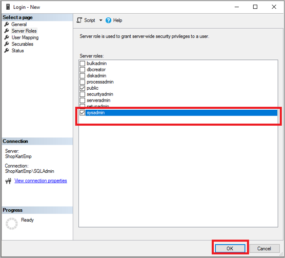
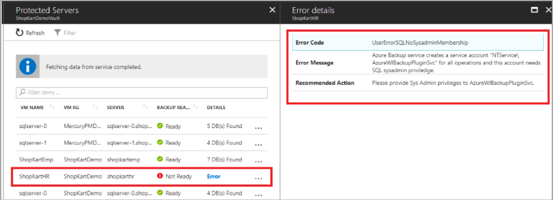
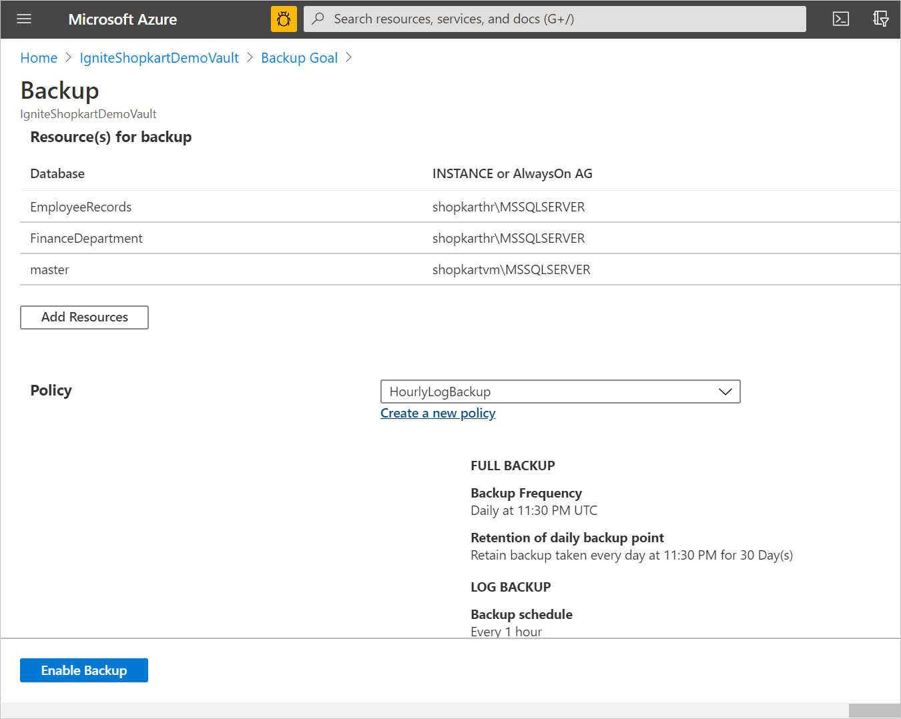
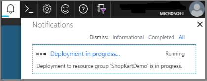
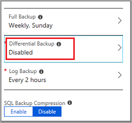
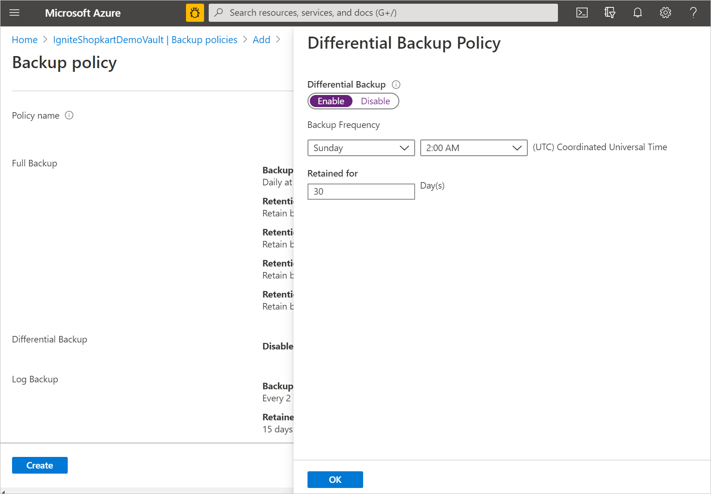
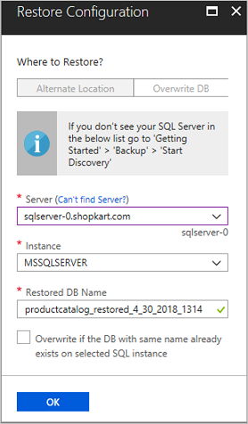
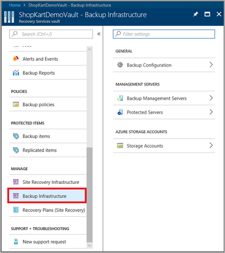

# Back up SQL Server database in Azure

SQL Server databases are critical workloads requiring low Recovery Point Objective (RPO) and long-term retention. Azure Backup provides a SQL Serverbackup solution that requires zero infrastructure, which means no complex backup server, no management agent, or backup storage to manage. Azure Backup provides centralized management for your backups across all SQL servers, or even different workloads.

 In this article you learn:

> [!div class="checklist"]
> * Prerequisites to back up SQL Server to Azure
> * Create and use a Recovery Services vault
> * Configure SQL Server database backups
> * Set a backup (or retention) policy for the recovery points
> * How to restore the database

Before starting the procedures in this article, you should have a SQL Server running in Azure. [You can use SQL marketplace virtual machines to quickly create a SQL Server](../sql-database/sql-database-get-started-portal.md).

## Public Preview limitations

The following items are the known limitations for the Public Preview.

- The SQL virtual machine requires internet connectivity to access Azure public IP addresses. For more detail, see the section, [Establish network connectivity](backup-azure-sql-database.md#establish-network-connectivity).
- You can protect up to 2000 SQL databases in one Recovery Services vault. Additional SQL databases should be stored in a separate Recovery Services vault.
- [Distributed availability groups backup has limitations](https://docs.microsoft.com/sql/database-engine/availability-groups/windows/distributed-availability-groups?view=sql-server-2017).
- SQL Failover Cluster Instances (FCI) are not supported.
- Use the Azure portal to configure Azure Backup to protect SQL Server databases. Support for Azure PowerShell, CLI, and REST APIs is not currently available.

## Supported operating systems and versions of SQL server

The following supported operating systems and versions of SQL Server apply to SQL marketplace Azure virtual machines, and non-marketplace virtual machines (where SQL Server is manually installed).

### Supported operating systems

- Windows Server 2012
- Windows Server 2012 R2
- Windows Server 2016

Linux is currently not supported.

### Supported versions/editions of SQL Server

- SQL 2012 Enterprise, Standard, Web, Developer, Express
- SQL 2014 Enterprise, Standard, Web, Developer, Express
- SQL 2016 Enterprise, Standard, Web, Developer, Express
- SQL 2017 Enterprise, Standard, Web, Developer, Express

## Prerequisites for using Azure Backup to protect SQL Server 

Before you can back up your SQL Server database, check the following conditions. :

- Identify or [create a Recovery Services vault](backup-azure-sql-database.md#create-a-recovery-services-vault) in the same region, or locale, as the virtual machine hosting SQL Server.
- [Check the permissions on the virtual machine](backup-azure-sql-database.md#set-permissions-for-non-marketplace-sql-vms) needed to back up SQL databases.
- [SQL virtual machine has network connectivity](backup-azure-sql-database.md#establish-network-connectivity).

If these conditions exist in your environment, proceed to the section, [Configure your vault to protect a SQL database](backup-azure-sql-database.md#configure-your-vault-to-protect-a-sql-database). If any of the prerequisites do not exist, continue reading this section.

## Establish network connectivity

For all operations, the SQL virtual machine needs connectivity to Azure public IP addresses. SQL virtual machine operations (such as database discovery, configuring backup, scheduled backups, restoring recovery points, and so on) fail without connectivity to the public IP addresses. Use either of the following options to provide a clear path for backup traffic:

- Whitelist the Azure datacenter IP ranges - To whitelist the Azure datacenter IP ranges, use the [download center page for details on the IP ranges and instructions](https://www.microsoft.com/download/details.aspx?id=41653). 
- Deploy an HTTP proxy server for routing traffic - When you're backing up a SQL database in a VM, the backup extension on the VM uses HTTPS APIs to send management commands to Azure Backup and data to Azure Storage. The backup extension also uses Azure Active Directory (AAD) for authentication. Route the backup extension traffic for these three services through the HTTP proxy, because it's the only component configured for access to the public internet.

The tradeoffs between the choices are: manageability, granular control, and cost.

> [!NOTE]
>Service tags for Azure Backup should be available by General Availability.
>

| Option | Advantages | Disadvantages |
| ------ | ---------- | ------------- |
| Whitelist IP ranges | No additional costs.   For opening access in an NSG, use **Set-AzureNetworkSecurityRule** cmdlet. | Complex to manage as the affected IP ranges change over time.  Provides access to the whole of Azure, not just storage.|
| Use an HTTP proxy   | Granular control in the proxy over the storage URLs is allowed.  Single point of internet access to VMs.   Not subject to Azure IP address changes. | Additional costs for running a VM with the proxy software. |

## Set permissions for non-marketplace SQL VMs

To back up a virtual machine, Azure Backup requires the **AzureBackupWindowsWorkload** extension be installed. If you are using Azure marketplace virtual machines, skip ahead to [Discover SQL server databases](backup-azure-sql-database.md#discover-sql-server-databases). If the virtual machine hosting your SQL databases was not created from the Azure marketplace, complete the following section to install the extension and set appropriate permissions. In addition to the **AzureBackupWindowsWorkload** extension, Azure Backup requires SQL sysadmin privileges to protect SQL databases. While discovering databases on the virtual machine, Azure Backup creates an account, NT Service\AzureWLBackupPluginSvc. For Azure Backup to discover SQL databases, the NT Service\AzureWLBackupPluginSvc account must have SQL log in and SQL sysadmin permissions. The following procedure explains how to provide these permissions.

To configure permissions:

1. In the [Azure portal](https://portal.azure.com), open the Recovery Services vault you're using to protect SQL databases.
2. In the vault dashboard menu, click **+ Backup** to open the **Backup Goal** menu.

   

3. On the **Backup Goal** menu, in the **Where is your workload running?** menu, leave **Azure** as the default.

4. On the **What do you want to backup** menu, expand the drop-down menu and select **SQL Server in Azure VM**.

    

    The **Backup Goal** menu displays two new steps: **Discover DBs in VMs** and **Configure Backup**. **Discover DBs in VMs** starts a search for Azure virtual machines.

    

5. Click **Start Discovery** to search for unprotected virtual machines in the subscription. Depending on the number of unprotected virtual machines in the subscription, it can take a while to go through all virtual machines.

    
 
    Once an unprotected virtual machine is discovered, it appears in the list. Unprotected virtual machines are listed by their virtual machine name and resource group. It is possible for multiple virtual machines to have the same name. However, virtual machines with the same name belong to different resource groups. If an expected virtual machine does not appear in the list, see if the virtual machine is already protected to a vault.

6. From the list of virtual machines, select the VM containing the SQL database you want to back up, and click **Discover DBs**. 

    The discovery process installs the **AzureBackupWindowsWorkload** extension on the virtual machine. The extension allows the Azure Backup service to communicate with the virtual machine so it can back up the SQL databases. Once the extension installs, Azure Backup creates the Windows virtual service account, **NT Service\AzureWLBackupPluginSvc**, on the virtual machine. The virtual service account requires SQL sysadmin permission. During the virtual service account installation process, if you see the error, **UserErrorSQLNoSysadminMembership**, see the section, [Fixing SQL sysadmin permissions](backup-azure-sql-database.md#fixing-sql-sysadmin-permissions).

    The Notifications area shows the progress of the database discovery. Depending on how many databases are on the virtual machine, it can take a while for the job to complete. When selected databases have been discovered, a success message appears.

    

Once you associate the database with the Recovery Services vault, the next step is to [configure the backup](backup-azure-sql-database.md#configure-your-vault-to-protect-a-sql-database).

### Fixing SQL sysadmin permissions

During the installation process, if you see the error, **UserErrorSQLNoSysadminMembership**, sign into SQL Server Management Studio (SSMS) with an account that has SQL sysadmin permission. Unless you require special permissions, you should be able to use Windows authentication to recognize the account.

1. On the SQL Server, open the **Security/Logins** folder.

    

2. On the Logins folder, right click and select **New Login**, and in the Login - New dialog, click **Search**

    

3. Since the Windows virtual service account, **NT Service\AzureWLBackupPluginSvc** has already been created during the virtual machine registration and SQL discovery phase, enter the account name as it appears in the **Enter the object name to select** dialog. Click **Check Names** to resolve the name. 

    

4. Click **OK** to close the Select User or Group dialog.

5. In the **Server Roles** dialog, make sure the **sysadmin** role is selected. Then click **OK** to close **Login - New**.

    

    The required permissions should now exist.

6. Though you fixed the permissions error, you still need to associate the database with the Recovery Services vault. In the Azure portal **Protected Servers** list, right click the server in error, and select **Rediscover DBs**.

    

    The Notifications area shows the progress of the database discovery. Depending on how many databases are on the virtual machine, it can take a while for the job to complete. When selected databases have been found, a success message appears in the Notifications area.

    

Once you associate the database with the Recovery Services vault, the next step is to [configure the backup](backup-azure-sql-database.md#configure-your-vault-to-protect-a-sql-database).

[!INCLUDE [Section explaining how to create a Recovery Services vault](../../includes/backup-create-rs-vault.md)]

## Discover SQL Server databases

Azure Backup can discover all databases on a SQL Server instance so you can protect them per your backup requirements. Use the following procedure to identify the virtual machine hosting the SQL databases. Once you identify the virtual machine, Azure Backup installs a lightweight extension to discover the SQL server databases.

1. Sign in to your subscription in the [Azure portal](https://portal.azure.com/).
2. In the left-hand menu, select **All Services**.

      

3. In the All services dialog, type *Recovery Services*. As you begin typing, your input filters the list of resources. Once you see it, select **Recovery Services vaults**.

      

    The list of Recovery Services vaults in the subscription appears. 

4. From the list of Recovery Services vault, select the vault that you want to use to protect your SQL databases.

5. In the vault dashboard menu, click **+ Backup** to open the **Backup Goal** menu.

   

6. On the **Backup Goal** menu, in the **Where is your workload running?** menu, leave **Azure** as the default.

7. On the **What do you want to backup** menu, expand the drop-down menu and select **SQL Server in Azure VM**.

    

    Once selected, the **Backup Goal** menu displays two steps: Discover DBs in VMs, and Configure Backup. 

    

8. Click **Start Discovery** to search for unprotected virtual machines in the subscription. Depending on the number of unprotected virtual machines in the subscription, it can take a while to go through all virtual machines.

    
 
    Once an unprotected virtual machine is discovered, it appears in the list. Multiple virtual machines can have the same name. However, multiple virtual machines with the same name belong to different resource groups. The unprotected virtual machines are listed by their virtual machine name and resource group. If an expected virtual machine is not listed, see if that virtual machine is already protected to a vault.

9. From the list of virtual machines, select the checkbox of the virtual machine that contains the SQL databases you want to protect, and click **Discover DBs**.

    Azure Backup discovers all SQL databases on the virtual machine. For information about what happens during the database discovery phase, see the following section, [Backend operations when discovering SQL databases](backup-azure-sql-database.md#backend-operations-when-discovering-sql-databases). After discovering the SQL databases, you are ready to [configure the backup job](backup-azure-sql-database.md#configure-your-vault-to-protect-a-sql-database).

### Backend operations when discovering SQL databases

When you use the **Discover DBs** tool, Azure Backup executes the following operations in the background:

- registers the virtual machine with the Recovery Services vault for workload backup. All databases on the registered virtual machine can only be backed up to this Recovery Services vault. 

- installs the **AzureBackupWindowsWorkload** extension on the virtual machine. Backing up a SQL database is an agentless solution, that is, with the extension installed on the virtual machine, no agent is installed on the SQL database.

- creates the service account, **NT Service\AzureWLBackupPluginSvc**, on the virtual machine. All backup and restore operations use the service account. **NT Server\AzureWLBackupPluginSvc** needs SQL sysadmin permissions. All SQL Marketplace virtual machines come with the SqlIaaSExtension installed, and AzureBackupWindowsWorkload uses SQLIaaSExtension to automatically get required permissions. If your virtual machine doesn't have SqlIaaSExtension installed, the Discover DB operation fails, and you get the error message, **UserErrorSQLNoSysAdminMembership**. To add the sysadmin permission for backup, follow the instructions in [Setting up Azure Backup permissions for non-marketplace SQL VMs](backup-azure-sql-database.md#set-permissions-for-non--marketplace-sql-vms).

    

## Configure backup for SQL Server database

Azure Backup provides management services to protect your SQL Server databases and manage backup jobs. The management and monitoring capabilities depend on your Recovery Services vault. To configure protection for your SQL database:

1. Open the Recovery Services vault registered with the SQL virtual machine.

2. In the vault dashboard menu, click **+ Backup** to open the **Backup Goal** menu.

    

3. On the **Backup Goal** menu, in the **Where is your workload running?** menu, leave **Azure** as the default.

4. On the **What do you want to backup** menu, expand the drop-down menu and select **SQL Server in Azure VM**.

    

    Once selected, the **Backup Goal** menu displays two steps: Discover DBs in VMs, and Configure Backup. If you've gone through this article in order, you've already discovered the unprotected virtual machines, and this vault is registered with a virtual machine. You're now ready to configure protection for the SQL databases.

5. In the Backup Goal menu, click **Configure Backup**.

    

    The Azure Backup service displays all SQL instances with standalone databases, as well as SQL AlwaysOn availability groups. To view the standalone databases in the SQL instance, click the chevron next to the instance name to view the databases. The following images show examples of a standalone instance and an Always On availability group.

    > [!NOTE]
    > Full and differential backups happen from the primary node, as SQL platform has that limitation. Log backup can happen based on your backup preference. Due to this limitation, the primary node must be registered.
    >

    

    Click the chevron next to AlwaysOn availability groups to view the list of databases.

    

6. From the list of databases, select all that you want to protect, and click **OK**.

    

    You can select up to 50 databases at one time. If you want to protect more than 50 databases, make multiple passes. After you protect the first 50 databases, repeat this step to protect the next set of databases.
    > [!Note] 
    > To optimize backup loads, Azure Backup breaks large backup jobs into multiple batches. The maximum number of databases in one backup job is 50.
    >
    >

7. To create or choose a backup policy, in the **Backup** menu, select **Backup policy**, to open the menu.

    

8. From the **Choose backup policy** drop-down menu, choose a backup policy, and click **OK**. For information on creating your own backup policy, see the section, [Define a backup policy](backup-azure-sql-database.md#define-a-backup-policy).

    

    In the Backup policy menu, from the **Choose backup policy** drop-down menu, you can choose: 
    - the default HourlyLogBackup policy, 
    - an existing backup policy previously created for SQL,
    - to [define a new policy](backup-azure-sql-database.md#define-a-backup-policy) based on your recovery point objective (RPO) and retention range. 

    > [!Note]
    > Azure Backup supports long-term retention based on the grandfather-father-son backup scheme to optimize backend storage consumption while meeting compliance needs.
    >

9. Once you have chosen a backup policy, in the **Backup menu** click **Enable backup**.

    

    You can track the configuration progress in the Notifications area of the portal.

    

### Define a backup policy

A backup policy defines a matrix of when the backups are taken, and how long the backups are retained. You can use Azure Backup to schedule three types of backup for SQL databases:

* Full backup - A full database backup backs up the entire database. A full backup contains all the data in a specific database or set of filegroups or files, and enough log to recover that data. At most, you can trigger one full backup per day. You can choose to take a full backup on a daily or weekly interval. 
* Differential backup - A differential backup is based on the most recent, previous full data backup. A differential backup captures only the data that has changed since the full backup. At most, you can trigger one differential backup per day. You cannot configure a full backup and a differential backup on the same day.
* Transaction log backup - a log backup enables point-in-time restoration up to a specific second. At most, you can configure transactional log backups every 15 minutes.

Policy is created at the Recovery Services vault level. If you have multiple vaults, the vaults can use the same backup policy, but you must apply the backup policy to each vault. When creating a backup policy, the daily, Full Backup is the default. You can add a Differential Backup, but only if you switch Full Backups to occur Weekly. The following procedure explains how to create a backup policy for a SQL server in an Azure virtual machine.

To create a backup policy

1. On the Backup policy menu, from the **Choose backup policy** drop-down menu, select **Create New**.

   

    The Backup policy menu switches to provide the fields necessary for any new SQL server backup policy.

   

2. In **Policy name**, provide a name. 

3. A Full Backup is mandatory. You can accept the default values for the Full Backup, or click **Full Backup** to edit the policy.

    

    Within the Full Backup policy, choose Daily or Weekly for the frequency. If you choose Daily, choose the hour and timezone, when the backup job begins. If you choose Daily Full Backups, you cannot create Differential Backups.

   

    If you choose Weekly, choose the day of the week, hour and timezone when the backup job begins.

   

4. By default, all Retention Range options (daily, weekly, monthly, and yearly) are selected. Uncheck any retention range limit you do not want, and set the intervals to use. In the Full Backup policy menu, click **OK** to accept the settings.

   

    Recovery points are tagged for retention, based on their retention range. For example, if you select a daily, Full backup only one Full backup is triggered each day. Depending on your weekly retention, the specific day's backup is tagged and retained based on the weekly retention range. The monthly and yearly retention range behaves similarly.

5. To add a differential backup policy, click **Differential Backup** to open its menu. 

   

    In the Differential Backup policy menu, select **Enable** to open the frequency and retention controls. You can trigger, at most, one differential backup per day.
    > [!Important] 
    > At most, differential backups can be retained for 180 days. If you need longer retention, you must use Full backups, you cannot use differential backups.
    >

   

    Click **OK** to save the policy and return to the main Backup Policy menu.

6. To add a transactional Log Backup policy, click **Log Backup** to open its menu. In the Log Backup menu, select **Enable**, and set the frequency and retention controls. Log backups can occur as often as every 15 minutes, and can be retained for up to 35 days. Click **OK** to save the policy and return to the main Backup Policy menu.

   

7. Choose whether to enable SQL Backup Compression. Compression is disabled by default.

    On the backend, Azure Backup uses SQL native backup compression.

8. When you have made all edits to the Backup policy, click **OK**. 

   

## Restore a SQL database

Azure Backup provides functionality to restore individual databases to a specific date or time, up to a specific second, using transaction log backups. Based on restore times you provide, Azure Backup automatically determines the appropriate Full, Differential and the chain of log backups required to restore your data.

Alternatively, you can select a specific Full or Differential backup to restore to a specific recovery point rather than a specific time.

To restore a database

1. Open the Recovery Services vault registered with the SQL virtual machine.

2. In the vault dashboard, select **Usage** Backup Items to open the Backup Items menu.

    .

3. In the **Backup Items** menu, select the backup management type, **SQL in Azure VM**. 

    

    The Backup Items list adjusts to show the list of SQL databases. 

4. From the list of SQL databases, select the database you want to restore.

    

    When you select the database, its menu opens. This menu provides the backup details for the database including:

    * the oldest and latest restore points,
    * log backup status for the last 24 hours (for databases in Full and Bulk logged recovery model, if configured for transactional log backups)

5. In the selected database menu, click **Restore DB** to open the Restore menu.

    

    The **Restore** menu opens, and so does the **Restore Configuration** menu. The **Restore Configuration** menu is the first step in configuring the restoration. In this menu, you select where you want to restore the data. The options are:
    * Alternate Location - use this option if you want to restore the database to an alternate location while still retaining the original source database.
    * Overwrite DB - restores the data to the same SQL Server instance as the original source. The effect of this is you overwrite the original database.

    > [!Important]
    > If the selected database belongs to an Always On availability group, SQL does not allow the database to be overwritten. In this case, only the **Alternate Location** option is enabled.
    >

    

### Restore to an alternate location

This procedure walks through restoring data to an alternate location. If you want to overwrite the database when restoring, jump to the section, [Restore and overwrite the database](backup-azure-sql-database.md#restore-and-overwrite-the-database). This procedure assumes you have your Recovery Services vault open, and are at the Restore Configuration menu. If you aren't, start with the section, [Restore a SQL database](backup-azure-sql-database.md#restore-a-sql-database).

The **Server** drop-down menu only shows the SQL servers registered with the Recovery Services vault. If the server you want is not in the **Server** list, see the section, [Discover SQL server databases](backup-azure-sql-database.md#discover-sql-server-databases) to find the server. During the discovery database process, any new servers are registered to the Recovery Services vault.

1. In the **Restore Configuration** menu:

    * select **Alternate Location**,
    * for **Server**, choose the SQL server where you want to restore the database.
    * in the **Instance** drop-down menu, choose a SQL instance
    * in the **Restored DB Name** dialog, provide the name of the target database.
    * if applicable, select **Overwrite if the DB with the same name already exists on selected SQL instance**.
    * click **OK** to complete configuring the destination and move to choosing a restore point.

    

2. In the **Select restore point** menu, you can choose either a Logs (Point in Time) or Full & Differential restore point. If you want to restore to a specific point-in-time log, continue with this step. If you want to restore a Full or Differential restore point, skip ahead to step 3.

    

    The point in time restore is only available for log backups for databases with Full & Bulk logged recovery model. To restore to a specific point-in-time:

    1. Select **Logs (Point in Time)** as the restore option.

        

    2. Under **Restore Date/time**, click the calendar icon to open the calendar. Dates in bold contain recovery points, and the current date is highlighted. Select a date on the calendar with recovery points. You cannot select dates with no recovery points.

        

        Once you select a date, the timeline graph displays the available recovery points in a continuous range.

    3. Using either the timeline graph, or the Time dialog, specify a specific time for the recovery point and click **OK** to complete the Restore Point step.
    
       

        The **Select restore point** menu closes, and the **Advanced Configuration** menu opens.

       

    4. From the **Advanced Configuration** menu:

        * To keep the database non-operational after restore, on the **Restore with NORECOVERY** menu, select **Enabled**.
        * If you want to change the restore location on the destination server, provide a new path in the **Target** column.
        * click **OK** to approve the settings, and close **Advanced Configuration**.

    5. On the **Restore** menu, click **Restore** to start the restore job. In the Notifications area, you can track progress. You can also track the progress in the database Restore jobs.

       

3. In the **Select restore point** menu, choose a recovery point. You can choose either a Logs (Point in Time) or Full & Differential. If you want to restore a point-in-time log, go back to step 2. This step restores a specific full or Differential restore point. With this option, you can see all Full and Differential recovery points for the last 30 days. If you want to see recovery points older than 30 days, click **Filter** to open the **Filter restore points** menu. If you choose a Differential recovery point, Azure Backup first restores the appropriate Full recovery point, and then applies the selected Differential recovery point.

    

    1. In the **Select restore point** menu, select **Full & Differential**.

       

        The list of available recovery points appears.

    2. From the list of recovery points, select a recovery point and click **OK** to complete the Restore Point procedure. 

        

        The **Restore Point** menu closes, and the **Advanced Configuration** menu opens.

        

    3. From the **Advanced Configuration** menu:

        * To keep the database non-operational after restore, on the **Restore with NORECOVERY** menu, select **Enabled**. **Restore with NORECOVERY** is disabled by default.
        * If you want to change the restore location on the destination server, provide a new path in the **Target** column.
        * Click **OK** to approve the settings, and close **Advanced Configuration**.

    4. On the **Restore** menu, click **Restore** to start the restore job. In the Notifications area, you can track progress. You can also track the progress in the database Restore jobs.

       

### Restore and overwrite the database

This procedure walks through restoring data and overwriting the database. If you want to restore to an alternate location, jump to the section, [Restore to an alternate location](backup-azure-sql-database.md#restore-to-an-alternate-location). This procedure assumes you have your Recovery Services vault open, and are at the **Restore Configuration** menu (see the following image). If you aren't, start with the section, [Restore a SQL database](backup-azure-sql-database.md#restore-a-sql-database).

The **Server** drop-down menu only shows the SQL servers registered with the Recovery Services vault. If the server you want is not in the **Server** list, see the section, [Discover SQL server databases](backup-azure-sql-database.md#discover-sql-server-databases) to find the server. During the discovery database process, any new servers are registered to the Recovery Services vault.

1. In the **Restore Configuration** menu, select **Overwrite DB** and click **OK** to complete configuring the destination. 

   

    The **Server**, **Instance**, and **Restored DB Name** dialogs are not necessary.

2. In the **Select restore point** menu, you can choose either a Logs (Point in Time) or Full & Differential restore point. If you want to restore a point-in-time log, continue with this step. If you want to restore a Full & Differential restore point, skip ahead to step 3.

    

    The point in time restore is only available for log backups for databases with Full & Bulk logged recovery model. To choose a point in time restore to a specific second:

    1. Select **Logs (Point in Time)** as the restore option.

        

    2. Under **Restore Date/time**, click the calendar icon to open the calendar. Dates in bold contain recovery points, and the current date is highlighted. Select a date on the calendar with recovery points. You cannot select dates with no recovery points.

        

        Once you select a date, the timeline graph displays the available recovery points.

    3. Using either the timeline graph, or the Time dialog, specify a specific time for the recovery point and click **OK** to complete the Restore Point step.
    
       

        The **Select restore point** menu closes, and the **Advanced Configuration** menu opens.

       

    4. From the **Advanced Configuration** menu:

        * To keep the database non-operational after restore, on the **Restore with NORECOVERY** menu, select **Enabled**.
        * If you want to change the restore location on the destination server, provide a new path in the **Target** column.
        * click **OK** to approve the settings, and close **Advanced Configuration**.

    5. On the **Restore** menu, click **Restore** to start the restore job. In the Notifications area, you can track progress. You can also track the progress in the database Restore jobs.

       

3. In the **Select restore point** menu, choose a recovery point. You can choose either a Logs (Point in Time) or Full & Differential. If you want to restore a point-in-time log, go back to step 2. This step restores a specific full or Differential restore point. With this option, you can see all Full and Differential recovery points for the last 30 days. If you want to see recovery points older than 30 days, click **Filter** to open the **Filter restore points** menu. If you choose a Differential recovery point, Azure Backup first restores the appropriate Full recovery point, and then applies the selected Differential recovery point.

    

    1. In the **Select restore point** menu, select **Full & Differential**.

       

        The list of available recovery points appears.

    2. From the list of recovery points, select a recovery point and click **OK** to complete the Restore Point procedure. 

        

        The **Restore Point** menu closes, and the **Advanced Configuration** menu opens.

        

    3. From the **Advanced Configuration** menu:

        * To keep the database non-operational after restore, on the **Restore with NORECOVERY** menu, select **Enabled**. **Restore with NORECOVERY** is disabled by default.
        * If you want to change the restore location on the destination server, provide a new path in the **Target** column.
        * Click **OK** to approve the settings, and close **Advanced Configuration**.

    4. On the **Restore** menu, click **Restore** to start the restore job. In the Notifications area, you can track progress. You can also track the progress in the database Restore jobs.

       

## Manage Azure Backup operations for SQL on Azure VMs

This section provides information about the various Azure Backup management operations available for SQL on Azure virtual machines. The following high-level operations exist:

* Monitor Jobs
* Backup Alerts
* Stop protection on a SQL database
* Resume protection for a SQL database
* Trigger an adhoc Backup job
* Unregister a SQL server

### Monitor Jobs

Azure Backup uses SQL native APIs for all backup operations. Using the native APIs, you can fetch all job information from the [SQL backupset table](https://docs.microsoft.com/sql/relational-databases/system-tables/backupset-transact-sql?view=sql-server-2017) in the msdb database. Additionally, Azure Backup shows all manually triggered, or adhoc, jobs in the Backup jobs portal. The jobs available in the portal include: all configure backup operations, restore operations, registration and discover database operations, and stop backup operations. All scheduled jobs can also be monitored with OMS Log analytics. Using Log analytics removes jobs clutter, and provides granular flexibility for monitoring or filtering specific jobs.

### Backup Alerts

With log backups occurring every 15 minutes, occasionally monitoring the backup jobs can be tedious. Azure Backup planned for this potentially tedious situation by providing email alerts triggered by any backup failure. Alerts are consolidated at the database level by error code. For example, if a database has multiple backup failures, instead of receiving an alert for each failure, you receive email for the first failure. You can then sign into the Azure portal to monitor subsequent failures for that database. 

To monitor backup alerts:

1. Sign into your Azure subscription in the [Azure portal](https://portal.azure.com).

2. Open the Recovery Services vault registered with the SQL virtual machine.

3. In the Recovery Services vault menu, select **Alerts and Events**. 

   

4. In the **Alerts and Events** menu, select **Backup Alerts** to view the list of alerts.

   

### Stop protection on a SQL Server database

If you stop protecting a SQL Server database, Azure Backup asks if you want to retain the recovery points. There are two ways to stop protecting SQL database:

* Stop all future backup jobs and delete all recovery points,
* Stop all future backup jobs, but leave the recovery points 

Leaving the recovery points carries a cost as the recovery points for SQL carry the SQL protected instance pricing charge, plus the storage consumed. For more information about Azure Backup pricing for SQL, see the [Azure Backup pricing page](https://azure.microsoft.com/pricing/details/backup/). To stop protection for the database:

1. Open the Recovery Services vault registered with the SQL virtual machine.

2. In the vault dashboard, select **Usage** Backup Items to open the Backup Items menu.

    .

3. In the **Backup Items** menu, select the backup management type, **SQL in Azure VM**. 

    

    The Backup Items list adjusts to show the list of SQL databases. 

4. From the list of SQL databases, select the database you want to stop protecting.

    

    When you select the database, its menu opens. 

5. In the selected database menu, click **Stop backup** to stop protecting the database.

    

    The **Stop Backup** menu opens.

6. In the **Stop Backup** menu, choose to Retain Backup Data, or Delete Backup Data. Optionally, you can provide a reason for stopping protection, and a comment.

    

7. Click **Stop backup** to stop protection on the database. 

### Resume protection for a SQL database

If the **Retain Backup Data** option was selected when stopping protection for the SQL database, it is possible to resume protection. If the backup data was not retained, protection cannot resume. 

1. To resume protection for the SQL database, open the backup item and click **Resume Backup**.

    

   The Backup Policy menu opens.

2. From the **Backup Policy** menu, select a policy, and click **Save**.

### Trigger an adhoc backup

You can trigger an adhoc backup whenever you want. There are four types of adhoc backups. For details on each type, see the article, [Types of SQL backups](https://docs.microsoft.com/sql/relational-databases/backup-restore/backup-overview-sql-server?view=sql-server-2017#types-of-backups).

* Full backup
* Copy Only Full Backup
* Differential Backup
* Log Backup

### Unregister a SQL Server

To unregister a SQL server after removing protection, but before deleting the vault

1. Open the Recovery Services vault registered with the SQL virtual machine.

2. In the **Manage** section of the vault menu, click **Backup Infrastructure**.  

   

3. In the **Management Servers** section, click **Protected Servers**.

   

    The Protected Servers menu opens. 

4. In the **Protected Servers** menu, select the server you want to unregister. IF you want to delete the vault, you must unregister all servers.

5. In the Protected Servers menu, right-click the protected server, and select **Delete**. 

   

## Next steps

To learn more about Azure Backup, see the PowerShell sample for backing up encrypted virtual machines.

> [!div class="nextstepaction"]
> [Back up encrypted VM](./scripts/backup-powershell-sample-backup-encrypted-vm.md)
