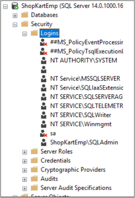
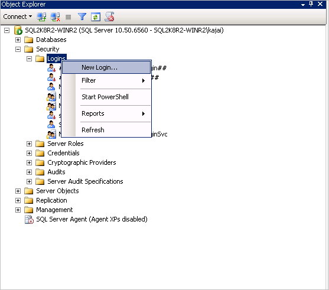
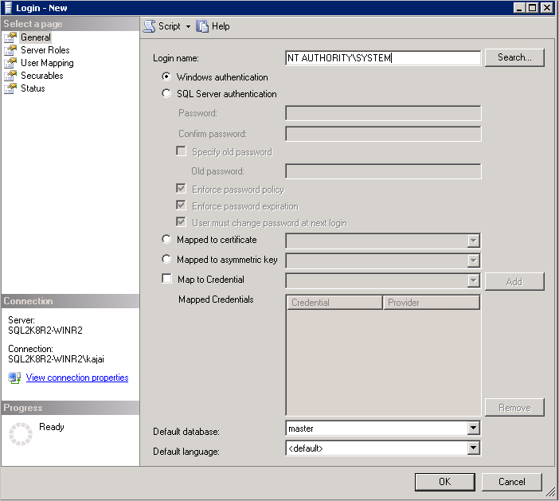

# About SQL Server Backup in Azure VMs

[Azure Backup](backup-overview.md) offers a stream-based, specialized solution to back up SQL Server running in Azure VMs. This solution aligns with Azure Backup's benefits of zero-infrastructure backup, long-term retention, and central management. It additionally provides the following advantages specifically for SQL Server:

1. Workload aware backups that support all backup types - full, differential, and log
2. 15-min RPO (recovery point objective) with frequent log backups
3. Point-in-time recovery up to a second
4. Individual database level backup and restore

To view the backup and restore scenarios that we support today, refer to the [support matrix](sql-support-matrix.md#scenario-support).

## Backup process

This solution leverages the SQL native APIs to take backups of your SQL databases.

* Once you specify the SQL Server VM that you want to protect and query for the databases in it, Azure Backup service will install a workload backup extension on the VM by the name `AzureBackupWindowsWorkload` extension.
* This extension consists of a coordinator and a SQL plugin. While the coordinator is responsible for triggering workflows for various operations like configure backup, backup and restore, the plugin is responsible for actual data flow.
* To be able to discover databases on this VM, Azure Backup creates the account `NT SERVICE\AzureWLBackupPluginSvc`. This account is used for backup and restore and requires SQL sysadmin permissions. The `NT SERVICE\AzureWLBackupPluginSvc` account is a [Virtual Service Account](https://docs.microsoft.com/windows/security/identity-protection/access-control/service-accounts#virtual-accounts), and therefore does not require any password management. Azure Backup leverages the `NT AUTHORITY\SYSTEM` account for database discovery/inquiry, so this account needs to be a public login on SQL. If you didn't create the SQL Server VM from the Azure Marketplace, you might receive an error **UserErrorSQLNoSysadminMembership**. If this occurs [follow these instructions](#set-vm-permissions).
* Once you trigger configure protection on the selected databases, the backup service sets up the coordinator with the backup schedules and other policy details, which the extension caches locally on the VM.
* At the scheduled time, the coordinator communicates with the plugin and it starts streaming the backup data from the SQL server using VDI.  
* The plugin sends the data directly to the recovery services vault, thus eliminating the need for a staging location. The data is encrypted and stored by the Azure Backup service in storage accounts.
* When the data transfer is complete, coordinator confirms the commit with the backup service.

  

## Before you start

Before you start, verify the below:

1. Make sure you have a SQL Server instance running in Azure. You can [quickly create a SQL Server instance](../azure-sql/virtual-machines/windows/quickstart-create-sql-vm-portal.md) in the marketplace.
2. Review the [feature consideration](sql-support-matrix.md#feature-consideration-and-limitations) and [scenario support](sql-support-matrix.md#scenario-support).
3. [Review common questions](faq-backup-sql-server.md) about this scenario.

## Set VM permissions

  When you run discovery on a SQL Server, Azure Backup does the following:

* Adds the AzureBackupWindowsWorkload extension.
* Creates an NT SERVICE\AzureWLBackupPluginSvc account to discover databases on the virtual machine. This account is used for a backup and restore and requires SQL sysadmin permissions.
* Discovers databases that are running on a VM, Azure Backup uses the NT AUTHORITY\SYSTEM account. This account must be a public sign-in on SQL.

If you didn't create the SQL Server VM in the Azure Marketplace or if you are on SQL 2008 and 2008 R2, you might receive a **UserErrorSQLNoSysadminMembership** error.

For giving permissions in case of **SQL 2008** and **2008 R2** running on Windows 2008 R2, refer [here](#give-sql-sysadmin-permissions-for-sql-2008-and-sql-2008-r2).

For all other versions, fix permissions with the following steps:

  1. Use an account with SQL Server sysadmin permissions to sign in to SQL Server Management Studio (SSMS). Unless you need special permissions, Windows authentication should work.
  2. On the SQL Server, open the **Security/Logins** folder.

      

  3. Right-click the **Logins** folder and select **New Login**. In **Login - New**, select **Search**.

      

  4. The Windows virtual service account **NT SERVICE\AzureWLBackupPluginSvc** was created during the virtual machine registration and SQL discovery phase. Enter the account name as shown in **Enter the object name to select**. Select **Check Names** to resolve the name. Click **OK**.

      

  5. In **Server Roles**, make sure the **sysadmin** role is selected. Click **OK**. The required permissions should now exist.

      

  6. Now associate the database with the Recovery Services vault. In the Azure portal, in the **Protected Servers** list, right-click the server that's in an error state > **Rediscover DBs**.

      

  7. Check progress in the **Notifications** area. When the selected databases are found, a success message appears.

      

> [!NOTE]
> If your SQL Server has multiple instances of SQL Server installed, then you must add sysadmin permission for **NT Service\AzureWLBackupPluginSvc** account to all SQL instances.

### Give SQL sysadmin permissions for SQL 2008 and SQL 2008 R2

Add **NT AUTHORITY\SYSTEM** and **NT Service\AzureWLBackupPluginSvc** logins to the SQL Server Instance:

1. Go the SQL Server Instance in the Object explorer.
2. Navigate to Security -> Logins
3. Right click on the Logins and click *New Login…*

    

4. Go to the General tab and enter **NT AUTHORITY\SYSTEM** as the Login Name.

    

5. Go to *Server Roles* and choose *public* and *sysadmin* roles.

    

6. Go to *Status*. *Grant* the Permission to connect to database engine and Login as *Enabled*.

    

7. Click OK.
8. Repeat the same sequence of steps (1-7 above) to add NT Service\AzureWLBackupPluginSvc login to the SQL Server instance. If the login already exists, make sure it has the sysadmin server role and under Status it has Grant the Permission to connect to database engine and Login as Enabled.
9. After granting permission, **Rediscover DBs** in the portal: Vault **->** Backup Infrastructure **->** Workload in Azure VM:

    

Alternatively, you can automate giving the permissions by running the following PowerShell commands in admin mode. The instance name is set to MSSQLSERVER by default. Change the instance name argument in script if need be:

```powershell
param(
    [Parameter(Mandatory=$false)]
    [string] $InstanceName = "MSSQLSERVER"
)
if ($InstanceName -eq "MSSQLSERVER")
{
    $fullInstance = $env:COMPUTERNAME   # In case it is the default SQL Server Instance
}
else
{
    $fullInstance = $env:COMPUTERNAME + "\" + $InstanceName   # In case of named instance
}
try
{
    sqlcmd.exe -S $fullInstance -Q "sp_addsrvrolemember 'NT Service\AzureWLBackupPluginSvc', 'sysadmin'" # Adds login with sysadmin permission if already not available
}
catch
{
    Write-Host "An error occurred:"
    Write-Host $_.Exception|format-list -force
}
try
{
    sqlcmd.exe -S $fullInstance -Q "sp_addsrvrolemember 'NT AUTHORITY\SYSTEM', 'sysadmin'" # Adds login with sysadmin permission if already not available
}
catch
{
    Write-Host "An error occurred:"
    Write-Host $_.Exception|format-list -force
}
```

## Next steps

* [Learn about](backup-sql-server-database-azure-vms.md) backing up SQL Server databases.
* [Learn about](restore-sql-database-azure-vm.md) restoring backed up SQL Server databases.
* [Learn about](manage-monitor-sql-database-backup.md) managing backed up SQL Server databases.
