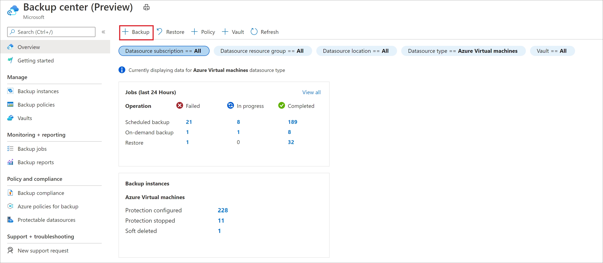
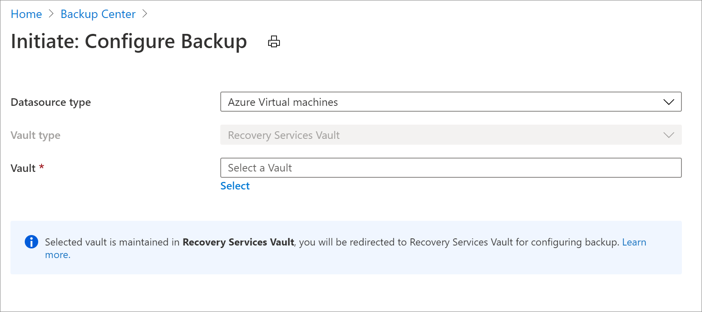
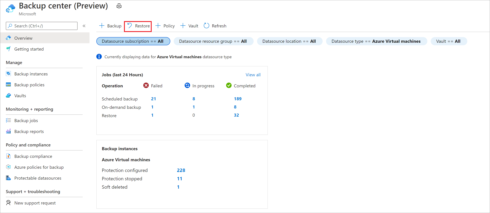
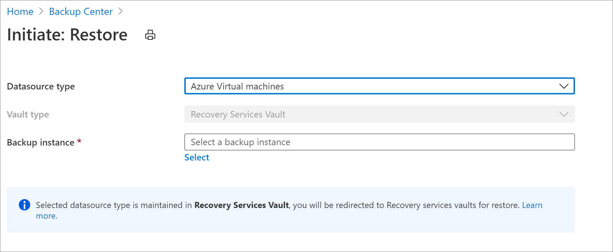
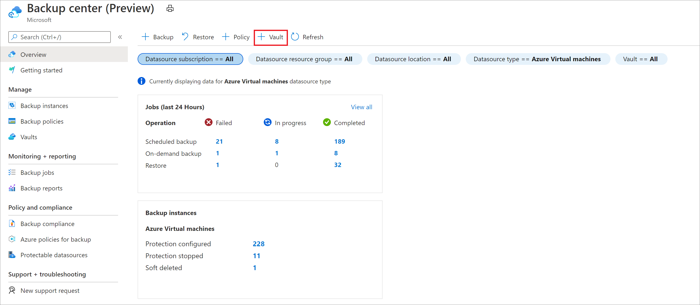
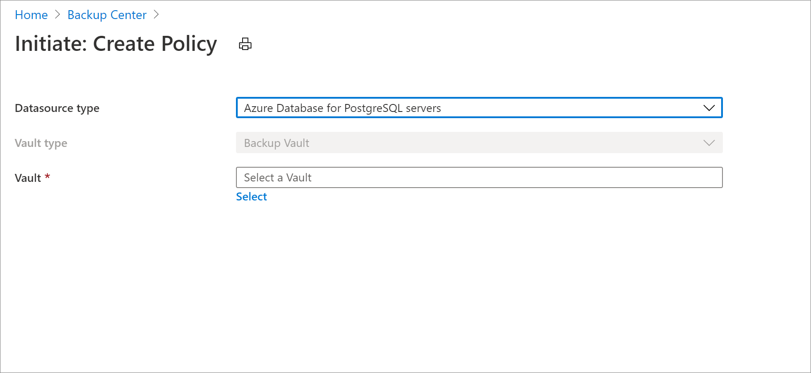
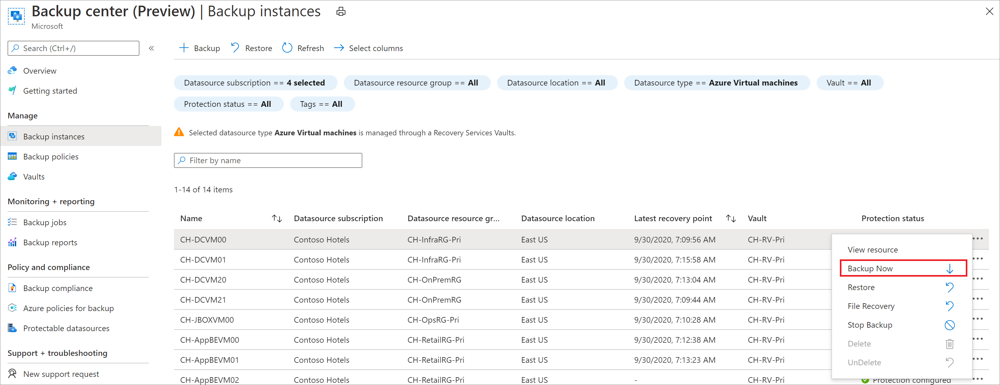
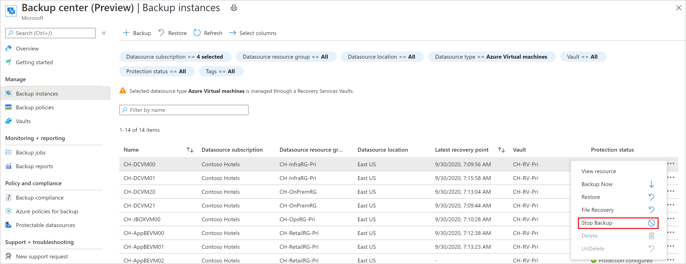

# Perform actions using Backup Center

Backup Center allows you to perform key backup-related actions from a central interface without needing to navigate to an individual vault. Some actions that you can perform from Backup Center are:

* Configure backup for your datasources
* Restore a backup instance
* Create a new vault
* Create a new backup policy
* Trigger an on-demand backup for a backup instance
* Stop backup for a backup instance

## Supported scenarios

* Backup Center is currently supported for Azure VM backup and Azure Database for PostgreSQL Server backup.
* Refer to the [support matrix](backup-center-support-matrix.md) for a detailed list of supported and unsupported scenarios.

## Configure backup

Depending on the type of datasource you wish to back up, follow the appropriate instructions as described below.

### Configure backup for Azure virtual machines

1. Navigate to the Backup Center and select **+ Backup** at the top of the **Overview** tab.

    

2. Select the type of datasource you wish to back up (Azure virtual machine in this case).

    

3. Choose a Recovery Services vault and select **Proceed**. This leads you to the backup configuration experience that is identical to the one reachable from a Recovery Services vault. [Learn more about how configure backup for Azure virtual machines with a Recovery Services vault](tutorial-backup-vm-at-scale.md).

### Configure backup for Azure Database for Postgre SQL Server

1. Navigate to the Backup Center and select **+ Backup** at the top of the **Overview** tab.
2. Select the type of datasource you wish to back up (Azure Database for PostgreSQL server in this case).

    

3. Select **Proceed**. This leads you to the backup configuration experience that it identical to the one reachable from a Backup vault. [Learn more about how to configure backup for Azure Database for PostgreSQL Server with a Backup vault](backup-azure-database-postgresql.md#configure-backup-on-azure-postgresql-databases).

## Restore a backup instance

Depending on the type of datasource you wish to restore, follow the appropriate instructions as described below.

### If you're restoring an Azure virtual machine

1. Navigate to the Backup Center and select **Restore** at the top of the **Overview** tab.

    

2. Select the type of datasource you wish to restore (Azure virtual machine in this case).

    

3. Choose a backup instance and select **Proceed**. This leads you to the restore settings experience that is identical to the one reachable from a Recovery Services vault. [Learn more about how to restore an Azure Virtual Machine with a Recovery Services vault](backup-azure-arm-restore-vms.md#before-you-start).

### If you're restoring an Azure Database for Postgre SQL Server

1. Navigate to the Backup Center and select **Restore** at the top of the **Overview** tab.
2. Select the type of datasource you wish to back up (Azure Database for PostgreSQL Server in this case).

    

3. Choose a backup instance and select **Proceed**. This leads you to the restore settings experience that is identical to the one reachable from a Recovery Services vault. [Learn more about how to restore an Azure Database for PostgreSQL Server with a Backup vault](backup-azure-database-postgresql.md#restore).

## Create a new vault

You can create a new vault by navigating to Backup Center and selecting **+ Vault** at the top of the **Overview** tab.

* [Learn more about creating a Recovery services vault](backup-create-rs-vault.md)
* [Learn more about creating a Backup vault](backup-vault-overview.md)

## Create a new backup policy

Depending on the type of datasource you wish to back up, follow the appropriate instructions described below.

### If you're backing up an Azure virtual machine

1. Navigate to the Backup Center and select **+ Policy** at the top of the **Overview** tab.

    

2. Select the type of datasource you wish to back up (Azure Virtual machine in this case).

    

3. Choose a Recovery services vault and select **Proceed**. This leads you to the policy creation experience that is identical to the one reachable from a Recovery Services vault. [Learn more about how to create a new backup policy for Azure Virtual Machine with a Recovery services vault](backup-azure-arm-vms-prepare.md#create-a-custom-policy).

### If you're backing up an Azure Database for Postgre SQL Server

1. Navigate to the Backup Center and select **+ Policy** at the top of the **Overview** tab.
2. Select the type of datasource you wish to back up (Azure Database for PostgreSQL Server in this case).

    

3. Select **Proceed**. This leads you to the policy creation experience that it identical to the one reachable from a Backup vault. [Learn more about how to create a new backup policy with a Backup vault](backup-azure-database-postgresql.md#create-backup-policy).

## Execute an on-demand backup for a backup instance

Backup Center allows you to search for backup instances across your backup estate and execute backup operations on demand.

To trigger an on-demand backup, navigate to Backup Center and select the **Backup Instances** menu item. Selecting this lets you view details of all the backup instances that you have access to. You can search for the backup instance you wish to back up. Right-clicking on an item in the grid opens up a list of available actions. Select the **Backup Now** option to execute an on-demand backup.

[Learn more about performing on-demand backups for Azure Virtual Machines](backup-azure-manage-vms.md#run-an-on-demand-backup).

[Learn more about performing on-demand backups for Azure Database for PostgreSQL Server](backup-azure-database-postgresql.md#on-demand-backup).

## Stop backup for a backup instance

There are scenarios when you might want to stop backup for a backup instance, such as when the underlying resource being backed up doesn’t exist anymore.

To trigger an on-demand backup, navigate to Backup Center and select the **Backup Instances** menu item. Select this lets you view details of all the backup instances that you have access to. You can search for the backup instance you wish to back up. Right-clicking on an item in the grid opens up a list of available actions. Select the **Stop Backup** option to stop backup for the backup instance.

[Learn more about stopping backup for Azure Virtual Machines](backup-azure-manage-vms.md#stop-protecting-a-vm).

[Learn more about stopping backup for Azure Database for PostgreSQL Server](backup-azure-database-postgresql.md).

## Next Steps

* [Monitor and Operate backups](backup-center-monitor-operate.md)
* [Govern your backup estate](backup-center-govern-environment.md)
* [Obtain insights on your backups](backup-center-obtain-insights.md)
