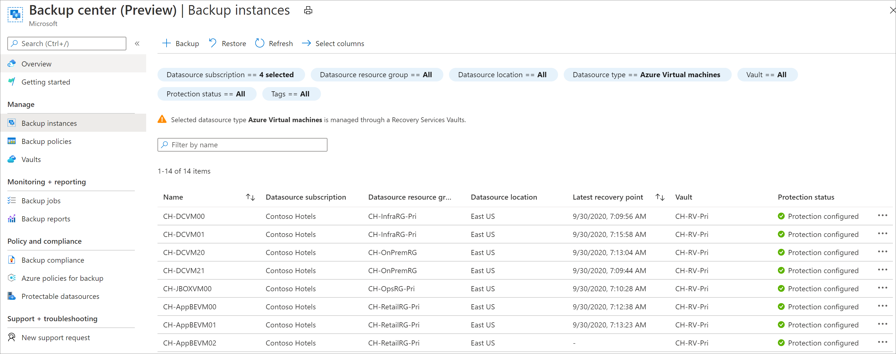
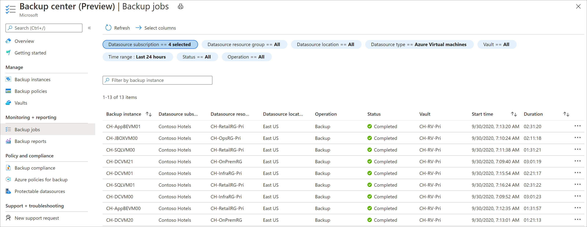
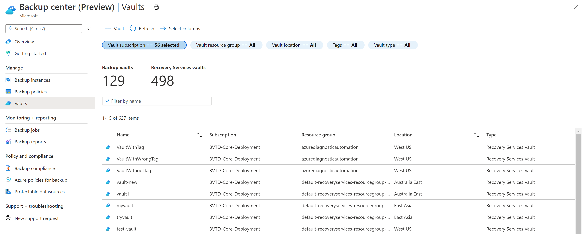
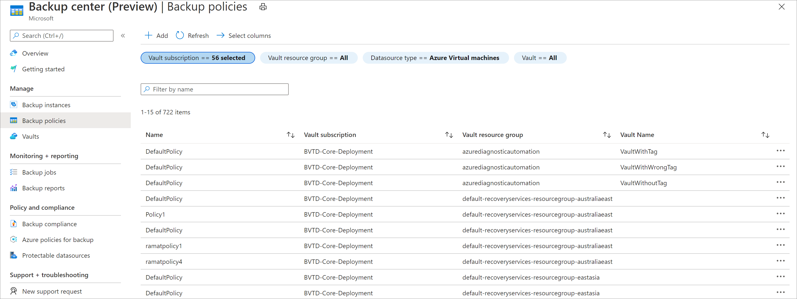

# Monitor and operate backups using Backup Center

As a backup admin, you can use Backup Center as a single pane of glass to monitor your jobs and backup inventory on a day-to-day basis. You can also use Backup Center to perform your regular operations, such as responding to on-demand backup requests, restoring backups, creating backup policies, and so on.

## Supported scenarios

* Backup Center currently supports all Azure-based workloads that are supported by Azure Backup – this includes Azure VM backup, SQL in Azure VM backup, SAP HANA in Azure VM backup, Azure File Share backup, Azure Database for PostgreSQL Server backup.
* Refer to the [support matrix]() for a detailed list of supported and unsupported scenarios.

## Backup Instances

Backup Center allows for easy search and discoverability of backup instances across your backup estate.

Selecting the **Backup Instances** tab in Backup Center lets you view details of all the backup instances that you have access to. You can view the datasource subscription, resource group, latest recovery point, vault and protection status of each backup instance. You can also filter the list by datasource subscription, resource group, location, type, vault, protection status, and datasource tags.

Right-clicking on any of the items in the grid lets you perform actions on the given backup instance, such as navigating to the resource, triggering on-demand backups and restores, or stopping backup.

## Backup Jobs

Backup Center allows you to view detailed information on all jobs that were created in your backup estate and take appropriate action for failing jobs.

Selecting the **Backup jobs** menu item in Backup Center provides a view of all your jobs, with information about backup instance, datasource subscription, resource group, location, operation, status, vault, start time and duration. Selecting an item in the grid allows you to view more details about the given job. Right-clicking on an item helps you navigate to the resource to take necessary action.

Using the **Backup jobs** tab, you can view jobs up to the last seven days. To view older jobs, use [Backup Reports]().

## Vaults

Backup Center allows you to have an aggregated and drill down view of all your vaults.

Selecting the **Vaults** menu item in Backup Center allows you to see a list of all [Recovery Services vaults]() and [Backup vaults]() that you have access to. You can filter the list by vault subscription, resource group, location, tags, and type. Selecting any item in the list allows you to navigate to a given vault.

## Backup Policies

Backup Center allows you to view and edit key information for any of your backup policies.

Selecting the **Backup Policies** menu item allows you to view all the policies that you've created across your backup estate. You can filter the list by vault subscription, resource group, datasource type, and vault. Right-clicking on an item in the grid lets you view associated items for that policy, edit the policy, or even delete it if necessary.

## Next Steps

* [Govern your backup estate]()
* [Perform actions using Backup Center]()
* [Obtain insights on your backups]()
