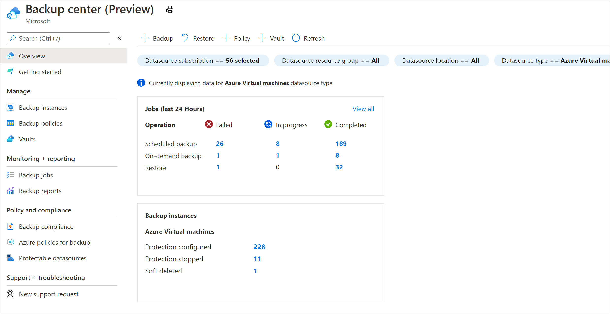

# Overview of Backup Center

Backup Center provides a **single unified management experience** in Azure for enterprises to govern, monitor, operate, and analyze backups at scale, in a manner that is consistent with Azure’s native management paradigms.

Some of the key benefits of Backup Center include:

* **Single pane of glass to manage backups** – You can use Backup Center to efficiently manage backups spanning multiple workload types, vaults, subscriptions, regions, and [Azure Lighthouse]() tenants.
* **Datasource-centric management** – Backup Center provides views and filters that are pivoted on the datasources that you're backing up (for example, VMs and databases). This allows a resource owner or a backup admin to monitor and operate backups of items without needing to focus on which vault an item is backed up to. A key feature of this design is the ability for a user to slice and dice views on the basis of datasource-specific properties, such as datasource subscription, datasource resource group, and datasource tags.
* i**Connected experiences** – Backup Center provides native integrations to existing Azure services that enable management at scale. For example, Backup Center leverages the [Azure Policy]() experience to help you govern your backups. It also leverages [Azure workbooks]() and [Azure Monitor Logs]() to help you view detailed reports on backups. So you don't need to learn any new paradigms to use the varied features that Backup Center offers.

## Supported scenarios

* Backup Center currently supports all Azure-based workloads that are supported by Azure Backup. This includes Azure VM backup, SQL in Azure VM backup, SAP HANA in Azure VM backup, Azure File Share backup, Azure Database for PostgreSQL Server backup.
* Refer to the [support matrix]() for a detailed list of supported and unsupported scenarios.

## Get Started

To get started with using Backup Center, search for **Backup Center** in the Azure portal and navigate to the **Backup Center (Preview)** dashboard.

The first screen that you see is the **Overview**. This contains two widgets – **Jobs** and **Backup instances**.

In the **Jobs** widget, you get a summarized view of all backup and restore related jobs that were triggered across your backup estate in the last 24 hours. Selecting any of the numbers in this widget allows you to view more information on jobs for a particular datasource type, operation type, and status.

In the **Backup Instances** widget, you get a summarized view of all backup instances across your backup estate. Selecting any of the numbers in this widget allows you to view more information on backup instances for a particular datasource type and protection state.

Follow the steps below to understand the different capabilities that Backup Center provides, and how you can leverage these capabilities to manage your backup estate efficiently.

## Next Steps

* [Monitor and Operate backups]()
* [Govern your backup estate]()
* [Perform actions using Backup Center]()
* [Obtain insights on your backups]()
