# Back up Windows machines by using the Azure Backup MARS agent

This article explains how to back up Windows machines by using the [Azure Backup](backup-overview.md) service and the Microsoft Azure Recovery Services (MARS) agent. MARS is also known as the Azure Backup agent.

In this article, you learn how to:

> [!div class="checklist"]
>
> * Verify the prerequisites and create a Recovery Services vault.
> * Download and set up the MARS agent.
> * Create a backup policy and schedule.
> * Perform an on-demand backup.

## About the MARS agent

Azure Backup uses the MARS agent to back up files, folders, and system state from on-premises machines and Azure VMs. Those backups are stored in a Recovery Services vault in Azure. You can run the agent:

* Directly on on-premises Windows machines. These machines can back up directly to a Recovery Services vault in Azure.
* On Azure VMs that run Windows side by side with the Azure VM backup extension. The agent backs up specific files and folders on the VM.
* On a Microsoft Azure Backup Server (MABS) instance or a System Center Data Protection Manager (DPM) server. In this scenario, machines and workloads back up to MABS or Data Protection Manager. Then MABS or Data Protection Manager uses the MARS agent to back up to a vault in Azure.

The data that's available for backup depends on where the agent is installed.

> [!NOTE]
> Generally, you back up an Azure VM by using an Azure Backup extension on the VM. This method backs up the entire VM. If you want to back up specific files and folders on the VM, install and use the MARS agent alongside the extension. For more information, see [Architecture of a built-in Azure VM backup](backup-architecture.md#architecture-built-in-azure-vm-backup).

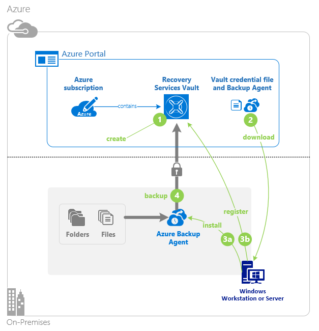

## Before you start

* Learn how [Azure Backup uses the MARS agent to back up Windows machines](backup-architecture.md#architecture-direct-backup-of-on-premises-windows-server-machines-or-azure-vm-files-or-folders).
* Learn about the [backup architecture](backup-architecture.md#architecture-back-up-to-dpmmabs) that runs the MARS agent on a secondary MABS or Data Protection Manager server.
* Review [what's supported and what you can back up](backup-support-matrix-mars-agent.md) by the MARS agent.
* Make sure that you have an Azure account if you need to back up a server or client to Azure. If you don't have an account, you can create a [free one](https://azure.microsoft.com/free/) in just a few minutes.
* Verify internet access on the machines that you want to back up.

### Verify internet access

If your machine has limited internet access, ensure that firewall settings on the machine or proxy allow the following URLs and IP addresses:

* URLs
    * `www\.msftncsi.com`
    * `*.Microsoft.com`
    * `*.WindowsAzure.com`
    * `*.microsoftonline.com`
    * `*.windows.net` 
* IP addresses
    * 20.190.128.0/18
    * 40.126.0.0/18

### Use Azure ExpressRoute

You can back up your data over Azure ExpressRoute by using public peering (available for old circuits) and Microsoft peering. Backup over private peering isn't supported.

To use public peering, first ensure access to the following domains and addresses:

* `http://www.msftncsi.com/ncsi.txt`
* `microsoft.com`
* `.WindowsAzure.com`
* `.microsoftonline.com`
* `.windows.net`

To use Microsoft peering, select the following services, regions, and relevant community values:

* Azure Active Directory (12076:5060)
* Azure region, according to the location of your Recovery Services vault
* Azure Storage, according to the location of your Recovery Services vault

For more information, see [ExpressRoute routing requirements](https://docs.microsoft.com/azure/expressroute/expressroute-routing).

> [!NOTE]
> Public peering is deprecated for new circuits.

All of the preceding URLs and IP addresses use the HTTPS protocol on port 443.

## Create a Recovery Services vault

A Recovery Services vault stores all the backups and recovery points that you create over time. It also contains the backup policy for the backed-up machines. 

To create a vault:

1. Sign in to the [Azure portal](https://portal.azure.com/) by using your Azure subscription.

1. Search for and select **Recovery Services vaults**.

    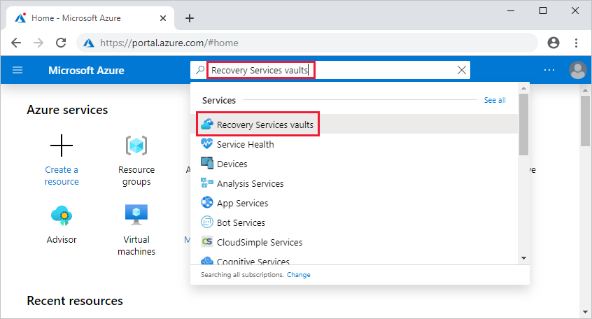

1. On the **Recovery Services vaults** menu, select **Add**.

    

1. For **Name**, enter a friendly name to identify the vault.

   * The name needs to be unique for the Azure subscription.
   * It can contain 2 to 50 characters.
   * It must start with a letter.
   * It can contain only letters, numbers, and hyphens.

1. Select the Azure subscription, resource group, and geographic region in which the vault should be created. Backup data is sent to the vault. Select **Create**.

    

    The system might take a while to create the vault. Monitor the status notifications in the upper-right area of the portal. If you don't see the vault after several minutes, select **Refresh**.

    

### Set storage redundancy

Azure Backup automatically handles storage for the vault. You specify how to replicate that storage.

1. Under **Recovery Services vaults**, select the new vault. Under **Settings**, select  **Properties**.
1. In **Properties**, under **Backup Configuration**, select **Update**.

1. Select the storage replication type, and select **Save**.

      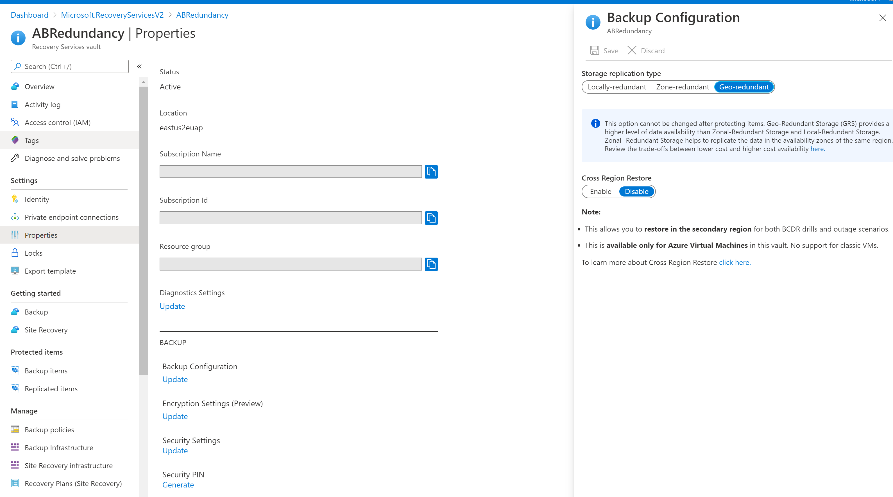

We recommend that if you use Azure as a primary backup storage endpoint, continue to use the default **Geo-redundant** setting. If you don't use Azure as a primary backup storage endpoint, select **Locally redundant** to reduce the Azure storage costs.

For more information, see [Geo-redundancy](../storage/common/storage-redundancy.md#geo-redundant-storage) and [Local redundancy](../storage/common/storage-redundancy.md#locally-redundant-storage).

## Download the MARS agent

Download the MARS agent so that you can install it on the machines that you want to back up.

If you've already installed the agent on any machines, make sure that you're running the latest version of the agent. Find the latest version in the portal, or go directly to the [download](https://aka.ms/azurebackup_agent).

1. In the vault, under **Getting Started**, select **Backup**.

    

1. Under **Where is your workload running?**, select **On-premises**. Select this option even if you want to install the MARS agent on an Azure VM.
1. Under **What do you want to back up?**, select **Files and folders**. You can also select **System State**. Many other options are available, but these options are supported only if you're running a secondary backup server. Select **Prepare Infrastructure**.

    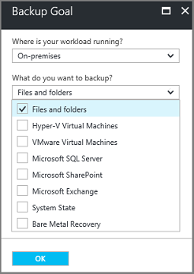

1. For **Prepare infrastructure**, under **Install Recovery Services agent**, download the MARS agent.

    

1. In the download menu, select **Save**. By default, the *MARSagentinstaller.exe* file is saved to your Downloads folder.

1. Select **Already download or using the latest Recovery Services Agent**, and then download the vault credentials.

    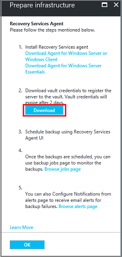

1. Select **Save**. The file is downloaded to your Downloads folder. You can't open the vault credentials file.

## Install and register the agent

1. Run the *MARSagentinstaller.exe* file on the machines that you want to back up.
1. In the MARS Agent Setup Wizard, select **Installation Settings**. There, choose where to install the agent, and choose a location for the cache. Then select **Next**.
   * Azure Backup uses the cache to store data snapshots before sending them to Azure.
   * The cache location should have free space equal to at least 5 percent of the size of the data you'll back up.

    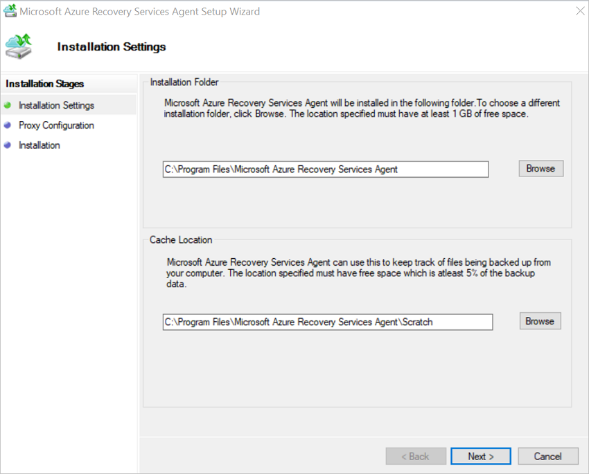

1. For **Proxy Configuration**, specify how the agent that runs on the Windows machine will connect to the internet. Then select **Next**.

   * If you use a custom proxy, specify any necessary proxy settings and credentials.
   * Remember that the agent needs access to [specific URLs](#before-you-start).

    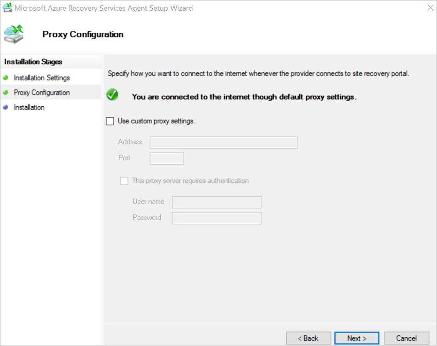

1. For **Installation**, review the prerequisites, and select **Install**.
1. After the agent is installed, select **Proceed to Registration**.
1. In **Register Server Wizard** > **Vault Identification**, browse to and select the credentials file that you downloaded. Then select **Next**.

    

1. On the **Encryption Setting** page, specify a passphrase that will be used to encrypt and decrypt backups for the machine.

    * Save the encryption passphrase in a secure location.
    * If you lose or forget the passphrase, Microsoft can't help you recover the backup data. Save the passphrase in a secure location. You need it to restore a backup.

1. Select **Finish**. The agent is now installed, and your machine is registered to the vault. You're ready to configure and schedule your backup.

## Create a backup policy

The backup policy specifies when to take snapshots of the data to create recovery points. It also specifies how long to keep recovery points. You use the MARS agent to configure a backup policy.
 
Azure Backup doesn't automatically take daylight saving time (DST) into account. This default could cause some discrepancy between the actual time and the scheduled backup time.

To create a backup policy:
1. After you download and register the MARS agent, open the agent console. You can find it by searching your machine for **Microsoft Azure Backup**.  
1. Under **Actions**, select **Schedule Backup**.

    
1. In the Schedule Backup Wizard, select  **Getting started** > **Next**.
1. Under **Select Items to Back up**, select **Add Items**.

    

1. In the **Select Items** box, select items to back up, and then select **OK**.

    

1. On the **Select Items to Back Up** page, select **Next**.
1. On the **Specify Backup Schedule** page, specify when to take daily or weekly backups. Then select **Next**.

    * A recovery point is created when a backup is taken.
    * The number of recovery points created in your environment depends on your backup schedule.
    * You can schedule up to three daily backups per day. In the following example, two daily backups occur, one at midnight and one at 6:00 PM.

        

    * You can run weekly backups too. In the following example, backups are taken every alternate Sunday and Wednesday at 9:30 AM and 1:00 AM.

        

1. On the **Select Retention Policy** page, specify how to store historical copies of your data. Then select **Next**.

    * Retention settings specify which recovery points to store and how long to store them. 
    * For a daily retention setting, you indicate that at the time specified for the daily retention, the latest recovery point will be retained for the specified number of days. Or you could specify a monthly retention policy to indicate that the recovery point created on the 30th of every month should be stored for 12 months.
    * Retention for daily and weekly recovery points usually coincides with the backup schedule. So when the schedule triggers a backup, the recovery point that the backup creates is stored for the duration that the daily or weekly retention policy specifies.
    * In the following example:

        * Daily backups at midnight and 6:00 PM are kept for seven days.
        * Backups taken on a Saturday at midnight and 6:00 PM are kept for four weeks.
        * Backups taken on the last Saturday of the month at midnight and 6:00 PM are kept for 12 months.
        * Backups taken on the last Saturday in March are kept for 10 years.

        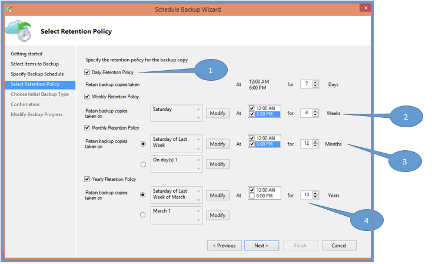

1. On the **Choose Initial Backup Type** page, decide if you want to take the initial backup over the network or use offline backup. To take the initial backup over the network, select **Automatically over the network** > **Next**.

    For more information about offline backup, see [Use Azure Data Box for offline backup](offline-backup-azure-data-box.md).

    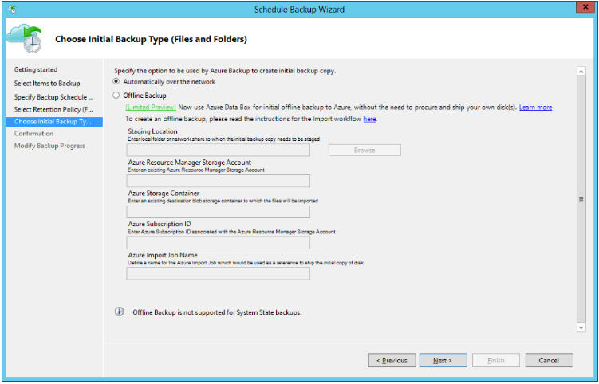

1. On the **Confirmation** page, review the information, and then select **Finish**.

    

1. After the wizard finishes creating the backup schedule, select **Close**.

    

Create a policy on each machine where the agent is installed.

### Do the initial backup offline

You can run an initial backup automatically over the network, or you can back up offline. Offline seeding for an initial backup is useful if you have large amounts of data that will require a lot of network bandwidth to transfer. 

To do an offline transfer:

1. Write the backup data to a staging location.
1. Use the AzureOfflineBackupDiskPrep tool to copy the data from the staging location to one or more SATA disks. 

    The tool creates an Azure Import job. For more information, see [What is the Azure Import/Export service](https://docs.microsoft.com/azure/storage/common/storage-import-export-service).
1. Send the SATA disks to an Azure datacenter. 

    At the datacenter, the disk data is copied to an Azure storage account. Azure Backup copies the data from the storage account to the vault, and incremental backups are scheduled.

For more information about offline seeding, see [Use Azure Data Box for offline backup](offline-backup-azure-data-box.md).

### Enable network throttling

You can control how the MARS agent uses network bandwidth by enabling network throttling. Throttling is helpful if you need to back up data during work hours but you want to control how much bandwidth the backup and restore activity uses.

Network throttling in Azure Backup uses [Quality of Service (QoS)](https://docs.microsoft.com/windows-server/networking/technologies/qos/qos-policy-top) on the local operating system.

Network throttling for backups is available on Windows Server 2012 and later, and on Windows 8 and later. Operating systems should be running the latest service packs.

To enable network throttling:

1. In the MARS agent, select **Change Properties**.
1. On the **Throttling** tab, select **Enable internet bandwidth usage throttling for backup operations**.

    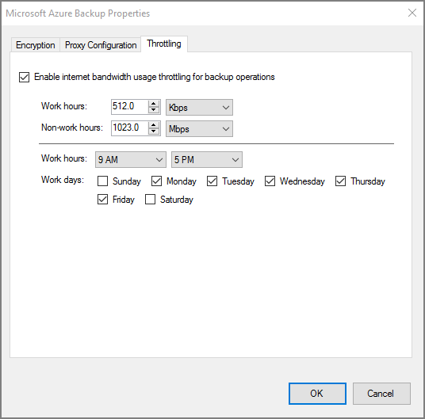
1. Specify the allowed bandwidth during work hours and nonwork hours. Bandwidth values begin at 512 Kbps and go up to 1,023 MBps. Then select **OK**.

## Run an on-demand backup

1. In the MARS agent, select **Back Up Now**.

    

1. If the MARS agent version is 2.0.9169.0 or newer, then you can set a custom retention date. In the **Retain Backup Till** section, choose a date from the calendar.

   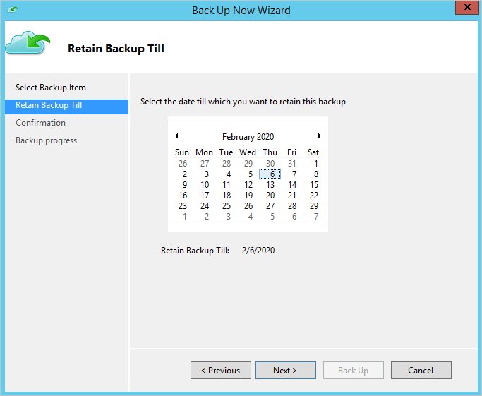

1. On the **Confirmation** page, review the settings, and select **Back Up**.
1. Select **Close** to close the wizard. If you close the wizard before the backup finishes, the wizard continues to run in the background.

After the initial backup finishes, the **Job completed** status appears in the Backup console.

## Set up on-demand backup policy retention behavior

> [!NOTE]
> This information applies only to MARS agent versions that are older than 2.0.9169.0.
>

| Backup-schedule option | Duration of data retention
| -- | --
| Day | **Default retention**: Equivalent to the "retention in days for daily backups."    **Exception**: If a daily scheduled backup that's set for long-term retention (weeks, months, or years) fails, an on-demand backup that's triggered right after the failure is considered for long-term retention. Otherwise, the next scheduled backup is considered for long-term retention.   **Example scenario**: The scheduled backup on Thursday at 8:00 AM failed. This backup was to be considered for weekly, monthly, or yearly retention. So the first on-demand backup triggered before the next scheduled backup on Friday at 8:00 AM is automatically tagged for weekly, monthly, or yearly retention. This backup substitutes for the Thursday 8:00 AM backup.
| Week | **Default retention**: One day. On-demand backups that are taken for a data source that has a weekly backup policy are deleted the next day. They're deleted even if they're the most recent backups for the data source.    **Exception**: If a weekly scheduled backup that's set for long-term retention (weeks, months, or years) fails, an on-demand backup that's triggered right after the failure is considered for long-term retention. Otherwise, the next scheduled backup is considered for long-term retention.    **Example scenario**: The scheduled backup on Thursday at 8:00 AM failed. This backup was to be considered for monthly or yearly retention. So the first on-demand backup that's triggered before the next scheduled backup on Thursday at 8:00 AM is automatically tagged for monthly or yearly retention. This backup substitutes for the Thursday 8:00 AM backup.

For more information, see [Create a backup policy](#create-a-backup-policy).

## Next steps

Learn how to [Restore files in Azure](backup-azure-restore-windows-server.md).
