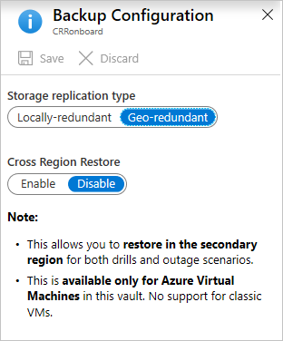
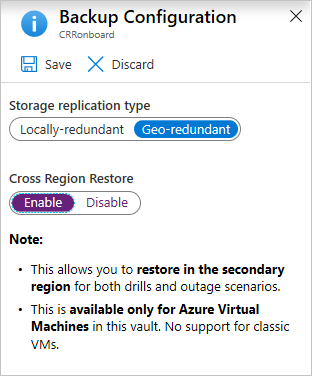

# Create a Recovery Services vault

[!INCLUDE [How to create a Recovery Services vault](../../includes/backup-create-rs-vault.md)]

## Set storage redundancy

Azure Backup automatically handles storage for the vault. You need to specify how that storage is replicated.

1. From the **Recovery Services vaults** blade, click the new vault. Under the **Settings** section, click  **Properties**.
2. In **Properties**, under **Backup Configuration**, click **Update**.

3. Select the storage replication type, and click **Save**.

     

   - We recommend that if you're using Azure as a primary backup storage endpoint, continue to use the default **Geo-redundant** setting.
   - If you don't use Azure as a primary backup storage endpoint, then choose **Locally redundant**, which reduces the Azure storage costs.
   - Learn more about [geo](../storage/common/storage-redundancy-grs.md) and [local](../storage/common/storage-redundancy-lrs.md) redundancy.

> [!NOTE]
> Changing **Storage Replication type** (Locally redundant/ Geo-redundant) for a Recovery services vault has to be done before configuring backups in the vault. Once you configure backup, the option to modify is disabled.
>
>- If you haven't yet configured the backup, then follow these [steps](https://docs.microsoft.com/azure/backup/backup-create-rs-vault#set-storage-redundancy) to review and modify the settings.
>- If you've already configured the backup and must move from GRS to LRS, then review [these](backup-azure-backup-faq.md#can-i-change-from-grs-to-lrs-after-a-backup) workarounds.

## Set Cross Region Restore

As one of the restore options, Cross Region Restore (CRR) allows you to restore Azure VMs in a secondary region, which is an [Azure paired region](https://docs.microsoft.com/azure/best-practices-availability-paired-regions). This option allows you to:

- conduct drills when there's an audit or compliance requirement
- restore the VM or its disk if there's a disaster in the primary region.

To choose this feature, select **Enable Cross Region Restore** from the **Backup Configuration** blade.

For this process, there are pricing implications as it is at the storage level.

>[!NOTE]
>Before you begin:
>
>- Review the [support matrix](backup-support-matrix.md#cross-region-restore) for a list of supported managed types and regions.
>- The Cross Region Restore (CRR) feature is now previewed in all Azure public regions.
>- CRR is a vault level opt-in feature for any GRS vault (turned off by default).
>- After opting-in, it might take up to 48 hours for the backup items to be available in secondary regions.
>- Currently CRR is supported only for Backup Management Type - ARM Azure VM (classic Azure VM will not be supported).  When additional management types support CRR, then they will be **automatically** enrolled.
>- Cross Region Restore currently cannot be reverted back to GRS or LRS once the protection is initiated for the first time.

### Configure Cross Region Restore

A vault created with GRS redundancy includes the option to configure the Cross Region Restore feature. Every GRS vault will have a banner, which will link to the documentation. To configure CRR for the vault, go to the Backup Configuration blade, which contains the option to enable this feature.

 

1. From the portal, go to Recovery Services vault > Settings > Properties.
2. Click **Enable Cross Region Restore in this vault** to enable the functionality.

   

   

Learn how to [view backup items in the secondary region](backup-azure-arm-restore-vms.md#view-backup-items-in-secondary-region).

Learn how to [restore in the secondary region](backup-azure-arm-restore-vms.md#restore-in-secondary-region).

Learn how to [monitor secondary region restore jobs](backup-azure-arm-restore-vms.md#monitoring-secondary-region-restore-jobs).

## Modifying default settings

We highly recommend you review the default settings for **Storage Replication type** and **Security settings** before configuring backups in the vault.

- **Storage Replication type** by default is set to **Geo-redundant** (GRS). Once you configure the backup, the option to modify is disabled.
  - If you haven't yet configured the backup, then follow these [steps](https://docs.microsoft.com/azure/backup/backup-create-rs-vault#set-storage-redundancy) to review and modify the settings.
  - If you've already configured the backup and must move from GRS to LRS, then review [these](backup-azure-backup-faq.md#can-i-change-from-grs-to-lrs-after-a-backup) workarounds.

- **Soft delete** by default is **Enabled** on newly created vaults to protect backup data from accidental or malicious deletes. Follow these [steps](https://docs.microsoft.com/azure/backup/backup-azure-security-feature-cloud#enabling-and-disabling-soft-delete) to review and modify the settings.

## Next steps

[Learn about](backup-azure-recovery-services-vault-overview.md) Recovery Services vaults.
[Learn about](backup-azure-delete-vault.md) Delete Recovery Services vaults.
