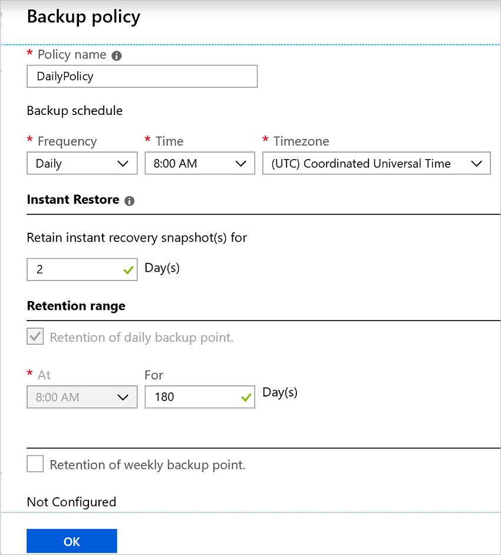

# Enable backup when you create an Azure virtual machine

Use the Azure Backup service to back up Azure virtual machines (VMs). VMs are backed up according to a schedule specified in a backup policy, and recovery points are created from backups. Recovery points are stored in Recovery Services vaults.

This article details how to enable backup while you're creating a virtual machine (VM) in the Azure portal.  

## Before you start

- [Check](backup-support-matrix-iaas.md#supported-backup-actions) what operating systems are supported if you want to enable backup when you create a VM.

## Sign in to Azure

If you aren't already signed in to your account, sign in to the [Azure portal](https://portal.azure.com).
 
## Create a VM with Backup configured

1. In Azure portal, click **Create a resource**.

2. In the Azure Marketplace, click **Compute**, and then select a VM image.

3. Set up the VM in accordance with the [Windows](https://docs.microsoft.com/azure/virtual-machines/windows/quick-create-portal) or [Linux](https://docs.microsoft.com/azure/virtual-machines/linux/quick-create-portal) instructions.

4. On the **Management** tab, in **Enable backup**, click **On**.
5. Azure Backup backups to a Recovery Services vault. Click **Create New** if you don't have an existing vault.
6. Accept the suggested vault name or specify your own.
7. Specify or create a resource group in which the vault will be located. The resource group vault can be different from the VM resource group.

     

8. Accept the default backup policy, or modify the settings.
    - A backup policy specifies how frequently to take backup snapshots of the VM, and how long to keep those backup copies. 
    - The default policy backs up the VM once a day.
    - You can customize your own backup policy for an Azure VM to take backups daily or weekly. [Learn more]()
    - [Learn more](backup-azure-vms-introduction.md#backup-and-restore-considerations) about backup considerations for Azure VMs.
    - [Learn more](backup-instant-restore-capability.md) about the instant restore functionality.

       

## Start a backup after creating the VM 

Your VM backup will run in accordance with your backup policy. However, we recommend that you run an initial backup. 

After the VM is created, do the following:

1. In the VM properties, click **Backup**. The VM status is Initial Backup Pending until the initial backup runs
2. Click **Back up now** to run an on-demand backup.

    ![Run an on-demand backup]](./media/backup-during-vm-creation/run-backup.png) 

## Use a Resource Manager template to deploy a protected VM

The previous steps explain how to use the Azure portal to create a virtual machine and protect it in a Recovery Services vault. To quickly deploy one or more virtual machines and protect them in a Recovery Services vault, see the template [Deploy a Windows VM and enable backup](https://azure.microsoft.com/resources/templates/101-recovery-services-create-vm-and-configure-backup/).

## Next steps 

Now that you've protected your VM, learn how to manage and restore them.

- [Manage and monitor VMs](backup-azure-manage-vms.md) 
- [Restore VM](backup-azure-arm-restore-vms.md) 

If you encounter any issues, [review](backup-azure-vms-troubleshoot.md) the troubleshooting guide.
