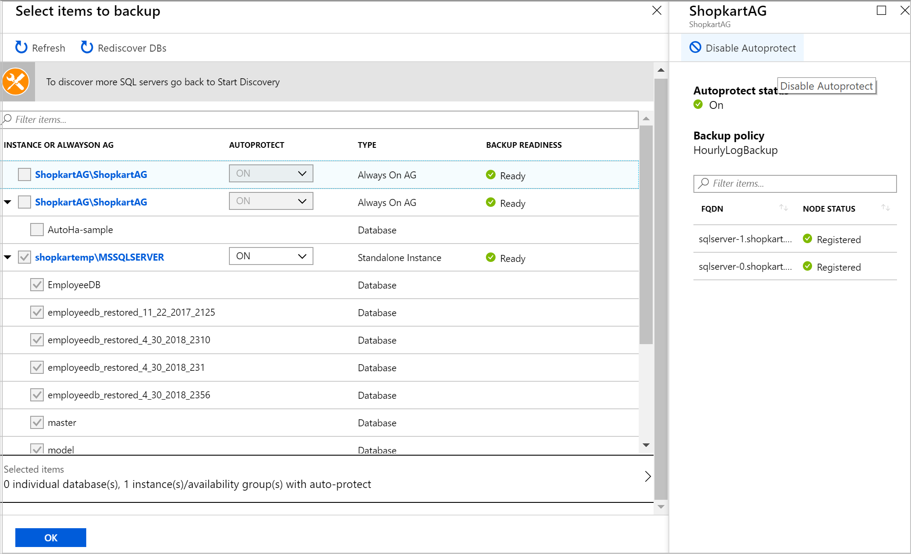
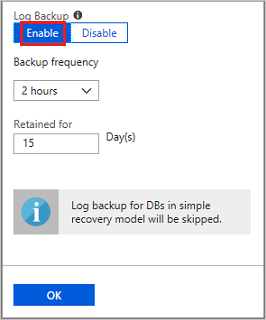

# Back up SQL Server databases in Azure VMs

SQL Server databases are critical workloads that require a low recovery point objective (RPO) and long-term retention. You can backup SQL Server databases running on Azure VMs using [Azure Backup](backup-overview.md).

This article shows you how to back up a SQL Server database running on an Azure VM to an Azure Backup Recovery Services vault. In this article, you learn how to:

> [!div class="checklist"]
> * Create and configure a vault.
> * Discover databases, and set up backups.
> * Set up auto-protection for databases.

[!INCLUDE [How to create a Recovery Services vault](../../includes/backup-create-rs-vault.md)]

## Discover SQL Server databases

Discover databases running on the VM.
1. In the [Azure portal](https://portal.azure.com), open the Recovery Services vault you use to back up the database.

2. On the **Recovery Services vault** dashboard, select **Backup**.

   

3. In **Backup Goal**, set **Where is your workload running** to **Azure** (the default).

4. In **What do you want to backup**, select **SQL Server in Azure VM**.

    

5. In **Backup Goal** > **Discover DBs in VMs**, select **Start Discovery** to search for unprotected VMs in the subscription. It can take a while, depending on the number of unprotected virtual machines in the subscription.

  - Unprotected VMs should appear in the list after discovery, listed by name and resource group.
  - If a VM isn't listed as you expect, check whether it's already backed up in a vault.
  - Multiple VMs can have the same name but they'll belong to different resource groups.

    

6. In the VM list, select the VM running the SQL Server database > **Discover DBs**.

7. Track database discovery in the **Notifications** area. It can take a while for the job to complete, depending on how many databases are on the VM. When the selected databases are discovered, a success message appears.

    

8. Azure Backup discovers all SQL Server databases on the VM. During discovery the following occurs in the background:

    - Azure Backup register the VM with the vault for workload backup. All databases on the registered VM can only be backed up to this vault.
    - Azure Backup installs the **AzureBackupWindowsWorkload** extension on the VM. No agent is installed on the SQL database.
    - Azure Backup creates the service account **NT Service\AzureWLBackupPluginSvc** on the VM.
      - All backup and restore operations use the service account.
      - **NT Service\AzureWLBackupPluginSvc** needs SQL sysadmin permissions. All SQL Server VMs created in the Azure Marketplace come with the **SqlIaaSExtension** installed. The **AzureBackupWindowsWorkload** extension uses the **SQLIaaSExtension** to automatically get the required permissions.
    - If you didn't create the VM from the marketplace, then the VM doesn't have the **SqlIaaSExtension** installed, and the discovery operation fails with the error message **UserErrorSQLNoSysAdminMembership**. Follow the instructions in [#fix-sql-sysadmin-permissions] to fix this issue.

        

## Configure backup  

Configure backup as follows:

1.  In **Backup Goal** select **Configure Backup**.

    

2. Click **Configure Backup**, the **Select items to backup** blade appears. This lists all the registered availability groups and standalone SQL Servers. Expand the chevron to the left of the row to see all the unprotected databases in that instance or Always on AG.  

    

3.  Select all the databases you want to protect > **OK**.

    

    To optimize backup loads, Azure Backup sets a maximum number of databases in one backup job to 50.

      * To protect more than 50 databases, configure multiple backups.
      * Alternatively, you can enable [auto-protection](backup-azure-sql-database.md#enable-auto-protection) on the entire instance or Always On Availability group by selecting the **ON** option in the corresponding dropdown in the **AUTOPROTECT** column. The [auto-protection](backup-azure-sql-database.md#enable-auto-protection) feature not only enables protection on all the existing databases in one go but also automatically protects any new databases that will be added to that instance or the availability group in future.  

## Enable auto-protection  

Enable auto-protection to automatically back up all existing databases, and databases that are added in the future to a standalone SQL Server instance or a SQL Server Always On Availability group.

  - When you turn on auto-protection and select a policy, the existing protected databases will continue to use previous policy.
  - There's no limit on the number of databases you can select for auto-protection in one go.

Enable auto-protection as follows:

1. In **Items to backup**, select the instance for which you want to enable auto-protection.
2. Select the dropdown under **Autoprotect**, and set to **On**. Then click **OK**.

    

3. Backup is configured for all the databases together and can be tracked in **Backup Jobs**.

If you need to disable auto-protection, click the instance name under **Configure Backup**, and select **Disable Auto-protect** for the instance. All databases will continue to back up. But future databases won't be automatically protected.

4. Click **OK** to open the **Backup policy** blade.

    

4. In Choose backup policy, select a policy, then click OK.

    - Select the default policy: HourlyLogBackup.
    - Choose an existing backup policy previously created for SQL.
    - [Define a new policy](backup-azure-sql-database.md#configure-a-backup-policy) based on your RPO and retention range.

  

5. On **Backup** menu, select **Enable backup**.

  

6. Track the configuration progress in the **Notifications** area of the portal.

  

### Create a backup policy

A backup policy defines when backups are taken and how long they're retained.

- A policy is created at the vault level.
- Multiple vaults can use the same backup policy, but you must apply the backup policy to each vault.
- When you create a backup policy, a daily full backup is the default.
- You can add a differential backup, but only if you configure full backups to occur weekly.
- [Learn about](backup-architecture.md#sql-server-backup-types) different types of backup policies.

To create a backup policy:

1. In the vault, click **Backup policies** > **Add**.
2. In **Add** menu, click **SQL Server in Azure VM**. This defines the policy type.

   

3. In **Policy name**, enter a name for the new policy.
4. In **Full Backup policy**, select a **Backup Frequency**, choose **Daily** or **Weekly**.

    - For **Daily**, select the hour and time zone when the backup job begins.
    - You must run a full backup, you can't turn off the **Full Backup** option.
    - Click **Full Backup** to view the policy.
    - You can't create differential backups for daily full backups.
    - For **Weekly**, select the day of the week, hour, and time zone when the backup job begins.

      

5. For **Retention Range**, by default all options are selected. Clear any undesired retention range limits you don't want to use, and set the intervals to use.

    - Minimum retention period  for any type of backup (full/differential/log) is 7 days.
    - Recovery points are tagged for retention based on their retention range. For example, if you select a daily full backup, only one full backup is triggered each day.
    - The backup for a specific day is tagged and retained based on the weekly retention range and your weekly retention setting.
    - The monthly and yearly retention ranges behave in a similar way.

   

6. In the **Full Backup policy** menu, select **OK** to accept the settings.
7. To add a differential backup policy, select **Differential Backup**.

   
   

8. In **Differential Backup policy**, select **Enable** to open the frequency and retention controls.

    - At most, you can trigger one differential backup per day.
    - Differential backups can be retained for a maximum of 180 days. If you need longer retention, you must use full backups.

9. Select **OK** to save the policy and return to the main **Backup policy** menu.

10. To add a transactional log backup policy, select **Log Backup**.
11. In **Log Backup**, select **Enable**, and then set the frequency and retention controls. Log backups can occur as often as every 15 minutes, and can be retained for up to 35 days.
12. Select **OK** to save the policy and return to the main **Backup policy** menu.

   

13. On the **Backup policy** menu, choose whether to enable **SQL Backup Compression**.
    - Compression is disabled by default.
    - On the back end, Azure Backup uses SQL native backup compression.

14. After you complete the edits to the backup policy, select **OK**.

### Modify policy
Modify policy to change backup frequency or retention range.

> [!NOTE]
> Any change in the retention period will be applied retrospectively to all the older recovery points besides the new ones.

In the vault dashboard, go to **Manage** > **Backup Policies** and choose the policy you want to edit.

  

 
## Next steps

- [Learn about](restore-sql-database-azure-vm.md) restoring backed up SQL Server databases.
- [Learn about](manage-monitor-sql-database-backup.md) managing backed up SQL Server databases.
