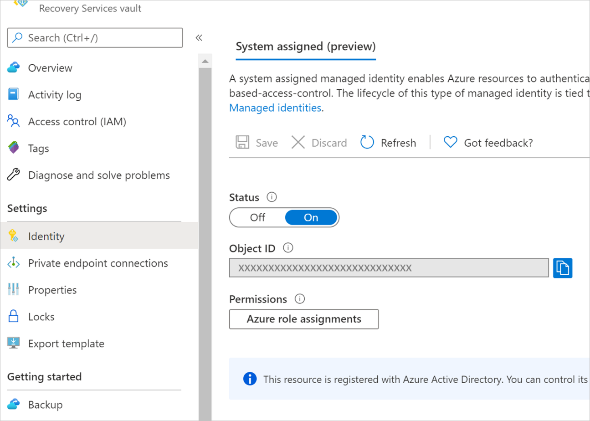
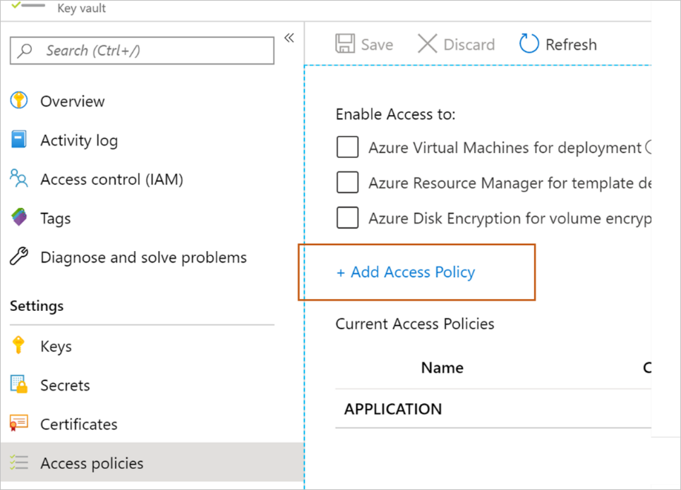
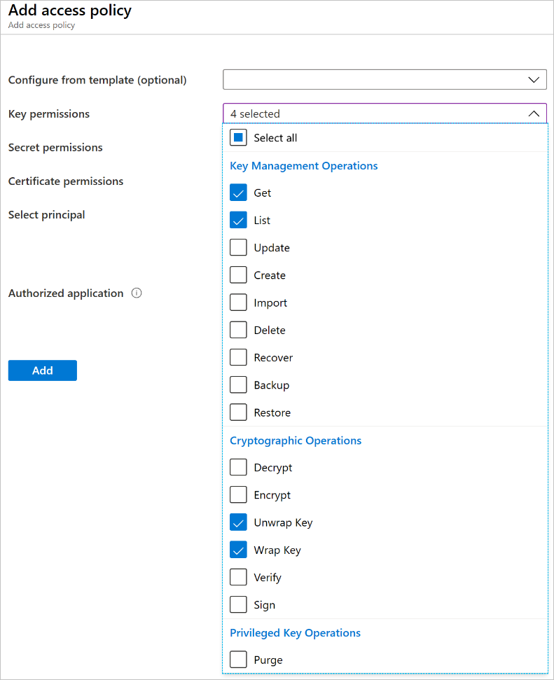
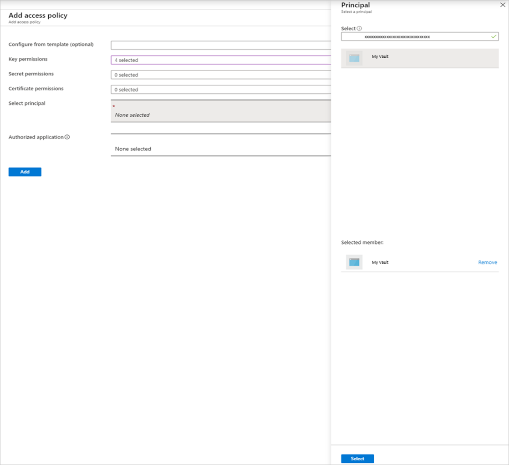
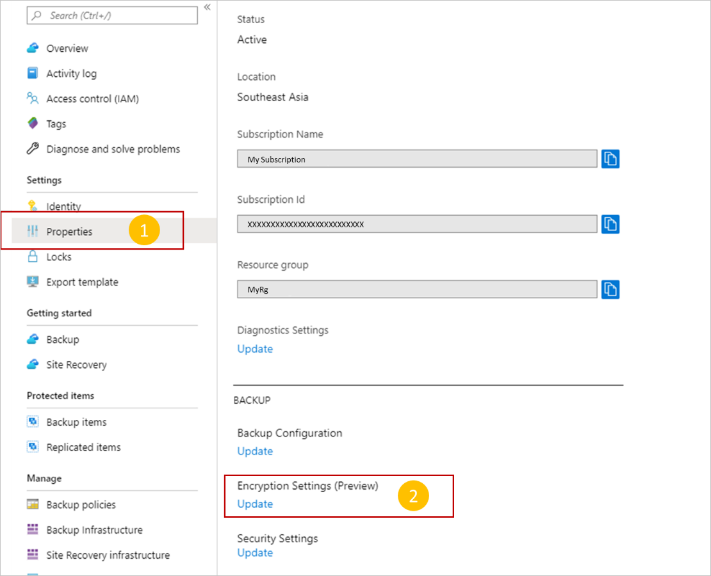
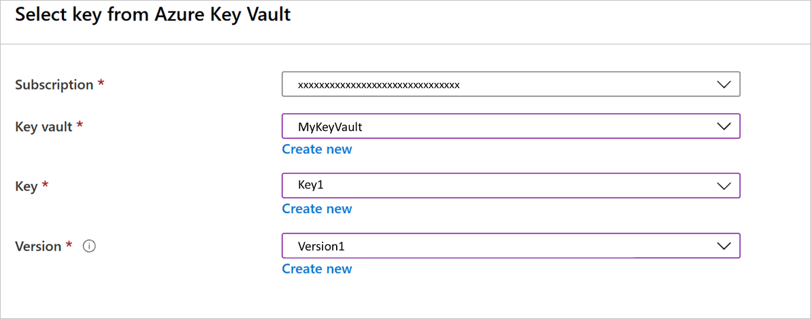
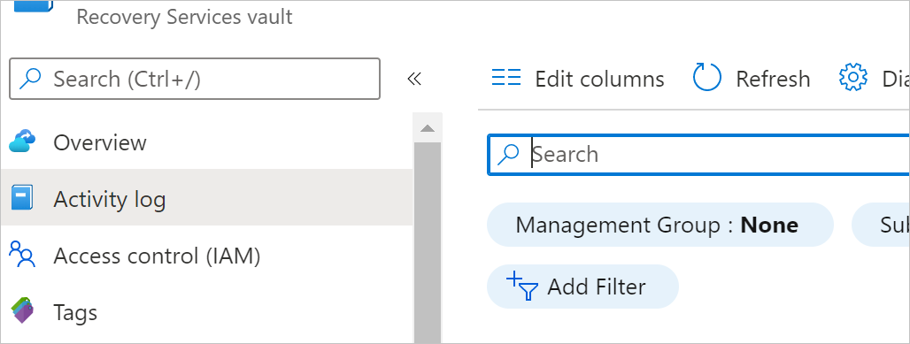

# Encryption of backup data using customer-managed keys

Azure Backup allows you to encrypt your backup data using customer-managed keys (CMK) instead of using platform-managed keys, which is enabled by default. Your keys that are used for encrypting the backup data must be stored in [Azure Key Vault](https://docs.microsoft.com/azure/key-vault/).

The encryption key used for encrypting backups may be different from the one used for the source. The data is protected using an AES 256 based data encryption key (DEK), which, in turn, is protected using your keys (KEK). This gives you full control over the data and the keys. To allow encryption, it's required that the Recovery Services vault be granted access to the encryption key in the Azure Key Vault. You can change the key as and when required.

This article discusses the following:

- Creating a Recovery Services vault
- Configuring your Recovery Services vault to encrypt backup data using customer-managed keys
- Performing backup to vaults encrypted using customer-managed keys
- Restoring data from backups

## Before you start

- This feature allows you to encrypt **new Recovery Services vaults only**. Any vaults containing existing items registered or attempted to be registered to it aren't supported.

- Once enabled for a Recovery Services vault, encryption using customer-managed keys can't be reverted back to using platform-managed keys (default). You can change the encryption keys according to your requirements.

- This feature currently **doesn't support backup using MARS agent**, and you may not be able to use a CMK-encrypted vault for the same. The MARS agent uses a user passphrase-based encryption. This feature also doesn't support backup of classic VMs.

- This feature isn't related to [Azure Disk Encryption](https://docs.microsoft.com/azure/security/fundamentals/azure-disk-encryption-vms-vmss), which uses guest-based encryption of a VM's disks using BitLocker (for Windows) and DM-Crypt (for Linux)

- The Recovery Services vault can be encrypted only with keys stored in an Azure Key Vault, located in the **same region**. Also, keys must be **RSA 2048 keys** only and should be in **enabled** state.

- Moving CMK encrypted Recovery Services vault across Resource Groups and Subscriptions isn't currently supported.

- This feature is currently configurable from the Azure portal only.

[!INCLUDE [How to create a Recovery Services vault](../../includes/backup-create-rs-vault.md)]

## Configuring a vault to encrypt using customer-managed keys

This section involves the following steps:

1. Enable managed identity for your Recovery Services vault

1. Assign permissions to the vault to access the encryption key in the Azure Key Vault

1. Enable soft-delete and purge protection on the Azure Key Vault

1. Assign the encryption key to the Recovery Services vault

It's necessary that all these steps are followed in the order mentioned above to achieve the intended results. Each step is discussed in detail below.

### Enable managed identity for your Recovery Services Vault

Azure Backup uses system assigned managed identity to authenticate the Recovery Services vault to access encryption keys stored in the Azure Key Vault. To enable managed identity for your Recovery Services vault, follow the steps mentioned below.

>[!NOTE]
>Once enabled, the managed identity must NOT be disabled (even temporarily). Disabling the managed identity may lead to inconsistent behavior.

1. Go to your Recovery Services vault -> **Identity**

    

1. Change the **Status** to **On** and click **Save**.

1. An Object ID is generated, which is the system-assigned managed identity of the vault.

### Assign permissions to the Recovery Services vault to access the encryption key in the Azure Key Vault

You now need to permit the Recovery Services vault to access the Azure Key Vault that contains the encryption key. This is done by allowing the Recovery Services vault’s managed identity to access the Key Vault.

1. Go to your Azure Key Vault -> **Access Policies**. Continue to **+Add Access Policies**.

    

1. Under **Key Permissions**, select **Get**, **List**, **Unwrap Key** and **Wrap Key** operations. This specifies the actions on the key that will be permitted.

    

1. Go to **Select Principal** and search for your vault in the search box using its name or managed identity. Once it shows up, select the vault and click **Select** at the bottom of the pane.

    

1. Once done, click **Add** to add the new access policy.

1. Click **Save** to save changes made to the access policy of the Azure Key Vault.

### Enable soft-delete and purge protection on the Azure Key Vault

You need to **enable soft delete and purge protection** on your Azure Key Vault that stores your encryption key. You can do this from the Azure Key Vault UI as shown below. (Alternatively, these properties can be set while creating the Key Vault). Read more about these Key Vault properties [here](https://docs.microsoft.com/azure/key-vault/general/overview-soft-delete).


You can also enable soft delete and purge protection through PowerShell using the steps below:

1. Sign in to your Azure Account.

    ```azurepowershell
    Login-AzAccount
    ```

1. Select the subscription that contains your vault.

    ```azurepowershell
    Set-AzContext -SubscriptionId SubscriptionId
    ```

1. Enable soft delete

    ```azurepowershell
    ($resource = Get-AzResource -ResourceId (Get-AzKeyVault -VaultName "AzureKeyVaultName").ResourceId).Properties | Add-Member -MemberType "NoteProperty" -Name "enableSoftDelete" -Value "true"
    ```

    ```azurepowershell
    Set-AzResource -resourceid $resource.ResourceId -Properties $resource.Properties
    ```

1. Enable purge protection

    ```azurepowershell
    ($resource = Get-AzResource -ResourceId (Get-AzKeyVault -VaultName "AzureKeyVaultName").ResourceId).Properties | Add-Member -MemberType "NoteProperty" -Name "enablePurgeProtection" -Value "true"
    ```

    ```azurepowershell
    Set-AzResource -resourceid $resource.ResourceId -Properties $resource.Properties
    ```

### Assign encryption key to the RS vault

>[!NOTE]
> Before proceeding further, please ensure the following:
>
> - All the steps mentioned above have been completed successfully:
>   - The Recovery Services vault’s managed identity has been enabled, and has been assigned required permissions
>   - The Azure Key Vault has soft-delete and purge-protection enabled
> - The Recovery Services vault for which you want to enable CMK encryption DOES NOT have any items protected or registered to it

Once the above are ensured, continue with selecting the encryption key for your vault.

To assign the key:

1. Go to your Recovery Services vault -> **Properties**

    

1. Click **Update** under **Encryption Settings**.

1. In the Encryption Settings pane, select **Use your own key** and continue to specify the key using one of the following ways. **Ensure that the key you want to use is an RSA 2048 key, which is in an enabled state.**

    1. Enter the **Key URI** with which you want to encrypt the data in this Recovery Services vault. You  also need to specify the subscription in which the Azure Key Vault (that contains this key) is present. This key URI can be obtained from the corresponding key in your Azure Key Vault. Ensure the key URI is copied correctly. It's recommended that you use the **Copy to clipboard** button provided with the key identifier.

        

    1. Browse and select the key from the Key Vault in the key picker pane.

        

1. Click **Save**.

1. **Tracking progress of encryption key update:** You can track the progress of the key assignment using the **Activity Log** in the Recovery Services vault. The status should soon change to **Succeeded**. Your vault will now encrypt all the data with the specified key as KEK.

    

    

>[!NOTE]
> This process remains the same when you wish to update/change the encryption key. If you wish to update and use a key from another Key Vault (different from the one that is being currently used), make sure that:
>
> - The Key Vault is located in the same region as the Recovery Services Vault
>
> - The Key vault has soft-delete and purge protection enabled
>
> - The Recovery Services vault has the required permissions to access the Key Vault.

## Backing up to a vault encrypted with customer-managed keys

Before proceeding to configure protection, we strongly recommend you ensure the following checklist is adhered to. This is important since once an item has been configured to be backed up (or attempted to be configured) to a non-CMK encrypted vault, encryption using customer-managed keys can't be enabled on it and it will continue to use platform-managed keys.

>[!IMPORTANT]
> Before proceeding to configure protection, you must have **successfully** completed the following steps:
>
>1. Enabled your subscription to use customer-managed keys for your Backup vault.
>1. Created your Backup vault
>1. Enabled the Backup vault’s system-assigned Managed Identity
>1. Assigned permissions to your Backup Vault to access encryption keys from your Key Vault
>1. Enabled soft delete and purge protection for your Key Vault
>1. Assigned a valid encryption key for your Backup vault
>
>If all the above steps have been confirmed, only then proceed with configuring backup.

The process to configure and perform backups to a Recovery Services vault encrypted with customer-managed keys is the same as to a vault that uses platform-managed keys, with **no changes to the experience**. This holds true for [backup of Azure VMs](https://docs.microsoft.com/azure/backup/quick-backup-vm-portal) as well as backup of workloads running inside a VM (for example, [SAP HANA](https://docs.microsoft.com/azure/backup/tutorial-backup-sap-hana-db), [SQL Server](https://docs.microsoft.com/azure/backup/tutorial-sql-backup) databases).

## Restoring data from backup

### VM backup

Data stored in the Recovery Services vault can be restored according to the steps described [here](https://docs.microsoft.com/azure/backup/backup-azure-arm-restore-vms). When restoring from a Recovery Services vault encrypted using customer-managed keys, you can choose to encrypt the restored data with a Disk Encryption Set (DES).

#### Restoring VM / disk

1. When recovering disk / VM from a "Snapshot" recovery point, the restored data will be encrypted with the DES used for encrypting the source VM’s disks.

1. When restoring disk / VM from a recovery point with Recovery Type as "Vault", you can choose to have the restored data encrypted using a DES, specified at the time of restore. Alternatively, you can choose to continue with the restore the data without specifying a DES, in which case it will be encrypted using Microsoft-managed keys.

You can encrypt the restored disk / VM after the restore is complete, regardless of the selection made while initiating the restore.


#### Select a Disk Encryption Set while restoring from Vault Recovery Point

The Disk Encryption Set is specified under Encryption Settings in the restore pane, as shown below:

1. In the **Encrypt disk(s) using your key**, select **Yes**.

1. From the dropdown, select the DES you wish to use for the restored disk(s). **Ensure you have access to the DES.**

>[!NOTE]
>The ability to choose a DES while restoring is not available if you are restoring a VM that uses Azure Disk Encryption.


#### Restoring files

When performing a file restore, the restored data will be encrypted with the key used for encrypting the target location.

### Restoring SAP HANA/SQL databases in Azure VMs

When restoring from a backed-up SAP HANA/SQL database running in an Azure VM, the restored data will be encrypted using the encryption key used at the target storage location. It may be a customer-managed key or a platform-managed key used for encrypting the disks of the VM.

## Frequently asked questions

### Can I encrypt an existing Backup vault with customer-managed keys?

No, CMK encryption can be enabled for new vaults only. So the vault must never have had any items protected to it. In fact, no attempts to protect any items to the vault must be made before enabling encryption using customer-managed keys.

### I tried to protect an item to my vault, but it failed, and the vault still doesn't contain any items protected to it. Can I enable CMK encryption for this vault?

No, the vault must not have had any attempts to protect any items to it in the past.

### I have a vault that is using CMK encryption. Can I later revert to encryption using platform-managed keys even if I have backup items protected to the vault?

No, once you've enabled CMK encryption, it can't be reverted to use platform-managed keys. You can change the keys used according to your requirements.

### Does CMK encryption for Azure Backup also apply to Azure Site Recovery?

No, this article discusses encryption of Backup data only. For Azure Site Recovery, you need to set the property separately as available from the service.

### I missed one of the steps in this article and went on to protect my data source. Can I still use CMK encryption?

Not following the steps in the article and continuing to protect items may lead to the vault not being able to use encryption using customer-managed keys. It's therefore recommended you refer to [this checklist](#backing-up-to-a-recovery-services-vault-encrypted-with-customer-managed-keys) before proceeding to protect items.

### Does using CMK-encryption add to the cost of my backups?

Using CMK encryption for Backup doesn't incur any additional costs to you. You may, however, continue to incur costs for using your Azure Key Vault where your key is stored.

## Next steps

- [Overview of security features in Azure Backup](security-overview.md)
