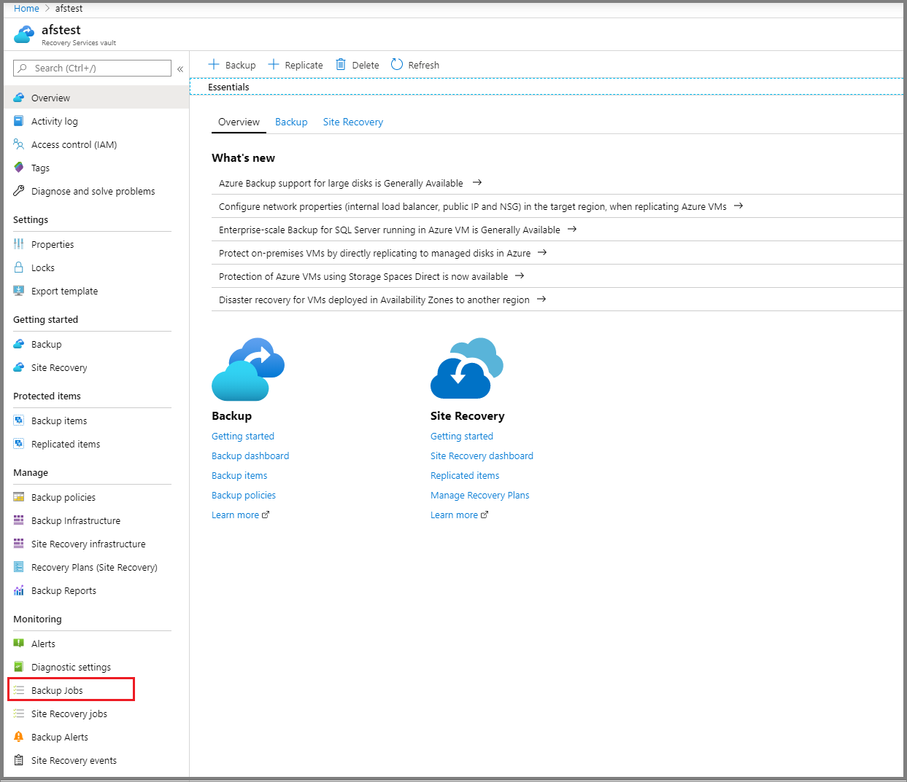
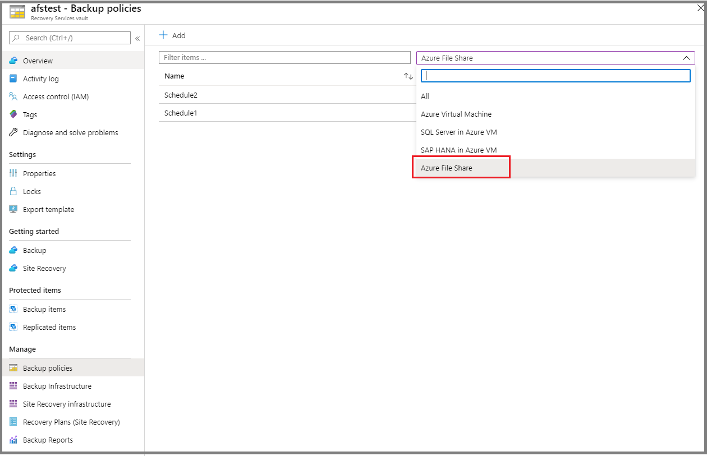
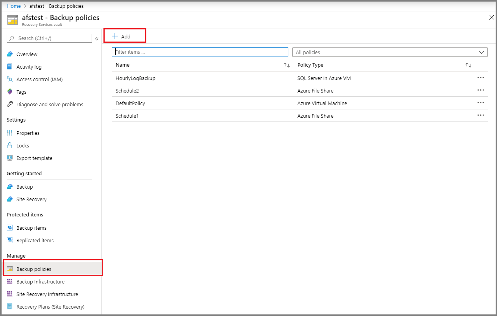
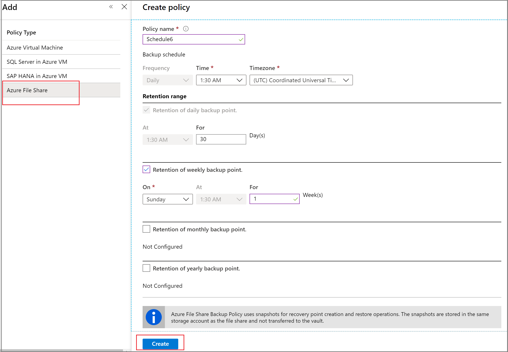
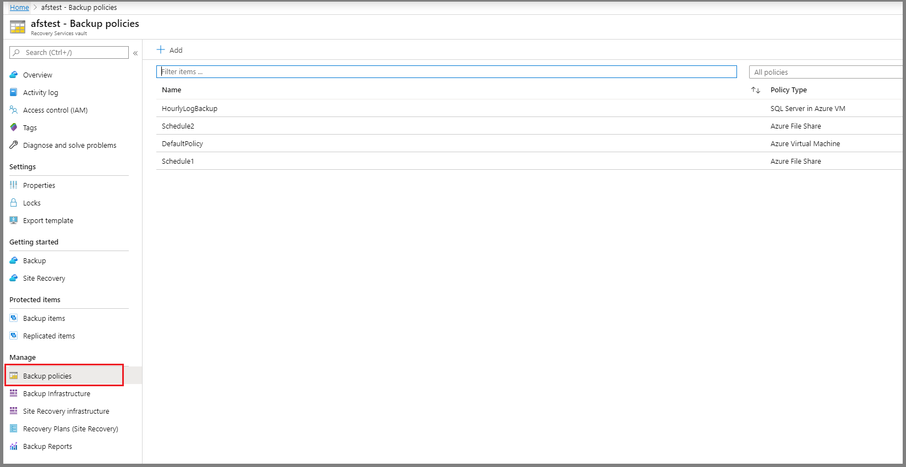
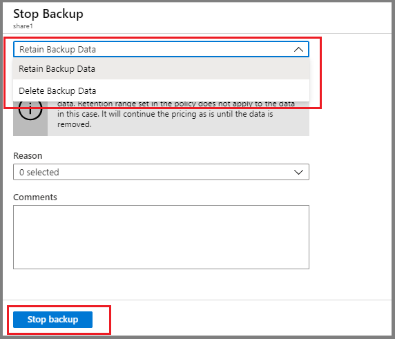
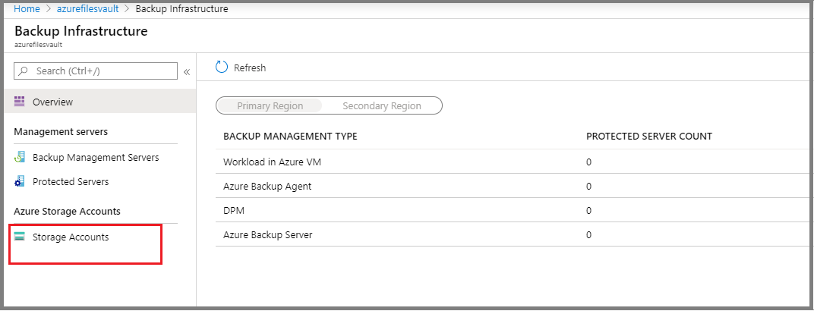
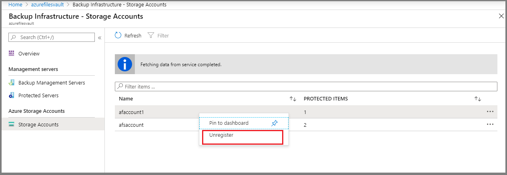

# Manage Azure file share backups

This article describes common tasks for managing and monitoring the Azure file shares that are backed up by the [Azure Backup](https://docs.microsoft.com/azure/backup/backup-overview) service. You'll learn how to execute the following management tasks in the Recovery Services Vault:

* [Monitor jobs](#monitor-jobs)
* [Create a new policy](#create-a-new-policy)
* [Modify Policy](#modify-policy)
* [Stop protection on a file share](#stop-protection-on-a-file-share)
* [Resume protection on a file share](#resume-protection-on-a-file-share)
* [Delete backup data](#delete-backup-data)
* [Unregister storage account](#unregister-storage-account)

## Monitor jobs

When you trigger a backup or restore operation, the backup service creates a job for tracking. You can monitor the progress of all jobs on the **Backup Jobs** page.

To open the **Backup Jobs** page:

1. Open the Recovery Services vault you used to configure backup for your file shares. In the **Overview** blade, click **Backup Jobs** under the **Monitoring** section.

2. Once you click OK, the **Backup jobs** blade is displayed listing the status of all jobs. You can click the workload name corresponding to the file share you want to monitor.

## Create a new policy

You can create a new policy to back up Azure file shares from the **Backup Policies** section of the Recovery Services vault. All policies created when you configured Backup for file shares show up with the Policy Type as Azure file Share.

To view the existing Backup policies:

1. Open the Recovery Services vault you used to configure the backup for file share, and in the Recovery Services vault menu, click **Backup policies** under Manage section. All backup policies configured in the vault will be listed.

2. To view policies specific to Azure File Share, select **Azure File Share** from the drop-down on the top right.

To create a new Backup policy:

1. Click **+ Add** in Backup Policies blade.

2. Select **Azure File Share** as the **Policy Type** in the **Add** blade. The Backup policy blade for Azure file share will open. Specify the policy name, backup frequency, and retention range for the recovery points. Click **OK** when you have defined the policy.

## Modify Policy

You can modify a backup policy to change the backup frequency or retention range.

To modify a policy:

1. Open the Recovery Services vault you used to configure the backup for the file share, and in the Recovery Services vault menu, click **Backup policies** under the Manage section. All backup policies configured in the vault will be listed.

2. To view policies specific to an Azure file share, select **Azure File Share** from the drop-down on the top right. Click the backup policy you want to modify.

3. The **Schedule** blade will open. Edit the backup schedule/retention range as required and click **Save**. You will see an "Update in Progress" message on the blade, and when the policy changes are updated successfully, you will see the message "Successfully updated the backup policy".

## Stop protection on a file share

There are two ways to stop protecting Azure file shares:

* Stop all future backup jobs and *delete all recovery points*
* Stop all future backup jobs but *leave the recovery points*

There may be a cost associated with leaving the recovery points in storage, as the underlying snapshots created by Azure Backup will be retained. However, the benefit of leaving the recovery points is you can restore the File share later, if desired. For information about the cost of leaving the recovery points, see the [pricing details](https://azure.microsoft.com/pricing/details/backup/). If you choose to delete all recovery points, you can't restore the File share.

To stop protection for an Azure file share:

1. Open the Recovery Services vault that contains the file share recovery points and click **Backup Items** under Protected Items section. The list of Backup Item types appears.

2. In the **Backup Management Type** list, select **Azure Storage (Azure Files)**. The list of **Backup Items for (Azure Storage (Azure Files))** appears.

3. In the list of **Backup Items (Azure Storage (Azure Files))**, select the backup item for which you want to stop protection.

4. Select the **Stop backup** option from the **Backup Item** blade’s menu.

5. In the **Stop Backup** blade, choose to **Retain Backup Data** or **Delete Backup Data** and click **Stop Backup**.

 

## Resume protection on a file share

If the **Retain Backup Data** option was chosen when protection for the file share was stopped, then it's possible to resume protection. If the **Delete Backup Data** option was chosen, then protection for the file share can't resume.

To resume protection for the Azure file share:

1. Open the Recovery Services vault that contains the file share recovery points and click **Backup Items** under Protected Items section. The list of Backup Item types appears.

2. In the **Backup Management Type** list, select **Azure Storage (Azure Files)**. The list of **Backup Items for (Azure Storage (Azure Files))** appears.

3. In the list of **Backup Items (Azure Storage (Azure Files))**, select the backup item for which you want to resume protection.

4. Select **Resume Backup** option from the **Backup Item** blade’s menu.

5. The **Backup Policy** blade will open, and you can choose a policy of your choice to resume backup.

6. Click **Save** after selecting the desired **Backup Policy**. You will see an "Update in Progress" message on the portal and once the backup is successfully resumed, you will see the message "Successfully updated backup Policy for Protected Azure File Share".

## Delete backup data

You can delete the backup of a file share during the **Stop backup** job, or any time after you have stopped protection. It may even be beneficial to wait days or weeks before deleting the recovery points. When deleting backup data, you can't choose specific recovery points to delete. If you choose to delete your backup data, you delete all recovery points associated with the file share.

The following procedure assumes that the protection has been stopped for the file share.

To delete Backup Data for Azure File Share:

1. Once the Backup job is stopped, the **Resume backup** and **Delete backup data** options are available in the **Backup item** dashboard. Click the **Delete backup data** option in the **Backup Item** blade’s menu.

2. The **Delete Backup Data** blade will open. Type the name of the File share to confirm deletion. Optionally, provide a **Reason** to delete or **Comment**. Click **Delete** once you're sure about deleting the backup data.

## Unregister storage account

If you want to protect your file shares in a particular storage account using a different recovery services vault, first [stop protection for all file shares](#stop-protection-on-a-file-share) in that storage account. Then unregister the account from the current recovery services vault used for protection.

The following procedure assumes that the protection has been stopped for all file shares in the storage account you want to unregister.

To unregister the storage account:

1. Open the recovery services vault where your storage account is registered.
2. Click the **Backup Infrastructure** option under the **Manage** section of the **Overview** blade.

3. The **Backup Infrastructure** blade opens. Click **Storage Accounts** under the **Azure Storage Accounts** section on this blade.

4. Once you click **Storage Accounts**, a list of storage accounts registered with the vault will be displayed.
5. Right-click the storage account you want to unregister and choose **Unregister**.

## Next steps

For more information, see [Troubleshoot Backup/Restore failures for Azure File Shares](https://docs.microsoft.com/azure/backup/troubleshoot-azure-files)
