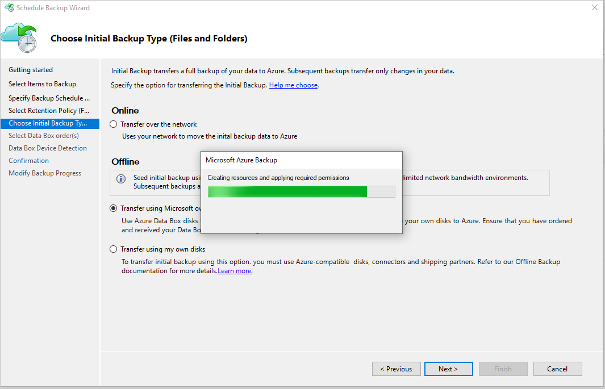
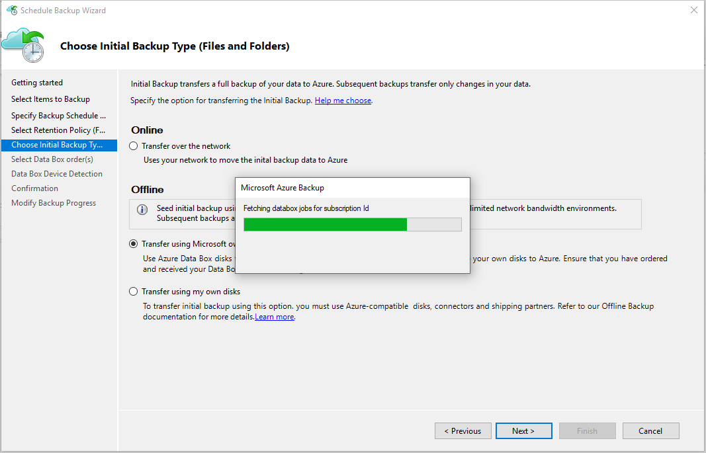
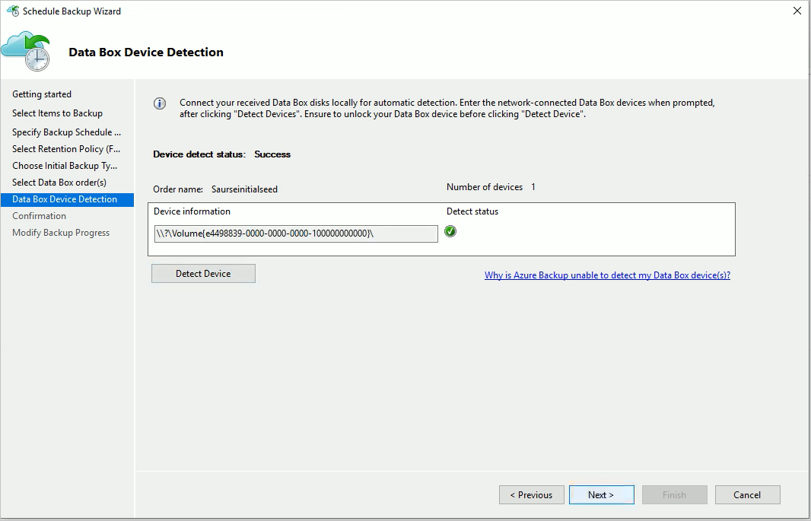
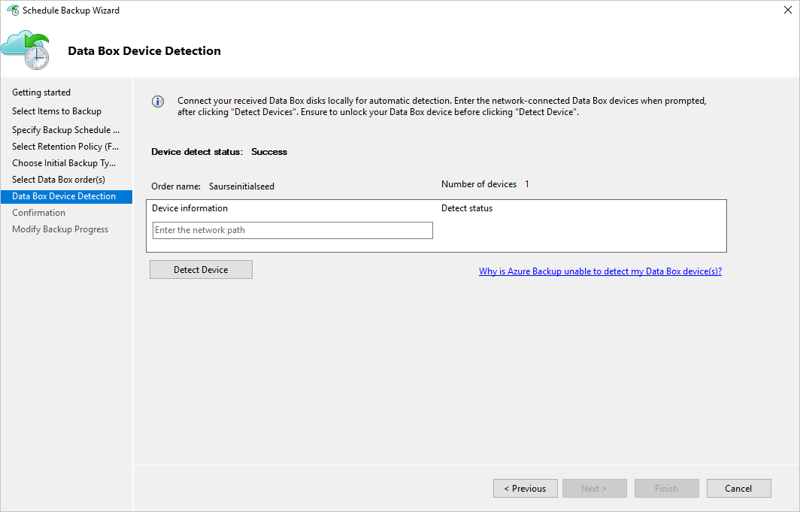
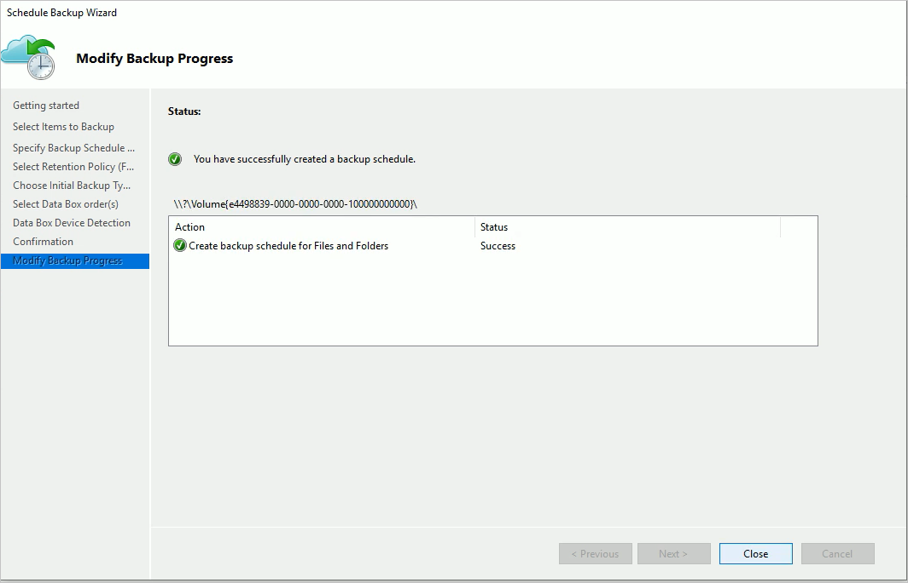
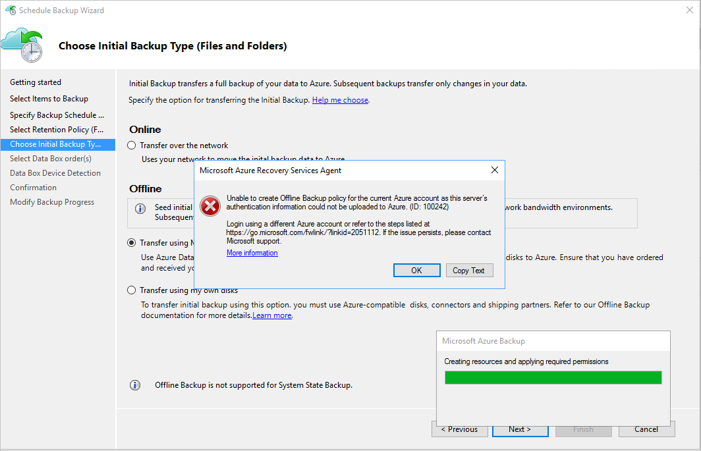
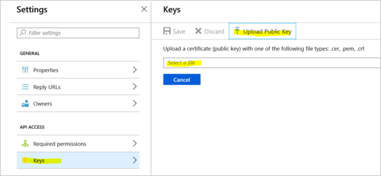

# Azure Backup offline-backup using Azure Data Box

You can use the [Azure Data Box](https://docs.microsoft.com/azure/databox/data-box-overview) service to seed your large initial MARS backups offline (without using network) to an Azure Recovery Services vault.  This saves both time and network bandwidth, that would otherwise be consumed moving large amounts of backup data online over a high-latency network. This enhancement is currently in preview. Azure Data Box based Offline Backup provides two distinct advantages over the [Azure Import/Export Service-based offline backup](https://docs.microsoft.com/azure/backup/backup-azure-backup-import-export).

1. No need to procure your own Azure-compatible disks and connectors. Azure Data Box service ships the disks associated with the selected [Data Box SKU](https://docs.microsoft.com/rest/api/databoxedgegateway/skus/list)

2. Azure Backup (MARS Agent) can directly write backup data onto the supported SKUs of Azure Data Box. This eliminates the need for provisioning a staging location for your initial backup data and the need for utilities to format and copy that data onto the disks.

## Azure Data Box with MARS Agent

This article explains how you can use Azure Data Box to seed large initial backup data offline from the MARS Agent to an Azure Recovery Services Vault. The article is divided into the following parts:

* Supported Platforms
* Supported Data Box SKUs
* Pre-requisites
* Setup MARS Agent
* Setup Azure Data Box
* Backup data transfer to Azure Data Box
* Post-Backup steps

## Supported Platforms

The process to seed data from the MARS Agent using Azure Data Box is supported on the following Windows SKUs:

| **OS**                                 | **SKU**                                                      |
| -------------------------------------- | ------------------------------------------------------------ |
| **Workstation**                        |                                                              |
| Windows  10 64 bit                     | Enterprise,  Pro, Home                                       |
| Windows  8.1 64 bit                    | Enterprise,  Pro                                             |
| Windows  8 64 bit                      | Enterprise,  Pro                                             |
| Windows  7 64 bit                      | Ultimate,  Enterprise, Professional, Home Premium, Home Basic, Starter |
| **Server**                             |                                                              |
| Windows  Server 2019 64 bit            | Standard,  Datacenter, Essentials                            |
| Windows  Server 2016 64 bit            | Standard,  Datacenter, Essentials                            |
| Windows  Server 2012 R2 64 bit         | Standard,  Datacenter, Foundation                            |
| Windows  Server 2012 64 bit            | Datacenter,  Foundation, Standard                            |
| Windows  Storage Server 2016 64 bit    | Standard,  Workgroup                                         |
| Windows  Storage Server 2012 R2 64 bit | Standard,  Workgroup, Essential                              |
| Windows  Storage Server 2012 64 bit    | Standard,  Workgroup                                         |
| Windows  Server 2008 R2 SP1 64 bit     | Standard,  Enterprise, Datacenter, Foundation                |
| Windows  Server 2008 SP2 64 bit        | Standard,  Enterprise, Datacenter                            |

## Backup Data Size and supported Data Box SKUs

| **Backup Data Size (post compression by MARS) per server** | **Azure Data Box SKU**                                       |
| ------------------------------------------------------------ | ------------------------------------------------------------ |
| <= 7.2 TB                                                    | [Azure   Data Box Disk](https://docs.microsoft.com/azure/databox/data-box-disk-overview) |
| > 7.2 TB and <= 80 TB**                                      | [Azure   Data Box (100 TB)](https://docs.microsoft.com/azure/databox/data-box-overview) |

*Typical compression rates vary between 10-20% <br>
** Reach out to [AskAzureBackupTeam@microsoft.com](mailto:AskAzureBackupTeam@microsoft.com) if you expect to have more than 80 TB of initial backup data for a single MARS server.

>[!IMPORTANT]
>Initial backup data from a single server must be contained within a single Azure Data Box or Azure Data Box Disk and cannot be shared between multiple devices of the same or different SKUs. However, an Azure Data Box device may contain initial backups from multiple servers.

## Pre-requisites

### Azure Subscription and required permissions

* The process requires an Azure Subscription
* The process requires that the user designated to perform the offline backup policy is an “Owner” of the Azure Subscription
* The Data Box job and the Recovery Services Vault (to which the data needs to be seeded) are required to be in the same subscriptions.
* It is recommended that the target storage account and the Recovery Services Vault be in the same region. However, this is not necessary.

### Get Azure PowerShell 3.7.0

**This is the most important pre-requisite for the process**. Before installing Azure PowerShell (ver. 3.7.0), perform the following checks**

#### Step 1: Check PowerShell version

* Open Windows PowerShell and run the following command:

    ```powershell
    Get-Module -ListAvailable AzureRM*
    ```

* If the output displays a version higher than **3.7.0**, perform step 2 below. Otherwise, skip to step 3.

#### Step 2: Uninstall the PowerShell version

Uninstall the current version of PowerShell by doing the following actions:

* Remove the dependent modules by running the following command in PowerShell:

    ```powershell
    foreach ($module in (Get-Module -ListAvailable AzureRM*).Name |Get-Unique)  { write-host "Removing Module $module" Uninstall-module $module }
    ```

* Run the following command to ensure the successful deletion of all the dependent modules:

    ```powershell
    Get-Module -ListAvailable AzureRM*
    ```

#### Step 3: Install PowerShell version 3.7.0

Once you have verified that no AzureRM modules are present, then install version 3.7.0 using one of the following methods:

* From GitHub, [link](https://github.com/Azure/azure-powershell/releases/tag/v3.7.0-March2017)

OR

* Run the following command in the PowerShell window:

    ```powershell
    Install-Module -Name AzureRM -RequiredVersion 3.7.0
    ```

Azure PowerShell could have also been installed using an msi file. To remove it, uninstall it using the Uninstall programs option in Control Panel.

### Order and receive the Data Box device

The Offline backup process using MARS and Azure Data Box requires that the required Data Box devices are in “Delivered” state before triggering Offline Backup using the MARS Agent. Refer to the [Backup Data Size and supported Data Box SKUs](#backup-data-size-and-supported-data-box-skus) to order the most suitable SKU for your requirement. Follow the steps in [this article](https://docs.microsoft.com/azure/databox/data-box-disk-deploy-ordered) to order and receive your Data Box devices.

>[!IMPORTANT]
>Do not select BlobStorage for the Account kind. The MARS agent requires an account that supports Page Blobs which is not supported when BlobStorage is selected.


## Install and Setup the MARS Agent

* Make sure you uninstall any previous installations of the MARS Agent.

* Download the latest MARS Agent from [here](https://aka.ms/azurebackup_agent).

* Run *MARSAgentInstaller.exe* and perform ***only** the steps to [Install and Register the Agent](https://docs.microsoft.com/azure/backup/backup-configure-vault#install-and-register-the-agent) to the Recovery Services Vault to which you want your backups to be stored.

  >[!NOTE]
  > The Recovery Services Vault must be in the same subscription as the Azure Data Box job.

* Once the agent is registered to the Recovery Services Vault, follow the steps in the sections below.

## Setup Azure Data Box device(s)

Depending on the Azure Data Box SKU you have ordered, perform the steps covered in the appropriate sections below to set up and prepare the Data Box device(s) for the MARS Agent to identify and transfer the initial backup data.

### Setup Azure Data Box Disk

If you ordered one or more Azure Data Box Disks (up to 8 TB each), follow the steps mentioned here to [Unpack, connect, and unlock your Data Box Disk](https://docs.microsoft.com/azure/databox/data-box-disk-deploy-set-up).

>[!NOTE] 
>It is possible that the server with the MARS Agent does not have a USB port. In that situation you can connect your Azure Data Box Disk to another server/client and expose the root of the device as a network share.

### Setup Azure Data Box

If you ordered an Azure Data Box (up to 100 TB), follow the steps mentioned here  [to setup your Data Box](https://docs.microsoft.com/azure/databox/data-box-deploy-set-up).

#### Mount your Azure Data Box as Local System

The MARS Agent operates in the Local System context and therefore requires the same level of privilege to be provided to the mount path where the Azure Data Box is connected. Follow the steps below to ensure you can mount your Data Box device as Local System using the NFS Protocol:

* Enable the Client for NFS feature on the Windows Server (that has MARS agent installed).<br>
  Specify alternate source: *WIM:D:\Sources\Install.wim:4*

* Download PSExec from <https://download.sysinternals.com/files/PSTools.zip> to the server with MARS Agent installed.

* Open an elevated command prompt and execute the following command with the directory containing PSExec.exe as the current directory:

    ```cmd
    psexec.exe  -s  -i  cmd.exe
    ```

* The command window that opens as a result of the above command is in the Local System context. Use this command window to execute the steps to mount the Azure Page Blob Share as a network drive on your Windows Server.

* Follow the steps [here](https://docs.microsoft.com/azure/databox/data-box-deploy-copy-data-via-nfs#connect-to-data-box) to connect your server with the MARS Agent to the Data Box device via NFS and execute the following command on the Local System command prompt to mount the Azure Page Blobs share:

    ```cmd
    mount -o nolock \\<DeviceIPAddress>\<StorageAccountName_PageBlob X:  
    ```

* Once mounted, check if you can access X: from your server. If yes, continue with the next section of this article.

## Transfer Initial Backup data to Azure Data Box device(s)

* Open the **Microsoft Azure Backup** application on your server.

* Click on **Schedule Backup** in the **Actions** pane.

    

* Follow the steps in the **Schedule Backup Wizard**

* **Add Items** such that the total size of the items is within [size limits supported by the Azure Data Box SKU](#backup-data-size-and-supported-data-box-skus) you ordered and received.

    

* Select the appropriate backup schedule and retention policy for Files and Folders and System State (system state is applicable only for Windows Servers and not for Windows Clients)

* On the **Choose Initial Backup Type (Files and Folders)** screen of the wizard, choose the option **Transfer using Microsoft Azure Data Box disks** and click **Next**

    

* Sign in to Azure when prompted using the user credentials that have owner access on the Azure Subscription. After you succeed in doing so, you should see a screen that resembles the one below:

    

* The MARS Agent will then fetch the Data Box jobs in the subscription that are in “Delivered” state.

    

* Select the correct Data box order for which you have unpacked, connected, and unlocked your Data Box disk. Click **Next**.

    

* Click on **Detect Device** on the **Data Box Device Detection** screen. This makes the MARS Agent scan for locally attached Azure Data Box disks and detect them as shown below:

    

    If you have connected the Azure Data Box as a Network Share (because of unavailability of USB ports or because you ordered and mounted the 100 TB Data Box device), detection will fail at first but will give you the option to enter the network path to the Data Box device as shown below:

    

    >[!IMPORTANT]
    > Provide the network path to the root directory of the Azure Data Box disk. This directory must contain a directory by the name *PageBlob* as shown below:
    >
    >
    >
    >For example if the path of the disk is `\\mydomain\myserver\disk1\` and *disk1* contains a directory called *PageBlob*, the path to be provided on the MARS Agent wizard is `\\mydomain\myserver\disk1\`
    >
    >If you [setup an Azure Data Box 100 TB device](#setup-azure-data-box), provide the following as the network path to the device `\\<DeviceIPAddress>\<StorageAccountName>_PageBlob`

* Click **Next** and click **Finish** on the next screen to save the Backup and Retention policy with the configuration of offline backup using Azure Data Box.

* The following screen confirms that the policy is saved successfully:

    

* Click **Close** on the screen above.

* Click on ***Back Up Now** in the **Actions** Pane of the MARS Agent console and click on **Back Up** in the wizard screen as shown below:

    

* The MARS Agent will start backing up the data you selected to the Azure Data Box device. This might take from several hours to a few days depending on the number of files and connection speed between the server with the MARS Agent and the Azure Data Box Disk.

* Once the backup of the data is complete, you will see a screen on the MARS Agent that resembles the one below:

    

## Post-Backup steps

This section explains the steps to take once the backup of the data to the Azure Data Box Disk is successful.

* Follow the steps in this article to [ship the Azure Data Box disk to Azure](https://docs.microsoft.com/azure/databox/data-box-disk-deploy-picked-up). If you used an Azure Data Box 100-TB device, follow these steps to [ship the Azure Data Box to Azure](https://docs.microsoft.com/azure/databox/data-box-deploy-picked-up).

* [Monitor the Data Box job](https://docs.microsoft.com/azure/databox/data-box-disk-deploy-upload-verify) in the Azure portal. Once the Azure Data Box job is “Complete”, the MARS Agent will automatically move the data from the Storage Account to the Recovery Services Vault at the time of the next scheduled backup. It will then mark the backup job as “Job Completed” if a recovery point is successfully created.

    >[!NOTE]
    >The MARS Agent will trigger backups at the times scheduled during policy creation. However these jobs will flag “Waiting for Azure Data Box job to be completed” until the time the job is complete.

* After the MARS Agent successfully creates a recovery point corresponding to the initial backup, you may delete the Storage Account (or specific contents) associated with the Azure Data Box job.

## Troubleshooting

The Microsoft Azure Backup (MAB) agent creates an Azure AD application for you in your tenant. This application requires a certificate for authentication that is created and uploaded when configuring offline seeding policy. We use Azure PowerShell for creating and uploading the certificate to the Azure AD Application.

### Issue

At the time of configuring offline backup you may face an issue, where due to a bug in the Azure PowerShell cmdlet you are unable to add multiple certificates to the same Azure AD Application created by the MAB agent. This will impact you if you have configured offline seeding policy for the same or a different server.

### How to verify if the issue is caused by this specific root cause

To ensure that the failure is due to the issue above, perform one of the following steps:

#### Step 1

Check if you see the following error message in the MAB console at the time of configuring offline backup:



#### Step 2

* Open the **Temp** folder in the installation path (default temp folder path is *C:\Program Files\Microsoft Azure Recovery Services Agent\Temp*). Look for the **CBUICurr** file and open the file.

* In the **CBUICurr** file, scroll to the last line and check if the failure is due to `Unable to create an Azure AD application credential in customer's account. Exception: Update to existing credential with KeyId <some guid> is not allowed`.

### Workaround

As a work-around to resolve this issue, perform the following steps and retry the policy configuration.

#### First step

Sign in to PowerShell that appears on the MAB UI using a different account with admin access on the subscription that will have the import export job created.

#### Second step

If no other server has offline seeding configured and no other server is dependent on the `AzureOfflineBackup_<Azure User Id>` application, then delete this application from **Azure portal** > **Azure Active Directory** > **App registrations.**

>[!NOTE]
> Check if the application `AzureOfflineBackup_<Azure User Id>` does not have any other offline seeding configured and also no other server is dependent on this application. Go to **Settings** > **Keys** under the **Public Keys** section it should not have any other public keys added. See the following screenshot for reference:
>
>

#### Third step

From the server you are trying to configure offline backup, perform the following actions:

1. Open the **Manage computer certificate application** > **Personal** tab and look for the certificate with the name `CB_AzureADCertforOfflineSeeding_<ResourceId>`

2. Select the above certificate, right-click **All Tasks** and **Export** without private key, in the .cer format.

3. Go to the Azure Offline Backup application mentioned in **point 2**. In the **Settings** > **Keys** > **Upload Public Key,** upload the certificate exported in the step above.

    

4. In the server, open the registry by typing **regedit** in the run window.

5. Go to the registry *Computer\HKEY_LOCAL_MACHINE\SOFTWARE\Microsoft\Windows Azure Backup\Config\CloudBackupProvider.* Right-click on **CloudBackupProvider** and add a new string value with name `AzureADAppCertThumbprint_<Azure User Id>`

    >[!NOTE]
    > To get the Azure User Id perform one of the following actions:
    >
    >1. From the Azure connected PowerShell run the `Get-AzureRmADUser -UserPrincipalName “Account Holder’s email as defined in the portal”` command.
    > 2. Navigate to the registry path: *Computer\HKEY_LOCAL_MACHINE\SOFTWARE\Microsoft\Windows Azure Backup\DbgSettings\OnlineBackup*; Name: *CurrentUserId*

6. Right-click on the string added in the step above and select **Modify**. In the value, provide the thumbprint of the certificate you exported in **point 2** and click **OK**.

7. To get the value of thumbprint, double-click on the certificate, then select the **Details** tab and scroll down until you see the thumbprint field. Click on **Thumbprint** and copy the value.

    

## Questions

For any questions or clarifications, regarding any issues faced, reach out to [saurse@microsoft.com](mailto:saurse@microsoft.com)
