# Restore SAP HANA databases on Azure VMs

This article describes how to restore SAP HANA databases that are running on Azure Virtual Machine (VM), that the Azure Backup service has backed up to an Azure Backup Recovery Services vault. Restores can be used to create copies of the data for dev / test scenarios or to return to a previous state.

For more information, on how to back up SAP HANA databases, see [Back up SAP HANA databases on Azure VMs](https://docs.microsoft.com/azure/backup/backup-azure-sap-hana-database).

## Restore to a time or a recovery point

Azure Backup can restore SAP HANA databases that are running on Azure VMs as follows:

* Restore to a specific date or time (to the second) by using log backups. Azure Backup automatically determines the appropriate full, differential backups and the chain of log backups that are required to restore based on the selected time.

* Restore to a specific full or differential backup to restore to a specific recovery point.

## Prerequisites

Before restoring a database, note the following:

* You can restore the database only to an SAP HANA instance that is in the same region

* The target instance must be registered with the same vault as the source

* Azure Backup cannot identify two different SAP HANA instances on the same VM. Therefore, restoring data from one instance to another on the same VM is not possible

* To ensure that the target SAP HANA instance is ready for restore, check its **Backup readiness** status:

  * Open the vault in which the target SAP HANA instance is registered

  * On the vault dashboard, under **Getting started**, choose **Backup**

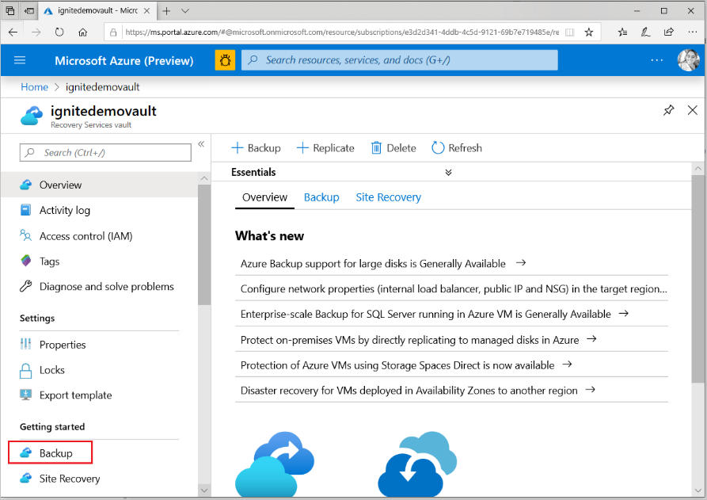

* In **Backup**, under **What do you want to backup?** choose **SAP HANA in Azure VM**

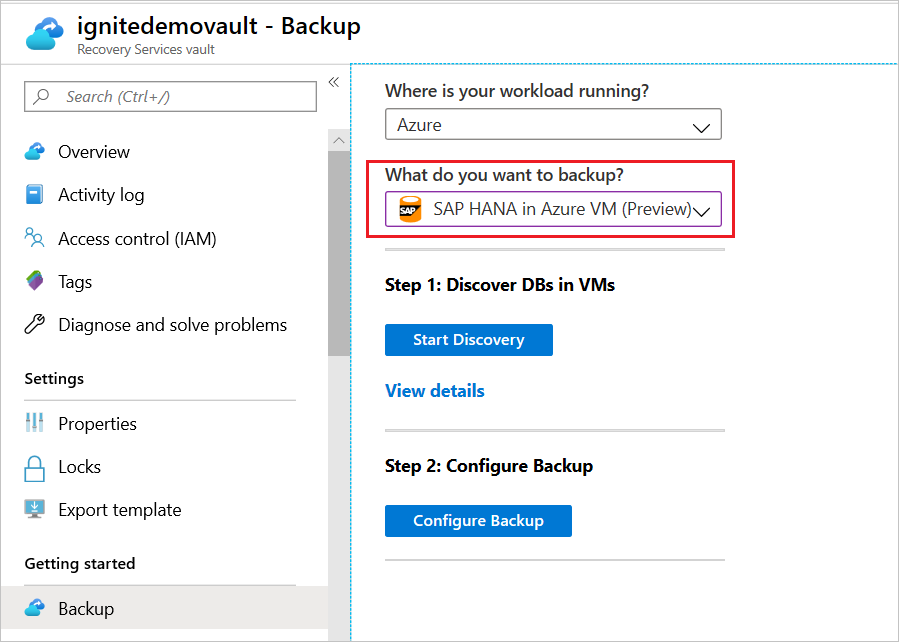

* Under **Discover DBs in VMs** click on **View details**

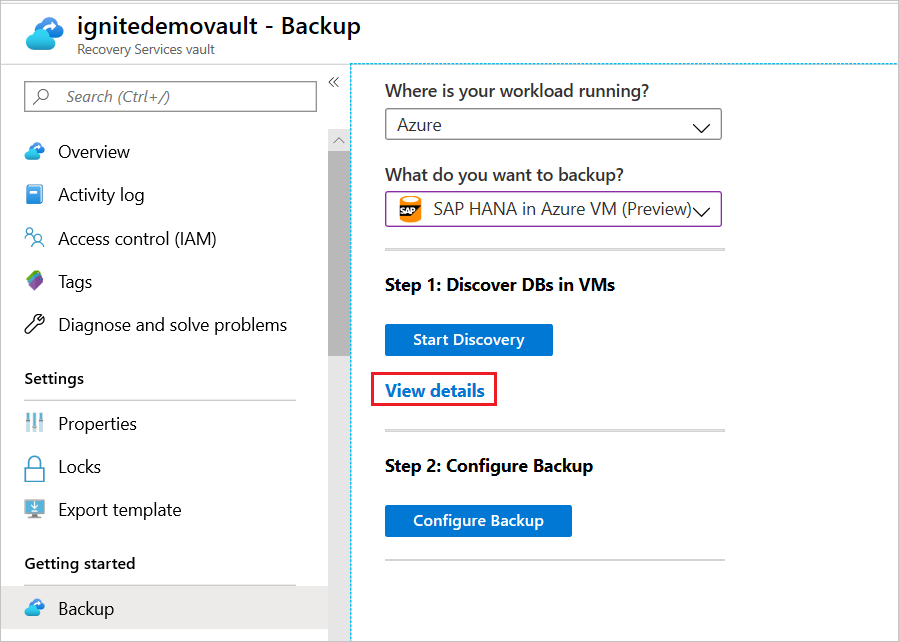

* Review the **Backup Readiness** of the target VM

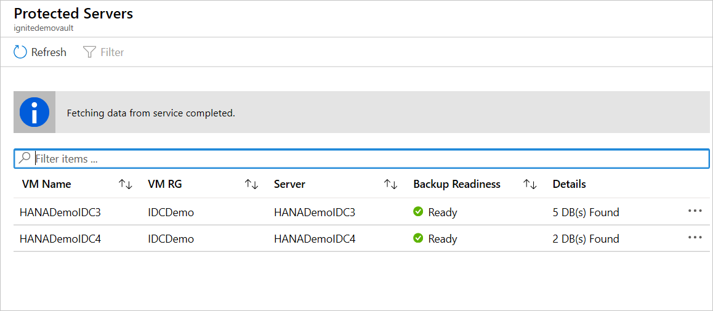

* To learn more about the restore types that SAP HANA supports, refer to the SAP HANA Note [1642148](https://launchpad.support.sap.com/#/notes/1642148)

## Restore a database

* Open the vault in which the SAP HANA database to be restored is registered

* On the vault dashboard, under **Protected Items**, choose **Backup Items**

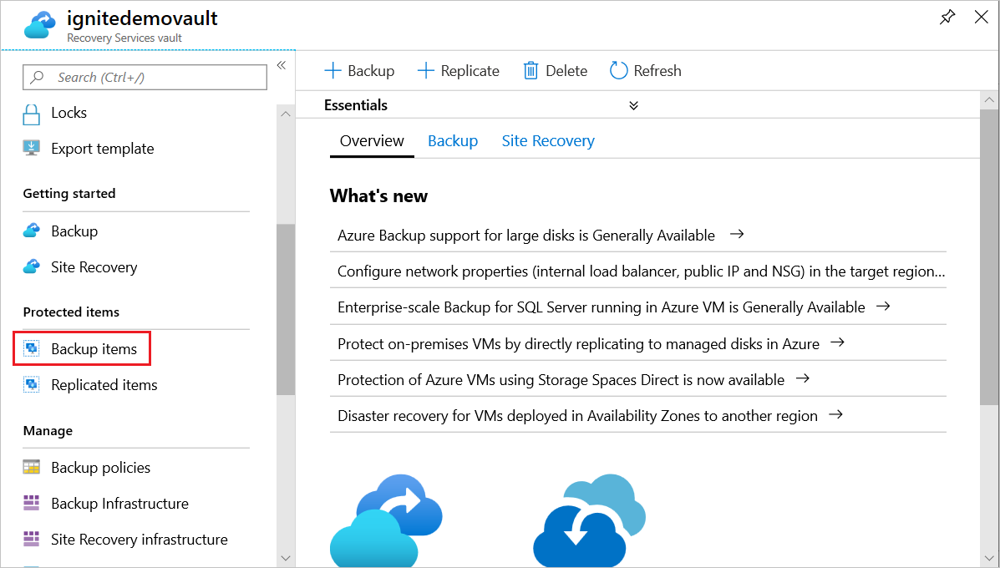

* In **Backup Items**, under **Backup Management Type** select **SAP HANA in Azure VM**

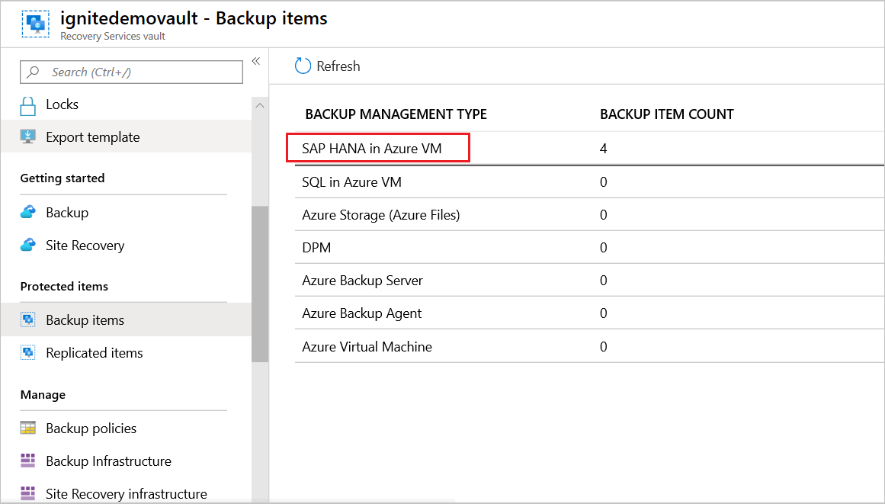

* Select the database to be restored

 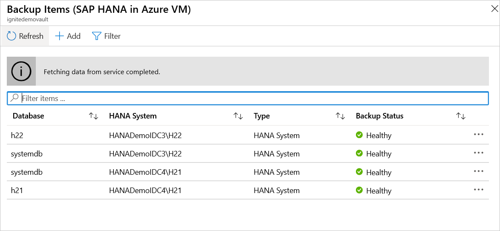

* Review the database menu. It provides information about database backup, including:

  * The oldest and latest restore points

  * The log backup status for the last 24 and 72 hours for the database

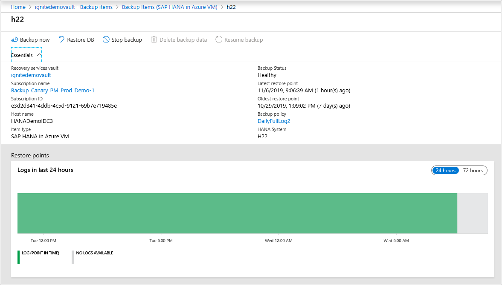

* Select **Restore DB**

* Under **Restore Configuration**, specify where (or how) to restore data:

  * **Alternate Location**: Restore the database to an alternate location and keep the original source database.

  * **Overwrite DB**: Restore the data to the same SAP HANA instance as the original source. This option overwrites the original database.

### Restore to alternate location

* In the **Restore Configuration** menu, under **Where to Restore**, select **Alternate Location**.

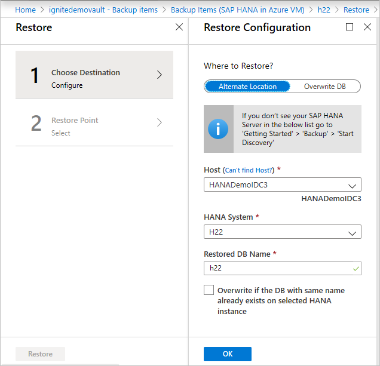

* Select the SAP HANA host name and instance name to which you want to restore the database.
* Check if the target SAP HANA instance is ready for restore by ensuring its **Backup Readiness.** Refer to the prerequisites section for more details.
* In the **Restored DB Name** box, enter the name of the target database.

> [!NOTE]
> Single Database Container (SDC) restores must follow these [checks](https://launchpad.support.sap.com/).

* If applicable, select **Overwrite if the DB with the same name already exists on selected HANA instance**.
* Select **OK**.

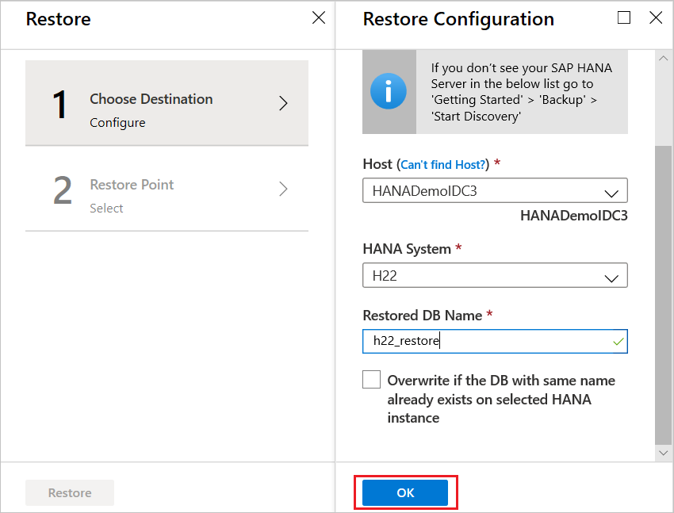

* In **Select restore point**, select **Logs (Point in Time)** to restore to a specific point in time. Or select **Full & Differential** to restore to a specific recovery point.

### Restore and overwrite

* In the **Restore Configuration** menu, under **Where to Restore**, select **Overwrite DB** > **OK**.

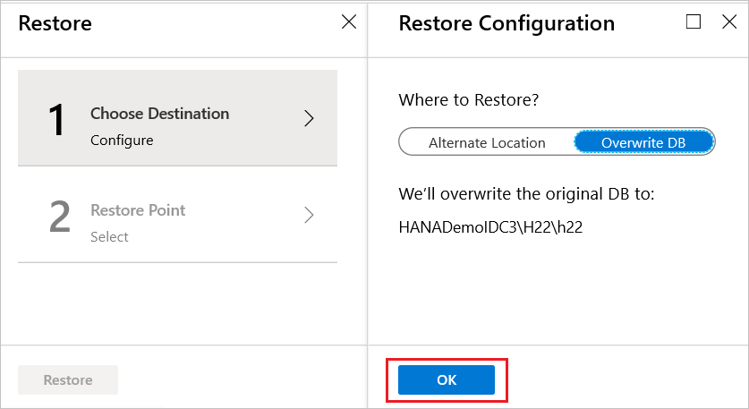

* In **Select restore point**, select **Logs (Point in Time)** to restore to a specific point in time. Or select **Full & Differential** to restore to a specific recovery point.

### Restore to a specific point in time

If you've selected **Full & Differential** as the restore type, do the following:

* Select a recovery point from the log graph and select **OK** to choose the point of restore.

* On the **Restore** menu, select **Restore** to start the restore job.

* Track the restore progress in the **Notifications** area or track it by selecting **Restore jobs** on the database menu.

### Restore to a specific recovery point

If you've selected **Full & Differential** as the restore type, do the following:

* Select a recovery point from the list and select **OK** to choose the point of restore.

* On the **Restore** menu, select **Restore** to start the restore job.

* Track the restore progress in the **Notifications** area or track it by selecting **Restore jobs** on the database menu.

> [!NOTE]
> In Multiple Database Container (MDC) restores after the system DB is restored to a target instance, one needs to run the pre-registration script again. Only then the subsequent tenant DB restores will succeed. To learn more refer to Troubleshooting – MDC Restore.

## Next steps

* Learn how to manage SAP HANA databases backed up using Azure Backup
