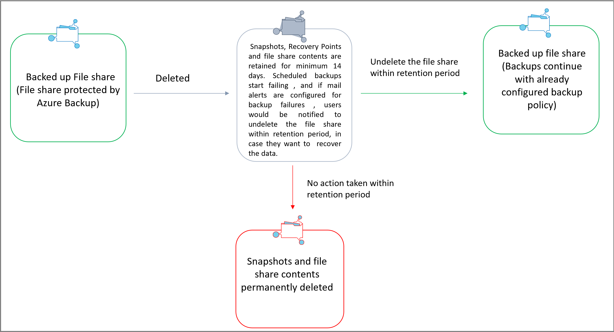

# Accidental delete protection for Azure File Shares using Azure Backup

To provide protection against cyberattacks or accidental deletion, soft delete is enabled for all file shares in a storage account when you configure backup for any file share in the respective storage account. With soft delete, even if a malicious actor deletes the file share, the file share’s contents and recovery points (snapshots) are retained for 14 additional days, allowing the recovery of file shares with no data loss.  

Soft delete is supported only for standard and premium storage accounts in [these regions](azure-file-share-support-matrix.md). It is a platform feature of Azure Files that is currently only available for file shares in a storage account with at least one protected file share by Azure Backup but will be available publicly shortly.

The following flow chart shows the different steps and states of a backup item when Soft Delete is enabled for file shares in a storage account:

 

## Frequently asked questions

### When will soft delete be enabled for file shares in my storage account?

When you configure backup for the first time for any file share in a storage account, Azure Backup service enables soft delete for all file shares in the respective storage account.

### Can I configure the number of days for which my snapshots and restore points will be retained in soft-deleted state after I delete the file share?

No, you only have the 14 days retention period to undelete the file share and recover your data.

### What is the cost incurred for this additional 14-day retention?

During the soft deleted period, the protected instance cost and snapshot storage cost will stay as is.  Also, you will be charged for the used capacity at the regular rate for standard file shares and at snapshot storage rate for premium file shares.

### Can I perform a restore operation when my data is in soft deleted state?

You need to first undelete the soft deleted file share to perform restore operations. The undelete operation will bring the file share into the backed-up state where you can restore to any point in time. To learn how to undelete your file share, see the [Undelete File Share Script](./scripts/backup-powershell-script-undelete-file-share.md).

### How can I purge the data of a file share in a storage account that has at least one protected file share?

If you have at least one protected file share in a storage account, it means that soft delete is enabled for all file shares in that account and your data will be retained for 14 days after the delete operation. But if you want to purge the data right away and don’t want it to be retained then follow these steps:

1. If you already deleted the file share while Soft Delete was enabled, then first undelete the file share using the [Undelete File Share Script](./scripts/backup-powershell-script-undelete-file-share.md).
2. Disable soft delete for file shares in your storage account using the [Disable Soft Delete Script](./scripts/disable-soft-delete-for-file-shares.md).
3. Now delete the file share whose contents you want to purge immediately.

>[!NOTE]
>You should perform step 2 before the next scheduled backup job runs against the protected file share in your storage account. Because whenever the backup job runs, it re-enables soft delete for all file shares in the storage account.

>[!WARNING]
>After disabling soft delete in step 2, any delete operation performed against the file shares is a permanent delete operation. This means if you accidentally delete the backed-up file share after disabling soft delete then you will lose all your snapshots and won’t be able to recover your data.

## Next steps

Learn how to [Backup Azure File Shares from the Azure portal](backup-afs.md)
